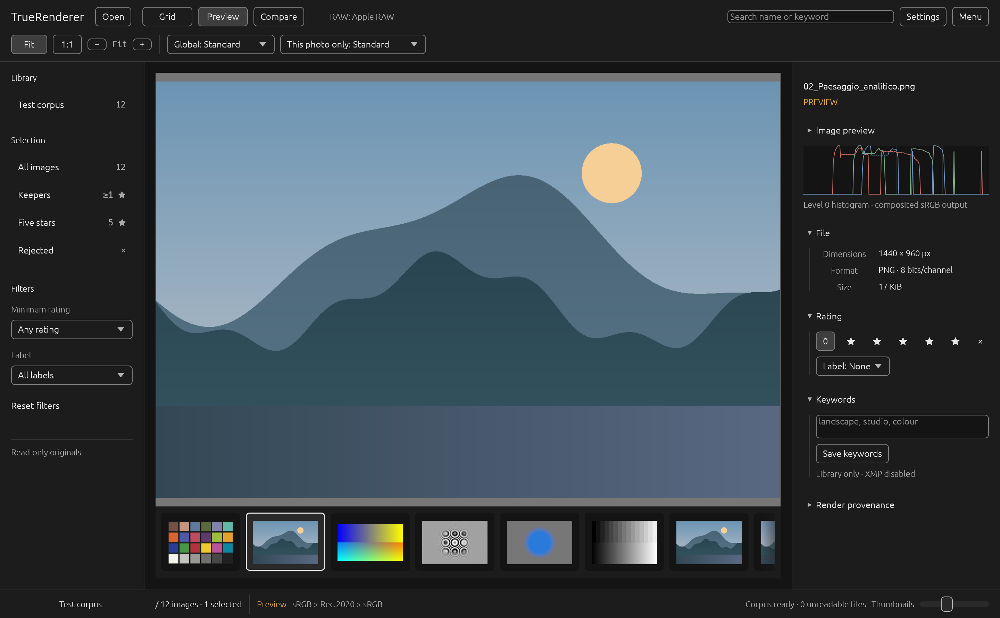
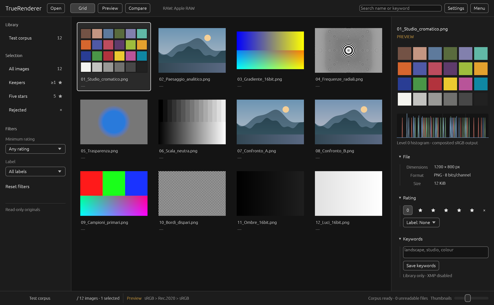
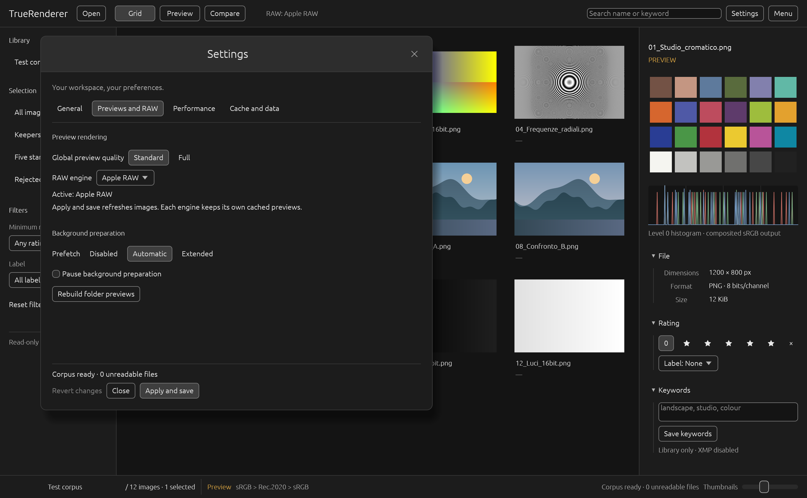

# TrueRenderer

## See the image. Understand the rendering.

TrueRenderer is a native desktop application for photographers, professional retouchers, archivists, imaging specialists, researchers and scientists who need to browse, inspect and compare images through a rendering path they can actually understand.

It is designed for photographic selection, critical review of retouched work, technical analysis and scientific visual inspection whenever it matters to know what happens between an original file and the pixels shown on screen. Instead of hiding every decision behind a generic preview, TrueRenderer makes resolution, RAW development, colour handling and decoder provenance part of the experience.

Your original files remain untouched. The library stays on your computer. No account, upload or subscription is required.



*TrueRenderer on macOS. The image shown is part of the generated test corpus.*


## Made for looking carefully

### Browse without friction

Open a photograph or an entire folder, then move through a thumbnail grid, filmstrip and focused viewer. Search and filters help narrow a library quickly, while the inspector keeps metadata, ratings, keywords and rendering information close to the image.

### Inspect real detail

Fit view is useful for composition. Physical 1:1 is useful for truth. TrueRenderer maps source samples to physical display pixels when you need to judge focus, texture, noise and processing without an accidental resize obscuring the result. Zoom and pan remain connected to the image rather than feeling like a separate technical mode.

### Compare with intent

Place two photographs side by side with synchronized navigation. This makes it easier to evaluate focus, exposure choices, RAW development and near duplicate frames without repeatedly switching context.

### Choose how a RAW file is interpreted

RAW is not a finished image, and no single development is neutral. TrueRenderer can present different RAW engines as explicit choices instead of silently replacing one interpretation with another. Available configurations include Apple RAW on macOS, LibRaw bilinear, LibRaw AHD and the experimental TrueRenderer fp32 engine for supported cameras.

### Know what you are seeing

The inspector can show decoder, colour and orientation provenance, source SHA 256, pixel values and a histogram labelled with the resident image stage. Standard and Full control preview resolution globally or for one photograph, while the interface keeps that choice distinct from the assurance level of the rendering pipeline.

### Keep ownership of the work

Original files are read only. Ratings, rejection flags, labels and keywords are stored separately in a local SQLite library with verified backups, and annotations can be exported as JSON. There is no mandatory cloud library and no remote account standing between you and your archive.

## Why the rendering path matters

TrueRenderer processes image data in extended linear Rec.2020 using 32 bit floating point precision and premultiplied alpha. Reduction uses a bandwidth guarded Lanczos3 filter, enlargement uses Mitchell filtering and physical 1:1 avoids filtering when source and display pixels align.

Those choices are visible because fidelity should be explainable. The application distinguishes the source file, decoder, RAW recipe, working representation, preview resolution and final display raster. CPU and GPU paths are checked against the same rendering rules, and cache entries are tied to the source and pipeline identity rather than treated as anonymous thumbnails.

This does not mean that every photograph has one universally correct appearance. RAW development always includes interpretation, and display colour depends on the complete system. TrueRenderer is valuable precisely because it makes those boundaries clearer and gives future qualification work a measurable foundation.

## A photographic workspace, not a control panel

The interface keeps the image at the centre. Open, view, search and settings controls occupy the top bar; folder context and assurance remain visible below. The inspector is divided into collapsible sections so technical information is available without overwhelming the photograph.



Fit, physical 1:1, zoom and quality controls remain above the image. A global quality choice sets the normal behaviour, while a per photo choice lets you request Full detail only where it matters. Returning to the global setting takes one action.

Preferences are grouped by purpose: General, Previews and RAW, Performance, and Cache and data. Language changes take effect immediately. Rendering and performance changes remain reviewable until they are applied.



The interface is available in English and Italian. TrueRenderer starts in English; the language can be changed from Menu or from General settings without losing the current selection, zoom or pending performance choices.

## Native, local and deliberately contained

TrueRenderer targets macOS on Apple silicon and Windows on x86 64. The macOS application bundle uses two sandboxed XPC services for external decoding. The Windows build confines its worker with LPAC and a Job Object. Decoder failures are kept away from the library writer, and rendering work is bounded by configurable CPU, GPU, memory and cache limits.

JPEG, PNG and TIFF are available through the portable bitmap path on Windows. The verified macOS path also covers common formats handled by the native platform services. RAW support depends on the selected engine and camera. Nikon D750 and D40 Bayer NEF files are supported by the experimental TrueRenderer engine alongside the project’s synthetic Bayer DNG fixtures.

Format recognition is not a promise that every historical or unusual variant is supported. AVIF, JPEG XL, EXR and PSD are not currently enabled. The detailed format contracts and platform boundaries are documented in the [architecture](docs/TrueRenderer-Architettura.md).

## Availability

TrueRenderer is currently a development preview, not a finished commercial release. The application is already usable for local browsing, comparison, annotation and image inspection, while release qualification continues across colour management, camera coverage, memory pressure, accessibility, packaging and additional hardware.

The public repository exists so the implementation and its engineering decisions can be inspected. TrueRenderer is proprietary software, not an open source project. Rights to the original project material are reserved by Antonio Dicorato. Use, modification and distribution require permission under [LICENSE](LICENSE), subject to applicable law, GitHub terms and third party licences.

## Build and run

The repository pins Rust 1.98.1 in [rust-toolchain.toml](rust-toolchain.toml). Run commands from the repository root and use [scripts/cargo-local.sh](scripts/cargo-local.sh), which selects the local toolchain when available. Python 3 is used by fixture and verification scripts.

### macOS development bundle

Xcode Command Line Tools are required. The complete local verification and bundle flow is:

```sh
./scripts/cargo-local.sh fetch --locked
python3 scripts/generate-format-fixtures.py
./scripts/verify.sh
./scripts/build-macos.sh
python3 scripts/test-xpc-integration.py
open -n dist/TrueRenderer.app --args --open "/path/to/image.jpg"
```

Use `./scripts/verify.sh --gui` to include native presentation checks. Changes to the broker, decoder or bundle should always be followed by the XPC integration test on the newly built application.

### Windows development build

An MSVC C++ build environment, the Windows SDK and a Bash shell such as MSYS2 are required. From PowerShell:

```powershell
bash scripts/cargo-local.sh fetch --locked
bash scripts/cargo-local.sh build --workspace --locked --offline
.\target\debug\truerenderer.exe
.\target\debug\truerenderer.exe --open "C:\Photos\image.jpg"
```

Keep `tr-worker.exe` beside `truerenderer.exe`; external decoding requires the confined worker.

### Source checks

```sh
./scripts/cargo-local.sh fmt --all --check
./scripts/cargo-local.sh clippy --workspace --all-targets --locked --offline -- -D warnings
./scripts/cargo-local.sh test --workspace --locked --offline
```

The full macOS verification entry point is `./scripts/verify.sh`. Platform specific integration checks and the evidence behind technical claims are indexed in [reports/VERIFICA.md](reports/VERIFICA.md).

## Local data

The library database and backups are durable user data. Keep `var/library.sqlite` and `var/backups/`; they are not disposable caches. Settings live in `var/settings.json`, unless a separate data directory is selected with `--data`.

Writable image folders may contain a `.truerenderer-cache/` directory. It contains derived previews and cache bookkeeping, never ratings, keywords or library backups. If the cache is unavailable, rendering can continue in memory.

## Documentation

The [documentation index](docs/README.md) separates product specifications, architecture decisions, verification reports and retained historical material. The [architecture](docs/TrueRenderer-Architettura.md) explains the rendering model and safety boundaries. The [development status and plan](STATO.md) contains implementation status for contributors without turning this page into a changelog.

Dependency rights, native component notices and trademarks are collected in [NOTICE.md](NOTICE.md). Naming a format, camera, company or project does not imply affiliation, certification or universal compatibility.
