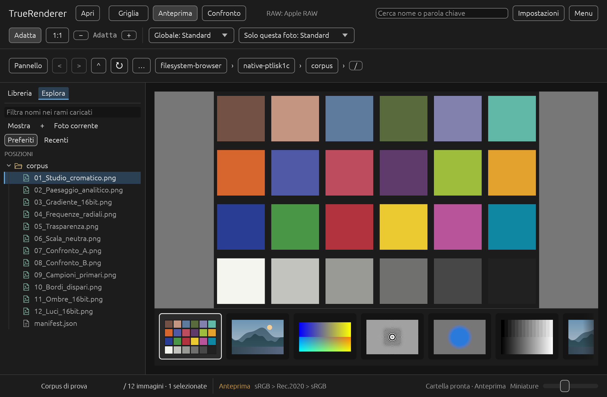
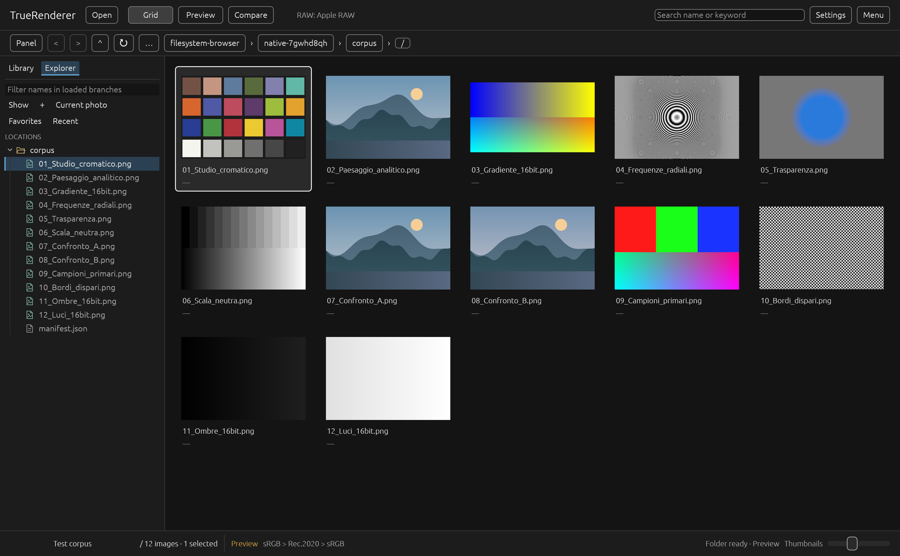
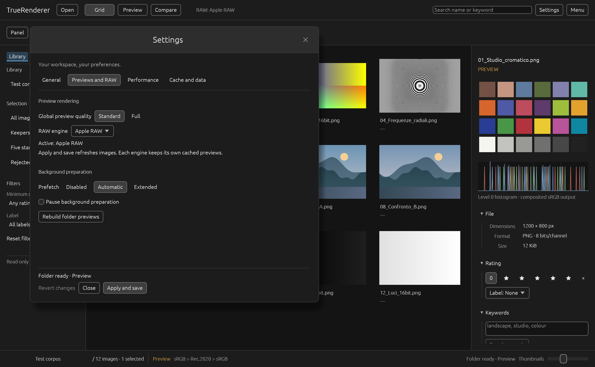

# TrueRenderer

## See the image. Understand the rendering.

TrueRenderer is a native desktop application for photographers, retouchers, archivists, imaging specialists, researchers and scientists who need to browse, inspect and compare photographs and other still images through a rendering path they can understand.

It brings each image, its technical context and the choices behind its appearance into one focused workspace. Originals remain untouched, the library stays on your computer, and no account, upload or subscription is required.



*TrueRenderer on macOS, shown with the generated test corpus.*

## A clearer way to look

### Browse naturally

Open an image or a folder, then move between the thumbnail grid, filmstrip and focused viewer. Library and Explorer views, search, favourites and navigation history keep large collections easy to explore.

Folder preparation runs in the background with visible progress and controls to pause, resume or cancel.

### Inspect real detail

Move from Fit view to physical 1:1 when you need to judge focus, texture, noise or retouching without an accidental resize getting in the way. Metadata, pixel values, histogram and rendering information remain close at hand.

### Compare with intent

Place two images side by side with synchronized navigation to compare focus, exposure, RAW development or near-duplicate frames.

### Choose how RAW is interpreted

RAW development always involves interpretation. TrueRenderer makes that choice explicit with Apple RAW on macOS, LibRaw bilinear, LibRaw AHD and the experimental TrueRenderer fp32 engine for supported cameras.

### Keep the work yours

Ratings, rejection flags, colour labels and keywords live in a local library, separate from the originals, with backups and JSON export.

## Rendering you can explain

TrueRenderer shows the source, decoder, RAW recipe, working representation and preview resolution instead of hiding them behind a generic preview.

Its processing path uses extended linear Rec.2020 and 32-bit floating point precision. Physical 1:1 preserves aligned source samples, while reduction and enlargement use documented filters.

RAW files do not have one universally correct appearance, and display colour depends on the complete system. TrueRenderer makes those boundaries visible, so the image on screen is easier to understand and evaluate.

## Designed around the photograph

The interface keeps the image at the centre. Explorer stays compact, technical information lives in collapsible sections, and familiar controls remain available across the grid, viewer and comparison workspace.



In smaller windows, navigation opens only when needed: [compact layout](reports/navigator-compact.png).



Preferences are grouped by purpose, and the interface is available in English and Italian.

## Local by design

Original files are read-only. Previews use a separate cache, while ratings, keywords and backups remain durable library data.

External decoding is isolated in sandboxed XPC services on macOS and a confined worker on Windows. Decoder failures remain separated from the library writer.

TrueRenderer targets Apple silicon Macs and x86-64 Windows PCs. JPEG, PNG and TIFF use its portable path; native macOS services and a growing set of camera profiles extend format support.

## Availability

TrueRenderer is currently a development preview available from source. Follow the verified scope, open work and latest test results in [STATO.md](STATO.md).

## Build and run

The repository pins Rust 1.98.1 and uses Python 3 for fixtures and verification. Run commands from the repository root.

### macOS

With the Xcode Command Line Tools installed:

```sh
./scripts/cargo-local.sh fetch --locked
python3 scripts/generate-format-fixtures.py
./scripts/verify.sh
./scripts/build-macos.sh
python3 scripts/test-xpc-integration.py
open -n dist/TrueRenderer.app --args --open "/path/to/image.jpg"
```

### Windows

With MSVC, the Windows SDK and a Bash shell such as MSYS2 installed:

```powershell
bash scripts/cargo-local.sh fetch --locked
bash scripts/cargo-local.sh build --workspace --locked --offline
.\target\debug\truerenderer.exe --open "C:\Photos\image.jpg"
```

## Documentation

The [documentation index](docs/README.md) links the specifications, architecture decisions and verification reports. TrueRenderer is proprietary software; see [LICENSE](LICENSE) and [third-party notices](NOTICE.md).
