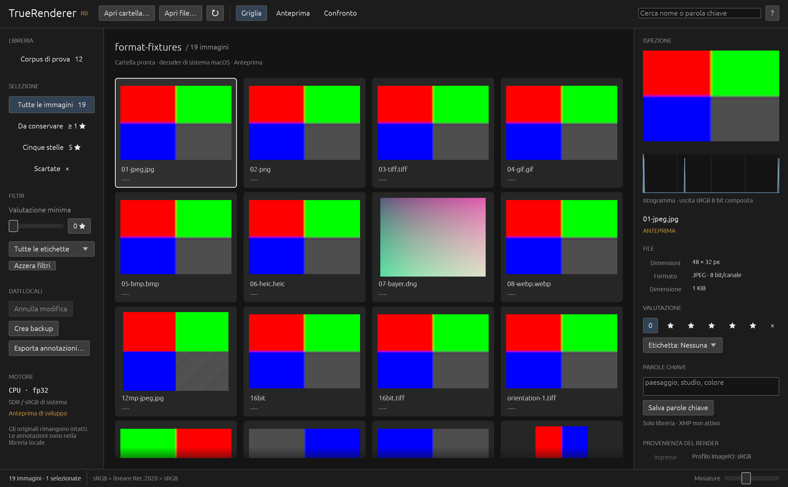

# TrueRenderer

Visualizzatore desktop per sfogliare, selezionare e ispezionare immagini, con elaborazione in luce lineare e pixel fisici 1:1. Scritto in Rust, con interfaccia egui/wgpu e decoder separati su macOS.

**Versione 0.1.3 · prototipo in sviluppo · licenza proprietaria.** Il nome precedente era TrueVision. Il repository è pubblico per consultazione; i diritti sul materiale originale sono riservati ad Antonio Dicorato. Uso, modifica e distribuzione richiedono l'autorizzazione prevista da [LICENSE](LICENSE), fatti salvi la legge, i termini GitHub e le licenze delle dipendenze. Non è un progetto open source.



## Funzioni disponibili

- Apertura di file o cartelle, trascinamento, griglia con miniature regolabili, anteprima e filmstrip.
- Zoom, pan, Adatta, 1:1 fisico anche su Retina e confronto sincronizzato di due immagini.
- Ricampionamento in luce lineare alla dimensione fisica della vista, condiviso da griglia, viewer, inspector e confronto.
- Istogramma, campionatore sorgente e informazioni su decoder, orientamento, colore e digest dei byte decodificati.
- Rating, scarto, etichette, parole chiave, ricerca e filtri; annotazioni locali in SQLite.
- Undo di sessione, backup SQLite verificato ed export JSON. Gli originali rimangono in sola lettura.
- Due decoder XPC con App Sandbox nel bundle macOS; salvataggi indipendenti dalla decodifica.

## Formati nella 0.1.3

L'apertura dei file esterni richiede il **bundle macOS**. La firma del contenuto determina il formato; l'estensione serve alla scansione.

| Formato | Percorso disponibile | Prove effettuate |
|---|---|---|
| JPEG / JPG / JPE | ImageIO e ColorSync | JPEG RGB, anche 4000×3000 pixel |
| PNG | ImageIO e ColorSync | RGB/RGBA, alpha e precisione 16 bit |
| TIFF / TIF | ImageIO e ColorSync | RGB 8/16 bit, orientamenti EXIF 1–8 |
| RAW, incluso DNG | CIRAWFilter, sviluppo a risoluzione nativa | DNG Bayer RGGB 1024×768 senza JPEG incorporato |
| HEIC / HEIF | Decoder del sistema | HEIC RGB |
| WebP | Decoder del sistema | WebP lossless RGB |
| GIF e BMP | ImageIO e ColorSync | Immagini RGB sintetiche |

Per RAW la compatibilità dipende da **fotocamera e versione del decoder Apple installato**. La scansione comprende DNG, NEF, NRW, CR2, CR3, CRW, ARW, SRF, SR2, RAF, ORF, RW2, RWL, PEF, SRW, 3FR, FFF, IIQ, MOS, MEF, MRW, ERF e RAW; questo elenco non garantisce tutte le varianti. Un file non decodificabile produce un errore visibile. Non viene sostituito lo sviluppo RAW con la sua anteprima JPEG. La ricetta corrente si chiama `TR-linear-v1`, descritta in [ADR 0004](docs/adr/0004-formati-esterni-e-pubblicazione.md).

Limiti: **256 MiB per file**, **67.108.864 pixel sorgente**, massimo **32.768 per lato**. Nei contenitori multipagina o animati si mostra solo la prima pagina/fotogramma, con massimo 256 pagine/fotogrammi ammessi. BigTIFF, varianti CMYK/YCCK, matrici ICC e fotocamere non coperte dalle prove restano da qualificare. AVIF, JPEG XL, EXR e PSD non sono abilitati.

I dodici PNG del corpus incluso conservano il decoder analitico originale. I binari fuori dal bundle usano pipe e accettano soltanto quel corpus; gli esterni non hanno un fallback nel processo dell'interfaccia.

## Avvio sul Mac di sviluppo

Aprire **`Avvia TrueRenderer.command`** oppure `dist/TrueRenderer.app`. Per un'immagine personale usare **Apri file…**, **Apri cartella…** o trascinarla nella finestra. Si può anche avviare:

```sh
open -n dist/TrueRenderer.app --args --open "/percorso/immagine.jpg"
```

Il bundle usa `corpus/` e `var/` nella cartella del progetto: spostare l'intera cartella TrueRenderer, mantenendo `dist/TrueRenderer.app` al suo interno. I binari e i dati locali sono esclusi da Git. Se macOS richiede l'accesso alla cartella delle immagini, il consenso viene gestito dal sistema.

Build interna arm64 con firma ad hoc, verificata su macOS 26.6.2 e Apple M4; non è una release notarizzata. I minimi OS/GPU e Windows reale restano da qualificare. L'app funziona localmente senza account, caricamento delle immagini o connessione a Internet.

## Fedeltà della visualizzazione

Il working space è Rec.2020 lineare fp32 con alpha premoltiplicata; l'uscita corrente è sRGB8 opaca su grigio `#777777`. A **1:1 allineato** ogni campione sorgente corrisponde a un pixel fisico, senza filtro. Adatta può ridurre o ingrandire a seconda della finestra e della scala Retina. Ridurre richiede attenuare i dettagli che i pixel disponibili non possono rappresentare: conservarli tutti produrrebbe moiré.

La 0.1.2 ha corretto il doppio ridimensionamento e il nearest a scala arbitraria segnalati nelle frequenze radiali e nella griglia. Il filtro corrente usa Lanczos3 con margine di banda per la riduzione opaca, Mitchell per l'ingrandimento e pesi non negativi per alpha. La UI presenta il raster alla dimensione fisica senza ridimensionarlo di nuovo. [ADR 0003](docs/adr/0003-campionamento-fisico-r0.md) documenta criteri e limiti.

Tutti i render sono **Anteprima**. Standard/Riferimento, gestione ICC/monitor completa e fedeltà di ogni display non sono ancora qualificati. Durante il ricalcolo può apparire brevemente lo sfondo. Le prove attuali non certificano assenza universale di aliasing o identità visiva tra scale diverse.

## Comandi principali

`G` griglia, `E` anteprima, `C` confronto; frecce per cambiare immagine. `Z` alterna Adatta/1:1, `Cmd+1` seleziona 1:1 fisico, rotella e trascinamento controllano zoom/pan. `0`–`5` rating, `X` scarto, `6`–`9` etichette. `Cmd+Z` annulla, `Cmd+F` cerca; `I` inspector, `T` filmstrip, `F` schermo intero, `Esc` griglia. Le modifiche multi-selezione e l'undo correnti operano per singola immagine, senza un batch atomico.

## Compilazione e verifica

Per il titolare e gli sviluppatori autorizzati: macOS arm64, Xcode Command Line Tools, Python 3 e Rust tramite rustup. `rust-toolchain.toml` blocca Rust 1.98.1, `Cargo.lock` blocca le dipendenze. La toolchain locale `.tools/`, se presente, ha precedenza.

```sh
./scripts/cargo-local.sh fetch --locked  # download iniziale su un nuovo checkout
./scripts/verify.sh                     # Rust, lint, IPC, precisione, ricampionamento
./scripts/build-macos.sh                # build release e bundle XPC firmato ad hoc
python3 scripts/test-xpc-integration.py
open -n -W dist/TrueRenderer.app --args --sampling-smoke
./dist/TrueRenderer.app/Contents/MacOS/TrueRenderer --verify-sampling-screenshots
```

I test nativi richiedono una normale sessione desktop macOS: Core Image/Cocoa/XPC possono essere bloccati dentro un sandbox aggiuntivo del terminale. I test marcati ignored vengono eseguiti esplicitamente da `verify.sh` dopo la build del worker.

Per ricreare e verificare i formati esterni serve anche `cwebp`, usato solo dal generatore WebP:

```sh
python3 scripts/generate-format-fixtures.py
./dist/TrueRenderer.app/Contents/MacOS/TrueRenderer --verify-formats
open -n -W dist/TrueRenderer.app --args --formats-smoke
python3 scripts/test-installed-macos.py  # suite completa, Finder e copia autonoma
```

Le fixture sono create localmente in `var/format-fixtures/` da formule proprie; non vengono scaricate fotografie. Le prove comprendono 19 file, sei controlli di rifiuto/riconoscimento, precisione 16 bit e tre schermate sui formati esterni, oltre alle regressioni del corpus. Gli esiti effettivi e il loro perimetro sono in [reports/VERIFICA.md](reports/VERIFICA.md).

## Piano, architettura e dati

| Percorso | Scopo |
|---|---|
| [PLAN.md](PLAN.md) | Piano operativo R0–R4, attività completate e lavoro rimanente |
| [docs/TrueRenderer-Architettura.md](docs/TrueRenderer-Architettura.md) | Specifica e registro: confronto completo con i requisiti iniziali |
| [docs/avanzamento.md](docs/avanzamento.md) | Fonte del registro sincronizzato anche nel documento sul Desktop |
| [Architettura originale v1.2](docs/TrueVision-Architettura.originale-v1.2.md) | Backup immutato della proposta; v1.2 è la revisione del documento |
| `var/library.sqlite`, `var/backups/` | Annotazioni e backup durevoli: non sono cache |
| `var/index.sqlite` | Indice ricostruibile |
| [reports/](reports/) | Prove, screenshot sintetici e inventario dipendenze |

`python3 scripts/sync-docs.py` aggiorna il solo blocco di avanzamento nella copia del repository e in `../TrueVision-Architettura.md`, il file storico sul Desktop. Conserva il resto del documento. Il nome del prodotto è **TrueRenderer** in entrambi.

Restano da completare i gate R0, memoria globale, recupero XPC rapido, firma reciproca di release, Windows, ICC/display, accessibilità, catalogo e XMP completi, matrice RAW/LibRaw, tile/gigapixel, installer e notarizzazione. La cache sorgenti è limitata a 1.536 MiB e i worker esterni sono supervisionati a 2 GiB/45 s, ma il consumo totale dei job in corso non ha ancora un budget globale. Il recupero XPC può richiedere circa dieci secondi. [ADR 0002](docs/adr/0002-xpc-decoder-r0.md) e [ADR 0004](docs/adr/0004-formati-esterni-e-pubblicazione.md) registrano i confini effettivi.

Il workspace contiene `tr-core`, `tr-app`, `tr-store`, `tr-platform`, `tr-worker`, `tr-render` e `apps/desktop`. Le dipendenze conservano le loro licenze: vedere [NOTICE.md](NOTICE.md) e [inventario](reports/dependency-inventory.json). Per segnalazioni e contributi consultare [CONTRIBUTING.md](CONTRIBUTING.md).
