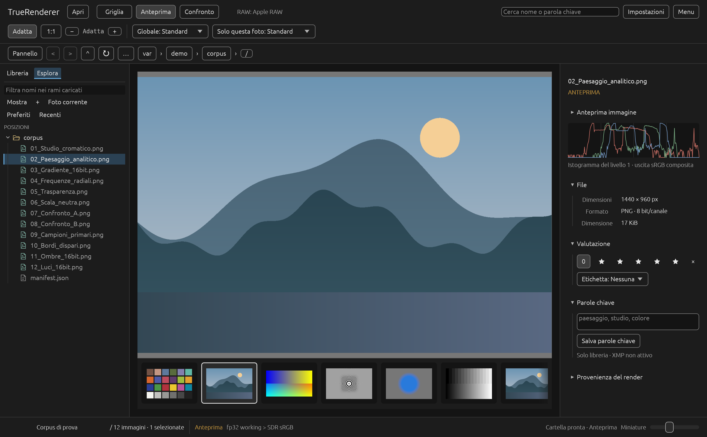
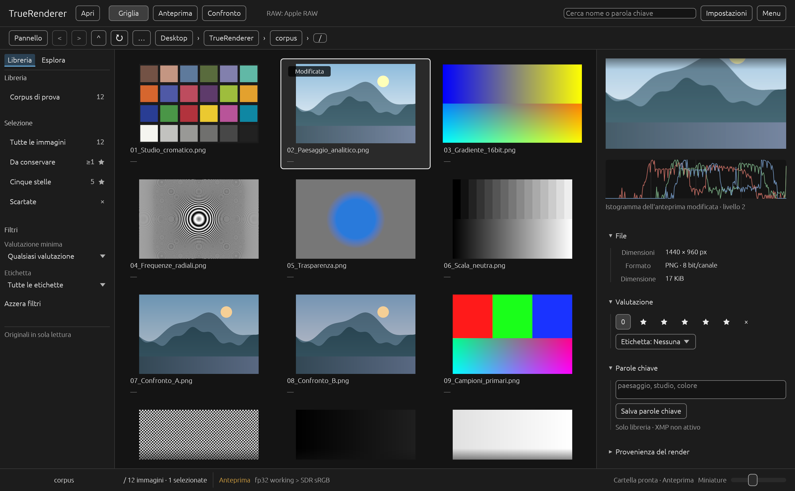
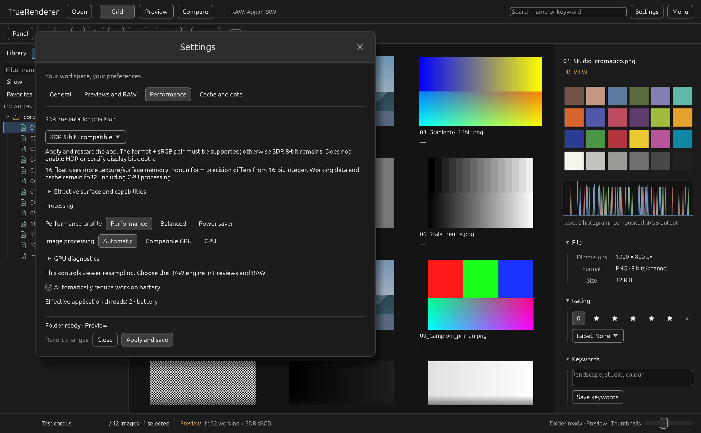

# TrueRenderer

## See the image. Understand the rendering.

TrueRenderer is a native desktop application for photographers, astrophotographers, retouchers, archivists, imaging specialists, astronomers, researchers and scientists who need to browse, inspect and compare photographs and other still images through a rendering path they can understand.

It brings each image, its technical context and the choices behind its appearance into one focused workspace. Originals remain untouched, the library stays on your computer, and no account, upload or subscription is required.



*Current macOS development build, shown with the generated test corpus and an editable recipe. [Screenshot verification](reports/readme-screenshots-macos.json).*

## A clearer way to look

### Browse naturally

Open an image or a folder, then move between the thumbnail grid, filmstrip and focused viewer. Library and Explorer views, search, favourites and navigation history keep large collections easy to explore.

Folder preparation runs in the background with visible progress and controls to pause, resume or cancel.

### Inspect real detail

Move from Fit view to physical 1:1 when you need to judge focus, texture, noise or retouching without an accidental resize getting in the way. Metadata, pixel values, histogram and rendering information remain close at hand.

### Compare with intent

Place two images side by side with synchronized navigation to compare focus, exposure, RAW development or near-duplicate frames.

### Choose how RAW is interpreted

RAW development always involves interpretation. TrueRenderer makes that choice explicit with Apple RAW on macOS, LibRaw bilinear, LibRaw AHD and the experimental TrueRenderer fp32 engine for supported cameras.

### Develop a photograph

The viewer's **Develop** section now has reversible exposure, brightness, contrast,
highlights, shadows, whites, blacks, a basic tone curve, relative RGB warmth/tint
and saturation. Edits are saved as versioned recipes in the local library;
**Undo**, **Redo** and **Before/After** leave the original file untouched.
To neutralize a colour cast, choose **Verify final rendering**, then
**Return to extended fp32 render**. Hover over an opaque, unclipped pixel that
should be neutral and use **Neutralize RGB sample**. This adjusts relative RGB
warmth/tint; it does not change the camera's RAW white balance.
The current picker uses one pixel and requires zero saturation in the edit recipe.
The quick edited view is provisional. **Verify final rendering** builds an
**sRGB16 export preview** from native resolution when the memory budget permits
it. It simulates native-size PNG/TIFF16 conversion before reducing the image,
so fitted views follow the exported file. Edits retain extended fp32 working
values. Choose **Return to extended fp32 render** for working-space inspection
and the RGB picker. JPEG compression and resized exports need separate checks.
Grid and filmstrip thumbnails reflect saved or in-progress edits. The inspector
histogram follows its edited thumbnail preview and labels the preview level.

The remaining tools in the [photographic development plan](STATO.md#piano-sviluppo-fotografico),
including native RAW white balance, optics, spatial detail filters, masks,
retouching and presets, are still in development.

### Keep the work yours

Ratings, rejection flags, colour labels and keywords live in a local library, separate from the originals, with backups and JSON export.

### Export photographs

Select photos and choose **Menu → Export photos**. Export JPEG with adjustable
quality, PNG 8/16-bit with lossless compression choices, TIFF 16-bit or linear
float32, and two distinct DNG operations: developed linear RGB or sensor mosaic.
Choose a destination and optional long-edge size; existing files are never replaced.
Exports use native development, independent of thumbnail quality.
JPEG, PNG and TIFF exports apply each photo's saved edit recipe. The recipe and
RAW engine are frozen when a batch starts. Linear DNG retains technical RGB
development, while RAW DNG retains the mosaic; neither bakes in creative edits.

PNG/TIFF 16-bit offer more output levels than JPEG but still clip to their output
range. TIFF float32 preserves extended linear working values. Linear DNG is
16-bit developed RGB. Reopen exported DNG files with LibRaw bilinear/AHD, not
Apple RAW or the TrueRenderer mosaic engine. RAW DNG is limited to the active-area mosaic of
Nikon D750/D40; it excludes optical margins and private camera metadata.
**Keep the original NEF: neither DNG operation is an archival copy.**

### Inspect scientific data

Read-only FITS supports the first eligible 2D primary/IMAGE plane with BITPIX
8, 16, 32 or −32, scaling, units and missing/nonfinite samples. The inspector
provides a native-value sampler, full-plane histogram and linear/asinh display
stretch. Cubes, compressed FITS, 64-bit samples, WCS and FITS export are excluded.
The scientific resampling path currently uses CPU, even in GPU mode.

Performance preferences also offer optional SDR10 and SDR16-float presentation
after restart, with explicit fallback to compatible SDR8. This removes an 8-bit
presentation bottleneck where supported; it does not enable HDR or certify the
physical display's bit depth. Working data and caches remain fp32.

See the [format and precision contract](docs/esportazione-precisione-fits.md)
and [verified scope](STATO.md) before choosing a workflow.

## Rendering you can explain

TrueRenderer shows the source, decoder, RAW recipe, working representation and preview resolution instead of hiding them behind a generic preview.

Its processing path uses extended linear Rec.2020 and 32-bit floating point precision. Physical 1:1 preserves aligned source samples, while reduction and enlargement use documented filters.

RAW files do not have one universally correct appearance, and display colour depends on the complete system. TrueRenderer makes those boundaries visible, so the image on screen is easier to understand and evaluate.

## Designed around the photograph

The interface keeps the image at the centre. Explorer stays compact, technical information lives in collapsible sections, and familiar controls remain available across the grid, viewer and comparison workspace.



In smaller windows, navigation opens only when needed: [compact layout](reports/readme-compact.png).



Preferences are grouped by purpose, and the interface is available in English and Italian.

## Local by design

Original files are read-only. Previews use a separate cache, while ratings, keywords and backups remain durable library data.

External decoding is isolated in sandboxed XPC services on macOS and a confined worker on Windows. Decoder failures remain separated from the library writer.

TrueRenderer targets Apple silicon Macs and x86-64 Windows PCs. JPEG, PNG and TIFF use its portable path; native macOS services and a growing set of camera profiles extend format support.

On Windows, the portable decoder applies embedded RGB matrix/TRC ICC v2/v4
profiles through Little CMS, including the profiles in the app's JPEG and TIFF
exports. Linear TIFF float preserves extended values and transparency. LUT,
Gray/CMYK and conflicting or malformed profiles remain unsupported and produce
an explicit error; this is not universal ICC compatibility. PNG exports also use
the supported sRGB path.

## Availability

TrueRenderer is currently a development preview available from source. Follow the verified scope, open work and latest test results in [STATO.md](STATO.md).

## Build and run

The repository pins Rust 1.98.1 and uses Python 3 for fixtures and verification. Run commands from the repository root.

### macOS

With the Xcode Command Line Tools installed:

```sh
./scripts/cargo-local.sh fetch --locked
python3 scripts/generate-format-fixtures.py
./scripts/verify.sh
./scripts/build-macos.sh
python3 scripts/test-xpc-integration.py
open -n dist/TrueRenderer.app --args --open "/path/to/image.jpg"
```

### Windows

Install Rust 1.98.1 (with rustfmt and Clippy), Visual Studio Build Tools with the
Desktop development with C++ workload and Windows SDK, Python 3, and Git for Windows.
The PowerShell helper uses Git Bash and the same local-toolchain wrapper as macOS;
Rust installed under `.tools/cargo` and `.tools/rustup` takes precedence over the system installation.

```powershell
powershell -NoProfile -ExecutionPolicy Bypass -File scripts/dev-windows.ps1 fetch --locked
powershell -NoProfile -ExecutionPolicy Bypass -File scripts/dev-windows.ps1 verify --gui
.\target\debug\truerenderer.exe --open "C:\Photos\image.jpg"
```

`verify` builds the workspace and runs formatting, Clippy, tests, worker protocol
and numerical checks. `--gui` also opens the native app for an automated surface
test. Each run saves reports and generated screenshots under a new `var/verify-*`
directory, using a separate test library. Private camera tests require `TR_RAW_SAMPLE`.
From Git Bash, use `./scripts/cargo-local.sh` and `./scripts/verify.sh` directly.
The execution policy option applies only to that PowerShell process; it does not
change the computer's policy.

## Documentation

The [documentation index](docs/README.md) links the specifications, architecture decisions and verification reports. TrueRenderer is proprietary software; see [LICENSE](LICENSE) and [third-party notices](NOTICE.md).
