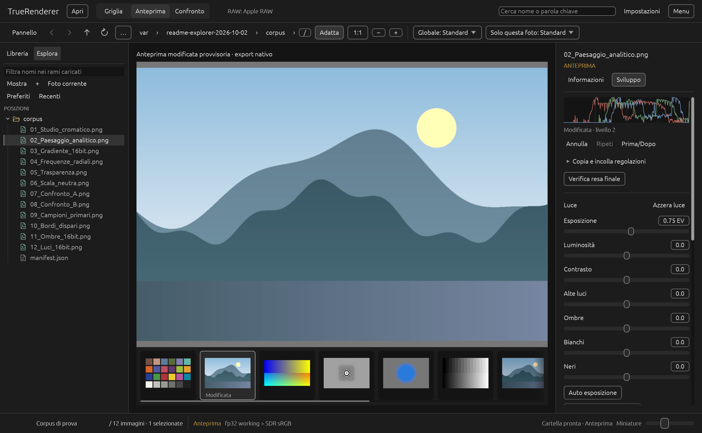
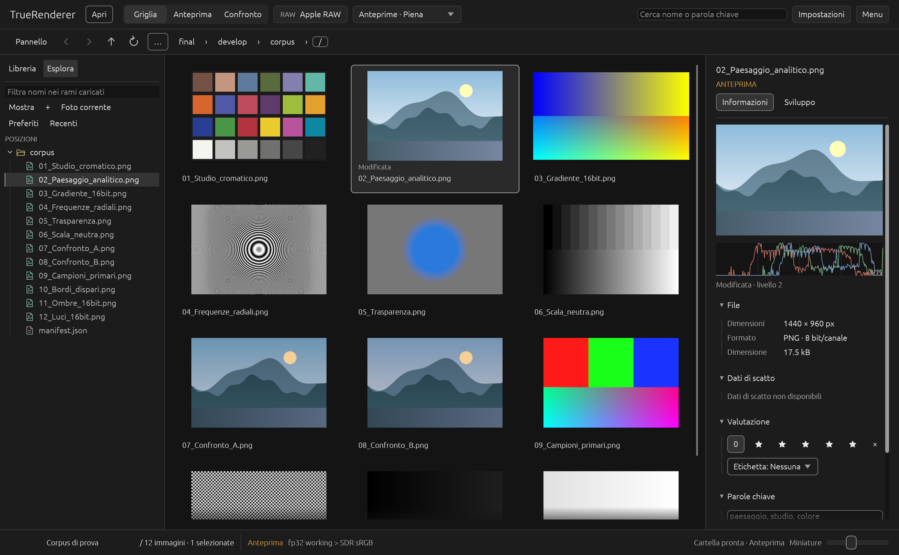
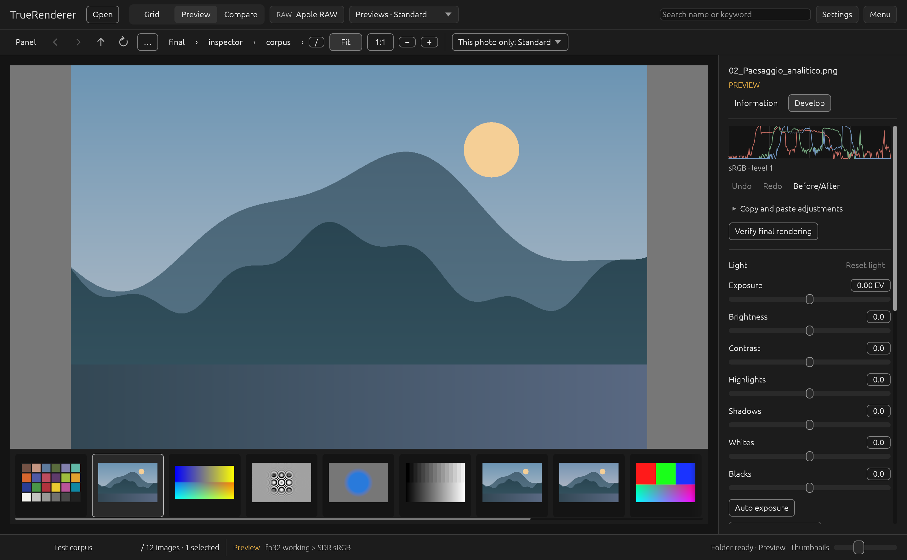
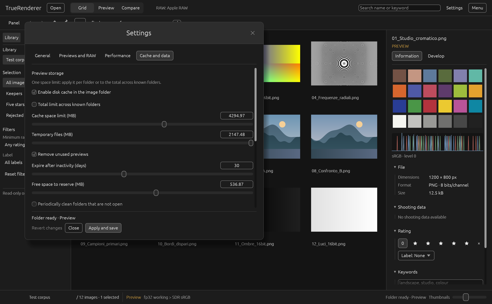

# TrueRenderer

## See the image. Understand the rendering.

TrueRenderer is a native desktop application for photographers, astrophotographers, retouchers, archivists, imaging specialists, astronomers, researchers and scientists who need to browse, inspect and compare photographs and other still images through a rendering path they can understand.

It brings each image, its technical context and the choices behind its appearance into one focused workspace. Originals remain untouched, the library stays on your computer, and no account, upload or subscription is required.



*Current macOS development build with Explorer, the Develop tab, an edited image and filmstrip. All screenshots use 100% UI scale and the generated test corpus. [Capture details and verification](reports/readme-screenshots-macos.json).*

## A clearer way to look

### Browse naturally

Open an image or a folder, then move between the thumbnail grid, filmstrip and focused viewer. Library and Explorer views, search, favourites and navigation history keep large collections easy to explore.

Folder preparation runs in the background with visible progress and controls to pause, resume or cancel. Nearby previews are prepared automatically, with a window that expands according to available memory. Useful previews stay in RAM; the lossless disk cache can serve evicted images without developing the RAW again when its quota allows.

The memory budget starts at **8 GB** and grows with the work, leaving a margin for navigation and capacity for the system. This is an admission budget, not memory allocated at startup. Physical capacity can make the usable budget lower on smaller machines. Under pressure, optional previews are released and work can wait for memory. **Automatically reduce work on battery** is off by default; an existing explicit choice is preserved.

Settings → Performance shows **Active display** in plain terms: SDR 8-bit, 10-bit or 16-bit floating point, plus any restart requirement or fallback. This describes the app's output format, not the verified bit depth of the monitor.

### Inspect real detail

Move from Fit view to physical 1:1 when you need to judge focus, texture, noise or retouching without an accidental resize getting in the way. Metadata, pixel values, histogram and rendering information remain close at hand.

The photographic Inspector has two tabs: **Information** opens by default in the grid, and **Develop** in the viewer. Each view keeps its tab choice for the session. The filename and tabs stay visible while the contents scroll.

**Information → Shooting data**, below **File**, shows camera, lens, shutter speed, aperture, ISO and focal length from readable standard EXIF tags. Missing fields appear as “—”; when no shooting data is available, a single message replaces the empty list. Hover over a value for its source. This read-only profile covers JPEG, PNG and classic TIFF-based files, including supported RAW containers; proprietary lens names and BigTIFF metadata are not inferred.

### Compare with intent

Place two images side by side with synchronized navigation to compare focus, exposure, RAW development or near-duplicate frames.

### Choose how RAW is interpreted

RAW development always involves interpretation. TrueRenderer makes that choice explicit with Apple RAW on macOS, LibRaw bilinear, LibRaw AHD and the experimental TrueRenderer fp32 engine for supported cameras.

The toolbar shows the active RAW engine in a compact badge. Next to it,
**Previews → Standard / Full** changes global preview quality in every view.
The same selector in **Settings → Previews and RAW** stays synchronized:
changes apply and save immediately, leaving other unapplied preferences intact.
Changing global quality clears session overrides; **This photo only** beside
the zoom controls remains available for individual photographs.

### Develop a photograph

The **Develop** tab has reversible exposure, brightness, contrast,
highlights, shadows, whites, blacks, a basic tone curve, relative RGB warmth/tint
and saturation. **Vibrance** selectively adjusts less saturated colours; optional
**Protect warm tones** reduces its effect on warm hues without identifying skin.
Using these controls opts that revision into photographic process 2; existing
recipes retain their previous rendering.

#### History and reusable adjustments

Edits are saved as versioned recipes in the local library;
**Undo**, **Redo** and **Before/After** leave the original file untouched.
Changing photos saves the current draft. If saving fails, **Retry save** keeps
your adjustments; **Discard draft and reload saved recipe** explicitly abandons
the unsaved changes and reloads the library version. Retrying a failed history
operation reloads the saved recipe without creating an extra revision.

**Reset light**, **Reset curve** and **Reset colour** clear only their group of
adjustments, preserving the RAW engine and native white balance. Each reset is
saved and can be undone or redone; Reset colour also clears vibrance and warm-tone
protection.

**Copy and paste adjustments** keeps a session copy of the saved recipe. Select
another photograph, choose Light, Tone curve and/or RGB color, then **Paste selected
groups**. Pasting replaces only those groups and creates one undoable revision;
the destination keeps its RAW engine and native white balance. The copy is cleared
when the app closes; pasted edits remain in the library. With image focus,
use **Alt+Shift+C/V** to copy/paste the selected groups, and
**Cmd/Ctrl+Alt+Z** / **Cmd/Ctrl+Alt+Shift+Z** to undo/redo photographic edits.
**Cmd/Ctrl+Z** continues to undo annotations. Editing shortcuts wait until the
recipe is loaded and saved, and stay inactive in text fields, menus, settings and
the photo export window.

#### RAW white balance

For a decoded RAW, the panel offers as-shot/reset and native controls: Apple RAW
uses temperature/tint; LibRaw bilinear, AHD and TrueRenderer use red/blue sensor
gains relative to as-shot, before demosaicing. These gains are not Kelvin. The
values are stored with the photograph's engine.

Use **Cancel RAW WB analysis** to interrupt a running estimate without changing the recipe or its history.

**Auto RAW WB** estimates native WB parameters from the unedited RAW render,
assuming average neutral scene colour. **RAW WB from 5×5 area** uses the last
sampled native pixel as the centre of a neutral patch. Both work through the
isolated decoder on supported RAWs up to 48 MP, save resolved values and support
Undo. Analysis may take multiple RAW developments (up to 120 seconds); unstable,
out-of-range or insufficient samples are refused without changing the recipe.
These controls are separate from Auto RGB and do not identify the scene illuminant.

Apple RAW temperature and tint are always-visible continuous sliders, with editable
numerical values. Temperature uses a logarithmic 2000–50000 K range with 1 K steps.
As-shot remains unchanged until you move a control; the initial manual reference
is explicitly 6500 K, not a measurement of the photograph. **As-shot RAW WB** resets
both values. Existing recipes keep their saved temperature and tint.

#### Automatic adjustments and sampling

**Auto exposure** suggests a conservative exposure; **Auto RGB · grey world**
assumes an average neutral scene and adjusts the relative RGB controls. Choose
**Load native for Auto** when needed. Both actions save their resolved values and
support Undo; Auto RGB requires zero saturation and vibrance and does not change native RAW WB.

To neutralize a colour cast, choose **Verify final rendering**, then
**Return to extended fp32 render**. Hover over an opaque, unclipped pixel that
should be neutral and use **Neutralize RGB sample**. This adjusts relative RGB
warmth/tint; it does not change the camera's RAW white balance.
Choose **Picker area**: 1×1, 5×5 (default) or 11×11 native pixels. Area sampling
reduces the influence of isolated outliers and rejects mixed-colour regions,
incomplete areas at image edges and areas with too few usable pixels. The panel
shows valid pixels and chromatic spread. The picker requires zero saturation
in the edit recipe.

#### Check the final rendering

The quick edited view is provisional. **Verify final rendering** builds an
**sRGB16 export preview** from native resolution when the memory budget permits
it. It simulates native-size PNG/TIFF16 conversion before reducing the image,
so fitted views follow the exported file. Edits retain extended fp32 working
values. Choose **Return to extended fp32 render** for working-space inspection
and the RGB picker. JPEG compression and resized exports need separate checks.
Grid and filmstrip thumbnails reflect saved or in-progress edits. The inspector
histogram follows its edited thumbnail preview and labels the preview level.

In short windows, copy/paste and final-render checks are in **Develop → Actions**.

#### Geometry, detail, colour and masks

Open the collapsible sections below the basic adjustments:

- **Crop and geometry:** aspect ratios or adjustable edges, 90° rotations,
  flips, straightening, manual perspective and scale. Enable **Draw a line to
  straighten** and drag along a horizontal or vertical feature. **Remove empty
  borders** searches for a tighter view; remaining missing pixels stay transparent.
- **Manual optics:** distortion, moustache distortion, optical vignetting,
  residual red/blue CA and purple/green defringe. Residual CA works on developed
  RGB. No lens profile is selected automatically.
- **Presence and detail:** Texture, Clarity, Dehaze, sharpening with native-pixel
  radius and noise threshold, plus luminance/chroma noise reduction.
- **Advanced colour:** eight hue bands, shadow/midtone/highlight grading,
  black and white, and per-channel curve controls. The basic tone curve also
  offers editable control points.
- **Local masks:** radial, linear gradient, brush, luminance and hue ranges;
  feather/invert plus local exposure, warmth and saturation. Select **Draw on
  photo** to position or paint a mask, then disable it to pan. Mask vectors are
  stored with the recipe and survive cache clearing, undo and backup/restore.

These tools opt the edited revision into process 3; older recipes keep their
rendering. Each section can be reset. Quick views remain provisional: assess
spatial detail at 100% with **Verify final rendering**. Native PNG/TIFF/JPEG
export applies the saved geometry and adjustments. Masks currently allow
16 groups and 512 brush points per photograph; exceeding a limit is reported.
Auto exposure/RGB and RGB neutralization require advanced tools to be reset;
native RAW WB remains a separate operation.

Automatic lens profiles, retouching, durable presets, extended mask combinations
and the remaining [photographic development gates](STATO.md#piano-sviluppo-fotografico)
remain planned. The extended preview/memory campaign follows this increment.

### Keep the work yours

Ratings, rejection flags, colour labels and keywords live in a local library, separate from the originals, with backups and JSON export.

### Export photographs

Select photos and choose **Menu → Export photos**. Export JPEG with adjustable
quality, PNG 8/16-bit with lossless compression choices, TIFF 16-bit or linear
float32, and two distinct DNG operations: developed linear RGB or sensor mosaic.
Choose a destination and optional long-edge size; existing files are never replaced.
Exports use native development, independent of thumbnail quality.
JPEG, PNG and TIFF exports apply each photo's saved edit recipe. The recipe and
RAW engine are frozen when a batch starts. Linear DNG retains technical RGB
development, while RAW DNG retains the mosaic; neither bakes in creative edits.

PNG/TIFF 16-bit offer more output levels than JPEG but still clip to their output
range. TIFF float32 preserves extended linear working values. Linear DNG is
16-bit developed RGB. Reopen exported DNG files with LibRaw bilinear/AHD, not
Apple RAW or the TrueRenderer mosaic engine. RAW DNG is limited to the active-area mosaic of
Nikon D750/D40; it excludes optical margins and private camera metadata.
**Keep the original NEF: neither DNG operation is an archival copy.**

### Inspect scientific data

Read-only FITS supports the first eligible 2D primary/IMAGE plane with BITPIX
8, 16, 32 or −32, scaling, units and missing/nonfinite samples. The inspector
provides a native-value sampler, full-plane histogram and linear/asinh display
stretch. Cubes, compressed FITS, 64-bit samples, WCS and FITS export are excluded.
The scientific resampling path currently uses CPU, even in GPU mode.

Performance preferences also offer optional SDR10 and SDR16-float presentation
after restart, with explicit fallback to compatible SDR8. This removes an 8-bit
presentation bottleneck where supported; it does not enable HDR or certify the
physical display's bit depth. Working data and caches remain fp32.

See the [format and precision contract](docs/esportazione-precisione-fits.md)
and [verified scope](STATO.md) before choosing a workflow.

## Rendering you can explain

TrueRenderer shows the source, decoder, RAW recipe, working representation and preview resolution instead of hiding them behind a generic preview.

Its processing path uses extended linear Rec.2020 and 32-bit floating point precision. Physical 1:1 preserves aligned source samples, while reduction and enlargement use documented filters.

RAW files do not have one universally correct appearance, and display colour depends on the complete system. TrueRenderer makes those boundaries visible, so the image on screen is easier to understand and evaluate.

## Designed around the photograph

The interface keeps the image at the centre. Explorer stays compact, technical information lives in collapsible sections, and familiar controls remain available across the grid, viewer and comparison workspace. Develop pairs each full-width slider with an editable value, while edit indicators sit below thumbnails to keep photographs unobstructed. Neutral selection borders and consistent navigation icons keep the controls easy to distinguish.



In smaller windows, navigation and the Inspector open as floating panels. The compact Inspector uses more of the available height; the image preview and histogram can be expanded when needed. Portrait previews fit within a bounded height so File metadata stays close at hand.



*Develop at 100% UI scale. [Compact navigation](reports/readme-compact.png).*


Preferences are grouped by purpose, and the interface is available in English and Italian.

Interface size can be set to 100%, 150% or 200% in **Settings → General → View · this session**. Cmd/Ctrl +/−/0 controls the photograph only. In short windows the filmstrip hides automatically to keep space for the viewer.

## Local by design

Original files are read-only. Previews use a separate cache, while ratings, keywords and backups remain durable library data.

Opening a folder prepares RAW development and the image levels for each photo, using its saved engine and white balance. **Full quality includes native detail**; Standard keeps its existing resolution limit. Choose background loading or a foreground popup in **Settings → Previews and RAW**. Completion waits for accepted cache writes, so subsequent Fit and zoom views can read prepared pixels instead of developing the RAW again. Memory and disk limits still apply: viewing previews take priority over optional native detail. Cache reads, uploads and viewport rendering may still show a refinement message; changing quality or RAW settings can require new preparation.

Folder loading also prepares independent viewing previews in RAM, even when disk caching is disabled or its quota is too small. These previews stay usable when larger native buffers are released; nearby photos take priority within the memory limit. Neighbour preloading continues while the rest of the folder loads. Clearing the cache runs the same preparation again. A completed folder can still need work for photos evicted from both RAM and disk, larger views or changed settings; disabling reusable RAM also disables this retention.

In **Settings → Cache and data**, one space limit applies either per folder or across all folders known to the current library. The total limit is optional. You can disable unused-preview expiry or enable periodic cleanup of folders that are not open; periodic cleanup runs every minute while the app is running and uses the same quota and expiry. **Clean known caches now** applies the saved policy, while **Clear folder cache** clears only the current folder. Clearing also removes its resident previews, cancels earlier image work and restarts thumbnail and viewing-preview preparation after deletion, in foreground or background. The command is available in the folder-loading popup too. Fresh previews can repopulate the disk cache as loading resumes; selection, zoom and saved edits are preserved. The summary reports the last cleanup measurement and incomplete checks. Previously visited folders become known when reopened with this version; disconnected folders are retried. No cleanup service runs after the app closes.

Cache and memory limits pair an editable value with a full-width slider. Sizes use decimal B/kB/MB/GB; MB fields also accept a decimal comma.



External decoding is isolated in sandboxed XPC services on macOS and a confined worker on Windows. Decoder failures remain separated from the library writer.

TrueRenderer targets Apple silicon Macs and x86-64 Windows PCs. JPEG, PNG and TIFF use its portable path; native macOS services and a growing set of camera profiles extend format support.

On Windows, the portable decoder applies embedded RGB matrix/TRC ICC v2/v4
profiles through Little CMS, including the profiles in the app's JPEG and TIFF
exports. Linear TIFF float preserves extended values and transparency. LUT,
Gray/CMYK and conflicting or malformed profiles remain unsupported and produce
an explicit error; this is not universal ICC compatibility. PNG exports also use
the supported sRGB path.

## Availability

TrueRenderer is currently a development preview available from source. Follow the verified scope, open work and latest test results in [STATO.md](STATO.md).

## Build and run

The repository pins Rust 1.98.1 and uses Python 3 for fixtures and verification. Run commands from the repository root.

### macOS

With the Xcode Command Line Tools installed:

```sh
./scripts/cargo-local.sh fetch --locked
python3 scripts/generate-format-fixtures.py
./scripts/verify.sh
./scripts/build-macos.sh
python3 scripts/test-xpc-integration.py
open -n dist/TrueRenderer.app --args --open "/path/to/image.jpg"
```

### Windows

Install Rust 1.98.1 (with rustfmt and Clippy), Visual Studio Build Tools with the
Desktop development with C++ workload and Windows SDK, Python 3, and Git for Windows.
The PowerShell helper uses Git Bash and the same local-toolchain wrapper as macOS;
Rust installed under `.tools/cargo` and `.tools/rustup` takes precedence over the system installation.

```powershell
powershell -NoProfile -ExecutionPolicy Bypass -File scripts/dev-windows.ps1 fetch --locked
powershell -NoProfile -ExecutionPolicy Bypass -File scripts/dev-windows.ps1 verify --gui
.\target\debug\truerenderer.exe --open "C:\Photos\image.jpg"
```

`verify` builds the workspace and runs formatting, Clippy, tests, worker protocol
and numerical checks. `--gui` also opens the native app for an automated surface
test. Each run saves reports and generated screenshots under a new `var/verify-*`
directory, using a separate test library. Private camera tests require `TR_RAW_SAMPLE`.
From Git Bash, use `./scripts/cargo-local.sh` and `./scripts/verify.sh` directly.
The execution policy option applies only to that PowerShell process; it does not
change the computer's policy.

## Documentation

The [documentation index](docs/README.md) links the specifications, architecture decisions and verification reports. TrueRenderer is proprietary software; see [LICENSE](LICENSE) and [third-party notices](NOTICE.md).
