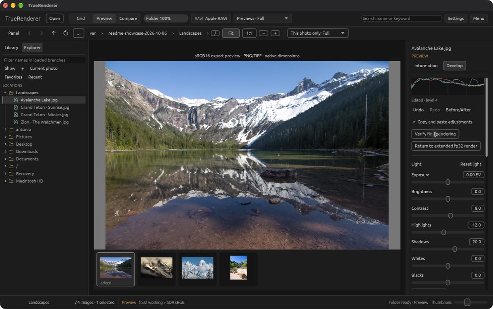
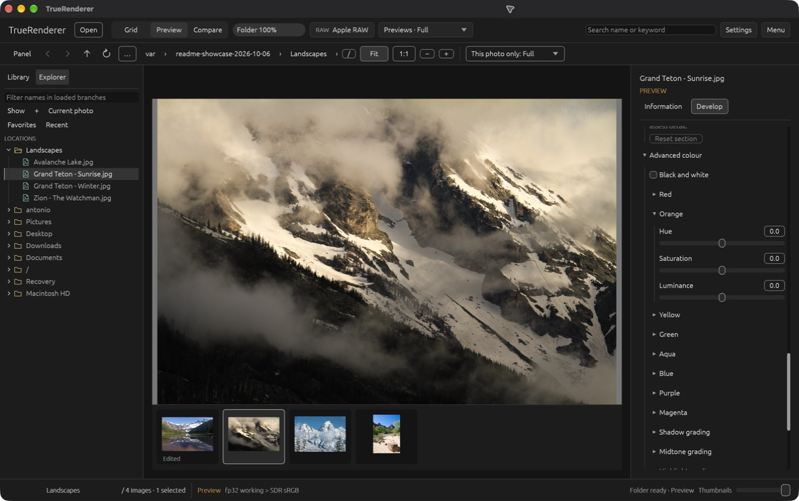
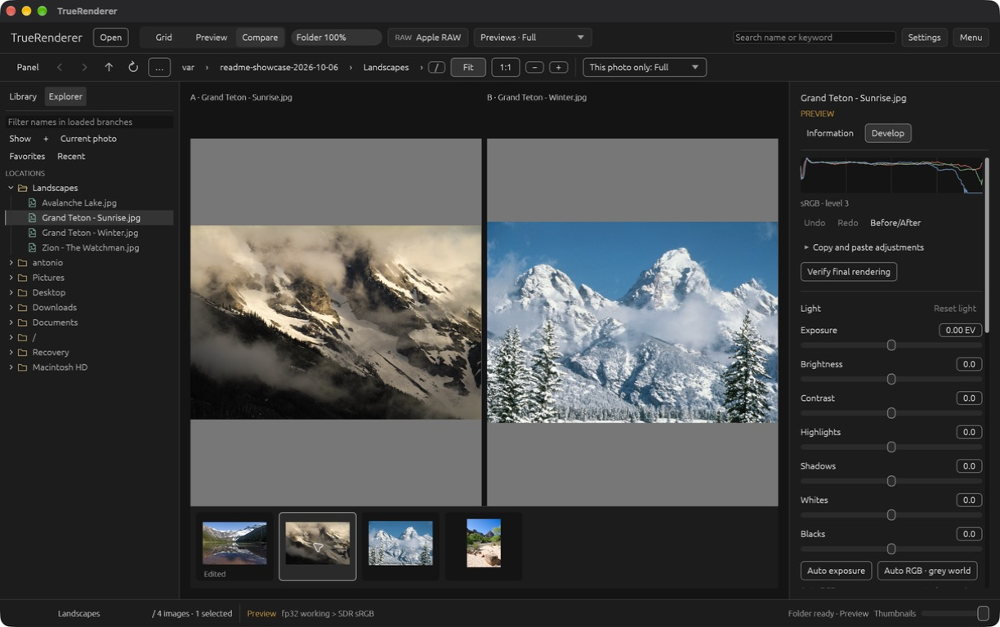
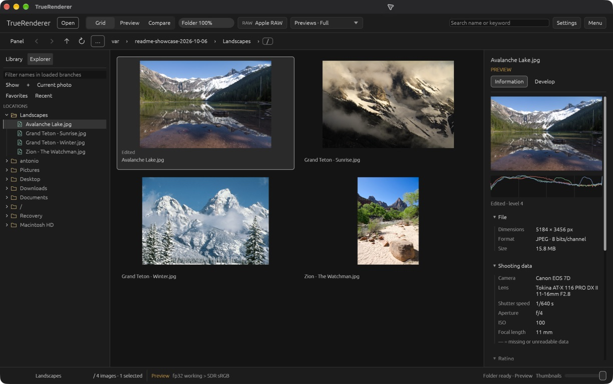

# TrueRenderer

### Your photographs. Your vision. Every detail under your control.

**TrueRenderer brings browsing, RAW development, precise editing and side-by-side comparison into one native desktop workspace.** Move from a folder of photographs to a carefully finished image, with responsive adjustments, powerful colour tools and originals that always remain untouched.



**GPU-accelerated editing · Four RAW engines on macOS · Reversible adjustments · Local-first library**

## Stay in the creative flow

A good editing session keeps your attention on the photograph. TrueRenderer combines GPU acceleration for light and colour adjustments with parallel CPU processing, so your hardware contributes directly to the editing experience.

**Standard and Full previews** let you choose the balance between speed and detail, globally or for an individual photograph. During a slider gesture, an adaptive preview follows your adjustments; after you stop, it refines automatically. Background preparation, nearby-image preloading and reusable previews help keep navigation moving.

Tune performance to your machine with CPU, GPU and memory preferences. Keep the controls close, move through the filmstrip and refine the image without leaving your workspace.

## Shape light. Refine colour. Make it yours.

From a subtle tonal correction to a distinctive creative treatment, the Develop panel gives you direct control over the photograph.

| Your intention | Your tools |
|---|---|
| Balance the light | Exposure, brightness, contrast, highlights, shadows, whites and blacks |
| Sculpt the tones | Point curves and individual RGB channel curves |
| Find the right colour | RAW white balance, RGB warmth and tint, saturation, vibrance and warm-tone protection |
| Build a distinctive look | Eight-band HSL mixer, shadow/midtone/highlight colour grading and black-and-white controls |
| Refine texture | Texture, clarity, dehaze, sharpening and luminance/chroma noise reduction |
| Strengthen the composition | Crop, aspect ratios, rotation, flips, straightening and perspective controls |
| Correct the optics | Manual distortion, vignette, chromatic aberration and defringe adjustments |
| Guide attention locally | Brush, radial and linear gradients, luminance and hue masks, with feathering and inversion |



Click in the tone-curve graph to add anchor points, then drag them to shape the tones. Select a point to refine its Input and Output with sliders or numeric values; use **Delete point** to remove it. Neighbouring anchors stay in place, and the midtone slider preserves your custom points. The black and white endpoints can also move horizontally and vertically to set input and output levels.

Double-click a photographic slider to restore its default. The **Reset all** button beside Undo/Redo restores all adjustments, including as-shot RAW white balance, and can itself be undone. Double-clicking either Apple RAW WB slider restores the complete as-shot white balance.

Experiment freely. **Undo, Redo, Reset all and Before/After** keep decisions reversible, while saved editing recipes preserve your work in the local library. Copy selected light, tone-curve and RGB colour adjustments between photographs to build a consistent look.

## Choose the RAW rendering that suits the photograph

The RAW engine is part of the creative decision. On macOS, choose **Apple RAW, LibRaw bilinear, LibRaw AHD or TrueRenderer fp32** for supported cameras. The active engine stays visible in the toolbar, and native white-balance controls work with the selected engine.

Start from as-shot white balance, adjust it manually, estimate it automatically or sample a neutral area. Apple uses native RAW temperature/tint; the other three engines adjust red/blue sensor gains relative to as-shot before demosaicing. A floating-point processing pipeline provides room for demanding tonal and colour adjustments before the final output conversion.

TrueRenderer fp32 neutralizes sensor-clipped highlights to prevent false magenta skies and reflections. It preserves unclipped channels and floating-point headroom; colour and detail lost in a fully saturated sensor cannot be recovered.

## See the differences that matter

Compare photographs side by side with synchronized navigation. Judge composition, exposure, colour and fine detail in context, then move to **physical 1:1** for a closer inspection.



Histograms, a pixel sampler and camera metadata put useful evidence alongside the image. Check shutter speed, aperture, ISO, focal length and lens information as you decide which frame deserves the final edit.

## Bring order to your photographs

Explore your folders, scan a thumbnail grid or stay immersed in the viewer. Search, favourites and navigation history help you return to the photographs you need.



Use **star ratings, colour labels, reject flags and keywords** to turn a folder into a considered selection. Switch between Library and Explorer, filter your collection and keep the information panel at hand.

Your originals are read-only. Your library, annotations, editing recipes and backups stay on your computer. **No account, photo upload or cloud subscription is required.**

## Finish with the output you need

Export your edited photographs as **JPEG, PNG or TIFF**, with 8-bit or 16-bit options where supported and floating-point TIFF for workflows that need extended numerical values. Export multiple photographs and set a target long edge when preparing a delivery.

Exports apply the saved photographic recipe to the native source. The final-rendering view lets you inspect the PNG/TIFF output rendering before writing your files.

For scientific imagery, TrueRenderer also opens **2D FITS images**, with linear or asinh display, a histogram and native-value inspection.

## Get started

Try the four public-domain landscape photographs shown here from **Library → Sample photos**, beside the test corpus. Their original files and credits are included in [`sample-photos/`](sample-photos/manifest.json); the macOS bundle includes them for offline use.

Open an image or a folder, choose a photograph and switch to **Develop**. Use **Settings → Previews and RAW** to choose preview quality and a RAW engine. English and Italian interfaces are available, with 100%, 150% and 200% UI scaling.

<details>
<summary><strong>Build and run from source</strong></summary>

Run these commands from the repository root. The repository pins Rust 1.98.1; Python 3 is required by the supporting scripts.

**macOS** — Install Rust 1.98.1 and the Xcode Command Line Tools, then:

```sh
./scripts/cargo-local.sh fetch --locked
python3 scripts/generate-format-fixtures.py
./scripts/build-macos.sh
open dist/TrueRenderer.app --args --open "/path/to/photos"
```

Use the macOS app bundle for external photographs: it includes the isolated decoder services.

**Windows** — Install Rust 1.98.1 with rustfmt and Clippy, Visual Studio Build Tools with the Desktop development with C++ workload and Windows SDK, Python 3, and Git for Windows. In PowerShell:

```powershell
.\scripts\dev-windows.ps1 fetch --locked
.\scripts\dev-windows.ps1 verify --gui
.\target\debug\truerenderer.exe
```

The [documentation index](docs/README.md) covers platform-specific format support, architecture and verification. Apple RAW is macOS-specific; camera and file compatibility depend on the selected decoder and platform.

Keep `var/library.sqlite` and `var/backups/`: they contain durable library data. To remove compilation artifacts, use `./scripts/cargo-local.sh clean`.

</details>

---

TrueRenderer is proprietary software. See the [license](LICENSE) and [third-party notices](NOTICE.md).

Screenshots show the English interface at **100% UI scale**. Landscape photographs: National Park Service, including NPS / David Restivo; public-domain source credits and capture details are recorded [here](reports/readme-showcase-macos-2026-10-06.json).
