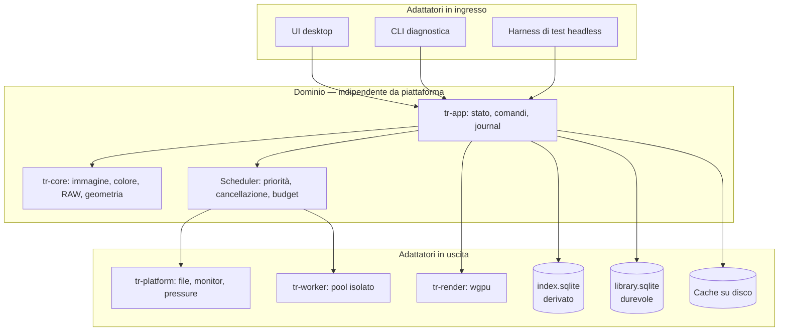
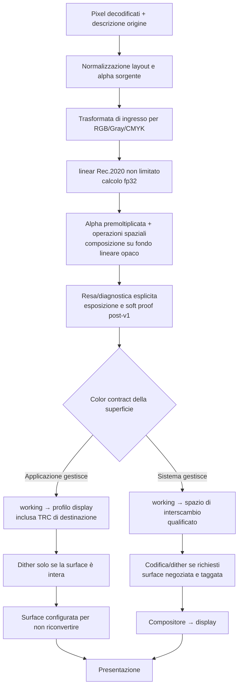
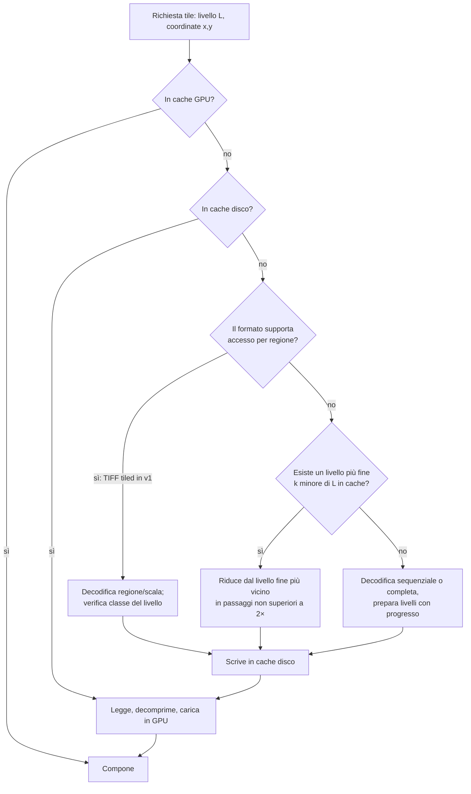

# TrueRenderer — Analisi architetturale e di progettazione

<!-- TR_PROGRESS_START -->
## 0. Sviluppo di TrueRenderer — piano e avanzamento

**Nome corrente: TrueRenderer.** TrueVision è il nome precedente del progetto. I riferimenti storici ai backup conservano il nome originale.

**Ultimo aggiornamento: 6 settembre 2026. Stato: prototipo R0 funzionante, avvio Finder e copia del runtime verificati; completato anche il laboratorio XPC macOS. R0 complessivo rimane aperto.**

Progetto: `/Users/antonio/Desktop/TrueRenderer`. Piano completo: `PLAN.md` nella cartella del progetto. Backup immutato della proposta v1.2: `docs/TrueVision-Architettura.originale-v1.2.md`.

| Area | Stato effettivo | Prossima attività |
|---|---|---|
| Piano | Preparata roadmap R0–R4 con dipendenze e gate | Aggiornare dopo ogni incremento |
| Ambiente | Rust 1.98.1 locale, Cargo.lock e inventario di 206 package build/test macOS | Qualifica dipendenze e canali R0/R4 |
| Codice | 6 crate + desktop compilabili; griglia, viewer, confronto, annotazioni, backup/undo e corpus PNG | Proseguire le prove e i confini mancanti di R0 |
| Verifica | 23 test Rust e 6 prove IPC passati; fmt/clippy senza avvisi; smoke nativo Metal e 3 screenshot | Estendere ai prossimi incrementi e a Windows |
| GPU | Apple M4/Metal: 4.096 campioni, errore massimo 9,54e-7 contro soglia 1e-4 | ICC/LUT, display e recovery non qualificati |
| Pacchetto | Bundle release arm64 firmato ad hoc; avvio Finder e copia indipendente di bundle/corpus passati | Firma di distribuzione e target Windows in R4 |
| Sandbox macOS | Due varianti XPC provate: file/rete negati, FD readonly, crash/recovery; limite aggiuntivo blocca figli | Integrazione decoder, memoria/revoca e firma del peer da qualificare |
| R0 | Aperto | Sandbox, display, Windows, accessibilità e corpus reale |
| R1–R4 | Pianificate, non completate | Gate descritti nel piano e in §22 |

**Limite di questa fase.** È un prototipo di sviluppo, non una v1 qualificata. Standard/Riferimento, RAW, gigapixel e scrittura XMP non possono essere dichiarati disponibili senza i rispettivi test. Fino al gate sandbox i decoder vengono usati solo su corpus controllato, come stabilito dal documento.

**Registro attività**

- 05/09/2026: letti i requisiti principali, creata la cartella, conservato il documento originale, registrato il cambio nome e il piano operativo; installata la toolchain locale.

- 05/09/2026: creati workspace e Cargo.lock, 12 immagini numeriche PNG proprie (8/16 bit), pipeline fp32 con alpha, IPC su pipe e allowlist dei digest; aggiunti libreria/index separati, revisioni/undo/backup, UI egui/wgpu e shader diagnostico. Superati i 10 test iniziali del nucleo. Correzioni di integrazione API in corso.

- 06/09/2026: completata la prima verticale R0 e superati 23 test Rust, 6 controlli avversari IPC, lint e smoke nativo su Apple M4/Metal. Verificati errori di decoder, timeout, riavvio dopo crash, persistenza/restore del backup, undo e servizio asincrono. Salvate le tre schermate e l’inventario dipendenze; corretto il layout del confronto. Build release prodotta, firma del bundle in completamento dopo una collisione di nomi del launcher.

- 06/09/2026: completati bundle release, firma ad hoc verificata, rilevamento della cartella a partire dall’eseguibile e messaggio privacy Desktop. Il primo avvio via Finder è in attesa del consenso macOS (`AUTHREQ_PROMPTING` verificato nei log TCC); nessuna modifica automatica alle autorizzazioni. Dettagli in `reports/VERIFICA.md`.

- 06/09/2026: superato il primo avvio Finder dopo il consenso Desktop di macOS (12 immagini, nessun errore, Metal). Superata anche la copia autonoma di bundle e corpus: report e database creati nella nuova cartella. Verificati i byte del backup originale e di tutti i 319 notice delle dipendenze anche nel repository Git locale.

- 06/09/2026: completato `experiments/macos-xpc/` con due suite eseguite sul Mac. Il servizio con App Sandbox nega lettura/scrittura/creazione esterne e rete, accetta il FD readonly e nega la scrittura; versione sconosciuta e crash rimangono contenuti. Due connessioni condividono un PID. La sandbox base consente figli; la variante con `RLIMIT_NPROC` hard/soft 0 li blocca (`EAGAIN`) e non può rialzare il limite (`EPERM`). Misurata un’allocazione di 16 MiB, senza dichiarare un tetto memoria. Report e istruzioni conservati; il decoder del prototipo mantiene la allowlist.

**Prossimo incremento tecnico:** integrare il decoder controllato in XPC con identità del codice verificata, due isolati reali, copia privata e terminazione/revoca misurata; qualificare memoria, Windows x86-64, contratto display e accessibilità. Solo dopo i gate pertinenti si possono ammettere archivi esterni e completare viewer SDR/ICC/JPEG/TIFF di R1. R2 aggiunge catalogo completo e XMP; R3 RAW/gigapixel; R4 hardening e rilascio.

<!-- TR_PROGRESS_END -->

**Documento di architettura software · v1.2 · 5 settembre 2026**

**Stato: sviluppo R0 avviato; capacità implementate e verifiche effettive sono elencate nel registro §0. Il resto rimane specifica.**

Applicazione desktop per la catalogazione e la visualizzazione verificabile di immagini
fotografiche. Prima release supportata: Windows x86-64 e macOS arm64. Linux, HDR nativo e Android
sono fasi successive subordinate a criteri di uscita espliciti.

> **Revisione v1.2.** Corregge i confini di fiducia dei worker, la gestione di alpha e CMYK,
> l'uso delle risoluzioni ridotte, il contratto XMP sotto concorrenza e il fallback CPU.
> Allinea modello dati, controlli UI, test e roadmap. La valutazione critica è in §1.6;
> il registro delle correzioni e delle verifiche è nell'appendice D.

**Come leggere il documento.** I requisiti v1 e le decisioni esplicite prevalgono sui mockup;
le sezioni marcate post-v1 sono ipotesi, non lavoro già approvato. I blocchi Rust illustrano
contratti, senza costituire un progetto compilabile. Lo schema SQL è una base eseguibile da
completare nelle migrazioni. Le fonti documentano API e specifiche, non dimostrano che TrueRenderer
le abbia implementate o superato i test. R0–R4 sono milestone; v1.2 è la versione del documento.

---

## Indice

1. [Sintesi esecutiva e decisioni chiave](#1-sintesi-esecutiva-e-decisioni-chiave)
2. [Obiettivi, non-obiettivi e requisiti](#2-obiettivi-non-obiettivi-e-requisiti)
3. [Il problema centrale: cosa significa "immagine reale"](#3-il-problema-centrale-cosa-significa-immagine-reale)
4. [Scelta dello stack tecnologico](#4-scelta-dello-stack-tecnologico)
5. [Architettura generale](#5-architettura-generale)
6. [Pipeline immagine](#6-pipeline-immagine)
7. [Pipeline RAW](#7-pipeline-raw)
8. [Color management end-to-end](#8-color-management-end-to-end)
9. [HDR, gain map e float](#9-hdr-gain-map-e-float)
10. [Ricampionamento e geometria](#10-ricampionamento-e-geometria)
11. [Immagini ad altissima risoluzione](#11-immagini-ad-altissima-risoluzione)
12. [Motore di calcolo: GPU e CPU](#12-motore-di-calcolo-gpu-e-cpu)
13. [Catalogo, metadati e ricerca](#13-catalogo-metadati-e-ricerca)
14. [Interfaccia utente desktop](#14-interfaccia-utente-desktop)
15. [Interfaccia utente Android](#15-interfaccia-utente-android)
16. [Design system](#16-design-system)
17. [Specificità di piattaforma](#17-specificità-di-piattaforma)
18. [Sicurezza e robustezza](#18-sicurezza-e-robustezza)
19. [Testing e verifica della correttezza](#19-testing-e-verifica-della-correttezza)
20. [Licenze e vincoli legali](#20-licenze-e-vincoli-legali)
21. [Build, CI/CD e distribuzione](#21-build-cicd-e-distribuzione)
22. [Roadmap e stima di sforzo](#22-roadmap-e-stima-di-sforzo)
23. [Rischi principali](#23-rischi-principali)
24. [Appendici](#24-appendici)

---

## 1. Sintesi esecutiva e decisioni chiave

TrueRenderer è un browser/visualizzatore di immagini professionale. La sua ragione d'essere non è
"aprire file", che sanno fare in molti, ma produrre una resa **tracciabile e verificabile**:
colore gestito end-to-end, ricampionamento in luce lineare, decodifica RAW dichiarata, errore
numerico misurato e nessun passaggio implicito. Per un bitmap il codec vincola la ricostruzione dei
campioni più di un RAW, ma profilo, alpha e presentazione restano parte dell'interpretazione; per
un RAW non esiste un'unica "immagine reale".

Il secondo pilastro è la **scalabilità dimensionale**, ma con un contratto dipendente dal formato:
un TIFF già piramidale o una piramide in cache deve offrire rapidamente un primo viewport;
la sua qualità dipende dalla provenienza dei livelli. Un PNG non tiled da gigapixel
richiede invece una preparazione sequenziale esplicita. Promettere la stessa latenza per entrambi
sarebbe tecnicamente falso.

Queste due esigenze determinano l'architettura più di qualunque altra considerazione.

### 1.1 Le decisioni portanti

| # | Decisione | Scelta | Stato e motivo |
|---|-----------|--------|-----------------|
| 1 | Scope | **v1 desktop SDR: Windows x86-64 + macOS arm64** | Linux, HDR e Android seguono solo dopo uso reale della v1 |
| 2 | Linguaggio del nucleo | **Rust** | Sicurezza di memoria nel codice proprio, prestazioni e FFI; le librerie C restano comunque non fidate |
| 3 | Rendering | **wgpu + WGSL**, con adattatori di presentazione per piattaforma | Condivide il motore, non presume che swapchain e gestione colore siano identiche |
| 4 | UI desktop | **egui, decisione provvisoria fino allo spike R0** | Buona integrazione Rust/wgpu; deve ancora provare accessibilità, IME, docking e griglia virtualizzata |
| 5 | Rappresentazione numerica | **working linear Rec.2020 non limitato in fp32** | Il confine di un decoder può avere precisione nativa diversa e viene dichiarato; dopo quel confine, valori negativi e oltre 1 non vengono troncati |
| 6 | Gestione colore | **Little CMS come riferimento; percorso GPU adattivo** | Trasformate di ingresso e di uscita separate; LUT dimensionata e validata, non fissata a priori a 65³ |
| 7 | Modello immagine | **`TileProvider` uniforme, piramide adattiva** | Le immagini piccole usano uno o pochi tile e mip GPU; la piramide persistente nasce solo quando serve |
| 8 | Decodifica non fidata | **Pool persistente di worker isolati** | Evita il costo di avvio per file e contiene decoder e parser C; limiti e sandbox sono specifici per OS |
| 9 | RAW | **LibRaw come baseline v1; demosaicing proprietario è ricerca post-v1** | Prima si valida che gli utenti ne percepiscano il valore e si misura il costo reale |
| 10 | Dati | **Indice derivato separato dallo stato utente durevole** | Cancellare la cache non deve cancellare rating, raccolte, override colore o parole chiave |
| 11 | Stato e operazioni | **Reducer deterministico + journal transazionale degli effetti** | Undo di sessione distinto dalle nuove transazioni necessarie per annullare dati già confermati |
| 12 | Accelerazione | **CPU di riferimento, GPU entro tolleranze dichiarate** | Nessuna promessa bit-a-bit fra backend; fallback selettivo quando una GPU non supera la verifica |
| 13 | Licenze | **versioni bloccate, SBOM e revisione prima della distribuzione** | "Costo zero" non equivale a rischio legale zero, soprattutto per LGPL e codec brevettati |
| 14 | Metadati | **EXIF normalizzato e XMP sidecar, con parser minimi qualificati** | IPTC-IIM storico, MakerNotes generici e scrittura incorporata restano fuori dalla v1 |

**Vincolo trasversale: nessun canone obbligatorio per le dipendenze.** Le versioni distribuite
devono avere licenze compatibili con il modello di distribuzione scelto e un piano di conformità
riproducibile. Questo non autorizza a dichiarare in anticipo assenza di royalty brevettuali o
compatibilità LGPL su ogni store: sono verifiche di rilascio. Il bilancio è in
[§20.4](#204-budget-di-licenze-e-distribuzione).

### 1.2 Il principio architetturale fondante

> **Il toolkit UI disegna la cornice. Il motore immagine produce una resa tracciabile.**

Ogni pixel dell'immagine passa dalla pipeline controllata: decodifica, stato colore, spazio lineare,
ricampionamento, trasformata di uscita e presentazione. L'unica eccezione ammessa è un decoder di
sistema scelto esplicitamente; in quel caso provenienza e limiti devono essere visibili.

Questa regola ha tre conseguenze enormi:

- Il nucleo è condiviso, mentre l'ultimo miglio verso il display è un **contratto di piattaforma
  verificato**. Due monitor diversi non possono essere promessi identici dal solo software.
- La **scelta del toolkit UI diventa reversibile**: se egui dovesse rivelarsi inadeguato fra due
  mesi, si sostituisce la cornice senza riscrivere dominio e pipeline.
- I test numerici girano headless; profilo del monitor, compositore e HDR richiedono anche test su
  hardware reale.

Il prodotto distingue sempre tre stati, evitando che una preview veloce venga scambiata per il
risultato finale:

| Stato | Garanzia |
|---|---|
| **Anteprima** | Può provenire dal file o da una cache lossy; è marcata e viene sostituita |
| **Standard** | Pipeline GPU validato entro il budget d'errore; è il default interattivo |
| **Riferimento** | Percorso CPU dalla revisione sorgente verificata, oppure cache fp32 prodotta da quel percorso; trasformata applicativa senza approssimazione LUT GPU |

Questi stati descrivono la **qualità del calcolo**. Origine (`JPEG`, `anteprima incorporata`,
`render LibRaw`), completezza (`parziale`, `in raffinamento`, `completo`), revisione sorgente e
contratto display sono dimensioni separate. `RENDER LIBRAW` non implica Riferimento; un viewport
misto eredita lo stato meno qualificato delle regioni visibili. La verifica GPU contro CPU è
un'azione diagnostica, non un quarto stato. Il badge Riferimento non certifica il pannello fisico.

### 1.3 Confini di portabilità

La portabilità si misura in dipendenze, contratti e prove sui target, senza anticipare
percentuali di codice condiviso prive di implementazione.

| Area | Politica |
|---|---|
| Dominio, catalogo, scheduler, geometria | Rust puro, nessuna API di piattaforma |
| Decoder e colore | API Rust comune, implementazioni/librerie isolate e versionate |
| Rendering | Shader e grafo condivisi; superficie, formato e color contract per OS |
| UI desktop | Codice comune finché lo spike R0 ne conferma i requisiti |
| File system, sandbox, profilo display, packaging | Adattatori nativi espliciti e testati separatamente |
| Android | Nuovo frontend e nuovo ciclo di vita; non conteggiato come porting "quasi gratuito" |

### 1.4 Scope per release

| Fase | Incluso | Escluso deliberatamente |
|---|---|---|
| **R0, validazione** | macOS arm64 e verticale Windows x86-64 su hardware reale; spike colore, wgpu/egui e worker isolato | Funzioni di catalogo |
| **v1.0** | Windows x86-64 e macOS arm64; JPEG, PNG, TIFF/BigTIFF anche tiled, matrice RAW limitata; SDR; EXIF normalizzato e XMP sidecar | WebP e altri formati, IPTC-IIM storico, MakerNotes fuori matrice, HDR nativo, scrittura dentro i file, demosaicing proprio, Android |
| **v1.x** | Linux x86-64 e gigapixel esteso ad altri formati, se richiesti | Parità automatica con ogni distro/compositore |
| **v2+** | AVIF/HEIF/JXL, HDR, Windows arm64, Android, algoritmi RAW propri | Entrano uno alla volta dopo un gate misurato |

### 1.5 Registro delle decisioni ancora aperte

Un punto aperto non viene nascosto come dettaglio d'implementazione. Il maintainer chiude ciascuna
voce con un ADR contenente prova, alternativa e criterio di revoca.

| Decisione | Evidenza richiesta | Scadenza | Default se non chiusa |
|---|---|---|---|
| egui oppure Qt/Iced | spike §4.4 sui due OS | fine R0 | fermare la UI oltre il prototipo |
| licenza/modello di distribuzione | distinta v1 + piano LGPL/CDDL/store | fine R0 | nessuna dipendenza copyleft distribuita |
| canale Windows | install/upgrade, firma, reputazione e costo | fine R0 | build interna soltanto |
| versioni minime OS/GPU | hardware utenti target + capability wgpu/color | fine R0 | nessuna promessa pubblica |
| contratto colore per surface | pattern e misure senza doppia conversione | fine R0 | sRGB dichiarato, modalità Riferimento non disponibile |
| composizione UI/immagine e recupero grafico | viewport opaco, gestione colore del chrome e recovery senza GPU di calcolo | fine R0 | fallback CPU limitato all'immagine; nessuna promessa di UI senza device |
| framing/serializzazione IPC | fuzz, limiti allocazione, versioning e handle transfer sui due OS | fine R0 | nessun worker in build distribuibile |
| proprietà e durata dei buffer IPC | worker che continua a scrivere dopo la risposta; copia privata e limiti misurati | fine R0 | copia bounded prima della validazione; nessun consumo diretto del buffer condiviso |
| revisione sorgente per cache e Riferimento | snapshot/esclusione writer o spool coerente, costo su file grandi e mutazioni in-place | fine R0 | lettura best-effort dichiarata; nessuna promozione sulla sola stat |
| sandbox concreta per worker | test negativi filesystem/rete/resource limits | prima di usare archivi esterni, al più tardi prima del pilot R2 | solo corpus controllato finché il gate non passa |
| qualificazione lettore EXIF ed estrattori XMP | corpus v1, limiti, input da handle/memoria, offset/cicli, fuzz e provenance | fine R1 | fermare R2 o ridurre i formati; non sommare parser ad hoc |
| versione XMP Toolkit e round-trip sidecar | build Win/mac, corpus RDF, fuzzing, licenze e confronto semantico | fine R1 | stato solo in libreria; nessuna scrittura `.xmp` |
| pubblicazione XMP per filesystem | creazione senza sovrascrittura, writer concorrenti, recovery e contratto di coordinamento | prima del pilot R2 | solo libreria/export distinto quando l'aggiornamento non è qualificato |
| versione/opzione LibRaw e matrice camere | SBOM, parere di compliance e corpus | inizio R3 | RAW non dichiarato supportato |
| nome commerciale | clearance nelle classi/territori scelti | prima di alpha pubblica | usare un codename non commercializzato |

### 1.6 Valutazione critica e ordine delle prove

La separazione fra dati utente e indice, i decoder isolati e una resa ispezionabile sono le scelte
più solide. Il rischio dominante resta la quantità di infrastruttura necessaria a una sola
persona prima di poter verificare il valore del prodotto. La proposta è adatta a guidare uno
spike; non è ancora una distinta implementativa né una stima di consegna affidabile.

| Priorità | Problema rilevato | Correzione / prova necessaria |
|---|---|---|
| Bloccante | Una lease IPC non rende immutabile memoria scrivibile da un worker compromesso | copia privata prima della validazione; autorità residua e riciclo espliciti (§5.3) |
| Bloccante | Controllare il digest e poi rinominare non è un compare-and-swap sul contenuto | coordinamento qualificato oppure pubblicazione senza sovrascrittura/solo libreria (§13.4) |
| Alta | CMYK, alpha associata e composizione UI non erano coperti dalla generica catena RGB | ingressi distinti, normalizzazione alpha e viewport opaco prima dell'uscita (§6.4, §8.4) |
| Alta | Risoluzioni native e mip arbitrari potevano essere confusi con un ricampionamento verificato | provenienza dei livelli, 1:1 senza filtro e piramide di riferimento definita (§6.2, §10) |
| Alta | CPU fallback veniva presentato come indipendenza dalla GPU dell'intera applicazione | distinguere calcolo immagine, presentazione e UI (§12.7–12.9) |
| Alta | Schema e journal non modellavano completamente storia utente, conflitti ed esiti incerti | revisione durevole, payload di conflitto, riconciliazione e test SQL (§13.2) |
| Prodotto | La prima prova con utenti arrivava dopo mesi di infrastruttura | interviste e corpus già in R0; R2 misura l'uso ripetuto (§2.0, §22) |

R0 deve chiudere prima i rischi bloccanti e il contratto di presentazione sui due OS. Se una prova
fallisce, si registra quale requisito cambia e il relativo costo; aggiungere genericamente
«da validare» non costituisce una soluzione. Le correzioni documentali non sostituiscono questi
esperimenti.

---

## 2. Obiettivi, non-obiettivi e requisiti

### 2.0 Ipotesi di prodotto e flusso primario

La v1 serve prima di tutto fotografi che lavorano su cartelle esistenti e vogliono selezionare,
confrontare e ispezionare senza importare in un editor. Il flusso che decide le priorità è:

`scegli cartella → griglia/preview → confronto a due → ispezione colore/RAW → rating/keyword → sidecar`

Il differenziatore non è “più corretto di tutti”, affermazione che richiederebbe un confronto di
mercato continuo, ma la **tracciabilità della resa** insieme a un browser rapido. TIFF tiled molto
grandi è una capability secondaria utile a scansioni/panorami: se richiede workflow scientifici o
formati ulteriori, esce dalla v1.

Prima di iniziare R3, una prova con 8–12 utenti del profilo target sui loro archivi deve mostrare
che il flusso è completabile senza assistenza e che almeno cinque tornano a usarlo ogni settimana
per quattro settimane. È un gate di apprendimento, non una prova statistica di mercato; un esito
debole riduce o ferma RAW/gigapixel prima dell'investimento maggiore.

La scoperta del bisogno parte già in R0: interviste brevi con almeno cinque fotografi, raccolta
autorizzata dei casi difficili e confronto del flusso con gli strumenti che usano. Non serve
distribuire un decoder ancora non isolato per verificare il bisogno. Il pilot R2 prova browser,
bitmap e annotazioni; può usare anteprime RAW incorporate soltanto se già qualificate in
isolamento. Il render RAW completo resta R3 e non è una precondizione circolare del pilot.

### 2.1 Obiettivi

1. Sfogliare cartelle con decine di migliaia di immagini con scorrimento fluido.
2. Visualizzare i formati dichiarati per la release con una resa tracciabile, senza usare
   "qualunque formato" come requisito non verificabile.
3. Gestire almeno 4 gigapixel nei profili TIFF/BigTIFF qualificati, entro budget di memoria e
   disco. Accesso locale ai tile e apertura veloce dell'intero campo sono requisiti distinti:
   quest'ultima richiede livelli ridotti già presenti. Gli altri formati si preparano in
   background solo se decoder e spazio disponibile lo consentono.
4. Zoom continuo da "adatta alla finestra" fino a 3200% con ispezione dei campioni raster.
5. Colore gestito su tutta la catena, con profilo del monitor rilevato automaticamente e
   sostituibile a mano dove il sistema consente un percorso applicativo verificabile.
6. Controllo completo dell'utente sullo spazio colore: leggere quello incorporato, assegnarne un
   altro senza modificare il file, importare profili ICC propri e vedere l'errore **del calcolo**.
   L'errore del calcolo non misura la calibrazione fisica del monitor.
7. Catalogare, valutare, etichettare, filtrare e cercare senza importare i file.
8. Trattare file e profili come input non fidati, con limiti espliciti e recupero dai crash dei
   decoder.

### 2.2 Non-obiettivi della versione 1

- Editing distruttivo o non distruttivo dei pixel. La conversione verso un nuovo file è post-v1.
- Scrittura di metadati dentro gli originali. In v1 si usano sidecar XMP e stato durevole
  dell'applicazione; l'embedding per formato richiede un progetto separato.
- Sincronizzazione cloud, account, collaborazione.
- Video e animazioni; al massimo si mostra un fotogramma statico quando il decoder lo consente.
- PSD/PSB, OpenEXR, HEIF/AVIF e JPEG XL, che entrano dopo la v1 uno alla volta.
- HDR/gain map e scene-linear float. La v1 può mostrare una base SDR indipendente quando prevista
  dal formato; non inventa un tone mapping generico per contenuto che non supporta.
- Linux, Android e iOS come piattaforme supportate. La portabilità si preserva, ma non si promette
  ciò che non viene provato e distribuito.

### 2.3 Requisiti non funzionali con budget misurabili

I budget sono criteri di accettazione, non previsioni. Le metriche p95 usano almeno 100 prove
indipendenti o un numero maggiore determinato dalla varianza, con intervallo di confidenza e
protocollo di warm-up/cold cache; le metriche batch dichiarano ripetizioni e dispersione. Si
misurano sulle due macchine di riferimento registrate nel repository (una macOS arm64 e una
Windows x86-64 con 16 GB e SSD NVMe). Il manifest fissa CPU, GPU, driver, sistema, corpus, stato
della cache OS e alimentazione. Fino alla fine di R0 i numeri sono obiettivi da confermare; se una
misura li smentisce si modifica il budget o lo scope, non il risultato.

| Metrica | Criterio v1 | Condizione di misura |
|---|---|---|
| Avvio a freddo fino a UI interattiva | p95 < 1,5 s; obiettivo < 800 ms | Indice con 200k voci, nessuna scansione bloccante |
| Prima miniatura da cache | p95 < 75 ms | Cartella con 1000 elementi, cache applicativa calda |
| Prima miniatura RAW non in cache | p95 < 300 ms | Anteprima incorporata, file locale, cache OS dichiarata |
| 1000 miniature RAW | < 30 s; obiettivo < 15 s | Estrazione anteprime incorporate, non sviluppo RAW completo |
| Scorrimento della griglia | p95 < 16,7 ms; p99 < 33 ms | 100k righe virtualizzate, sole celle visibili renderizzate |
| Primo fotogramma Standard da cache verificata | p95 < 100 ms | Digest dell'handle già confermato nella sessione; un hit solo-token resta Anteprima |
| Render RAW a 1:1 | obiettivo p95 < 3 s | 45 Mpx, LibRaw CPU baseline v1 e macchina registrata; da confermare all'inizio di R3 |
| TIFF piramidale da 2 Gpx | p95 < 1 s al primo viewport utile | Piramide nativa o cache pronta, disco locale |
| Immagine enorme non tiled | Progresso/cancellazione visibili < 500 ms | Nessuna promessa di apertura sub-secondo |
| Pan e zoom con tile residenti | p95 < 16,7 ms, mai viewport vuoto | Raffinamento progressivo consentito |
| Memoria residente a riposo | < 500 MB | Indice grande, nessuna immagine aperta |
| Working set | `min(2 GiB, 25% RAM)` di default, riducibile | Totale broker + worker + buffer/staging + memoria GPU attribuibile, senza doppio conteggio su memoria unificata; ammissione job e pressure API |
| Errore numerico del percorso GPU | ΔE00 medio < 0,5, max < 1,0 | Campioni in gamut contro la stessa trasformata Little CMS; quantizzazione esclusa |
| Recupero decoder | UI viva e worker ripristinato < 1 s | Corpus di crash controllati e job in quarantena |
| Durabilità stato utente | nessuna mutazione confermata persa dopo crash/power-fault simulato | `library.sqlite`, journal e restore su copie fault-injected |
| Sidecar | nessun aggiornamento automatico se manca un contratto di coordinamento qualificato; nessuna perdita dello stato locale confermato | creazione no-clobber, conflitti e race anche fra ultimo controllo e sostituzione; §13.4 |
| Isolamento worker | nessun accesso oltre handle/buffer concessi nei test di policy OS | filesystem, rete, child process e resource exhaustion |
| Accessibilità | baseline §16.6 completa sui due OS | NVDA/VoiceOver, solo tastiera, 200% e high contrast |

### 2.4 Formati richiesti

Matrice completa in [appendice A](#a-matrice-dei-formati). La v1 copre solo:

- **Obbligatori**: JPEG, PNG e TIFF/BigTIFF.
- **RAW baseline**: DNG e formati proprietari entrano solo nella matrice qualificata. Il piano
  iniziale ammette al massimo 12 combinazioni modello/formato/CFA, scelte dai pilot R2; ogni riga
  richiede campioni, preview, render e metadata verificati con la versione LibRaw bloccata. Altri
  file che LibRaw riesce ad aprire restano sperimentali/preview-only, non “supportati”. Una
  combinazione X-Trans conta nella matrice solo se supera anche il gate specifico del §7.3.7;
  altrimenti il relativo RAF può offrire la sola preview incorporata e non riceve il badge render.
- **Non inclusi nella v1**: BMP, TGA e PNM; sono semplici solo in apparenza e seguono lo stesso
  gate di ogni nuovo decoder.

Profilo di conformità iniziale, da trasformare in fixture positive e negative:

| Contenitore v1 | Varianti incluse | Limite deliberato |
|---|---|---|
| JPEG | 8 bit baseline/progressive; gray, YCbCr/RGB, CMYK/YCCK; ICC/EXIF | niente JPEG 12 bit, lossless, arithmetic o MPO finché backend e corpus non li qualificano |
| PNG | statico: gray 1/2/4/8/16 bit; indexed 1/2/4/8 bit; RGB e gray/RGB con alpha 8/16 bit; `tRNS`; non interlacciato o Adam7 | solo combinazioni valide; segnali HDR senza base SDR autonoma non sono render v1; APNG mostra la default image con badge, playback escluso |
| TIFF/BigTIFF | primo IFD immagine, 8/16 bit interi, Gray/RGB/CMYK, planar/contiguous, strip/tile; none, PackBits, LZW, Deflate e JPEG moderno dove valido | multipagina, OJPEG, floating point, LogLuv e tag/vendor non qualificati sono post-v1 o rifiutati con motivo |

Il limite pixel/byte e il supporto reale di ogni combinazione dipendono inoltre dal corpus e dalle
capability del decoder bloccato; una cella non testata non eredita il supporto dal contenitore.

WebP, AVIF/HEIF, JPEG XL, OpenEXR, Radiance HDR, PSD/PSB, animazioni e altri profili RAW sono
post-v1. Ogni nuovo decoder deve portare con sé corpus, limiti, fuzzing e piano di aggiornamento.

---

## 3. Il problema centrale: cosa significa "immagine reale"

"Immagine reale" è una formula intuitiva ma tecnicamente sbagliata. Il requisito utile è più
preciso: per un bitmap, decodifica conforme e trasformata tracciabile; per un RAW, interpretazione
dichiarata e riproducibile; per il display, errore del software distinto dall'incertezza fisica di
profilo, calibrazione, ambiente e compositore. Un visualizzatore che nasconde questi passaggi è
peggio di uno che dichiara i propri limiti.

Ci sono circa quindici modi documentati in cui un visualizzatore mostra pixel sbagliati. Elencarli
esplicitamente serve a due cose: guidare l'implementazione e generare la suite di test.

### 3.1 Catalogo delle fonti di errore

| # | Errore | Sintomo visibile | Contromisura in TrueRenderer |
|---|---|---|---|
| 1 | Profilo ICC incorporato ignorato | Immagini Adobe RGB o ProPhoto piatte e desaturate | Estrazione ICC obbligatoria da ogni contenitore bitmap qualificato, con precedenza specificata |
| 2 | Profilo del monitor ignorato | Colori saturi o spenti su schermi wide gamut | Rilevamento del profilo per monitor, ricalcolo al cambio schermo |
| 3 | Ridimensionamento in spazio gamma | Immagini scure e "sporche" dopo il downscale, aloni sui bordi | Ogni ricampionamento avviene in luce lineare |
| 4 | Alpha non premoltiplicata durante il filtraggio | Alone scuro o chiaro attorno agli oggetti trasparenti | Premoltiplicazione prima dei filtri; conversione a straight solo se il confine di uscita la richiede |
| 5 | Matrice YCbCr o range sbagliati | Contrasto e tinta alterati, neri lavati | Metadati del contenitore, poi default normativo del codec con assunzione visibile |
| 6 | Siting del croma sbagliato | Frange colorate sui bordi ad alto contrasto | Leggere il segnale quando esiste; altrimenti applicare il default specifico di codec e sottocampionamento |
| 7 | Orientamento EXIF applicato due volte o zero volte | Immagine ruotata o capovolta | Normalizzazione dell'orientamento in un unico punto, con regole per HEIF `irot`/`imir` |
| 8 | Quantizzazione a 8 bit senza dithering | Banding nei cieli e nelle sfumature | Dither TPDF o blue-noise dimensionato per il quantizzatore e validato prima della quantizzazione |
| 9 | Pipeline a 8 bit interi | Posterizzazione dopo trasformate colore concatenate | Calcoli critici fp32; eventuale storage fp16 solo se validato |
| 10 | Anteprima JPEG incorporata scambiata per il RAW | Il file "cambia colore" dopo qualche secondo, oppure resta mostrata la resa della fotocamera | Indicatore esplicito "anteprima incorporata" / "render RAW", commutazione manuale |
| 11 | Livello di piramide sbagliato | Immagine sfocata o aliasata a zoom intermedi | Selezione del LOD sul rapporto di scala effettivo in pixel del dispositivo |
| 12 | Scalatura del sistema operativo applicata sopra la nostra | Immagine sfocata su schermi HiDPI | Drawable alla dimensione fisica richiesta e test pattern per rilevare resample del compositore |
| 13 | Livelli di nero e bianco RAW non applicati | Neri grigi o dominanti magenta nelle alte luci | Applicazione dei livelli per canale, con tabelle di linearizzazione |
| 14 | Immagini CMYK convertite ingenuamente | Colori completamente errati, spesso invertiti | Trasformata ICC obbligatoria, gestione del flag Adobe di inversione |
| 15 | Filtri di sistema attivi (Night Shift, True Tone, profili notturni) | L'utente giudica il colore su uno schermo alterato | Stato solo dove un'API documentata lo espone; altrimenti checklist esplicita, senza fingere il rilevamento |

### 3.2 Le sette invarianti della pipeline

Regole non negoziabili, verificate da test automatici:

1. **Ogni filtro o compositing implementato da TrueRenderer opera in luce lineare con alpha
   premoltiplicata.** Ricostruzione del codec e demosaic hanno il proprio dominio dichiarato;
   riduzioni native non equivalenti restano Anteprima (§6.2).
2. **I calcoli critici implementati da TrueRenderer avvengono almeno in fp32.** Precisione,
   quantizzazione e clipping propri del decoder sono parte della provenienza e del budget; fp16 è
   ammesso soltanto come storage validato e non nel percorso di riferimento.
3. **Esiste un solo responsabile della trasformata finale:** applicazione oppure compositore.
   Formato, codifica e tagging della superficie fanno parte della stessa decisione.
4. **L'orientamento è normalizzato esattamente una volta, in un unico modulo.**
5. **Ogni pixel mostrato ha uno spazio di origine dichiarato o un'assunzione esplicita.** In
   assenza di informazione si applica la regola di default documentata per quel formato, e la UI
   la segnala come assunta.
6. **Il ricampionamento non introduce sharpening non dichiarato.** Filtro, lobi, eventuale clamp
   e versione appartengono alla provenance del risultato.
7. **Un errore di decodifica non produce mai pixel non inizializzati o presentati come validi.**
   Il risultato è respinto oppure marcato come parziale, con regioni mancanti inizializzate a un
   valore neutro e diagnostica conservata.

### 3.3 Modalità "ispezione"

Oltre alla resa corretta, un professionista deve poter verificare cosa sta guardando. TrueRenderer
espone una modalità di ispezione con:

- **Campionatore di colore**: campione nativo, campione di lavoro e valore inviato alla
  superficie, con coordinate e disponibilità dichiarate (§8.10.6).
- **Avviso di gamut**: sovrapposizione dei pixel fuori dal gamut del display; un profilo di
  soft proof scelto è post-v1.
- **Avviso di clipping**: alte luci e ombre tagliate, per canale, con soglia configurabile.
- **Istogramma** a scelta su dati di origine, di lavoro o di display, lineare o percettivo.
- **Griglia dei pixel** oltre il 500% di zoom.
- **Pannello "provenienza del pixel"**: quale decoder, quale profilo, quale intento di rendering,
  quale livello di piramide, se si sta guardando l'anteprima incorporata o il render completo.

Questo pannello rende verificabile quale interpretazione e quale catena abbiano prodotto il
campione, senza chiamarle “l'immagine reale”.

---

## 4. Scelta dello stack tecnologico

### 4.1 Vincoli che restringono il campo

- Due piattaforme desktop nella v1, con API di presentazione e sandbox differenti.
- Necessità di legare alcune librerie C/C++ mature: LibRaw, libjpeg-turbo, libpng, libtiff,
  Little CMS e il backend XMP qualificato. I decoder post-v1 non entrano finché non superano un
  gate di sicurezza.
- Necessità di calcolo GPU personalizzato, non solo disegno di rettangoli.
- Parser di formati binari ostili, con limiti di risorse e isolamento verificabile.
- Una persona sola: il numero di moduli, target e pipeline parallele va minimizzato quanto il
  codice duplicato.

### 4.2 Decisione sul linguaggio del nucleo

La scelta confronta pochi discriminanti tecnici e di manutenzione:

| Candidato | Punti forti per questo prodotto | Costo/rischio decisivo |
|---|---|---|
| **Rust** | ownership sui buffer, concorrenza, buon FFI C, ecosistema wgpu | ecosistema imaging più piccolo e unsafe inevitabile al confine C |
| **C++20** | ecosistema imaging e API native mature | maggiore disciplina/tooling necessari su memoria e concorrenza ostile |
| **Kotlin/JVM** | produttività e sicurezza gestita | controllo/copie dei grandi buffer e percorso desktop/GPU meno diretto |
| **Dart/TypeScript** | UI rapida | runtime e FFI diventano un secondo nucleo per il percorso pixel |

**Rust è confermato** soprattutto per la combinazione di sicurezza di memoria nel codice proprio,
controllo della memoria e FFI. Un wrapper Rust non rende sicura una libreria C: il confine di
sicurezza resta il worker isolato. Anche il costo di IPC e copia non si presume nullo; si misura
nello spike R0.

C++ resta una scelta ragionevole se chi sviluppa possiede già competenza profonda nel linguaggio.
La scelta di Rust non dipende da una presunta impossibilità di usare Qt gratuitamente: Qt LGPL è
un'opzione possibile se si rispettano i suoi obblighi, ma comporta un secondo ecosistema e un
confine FFI più ampio.

### 4.3 Politica su costi e licenze

Requisito: **nessun canone obbligatorio per compilare e distribuire la configurazione scelta**.
Non è invece richiesto che ogni componente sia permissivo. Sono ammesse licenze weak-copyleft
quando esiste un piano concreto di conformità per ciascun canale di distribuzione.

La baseline di pianificazione è un'app proprietaria/commerciale, non una decisione già presa
sulla licenza finale. Finché l'ADR di R0 non la sostituisce, dipendenze GPL che imporrebbero un
modello incompatibile restano escluse; weak-copyleft e CDDL restano gate di packaging/compliance.

La decisione si prende sulla versione esatta, non sul nome del progetto:

1. dipendenze bloccate e hashate;
2. SBOM e testi di licenza generati a ogni release;
3. verifica di linking, relinking, reverse engineering consentito e sorgenti corrispondenti per
   LGPL/CDDL;
4. codec brevettati disattivati finché una revisione competente non chiarisce distribuzione,
   territori e copertura del decoder di sistema;
5. nessuna frase come "zero rischio" o "per sempre": una versione già acquisita ha una licenza,
   ma aggiornamenti, store e brevetti possono cambiare il quadro.

Qt e Slint non sono esclusi per definizione. Sono alternative tecniche con costi di integrazione
o condizioni di licenza differenti, descritte in [§20.5](#205-alternative-non-selezionate).

### 4.4 Decisione sul toolkit UI

La decisione dipende dai rischi che lo spike deve risolvere:

| Candidato | Vantaggio decisivo | Rischio decisivo |
|---|---|---|
| **egui** | Rust e integrazione wgpu diretta | Accessibilità, IME, comportamento nativo e UI molto densa da provare |
| **Iced** | Rust, modello dichiarativo, wgpu | Ecosistema più piccolo per docking e strumenti professionali |
| **Qt 6 LGPL** | Maturità desktop, accessibilità, IME e integrazione OS | FFI/secondo stack e piano di conformità LGPL per ogni pacchetto |
| **Flutter** | UI coerente e futuro Android | Runtime/linguaggio aggiuntivo e interoperabilità con la superficie GPU |
| **Tauri/web** | Produttività per pannelli e tabelle | Contratto colore e composizione GPU meno controllabili |

**Decisione provvisoria: egui.** Diventa definitiva solo se lo spike R0 dimostra insieme:

1. un viewport wgpu nello stesso device/coda della UI, senza readback né copia CPU;
2. griglia virtualizzata da 100.000 elementi entro il budget di §2.3;
3. input da tastiera, IME, menu, dialoghi e drag-and-drop corretti su Windows e macOS;
4. percorso completo con VoiceOver e NVDA, focus visibile e navigazione solo tastiera;
5. una finestra spostata fra monitor con scale e profili diversi, anche a cavallo, senza doppia
   conversione né riuso della surface con il contratto sbagliato.

Se fallisce accessibilità o integrazione di sistema, il piano B è Qt. Se fallisce soltanto il
modello di layout, si prova Iced. La decisione va chiusa entro R0: cambiare toolkit dopo il
catalogo costerebbe molto più dello spike.

### 4.5 Stack raccomandato

```
┌───────────────────────────────────────────────────────────────────┐
│ Desktop: egui provvisorio + adattatore presentazione Win/macOS    │
├───────────────────────────────────────────────────────────────────┤
│ tr-app: stato puro, comandi, journal degli effetti                │
├───────────────────────────────┬───────────────────────────────────┤
│ tr-render: wgpu + WGSL        │ tr-store: index/library/cache     │
├───────────────────────────────┴───────────────────────────────────┤
│ tr-core: immagine, colore, RAW, geometria, scheduler              │
├───────────────────────────────────────────────────────────────────┤
│ tr-platform: file handle, monitor, sandbox, pressure, packaging   │
├───────────────────────────────────────────────────────────────────┤
│ pool tr-worker: LibRaw, JPEG, PNG, TIFF, lcms e parser non fidati │
└───────────────────────────────────────────────────────────────────┘
```

Si parte come **monolite modulare con sei crate di servizio e un'app desktop**. Si separa un crate
solo per imporre un confine di dipendenza, un confine di processo o un artefatto distribuibile.

Backend primari: Direct3D 12 su Windows e Metal su macOS. Vulkan su Linux entra con v1.x; il
backend GL/GLES di wgpu è un percorso downlevel best-effort, non una garanzia di parità. WGSL e il
grafo di rendering sono condivisi, mentre formato della superficie e responsabilità del colore
restano adattatori specifici.

---

## 5. Architettura generale

### 5.1 Vista a livelli

L'architettura è esagonale nei confini, ma resta un **monolite modulare** nel deployment. Il
dominio non conosce UI, database, GPU o API del sistema; la separazione in processi esiste solo
dove crea un confine di sicurezza reale.



### 5.2 Mappa dei moduli

I package iniziali sono pochi e hanno una ragione verificabile per esistere.

| Package | Responsabilità | Regola di dipendenza |
|---|---|---|
| `tr-core` | Tipi immagine/colore, geometria, porte `TileProvider`/decoder, pipeline RAW, riferimento CPU proprio | Rust puro; nessuna UI, SQL, wgpu o handle OS; lcms/LibRaw sono implementazioni esterne delle porte |
| `tr-app` | Store, comandi, scheduler, journal degli effetti, sessione | Dipende da porte, non dagli adattatori |
| `tr-render` | Consuma `TileProvider`; residenza GPU, composizione, shader, verifica GPU | Incapsula wgpu per il motore; l'adattatore UI può dipenderne per condividere device/coda |
| `tr-store` | Indice derivato, libreria utente, cache e migrazioni | Unico package che dipende da SQLite |
| `tr-platform` | File handle, watcher, monitor/ICC, pressure API, sandbox e integrazione desktop | Implementazioni `cfg` piccole e isolate |
| `tr-worker` | Eseguibile senza stato di dominio durevole per sniffing, metadata, ICC e decode | Nessuna UI o database; stato nativo transitorio e autorità di processo seguono §5.3 |
| `apps/desktop` | Composizione finale, UI e integrazione egui/wgpu | Può conoscere gli adattatori per collegarli; nessuna logica di dominio nuova |

Un modulo interno diventa crate solo quando serve a spezzare un ciclo, ridurre dipendenze o
produrre un artefatto separato. Android, se approvato, aggiungerà il proprio frontend e FFI in
quel momento.

### 5.3 Modello a processi

File immagine, metadata e profili ICC sono input non fidati. I parser e decoder, inclusi quelli
C/C++, vivono in un pool persistente e limitato di worker; non si crea un processo per ogni
miniatura e non si carica codice non fidato nel broker.

```
┌───────────────────────────────────────────────────────────┐
│  Processo principale (broker)                             │
│  UI, stato, catalogo, GPU, cache, decisioni di sicurezza  │
│  Unico titolare dei permessi sul file system              │
└────────────┬──────────────────────────────────────────────┘
             │ IPC versionato e bounded
             │ handle in sola lettura + output preallocato dal broker
   ┌─────────┴─────────┬─────────────────┬──────────────────┐
   ▼                   ▼                 ▼                  ▼
┌────────────┐  ┌────────────┐   ┌────────────┐   ┌────────────┐
│ Worker     │  │ Worker     │   │ Worker     │   │ Worker     │
│ decode #1  │  │ decode #2  │   │ decode #3  │   │ decode #4  │
│ sandbox    │  │ sandbox    │   │ sandbox    │   │ sandbox    │
└────────────┘  └────────────┘   └────────────┘   └────────────┘
```

Il pool è un'astrazione logica con concorrenza iniziale 2 e una sola richiesta attiva per
**isolato**. Il numero di processi, servizi XPC e connessioni dipende dalla primitiva OS provata
in R0; non si presume che
quattro connessioni XPC producano quattro processi. Un isolato è riciclato dopo crash, timeout,
high-water mark o numero massimo di job, limitando stato accumulato e costo di avvio.

Meccanismi candidati, da provare nello spike R0:

| Piattaforma | Sandbox |
|---|---|
| Windows v1 | AppContainer/LPAC dove praticabile, token ristretto e Job Object con limiti; test obbligatorio del passaggio handle |
| macOS v1 | XPC Service firmato con App Sandbox ed entitlement propri; non `sandbox_init`, API deprecata e non adatta come fondamento |
| Linux v1.x | `no_new_privs` + seccomp e Landlock/namespace quando disponibili; il livello effettivo è rilevato e dichiarato |
| Android futuro | Service con `android:isolatedProcess="true"`; progettazione Binder/FD da validare sul target reale |

Il broker apre il file in sola lettura e crea l'area di output con dimensione massima già
validata. Il worker riceve handle, offset e lunghezze, mai un percorso arbitrario. Ogni messaggio
IPC ha versione, limite di dimensione e campi controllati con aritmetica checked; al ritorno il
broker acquisisce una copia privata e rivalida dimensioni, stride e stato prima di esporre i byte
al renderer. Nessuna rete e nessuna scrittura generica.

**La memoria condivisa resta non fidata anche dopo la risposta.** Un worker compromesso può
ignorare la lease e modificare uno slab mentre il broker lo legge. La baseline copia un numero
di byte fissato dal broker in un buffer privato, poi valida quella copia; profili, XMP, LUT e
descrittori seguono la stessa regola. L'accesso alla memoria concorrente usa un adattatore
auditato, senza costruire riferimenti Rust che presuppongano immutabilità. Hash e controlli
avvengono sulla copia effettivamente consumata. Il renderer non conserva mapping scrivibili dal
worker. Eliminare la copia richiede una revoca/immutabilità imposta dal kernel e provata anche
contro handle duplicati: un ACK non basta. Costo e doppia residenza entrano nel budget R0.

**Il riuso del processo non isola due job l'uno dall'altro.** Un worker compromesso può mantenere
stato e descrittori ricevuti in precedenza. La sandbox contiene il processo rispetto al broker;
la sua autorità massima è l'unione delle risorse concesse dalla nascita del processo. Si riusano
worker solo nello stesso dominio di autorità, con numero di job/handle e durata limitati, e si
terminano al cambio di dominio. Se il requisito è revocare l'accesso al singolo file, si termina
il processo dopo quel job oppure si usa una primitiva di revoca provata. Lo spike misura questa
alternativa; il pool non può promettere insieme riuso arbitrario e isolamento per file.

Il modello assume un worker potenzialmente compromesso: la validazione strutturale protegge il
broker, ma non dimostra che pixel o metadati prodotti siano veritieri. Il broker autorizza solo
le mutazioni utente già registrate, mai comandi, percorsi o revisioni suggeriti dal worker.

I binding usano sorgenti `read/seek/read_at` costruite sull'handle concesso (`LibRaw_datastream`,
TIFF client I/O e callback equivalenti), così la libreria non riapre un nome di file. Il buffer
preallocato limita ciò che attraversa IPC, non le allocazioni interne del codec: heap temporaneo,
mmap e thread nativi del worker rientrano nel limite di job/processo. Se il decoder non sa scrivere
direttamente nell'area condivisa, una copia bounded è prevista e misurata, non negata.

Il framing di controllo ha header fisso (`magic`, versione, tipo, request ID, lunghezza) e un tetto
iniziale di 64 KiB; pixel, packet XMP, profili e LUT viaggiano solo come descrittori di regioni
concesse separatamente. La serializzazione Rust resta una decisione R0 fra formati con decoder
bounded e fuzzabile; non si usa deserializzazione zero-copy di memoria non fidata senza una
validazione strutturale completa. Versione o campi obbligatori sconosciuti chiudono la
connessione, mentre una risposta in ritardo con request ID scaduto viene scartata.

I decoder di sistema sono una classe distinta: possono vivere in servizi del sistema e non nel
nostro worker. Se usati, il pannello di ispezione riporta backend, versione/capacità nota e il
fatto che l'isolamento è fornito dal sistema.

Politiche di resilienza:

- Timeout assoluto per classe di job, affinato con i byte realmente letti ma mai derivato soltanto
  dalle dimensioni dichiarate dal file.
- Limite di memoria per worker con meccanismo OS dichiarato. Un limite imposto dal kernel è
  distinto da monitoraggio RSS più terminazione, che può intervenire in ritardo. XPC/App Sandbox
  da soli non dimostrano un tetto rigido; R0 misura overshoot e riserva necessaria per ogni OS.
- Crash del worker: si riavvia, si registra l'evento, il file entra in una lista di quarantena e
  viene segnalato in UI. La quarantena usa l'impronta del contenuto, non solo il percorso.
- Nel corpus avversario e nei test di fault injection, un file malformato non deve terminare il
  processo principale. Vulnerabilità del kernel, del driver o della primitiva di sandbox restano
  fuori da questa garanzia applicativa e richiedono difesa in profondità.
- Un limite di decompressione protegge da bombe logiche: pixel, frame, layer, profondità degli
  alberi, rapporto di espansione e tempo CPU sono tutti bounded.

Il costo di IPC, copia e startup viene misurato in R0. Non si assume irrilevante: sulle miniature
piccole può essere il costo dominante e giustifica pool, batching e anteprime incorporate.

### 5.4 Modello di concorrenza

Quattro risorse bounded, dimensionate dalle misure e dal budget di memoria:

| Risorsa | Dimensione iniziale | Scopo |
|---|---|---|
| Runtime I/O | 2-4 operazioni concorrenti per volume | Enumerazione, letture e watcher; evita di saturare dischi lenti o di rete |
| Worker decode | 2, fino a 4 se la memoria lo consente | Parser, metadata e decoder non fidati |
| Calcolo CPU | valore iniziale prudente, adattato a latenza/memoria | RAW, trasformate e ricampionamento di riferimento |
| Coda GPU | Una coda bounded coordinata dal render loop | Upload, compute e presentazione senza thread aggiuntivi gratuiti |

La scelta fra CPU e GPU per ogni singolo job, e l'ottimizzazione di entrambi i percorsi, sono
trattate nel capitolo §12.

Il thread UI non esegue decodifica, I/O sincrono o query SQL senza limiti espliciti. La soglia di
2 ms è un segnale di telemetria, non una classificazione statica: un'operazione che la supera
viene spostata fuori dal loop nella successiva iterazione di sviluppo.

**Priorità dei job**, con cancellazione cooperativa e riassegnazione ai confini dei blocchi;
non si promette prelazione di una chiamata C o di un dispatch GPU già avviato:

```
P0  Primo contenuto utile del viewport o miniature visibili nella vista griglia attiva
P1  Tile visibili al LOD richiesto (raffinamento del contenuto già mostrato)
P2  Tile appena fuori dal viewport, in direzione del pan
P3  Miniature visibili di pannelli secondari
P4  Miniature delle righe adiacenti
P5  Preparazione dell'immagine successiva e precedente nella sequenza
P6  Indicizzazione di sfondo, generazione cache, calcolo istogrammi
```

Ogni job porta un token di cancellazione. Il codice Rust coopera ai confini di tile/blocco; una
libreria C che non offre cancellazione non viene considerata interrotta finché non ritorna. Per
un job P0 scaduto il broker può terminare e ricreare quel worker, senza bloccare la UI.

**Backpressure**: la coda di decodifica ha una lunghezza massima calcolata sulla memoria
disponibile. Se satura, i job a bassa priorità vengono scartati anziché accodati, e riemessi in
seguito se ancora rilevanti.

Le dipendenze ereditano la priorità del risultato che sbloccano: profilo, decode e upload per un
primo viewport non restano P6. Ogni richiesta porta asset, revisione del contenuto, generazione
del viewport e revisione del contratto display; una risposta tardiva può alimentare una cache
compatibile ma non sostituire il frame di una selezione successiva. Il completamento di un fence
GPU, non la sola cancellazione logica, libera buffer ancora in uso. Lo scheduler deduplica job
equivalenti e limita l'attesa dei lavori durevoli, senza farli competere come prefetch scartabile.

### 5.5 Flusso di apertura di un'immagine

```mermaid
sequenceDiagram
    participant U as Utente
    participant App as tr-app
    participant Cache as tr-store / cache
    participant Job as tr-app / scheduler
    participant W as Worker sandbox
    participant Col as tr-core / colore
    participant R as tr-render

    U->>App: seleziona file
    App->>Cache: risolvi revision token/digest + chiave del render
    alt cache calda
        Cache-->>R: tile LOD + classe cache + provenance
        R-->>U: fotogramma con stato Anteprima/Standard/Riferimento coerente
    else cache fredda
        App->>Job: richiesta anteprima veloce (P0)
        Job->>W: leggi handle, estrai preview o decode ridotto
        W-->>Job: RGB + descrizione colore/provenance, oppure preview assente
        alt preview disponibile
            Job->>Col: costruisci trasformata origine → lavoro
            Col-->>R: dati di lavoro + contratto di presentazione
            R-->>U: anteprima/ridotto visibile con badge corrispondente
        else preview assente
            R-->>U: placeholder informativo
        end
        App->>Job: richiesta render completo (P1)
        Job->>W: decodifica completa o pipeline RAW
        W-->>Job: blocco/chunk nativi + descrizione e provenance
        Job->>Col: normalizza e trasforma in working fp32
        Col->>Cache: scrivi tile/mip necessari; piramide solo se giustificata
        Cache-->>R: tile definitivi
        R-->>U: sostituzione senza sfarfallio, badge "render completo"
    end
```

Nel diagramma, “cache calda” significa che il digest dell'handle corrente è già stato verificato.
Un hit basato soltanto sul `SourceRevisionToken` segue invece il ramo non verificato: può fornire
subito tile marcati Anteprima mentre un job bounded calcola il digest, poi riusa/promuove la cache
solo in caso di corrispondenza. Hash e decode possono sovrapporsi entro il budget I/O, ma non
riaprono il percorso: usano handle e revisione osservata comuni; una mutazione rilevata invalida
entrambi i risultati secondo il contratto di §11.4.
«Verificato» include la stabilità dei byte richiesta da §11.4, non soltanto un hash eseguito
in parallelo al decode su un file modificabile.

Il punto delicato è la **sostituzione senza ambiguità**: l'anteprima incorporata e il render
completo possono differire in colore e luminosità. Il nuovo frame diventa visibile atomicamente e
il badge cambia sempre. Un breve crossfade è ammesso soltanto nella navigazione normale, mai in
modalità Ispezione o Confronto; non si usa una media globale per decidere se una differenza locale
sia trascurabile.

### 5.6 Modello di stato

Store unidirezionale, in stile Elm, con effetti espliciti:

```rust
pub enum Command {
    NavigateTo(FolderId),
    SelectItems(Vec<ItemId>, SelectionMode),
    SetRating(Vec<ItemId>, Rating),
    SetLabel(Vec<ItemId>, Option<LabelId>),
    SetZoom(ZoomTarget),
    SetViewMode(ViewMode),
    ApplyFilter(FilterSpec),
    // ...
}

pub trait Reducer {
    fn reduce(&mut self, cmd: Command) -> Vec<EffectRequest>;
}

pub enum Rating { Rejected, Unrated, Stars(Stars1To5) }
// Stars1To5 è un tipo validato; il mapping XMP è rispettivamente -1, 0, 1..=5.
```

Il reducer rende deterministici stato UI e richieste di effetto. Non rende automaticamente
annullabili le operazioni sul mondo esterno.

Gli effetti esterni hanno identificatore idempotente e journal. `pending` può diventare
`committed`, `failed` (assenza di effetto accertata), `superseded` (mai eseguito e superato da una
revisione più recente) o `reconciling` (esito esterno incerto). Un effetto incerto non viene
ritentato finché l'osservazione non lo risolve. Solo `committed` può passare a
`compensation_pending → compensated | compensation_failed`; anche una compensazione incerta
resta in riconciliazione, con la fase conservata nel payload.

Ogni tipo dichiara `Reversible`, `Compensatable` o `Irreversible`. Zoom e selezione hanno undo di
sessione. Annullare rating, keyword o assegnazioni già confermati produce **una nuova transazione
durevole**, con nuova revisione e nuovo effetto XMP; non decrementa la revisione e non riavvolge un
commit esterno. La cronologia necessaria è in `asset_revision` (§13.2). Prima di eseguire un
effetto si confronta la revisione richiesta con quella attuale; effetti sullo stesso asset e
destinazione sono serializzati. Dopo un crash si riconcilia anche un `pending`, perché il crash
può essere avvenuto prima di registrare l'esito della chiamata OS.

---

## 6. Pipeline immagine

### 6.1 Riconoscimento del formato

Mai fidarsi dell'estensione. Il riconoscimento avviene in tre passi:

1. **Byte magici** su un prefisso bounded, inizialmente 32 byte, per individuare una famiglia.
   Non bastano a disambiguare ogni file: `ftyp`, brand compatibili e box ISOBMFF richiedono il
   sondaggio strutturale entro limiti di lettura, anche per distinguere CR3 da HEIF.
2. **Sondaggio strutturale**: apertura dell'header vero e proprio. Un TIFF può essere un DNG, un
   ARW, un NEF o un TIFF normale. La discriminazione avviene su tag specifici
   (`DNGVersion`, `SubIFD` con `NewSubfileType`, tag privati per marca).
3. **Fallback per estensione**, solo come ultima risorsa e con l'esito segnalato.

Il processo principale non istanzia decoder concreti. Parla con il pool attraverso un protocollo
tipizzato; il tratto seguente è la porta applicativa, non un oggetto C trasferito attraverso IPC:

```rust
pub trait DecodeService: Send + Sync {
    fn submit_probe(&self, source: SourceId) -> Result<DecodeTicket<ProbeResult>>;
    fn submit_decode(
        &self,
        request: DecodeRequest,
        sink: OutputLease,
    ) -> Result<DecodeTicket<DecodeSummary>>;
    fn cancel(&self, job: JobId);
}

// Ticket risolto dal runtime/oneshot; il tratto non impone una crate async specifica.
pub struct DecodeTicket<T> { pub job: JobId, pub completion: Completion<Result<T>> }

pub struct DecodeRequest {
    pub source: SourceId,               // capability opaca; gli handle OS restano nell'adattatore
    pub page_or_frame: u32,
    pub region: Option<RectU64>,
    pub scale: ScaleRequest,
    pub output: SampleLayout,
    pub limits: DecodeLimits,
}

pub enum OutputLease {
    Single(SharedBlockLease),
    ChunkRing { slabs: Vec<SharedBlockLease>, max_in_flight: u8 },
}

pub struct DecodeSummary {
    pub decoded_region: RectU64,
    pub layout: SampleLayout,
    pub color: SourceColorDescription,
    pub alpha: AlphaMode,
    pub provenance: DecodeProvenance,
}

pub enum SourceColorDescription {
    EmbeddedIcc { bytes: SharedBlobSlice, digest: ContentDigest },
    Cicp(CicpDescription),
    Calibrated(CalibratedColorDescription), // primarie/bianco/TRC o grigio da tag normativi
    SceneLinear(SceneSpace),
    Unspecified,
}
```

`ProbeResult` dichiara capacità **verificate dell'implementazione attiva**: preview incorporata,
scale native, accesso a tile/regione, scansione sequenziale e frame. Non basta che il formato
teoricamente consenta una funzione. Se il backend non la espone o non supera i test, la capacità
è falsa e il sistema usa preview, streaming o preparazione della cache.

Ogni `SharedBlockLease` è creato e dimensionato dal broker. `Single` copre output che rientrano nel
budget; `ChunkRing` offre un piccolo numero di slab riusabili per righe, strip o tile. Il worker
pubblica sequenza, regione e byte validi di un chunk e non può riutilizzarne lo slab finché il
broker non restituisce il credito dopo la rivalidazione. Cancellazione o errore revocano tutte le
lease logiche del job; mapping e handle seguono la revoca/terminazione di §5.3. La copia privata
precede validazione e restituzione del credito. Un decoder sequenziale alimenta piramide/spool
con memoria limitata dal piano di bande, larghezza e filtri:
`DecodeSummary` descrive il risultato, ma non trasferisce implicitamente un'immagine completa.

### 6.2 Strategie di decodifica per formato

Sfruttare le capacità native di ogni formato è il modo più efficace per essere veloci.

| Formato v1 | Decodifica ridotta | Accesso parziale reale | Strategia |
|---|---|---|---|
| JPEG | DCT 1/2, 1/4, 1/8 se esposto | Crop/skip sequenziale, non random access costante | Thumbnail dalla scala nativa; buffer completo o bande per il resto |
| PNG | No | Streaming per righe; Adam7 non è una API di regione | Preview progressiva e piramide solo sopra soglia |
| TIFF/BigTIFF | SubIFD se presenti | Tile/strip secondo il file | Accesso diretto ai tile; è il percorso v1 per gigapixel |
| DNG/RAW | Preview incorporata e talvolta ridotta | Baseline v1: pianificare unpack e render full-frame | Preview se presente; cancellazione secondo API o riciclo worker. Regioni abilitate solo dopo misura sul backend concreto |

**Scala nativa e resa verificata sono capacità distinte.** Un IDCT JPEG ridotto, un demosaic
ridotto o un SubIFD TIFF esterno possono usare filtri, dominio e look ignoti. La v1 li usa come
Anteprima; Standard/Riferimento derivano dal decode qualificato a piena risoluzione e dalla
piramide TrueRenderer versionata. Un livello TIFF può essere promosso solo con provenienza e test
che ne dimostrino l'equivalenza al contratto scelto. Un TIFF tiled senza piramide accelera il
viewport a 1:1, ma l'adatta-alla-finestra può richiedere la lettura di tutti i tile.

Il percorso TIFF 8/16 bit usa le API a campioni nativi di tile/strip: le funzioni di comodità
[`TIFFReadRGBAImage` e affini](https://libtiff.gitlab.io/libtiff/functions/TIFFReadRGBAImage.html)
producono RGBA a 8 bit e conversioni implicite, quindi non sono il backend Standard/Riferimento.
Per JPEG, IDCT e ricostruzione del croma hanno configurazione bloccata; la loro precisione è un
confine del decoder, non un filtro TrueRenderer retroattivamente reso lineare.

AVIF/HEIF, JPEG XL, OpenEXR e PSD sono post-v1. Le loro capacità verranno aggiunte alla tabella
solo dopo una prova sull'API concreta: caratteristiche del formato e caratteristiche del decoder
non sono la stessa cosa.

### 6.3 Rappresentazione in memoria

```rust
pub struct PixelBlock {
    pub data: OwnedValidatedBlock,      // copia privata o memoria resa immutabile dal kernel
    pub layout: SampleLayout,           // canali, tipo, endianness, subsampling e piani
    pub width: u32,
    pub height: u32,
    pub row_pitch: usize,               // unico stride del caso interleaved illustrato
    pub color: ColorEncoding,
    pub alpha: AlphaMode,
    pub provenance: DecodeProvenance,
}

pub enum ColorEncoding {
    Icc(ProfileKey),                    // chiave content-addressed registrata dal broker
    Cicp(CicpDescription),
    Calibrated(CalibratedColorDescription), // descrizione canonica validata, senza ICC sintetico implicito
    SceneLinear(SceneSpace),
    Assumed { space: KnownSpace, rule: AssumptionRuleId },
}
```

Layout dei campioni, significato colore, alpha e provenienza viaggiano sempre insieme. Separare
un generico campo `encoding` da un profilo ICC sarebbe ambiguo, perché il profilo contiene già le
proprie TRC. Lo stato `Assumed` conserva la regola applicata e non si maschera da profilo
dichiarato.

`SourceColorDescription` è il risultato non ancora fidato del worker. Il broker rivalida digest e
slice del profilo, lo registra per hash e soltanto allora il normalizzatore produce
`ColorEncoding::Icc(ProfileKey)`; `Unspecified` diventa `Assumed` solo applicando una regola
versionata del formato. Il worker non assegna identificatori del database.

Nella pratica si arriva a un livello ancora più forte, usando i tipi fantasma:

```rust
pub struct SourceEncoded;
pub struct WorkingLinearF32;
pub struct PremultipliedLinearF32;
pub struct Buffer<State> { /* layout e stato non omessi */ }

impl Buffer<PremultipliedLinearF32> {
    pub fn resample(&self, target: Size, filter: Filter) -> Self { /* ... */ }
}
// `resample` non esiste su SourceEncoded o su alpha straight.
```

### 6.4 La pipeline completa, in ordine

```
  File su disco
      │
      ├─ 1. Apertura handle e budget [broker]; sniffing/probe    [worker]
      ├─ 2. Metadata, orientamento logico e descrizione colore [worker]
      ├─ 3. Decodifica alla scala/regione realmente supportata;
      │      per RAW, unpack del mosaico                        [worker]
      ├─ 4. Copia privata + rivalidazione layout e provenienza  [broker]
      ├─ 5. Solo RAW: normalizzazione, WB, demosaic e correzioni
      │      previste dal profilo/decoder, nello stadio corretto [worker nella baseline v1]
      ├─ 6. Normalizza layout e alpha sorgente; trasformata
      │      origine/camera → linear Rec.2020 in fp32
      │      [worker lcms o funzioni canoniche tr-core]
      ├─ 7. Premoltiplicazione alpha in lineare                  [tr-core]
      ├─ 8. Risoluzione via TileProvider: diretto, mip o cache    [tr-render/store]
      ├─ 9. Ricampionamento; composizione sul fondo lineare
      │      fino a viewport opaco                               [GPU o CPU]
      ├─ 10. Soft proof/tone mapping post-v1, quando espliciti
      ├─ 11. Trasformata di uscita secondo il color contract      [app oppure OS]
      ├─ 12. Codifica/dithering una sola volta secondo il formato
      └─ 13. Presentazione con formato e tag colore coerenti
```

I passi non sono tutti "una volta per immagine": con file tiled e RAW possono essere valutati
per regione e invalidati separatamente. La cache indica sempre a quale passo, versione e modalità
appartiene. Il budget di fotogramma della v1 è 16,7 ms a 60 Hz; 120 Hz è uno stretch goal, non un
vincolo che deve deformare l'architettura iniziale.
Qualunque risultato degli stadi eseguiti nel worker, incluso il render RAW del passo 5,
attraversa copia e validazione del passo 4 prima dell'uso nel broker. La numerazione descrive
dipendenze logiche, non autorizza un ritorno IPC che salti quel confine.

**Contratto alpha.** Prima di una trasformata non lineare, i canali colore sono straight.
Un ingresso associato viene deassociato nel dominio in cui il formato/decoder ha eseguito
l'associazione; non si presume che quel dominio sia già lineare. Per `alpha > 0` si ricavano i
canali non associati, si converte al working e si premoltiplica in lineare. Alpha è copertura:
non riceve ICC, gamma o BPC. Per `alpha = 0` il working usa RGB zero e conserva i campioni
sorgente separatamente se richiesti dall'ispezione. Valori non finiti o alpha fuori dal dominio
dichiarato producono errore/diagnostica, non un clamp invisibile. Il recupero a bassa alpha non
inventa precisione persa nella codifica associata. CMYK con alpha associata resta escluso finché
il suo specifico contratto non supera il corpus.

Dopo il filtro, l'immagine viene composta sul fondo del viewport nello stesso working lineare:
`C_opaco = C_premoltiplicato + (1 - alpha) * C_fondo`. Solo allora si applica l'uscita colore.
Il quad fotografico passato a egui è opaco: il blending predefinito del toolkit non deve
ricomporre la trasparenza dell'immagine in valori codificati. Il chrome e il fondo, definiti
semanticamente in sRGB, ricevono la conversione necessaria al medesimo contratto superficie;
in app-managed non si lasciano colori UI sRGB grezzi in una surface contenente valori del monitor.

---

## 7. Pipeline RAW

Il RAW richiede una **interpretazione**, non soltanto una decodifica. Due programmi corretti
possono mostrare lo stesso RAW in modo diverso; per questo versione, parametri e confini del
decoder devono essere visibili e riproducibili.

### 7.1 Fasi

La sequenza seguente è un grafo concettuale, non un ordine universale da imporre a ogni formato.
Opcode DNG e ricette specifiche di sensore dichiarano lo stadio in cui operano; una fase non viene
spostata per comodità se questo cambia la semantica.

```
File RAW
   │
   ├─ 1. Parsing contenitore (TIFF-like, ISOBMFF per CR3, proprietario per X3F)
   ├─ 2. Estrazione dei dati grezzi del sensore + metadati di calibrazione
   ├─ 3. Decompressione (lossless JPEG, LJ92, packed 12/14 bit, Nikon/Sony curve)
   ├─ 4. Linearizzazione: curva di linearizzazione, se presente
   ├─ 5. Sottrazione del livello di nero per canale; difetti del sensore come fase distinta
   ├─ 6. Normalizzazione scene-referred sul livello di bianco nominale; headroom preservato
   │      solo quando il contratto del decoder lo fornisce
   ├─ 7. Bilanciamento del bianco: moltiplicatori per canale (come scattato o scelti)
   ├─ 8. Correzione dell'ombreggiatura (vignettatura del sensore, opcode DNG)
   ├─ 9. DEMOSAICING
   ├─ 10. Recupero delle alte luci
   ├─ 11. Conversione allo spazio colore: matrice fotocamera → XYZ D50 → spazio di lavoro
   ├─ 12. Correzioni obiettivo: distorsione, aberrazione cromatica, vignettatura
   ├─ 13. Riduzione del rumore di base (opzionale, disattivata di default)
   └─ 14. Curva tonale/look solo se espliciti; disattivati nella baseline v1
```

### 7.2 Demosaicing

La scelta dell'algoritmo dipende dal contesto, ma nella v1 non diventa una matrice di preferenze.
Esiste un default stabile e il pannello di ispezione ne mostra nome e versione.

| Contesto | Scelta v1 | Note |
|---|---|---|
| Miniatura | anteprima incorporata validata; altrimenti decode ridotto supportato | fallback e provenienza sono visibili |
| Render v1 | una configurazione LibRaw bloccata per modello/CFA | algoritmo e parametri finiscono nella provenance |
| X-Trans e CFA non Bayer | solo combinazioni che superano corpus **e** gate §7.3.7 | nessun metodo viene promesso in base alla sola capacità di parsing di LibRaw |
| Quad-Bayer, Foveon e sensori speciali | fuori dalla promessa generica | entrano modello per modello dopo un gate |
| Ricerca post-v1 | GBTF/RI/ARI o altro candidato | nessuna dipendenza della v1 |

**Licenze.** La build distribuita usa soltanto componenti presenti nell'SBOM e ammessi dalla
configurazione verificata. I pack GPL non entrano in una build proprietaria. La possibilità di
reimplementare un articolo non è una conclusione legale automatica: codice, brevetti, dati di
test e provenienza vengono riesaminati prima di iniziare un algoritmo proprio.

Strategia adottata: **rendering a due stadi**. Alla selezione si mostra l'anteprima incorporata,
se valida; in sua assenza una preview ridotta. Quando la selezione resta stabile parte il render
baseline sulla regione utile o sull'intero mosaico, secondo le capacità reali del decoder. La
soglia temporale è tarata con telemetria locale e non fissata nel documento.

**Contratto LibRaw v1.** Il worker esegue parsing, unpack e demosaic con una configurazione
immutabile e versionata. Restituisce un raster lineare nella profondità nativa dell'API scelta,
la descrizione non ambigua dello spazio prodotto, scala/white level, maschera di saturazione se
ricostruibile e tutti i parametri che hanno influenzato il risultato. Il broker converte subito i
campioni accettati in fp32; non rinomina come “camera RGB” un output già convertito e non inventa
headroom perso nel passaggio a interi.

Il gate R3 qualifica per ogni famiglia uno dei due contratti: RGB lineare nello spazio camera con
metadata sufficienti alla trasformata TrueRenderer, oppure RGB lineare in uno spazio di uscita
nominato prodotto da LibRaw. Nel primo caso la v1 usa soltanto il percorso a matrici qualificato;
profili DCP/ICC personalizzati restano post-v1. Auto-bright, gamma di visualizzazione e curve
creative sono disattivati; bilanciamento, highlight mode, algoritmo e ogni fallback hanno valori
espliciti nella provenance. Se l'API/versione non consente di verificare questo confine, quel
modello non riceve il badge `RENDER LIBRAW`.

Per limitare il lavoro v1, il primo contratto da provare è l'output LibRaw lineare a 16 bit in uno
spazio RGB nominato; camera-space è un'alternativa soltanto se questo fallisce un requisito
misurato. La ricetta fissa almeno gamma lineare, `output_bps`, `output_color`, WB e fallback,
`no_auto_bright`, `highlight`, `user_qual`, scala/esposizione e gestione dell'orientamento. Si
verifica anche la disattivazione di profili/file ausiliari aperti per percorso. I valori e i
default effettivi sono quelli dell'[API della versione LibRaw scelta](https://www.libraw.org/docs/API-datastruct-eng.html),
registrati nel manifest; «nessuna curva creativa» non significa assenza di quantizzazione o di
clipping interno. `RIFERIMENTO CPU` parte dallo stesso raster LibRaw e non ricostruisce headroom
perso. La scelta di una seconda ricetta per famiglia richiede motivazione e fixture proprie.

### 7.3 Demosaicing proprietario: ricerca post-v1

**Decisione normativa:** non si implementa né si porta su GPU un demosaicer proprietario prima
che la v1 abbia utenti e che un confronto cieco dimostri un problema percepibile della baseline.
LibRaw stesso non presenta i propri metodi storici come rendering di produzione: questa è una
ragione per essere trasparenti, non per impegnarsi subito in un sottoprogetto di ricerca.

Il gate richiede tutti questi elementi:

1. almeno 30 casi reali in cui la baseline fallisce e il difetto è visibile nell'uso di
   TrueRenderer;
2. benchmark riproducibile contro due renderer maturi, con configurazione neutra documentata;
3. qualità migliore su corpus sintetico **e** RAW reali rumorosi;
4. prototipo CPU a fotogramma intero prima di tiling e GPU;
5. revisione di licenze e brevetti sulla tecnica scelta;
6. stima aggiornata dopo il prototipo e decisione esplicita go/no-go.

Le sottosezioni seguenti sono **note di ricerca non normative**. Tempi e prestazioni non
appartengono alla roadmap finché il gate non è superato; l'unica eccezione è il criterio di
qualificazione X-Trans in §7.3.7, richiamato esplicitamente dalla matrice v1.

#### 7.3.1 Che cosa manca davvero

Prima di scrivere qualunque cosa conviene inventariare con precisione che cosa è effettivamente
precluso dal vincolo di licenza. La superficie è più piccola di quanto sembri.

| Famiglia | Decisione architetturale | Verifica richiesta |
|---|---|---|
| Metodi esposti dal nucleo LibRaw | candidati baseline | file effettivamente compilati, opzione di licenza e corpus per CFA |
| Pack o codice GPL opzionale | escluso da una build proprietaria | licenza precisa per file/versione e compatibilità dell'intera distribuzione |
| Reimplementazione da letteratura | non pianificata in v1 | provenienza indipendente, brevetti, qualità e costo di mantenimento |
| X-Trans/Markesteijn | nessuna assunzione | inventario della release bloccata; vedi §7.3.7 |

La tabella è un inventario da verificare sulla versione bloccata di LibRaw e sui relativi file di
licenza. Non dimostra che il vuoto riguardi "solo" Bayer né che X-Trans sia risolto: copertura di
un algoritmo, qualità, diritto di distribuzione e disponibilità nella build sono domande diverse.

#### 7.3.2 Ipotesi sui vantaggi di un'implementazione propria

Questi possibili vantaggi vanno misurati sul prototipo; non rendono la decisione automatica.

1. **Parallelismo controllabile.** Un algoritmo progettato per tile può ridurre latenza e lavoro
   cancellato, ma molti metodi di qualità sono multipass e non si fondono in un solo kernel.
2. **Dipendenze spaziali note.** Dichiarare l'alone consente regioni corrette, purché le fasi
   globali siano separate e i test escludano cuciture.
3. **Rappresentazione coerente.** L'implementazione propria usa aritmetica fp32 come il resto del
   percorso critico; fp16 resta solo una possibile ottimizzazione di memoria validata.

Il costo di licenza può quindi aggiungere lavoro reale e anche rendere non conveniente il
progetto. Questa possibilità è parte del gate.

#### 7.3.3 Perché per regioni, e quando invece conviene il fotogramma intero

La scelta di demosaicizzare solo ciò che serve non è ovvia e merita di essere argomentata, perché
ha un costo e non vale sempre.

Prima distinzione: **unpack del mosaico e demosaicing non sono la stessa operazione**. Molti RAW
compressi non consentono accesso casuale economico; LibRaw può dover decomprimere il mosaico
intero anche se poi si demosaicizza una regione. I guadagni seguenti riguardano quindi soltanto
gli stadi successivi all'unpack e devono essere misurati separatamente.

**La ragione: lo schermo non cresce con il sensore.**

Un visualizzatore mostra al massimo i pixel che il viewport possiede. A 1:1, un viewport 4K
contiene circa 8,3 Mpx, cioè circa il 18% di un sensore da 45 Mpx e l'8% di uno da 102 Mpx. Questa
è una frazione geometrica, non un guadagno di tempo: unpack globale, fasi condivise, aloni,
scheduling e banda possono dominare. Il profiler riporta separatamente lavoro globale e lavoro
proporzionale alla regione, senza derivare la latenza dalla sola area.

**La seconda ragione: la memoria.**

Un demosaicing di qualità può produrre più piani intermedi. La memoria reale si calcola dal grafo
dell'algoritmo: dimensioni estese dall'alone × byte/campione × piani vivi × job concorrenti, più
output, unpack e staging. R0/il prototipo registra il picco RSS e GPU; non si usa la vecchia
tabella da 1,4 GB, che mescolava RGB/RGBA e ipotesi non dichiarate.

**La terza ragione: il lavoro cancellato.**

Nell'uso reale l'utente scorre con le frecce. Se ogni pressione avvia un demosaicing a fotogramma
intero, si consuma CPU su pixel che nessuno vedrà e la pressione successiva butta via tutto. Con
la granularità del tile, la cancellazione costa quanto un tile e non quanto un'immagine.

**Il costo: l'alone.**

Gli algoritmi direzionali hanno bisogno di un contorno di pixel validi attorno alla regione, per
produrre all'interno un risultato equivalente entro tolleranza al fotogramma intero. Quel contorno
è lavoro in più.

| Alone | Tile 512 | Tile 1024 | Tile 2048 |
|---|---|---|---|
| 4 px | +3,1% | +1,6% | +0,8% |
| 8 px | +6,3% | +3,1% | +1,6% |
| 16 px | +12,9% | +6,3% | +3,1% |
| 32 px | +26,6% | +12,9% | +6,3% |
| 64 px | +56,2% | +26,6% | +12,9% |

Da qui una conseguenza di progetto: **il tile logico della cache non coincide necessariamente con
il blocco di elaborazione o con l'atlante GPU.** La cache può usare tile da 512 pixel come formato
stabile; blocco CPU/GPU e numero di tile in volo vengono scelti dalle misure e dall'alone. Valori
1024/2048 sono candidati, non decisioni universali.

Non si assegna un alone dal nome dell'algoritmo. L'implementazione dichiara dipendenze, numero di
iterazioni e trattamento del bordo; una ricerca automatica aumenta il contorno finché tile e
fotogramma intero rientrano nella tolleranza su origini casuali. Il valore qualificato entra nella
versione dell'algoritmo e nei test golden.

**Quando conviene il fotogramma intero.**

Il punto di pareggio non è una percentuale universale. Lo scheduler confronta due stime
calibrate per decoder e macchina:

```
costo_regione = unpack_globale + tile_richiesti_con_alone + setup + miss_futuri_stimati
costo_intero  = unpack_globale + fotogramma_intero       + setup - beneficio_cache_stimato
```

Memoria disponibile, direzione del pan, probabilità di restare sull'immagine e costo di
cancellazione entrano nella scelta. In assenza di misure si usa la modalità più conservativa
esposta dal backend; se LibRaw richiede il fotogramma intero, il sistema non finge accesso
regionale. La decisione è visibile nel pannello prestazioni ma non diventa una preferenza utente
finché non emerge un caso che l'automatismo non può distinguere.

Quando usa lo stesso algoritmo, il percorso regionale deve coincidere con quello completo entro
la tolleranza numerica dichiarata. Non si promette identità al bit fra CPU e GPU o fra backend.
Se la modalità cambia algoritmo, cambia anche la qualità e la UI deve dirlo: una preferenza di
prestazioni non può mascherare una preferenza di resa.

**Il livello di dettaglio cambia anche l'algoritmo.**

C'è un punto correlato che vale più del guadagno di velocità. Quando l'immagine è adattata alla
finestra, calcolare sempre un demosaic a piena risoluzione può essere lavoro sprecato. Ma un
percorso ridotto non è automaticamente migliore: demosaic e low-pass formano insieme il filtro di
ricostruzione e vanno confrontati contro il full-resolution seguito dal downsample corretto.

| Livello di piramide | Strategia |
|---|---|
| 0, cioè 1:1 | Alta qualità, per regione, con alone |
| 1 | Alta qualità sulla regione, poi riduzione di 2 |
| 2 e oltre | Decode/demosaic ridotto soltanto se backend e CFA lo qualificano; altrimenti percorso pieno più low-pass versionato |

Il binning 2×2 è comunque un'approssimazione: rosso, blu e i due verdi provengono da posizioni
diverse e non costituiscono un campione RGB co-situato. È spesso adeguato alle scale ridotte, ma
va confrontato con un demosaic seguito da low-pass; non è corretto definirlo privo di artefatti.

**Ciò che non si può tagliare a tile.**

Alcuni passaggi della pipeline RAW sono globali per natura e vanno trattati a parte, altrimenti
compaiono discontinuità ai bordi dei tile:

| Passaggio | Perché è globale | Soluzione |
|---|---|---|
| Ricostruzione delle alte luci | alcuni metodi propagano informazione oltre un alone limitato | scegliere un metodo locale dichiarato oppure forzare una fase/full-frame; una statistica ridotta non prova equivalenza |
| Aberrazione cromatica | una stima automatica può richiedere l'immagine intera | usare metadata noti o separare stima globale e applicazione, con test |
| Istogramma, esposizione automatica | richiedono una distribuzione rappresentativa | stima campionata dichiarata o scansione completa; non chiamare identiche le due |
| Distorsione geometrica dell'obiettivo | Un pixel di uscita legge da una posizione spostata anche di decine di pixel | Vedi sotto |

L'ultimo caso introduce il vincolo più insidioso: **gli aloni si compongono lungo la pipeline.**
La correzione della distorsione avviene dopo il demosaicing, e ai bordi del fotogramma può leggere
da una posizione spostata di parecchi pixel. Il tile da demosaicizzare deve quindi essere abbastanza
grande da alimentare anche quello spostamento.

La formulazione corretta è calcolare il rettangolo sorgente percorrendo la pipeline all'indietro,
partendo dal rettangolo visibile:

```rust
pub trait Stage {
    /// Rettangolo di ingresso sufficiente per produrre `out` entro il contratto numerico.
    fn required_input(&self, out: Rect) -> Rect;
}

let src = pipeline.stages().rev()
    .fold(visible_rect, |r, stage| stage.required_input(r));
```

Ogni stadio dichiara la propria dipendenza e il sistema deduce quanto leggere. È il modo per
rendere verificabile l'equivalenza con il fotogramma intero senza usare un margine globale enorme.

**Verifica.** Si confrontano tile interni e di bordo con il fotogramma intero in fp32: errore
assoluto/relativo, ULP e ΔE devono restare sotto soglie per stadio, e nessuna discontinuità può
emergere lungo la cucitura. L'identità al bit è richiesta solo confrontando due esecuzioni dello
stesso percorso CPU deterministico.

#### 7.3.4 Da dove si parte: la letteratura è ricca

Una pubblicazione dettagliata rende la ricerca possibile, non automaticamente facile né libera da
vincoli. Prima di implementare si documentano provenienza indipendente del codice, brevetti
ancora rilevanti, licenza dei dati e criteri di accettazione. Non si traduce codice di terzi.

Algoritmi con pubblicazione formale da valutare:

| Algoritmo | Riferimento | Motivo di studio | Stato |
|---|---|---|---|
| VNG | Chang, Cheung, Pan, SPIE 1999 | baseline storica | da riprodurre |
| AHD | Hirakawa, Parks, IEEE TIP 2005 | adattamento direzionale | da riprodurre |
| DLMMSE | Zhang, Wu, IEEE TIP 2005 | stima direzionale | da riprodurre |
| Dominio della frequenza | Dubois, IEEE SPL 2005 | comportamento sulle alte frequenze | da riprodurre |
| Menon con decisione a posteriori | Menon, Andriani, Calvagno, IEEE TIP 2007 | decisione direzionale | da riprodurre |
| **GBTF** | Pekkucuksen, Altunbasak, ICIP 2010 | interpolazione guidata dal gradiente | candidato |
| MSG | Pekkucuksen, Altunbasak, IEEE TIP 2013 | variante multiscala | candidato |
| **RI, interpolazione residua** | Kiku, Monno, Tanaka, Okutomi, ICIP 2013 | famiglia residuale | candidato |
| MLRI | Kiku et al., ICASSP 2014 | variante residuale | candidato |
| **ARI, residua adattiva** | Monno, Kiku, Tanaka, Okutomi, Sensors 2017 | adattamento iterativo | candidato costoso |

I risultati pubblicati della famiglia dell'interpolazione residua la rendono un candidato, non una
garanzia sul corpus reale di TrueRenderer. Confronti fra articoli sono validi solo se dataset,
preprocessing e metrica coincidono.

Algoritmi conosciuti soprattutto attraverso implementazioni di terzi non vengono ricostruiti da
quel codice senza una base documentale e una provenienza legale indipendente. Il fatto che una
pubblicazione esista non rende comunque meccanica o libera la reimplementazione.

#### 7.3.5 Sequenza di ricerca, se il gate viene superato

La sequenza seguente è deliberatamente subordinata al gate e può fermarsi dopo ogni stadio.

**Stadio 1, infrastruttura.** L'astrazione del mosaico, che descrive un pattern periodico
arbitrario invece di codificare Bayer, così X-Trans e i sensori futuri entrano senza casi
speciali. Il motore a tile con alone, la gestione dei bordi, il banco di prova e le metriche.
Questa parte va adattata ai contratti di TrueRenderer; infrastrutture analoghe esistono e possono
essere studiate nel rispetto delle relative licenze.

```rust
pub struct CfaPattern {
    period: (u8, u8),          // 2×2 per Bayer, 6×6 per X-Trans
    map: Vec<ColorIndex>,      // colore di ogni fotosito nel periodo
}

pub trait Demosaicer: Send + Sync {
    fn halo(&self) -> u32;     // pixel di margine richiesti attorno al tile
    fn supports(&self, cfa: &CfaPattern) -> bool;
    fn run(&self, input: &MosaicTile, out: &mut RgbTile) -> Result<()>;
}
```

Il campo `halo` dichiara di quanti pixel di contorno l'algoritmo ha bisogno perché il risultato
nel tile rispetti la stessa tolleranza del fotogramma intero. È una proprietà misurata, non
dedotta dal nome dell'algoritmo.

**Stadio 2, livello veloce.** Binning e bilineare come baseline di ricerca; nessuna stima prima
del prototipo.

**Stadio 3, livello medio.** AHD o Menon 2007 per l'anteprima a schermo. Qui ci si può anche
appoggiare agli algoritmi già presenti nel nucleo LibRaw e rimandare la versione propria.

**Stadio 4, livello alto.** Il primo candidato viene scelto dopo una riproduzione CPU minima di
almeno due famiglie (per esempio GBTF e RI), non in base alla reputazione. Si procede a MLRI/ARI
soltanto se i risultati e il profilo memoria giustificano la complessità.

**Stadio 5, GPU.** Solo dopo che la CPU supera la qualità richiesta. Si conserva il grafo
multipass quando l'algoritmo lo richiede; fondere dispatch non deve alterare il risultato.

#### 7.3.6 Come si verifica che il risultato sia buono

Senza misure, "abbiamo scritto il nostro demosaicing" è un'affermazione vuota. La verifica usa i
banchi di prova ricorrenti in letteratura, ma confronta numeri pubblicati soltanto quando dataset,
crop, simulazione CFA, bordo, spazio colore e metrica coincidono. In caso contrario si rieseguono
le implementazioni ammissibili nello stesso harness e si evita un confronto diretto fuorviante.

| Banco di prova | Contenuto | Perché serve |
|---|---|---|
| Kodak, 24 immagini | Scansioni da pellicola, poco rumore | È il riferimento storico, quasi tutti gli articoli lo riportano |
| McMaster IMAX, 18 immagini | Colori più saturi e transizioni più brusche | Kodak da solo è troppo indulgente sui colori |
| Corpus proprio | Ritagli da RAW reali con rumore vero | Kodak e McMaster non modellano sistematicamente rumore, CFA e risposta di un sensore RAW moderno |

Il manifest del benchmark registra per ogni immagine hash, origine, condizioni d'uso e diritto di
conservazione/redistribuzione. Il fatto che un dataset sia citato in letteratura non autorizza a
includerlo nel repository o nel pacchetto: se i termini non sono documentati, resta una fixture
locale non redistribuita oppure viene sostituito da materiale autorizzato.

Metriche: CPSNR e SSIM sul risultato, più due misure specifiche degli artefatti tipici, cioè il
falso colore sui bordi e l'effetto cerniera sulle strutture ad alta frequenza. Il procedimento è
simulare il mosaico a partire da un'immagine a colori pieni, demosaicizzare, e confrontare con
l'originale.

Test mirati sugli artefatti che contano nella pratica: tessuti a trama fine, mattoni, reti
metalliche, capelli, e i bordi netti fra colori complementari.

**Avvertenza onesta.** Un buon punteggio su Kodak non garantisce un buon risultato su un RAW
reale. AMaZE deve parte della sua reputazione ad anni di taratura empirica su sensori veri, non a
un punteggio su immagini sintetiche. Per questo il corpus proprio con rumore reale pesa quanto gli
altri due, e la validazione finale è un confronto affiancato con RawTherapee su un insieme di
scatti difficili scelti apposta.

#### 7.3.7 Il caso X-Trans

È il punto di maggiore incertezza e va trattato apertamente.

La disponibilità e la licenza dell'implementazione Markesteijn vanno verificate sui sorgenti e
sull'SBOM della build bloccata prima di dichiarare supporto X-Trans. Il nome del metodo nella
documentazione non basta a stabilire quali file vengano compilati.

Una combinazione X-Trans riceve il badge `RENDER LIBRAW` soltanto se il metodo realmente compilato,
la sua licenza/configurazione, i parametri e il corpus per quel modello superano il gate R3. Se il
gate fallisce, non si presume che un algoritmo Bayer si generalizzi "naturalmente" per la densità
del verde: nella v1 sono ammessi solo preview incorporata con badge e render dichiarato non
disponibile. Un'alternativa propria resta post-v1 e richiede un algoritmo pubblicato e validato sul
pattern 6×6. `CfaPattern` evita di bloccare l'infrastruttura, ma non risolve la ricerca.

#### 7.3.8 Costo, rischio e piano di ripiego

Integrazione, validazione sui sensori, tuning, regressioni e lavoro GPU multipass impediscono
una stima impegnabile prima del prototipo. Come sola ipotesi di portafoglio si considera
**6-12 mesi-persona**, da ristimare prima di autorizzare la ricerca, con
possibilità concreta di fermarsi se il vantaggio non giustifica il costo.

Piani di ripiego, in ordine, se la qualità non arrivasse al livello atteso:

1. Rilasciare con la baseline chiaramente nominata e con confronto preview/render.
2. Non dichiarare render RAW per una famiglia che non supera il corpus; mostrare la preview è
   preferibile a inventare una qualità uniforme.
3. Valutare una build GPL separata soltanto dopo una revisione completa delle dipendenze e della
   modalità di distribuzione: non basta attivare un flag per rendere automaticamente coerente
   l'intero prodotto.

### 7.4 Colore della fotocamera

È la parte che determina se il RAW "sembra giusto".

- **Matrici DNG**: `ColorMatrix1/2`, `CameraCalibration1/2`, `ForwardMatrix1/2` e
  `AnalogBalance` vengono interpretate secondo la revisione DNG bloccata e confrontate con un
  riferimento. Non si sostituisce la procedura normativa con una semplice interpolazione lineare
  della temperatura.
- **Profili DCP** (post-v1): includono `HueSatDeltas`, `LookTable` e altre regole che richiedono
  parsing, illuminanti, interpolazione, tone curve e matching del modello. La specifica pubblica
  non equivale a un'implementazione già disponibile nella distinta v1.
- **Profili ICC per fotocamera** (post-v1): richiedono un contratto camera-space, matching e
  profilazione verificabili; Little CMS può applicare un ICC ma non decide da solo questi punti.
- **Resa del costruttore**: MakerNotes possono identificare Picture Style/Film Simulation, ma non
  contengono necessariamente una trasformata completa e redistribuibile. L'anteprima incorporata
  è un esempio dell'elaborazione in-camera, non un oracolo colorimetrico; il render dichiara il
  profilo diverso.

**Regola di trasparenza**: il pannello di ispezione mostra sempre quale profilo è in uso e da dove
viene. Un utente non deve mai chiedersi perché il colore differisce da quello mostrato sul dorso
della fotocamera.

### 7.5 Correzioni geometriche e dell'obiettivo

Alcuni sistemi si affidano molto alle correzioni software. Mostrare dati corretti o non corretti
sono due viste utili ma diverse; l'app deve dichiarare quale presenta, senza chiamare l'altra
universalmente “sbagliata”:

- Micro Quattro Terzi (Olympus/OM, Panasonic): distorsione fortemente corretta via software, con
  parametri incorporati nel RAW.
- Fujifilm serie X con obiettivi recenti: distorsione e aberrazione cromatica incorporate.
- Sony serie E compatta, e la maggior parte degli obiettivi per fotocamere compatte.
- Opcode list nei DNG: `WarpRectilinear`, `FixVignetteRadial`, `WarpFisheye`. Revisione, lista,
  stadio e flag che distinguono operazioni obbligatorie/opzionali governano il comportamento; un
  opcode obbligatorio non supportato rende quel percorso non qualificato, invece di essere
  ignorato silenziosamente.

La v1 applica soltanto correzioni incorporate/standardizzate che la combinazione decoder-modello
ha superato nel corpus, conserva il crop risultante e mostra lo stato. Se un opcode o MakerNote non
è interpretato, avvisa e non inventa parametri.
Nella baseline non si costruisce un secondo interprete generale di opcode o MakerNotes: la
matrice registra che cosa LibRaw ha effettivamente applicato. Se mancano correzioni necessarie al
contratto scelto, il modello resta preview-only; un renderer DNG completo è una decisione distinta.

**Lensfun è post-v1.** Matching ambiguo, versione del database, licenza dei dati e differenze
rispetto ai parametri del produttore richiedono un gate dedicato; non è una dipendenza implicita
del render baseline.

### 7.6 Anteprima incorporata contro render completo

Molti RAW contengono una o più anteprime generate dalla fotocamera, ma presenza, formato,
dimensione e validità non sono garantiti. Se manca una preview adatta, l'app mostra un placeholder
informativo o un decode ridotto; non finge un'apertura istantanea.

La barra separa origine e qualità, secondo §1.2. Esempi di combinazioni:

| Badge | Significato |
|---|---|
| `ANTEPRIMA · incorporata` | Preview prodotta dalla fotocamera, con formato e risoluzione dichiarati |
| `STANDARD · RENDER LIBRAW` | Render baseline con pipeline successiva GPU/CPU qualificata |
| `RIFERIMENTO CPU · RENDER LIBRAW` | Stesso decode LibRaw, poi riferimento CPU/fp32; non implica una resa creativa migliore |

Una scorciatoia confronta anteprima e render e rende esplicita la differenza di interpretazione.

---

## 8. Color management end-to-end

### 8.1 Architettura della catena colore



La scelta fra i due rami è per piattaforma e modalità, non per fotogramma. **Non si applica mai
una TRC dopo una trasformata ICC che ha già prodotto valori codificati di destinazione.** Formato
pixel, spazio dichiarato alla superficie e responsabile della conversione sono un unico contratto
testato end-to-end.

### 8.2 Determinazione dello spazio di origine

La precedenza è specificata per formato e non lasciata al caso. La tabella è una base di
implementazione; ogni riga deve citare la revisione della specifica nei test di conformità. Se due
segnali si contraddicono, il file è marcato ambiguo e il conflitto resta visibile invece di essere
risolto silenziosamente.

| Formato | Regola di risoluzione |
|---|---|
| **JPEG** | ICC APP2 determina la colorimetria quando valido; EXIF/Interop e default coprono l'assenza. APP14 e component ID determinano invece interpretazione YCbCr/CMYK/YCCK e non sostituiscono un profilo ICC |
| **PNG** | PNG Third Edition: `cICP` valido e supportato → `iCCP` → `sRGB` → `cHRM`/`gAMA`; eventuali informazioni mancanti hanno assunzioni separate. `mDCV`/`cLLI` non sostituiscono un profilo. PQ/HLG o altra codifica non supportata non diventano SDR ignorando il segnale prioritario |
| **TIFF** | `InterColorProfile` quando valido; altrimenti una descrizione TIFF completa usa `PhotometricInterpretation`, primarie/bianco e funzione di trasferimento pertinenti. `ExtraSamples` decide alpha associata/non associata. RGB incompleto usa l'assunzione sRGB visibile; CMYK/Lab o alpha ambigua richiedono scelta oppure restano non gestiti |
| **WebP** | post-v1: chunk `ICCP` quando valido, altrimenti default sRGB; backend e animazione hanno un gate proprio |
| **AVIF** | post-v1: proprietà `colr`, configurazione AV1 e full/limited range risolti secondo le revisioni AVIF/AV1 bloccate; segnali assenti restano “non specificati”, non diventano sRGB/full-range per comodità |
| **HEIF** | post-v1: proprietà `colr`, associazioni agli item e configurazione codec vengono conservate separatamente; la precedenza segue la revisione HEIF/codec implementata e i segnali discordanti restano diagnostici |
| **JPEG XL** | post-v1: risolvere ICC e codifica colore nativa secondo la versione libjxl/spec, senza default deciso qui |
| **OpenEXR** | post-v1: attributi cromatici, ruoli dei canali e assunzioni scene-linear entrano nel gate del formato |
| **PSD** | post-v1: profilo, modo colore e composito/layer richiedono una policy del decoder concreto |
| **RAW** | Matrici della fotocamera, vedi §7.4. Non esiste "spazio di origine" nel senso ICC |

Quando si applica un default, il pannello di ispezione lo dichiara come "assunto", non come
"dichiarato". La distinzione è visibile all'utente.

Il resolver distingue **assenza**, **invalidità**, **conflitto** e **codifica valida non
supportata**. L'ultimo caso non autorizza un fallback che cambierebbe il significato dei pixel.
In PNG `gAMA` e `cHRM` possono essere presenti separatamente: si conserva l'informazione valida
e si dichiara soltanto la componente assunta. L'override esplicito dell'utente resta distinto
dalla precedenza normativa. Le combinazioni legali di profondità, alpha e colore seguono la
[PNG Third Edition](https://www.w3.org/TR/2025/REC-png-3-20250624/).

### 8.3 Spazio di lavoro

**Scelta: coordinate RGB Rec.2020/D65 lineari non limitate, aritmetica fp32.**

Ragioni:

- Rec.2020 è un riferimento ben specificato e comodo per fotografia e HDR. Non è un sovrainsieme
  di ogni spazio: i colori esterni sono rappresentati con componenti negative o maggiori di 1.
  È l'assenza di clamp, non il triangolo delle primarie, a evitare il clipping precoce.
- Lineare è obbligatorio per un filtraggio spaziale corretto. L'adattamento cromatico fra PCS
  D50, D65 e altri bianchi è parte esplicita della trasformata, non una matrice RGB omessa.
- fp32 è il minimo per matrici concatenate, accumuli di filtri, percorso di riferimento e ogni
  futuro demosaic implementato da TrueRenderer. La baseline LibRaw conserva invece la propria
  precisione nativa come confine dichiarato (§7.2). fp32 riduce il rischio nelle ombre e rende il
  budget numerico del codice controllato verificabile.
- fp16 resta utile come texture o cache standard a 8 byte per pixel RGBA. Si usa stadio per
  stadio solo se il confronto fp32 sul corpus resta entro soglia; la modalità Riferimento non
  dipende da questa ottimizzazione.

ACEScg e XYZ non sono "meno corretti" in assoluto: introducono altri trade-off (adattamento D60,
valori meno comodi, composizione). La scelta Rec.2020 è pragmatica e resta confinata dietro
`WorkingSpace`, così può essere cambiata con una migrazione di cache versionata.

### 8.4 Costruzione e applicazione delle trasformate

Little CMS è il riferimento software per i profili ICC v2/v4. Le trasformate sono due e hanno cache
distinte:

- **ingresso:** origine → working, per profilo/contenuto;
- **uscita:** working → proof/display oppure working → spazio di interscambio del compositore.

Separarle evita di ricostruire il lavoro dell'immagine quando cambia monitor. L'ingresso v1 usa
colorimetrico relativo senza BPC quando costruibile; fallback e normalizzazione del bianco sono
espliciti. Intento e BPC dell'uscita non vengono applicati anche all'ingresso per comodità.
L'assenza di clamp nel working non annulla gamut mapping o limiti intrinseci del profilo/CMM.

Per profili a matrice/TRC qualificati si usano funzioni e matrici fp32. La dimensione di una LUT
dipende invece dai **canali di ingresso**, non dai tre canali RGB di uscita:

| Trasformata | Percorso v1 |
|---|---|
| RGB → working, profilo tabellare | LUT 3D validata oppure lcms CPU |
| Gray → working | curva/trasformata a un ingresso, qualificata contro lcms |
| CMYK → working | lcms CPU nel worker, con quattro campioni nativi; nessuna riduzione preliminare CMYK→RGB |
| working → RGB di interscambio/display | analitico oppure LUT 3D validata |

Una LUT 3D non rappresenta una trasformata CMYK generale: K è una quarta variabile indipendente.
Una LUT 4D GPU è post-v1. L'architettura dei profili e del PCS è descritta dall'[ICC](https://www.color.org/iccmax/connection1/).

Il profilo grezzo e Little CMS restano nel worker isolato. Il broker riceve soltanto una
rappresentazione canonica validata (matrici/curve con limiti) oppure campioni/LUT in un buffer
preallocato; non carica un ICC ostile nel processo UI. La cache include hash del profilo, versione
lcms, flag, intento e dominio.

```
Trasformata ICC a tre ingressi + intento + dominio
                  │
                  └──► Little CMS ──► LUT 3D candidata 33³/65³/97³
                                                │
                              validazione stratificata + punti avversi
                                                │
                         ┌──────────────────────┴─────────────────────┐
                         ▼                                            ▼
                   entro budget                              fuori budget
             LUT + interpolazione tetraedrica        griglia/shaper maggiore o CPU
```

Dettagli che contano:

- **Nessuna dimensione universale.** Si parte da 33³ e si aumenta solo se i campioni di verifica
  superano il budget. Il risultato, non la dimensione, è il contratto.
- **Dominio esplicito.** Una LUT su `[0,1]³` non rappresenta valori negativi o HDR. Questi passano
  da un percorso analitico o un dominio esteso qualificato; il fallback lcms CPU è valido solo
  se il profilo e l'API gestiscono quel dominio. Usare float non rende illimitata una CLUT ICC.
  Fuori dominio si segnala il limite o si applica una policy di uscita dichiarata; niente clamp
  nascosto per far rientrare la misura.
- **Interpolazione verificata.** Tetraedrica è la prima candidata, ma viene confrontata con la
  trasformata di riferimento sugli stessi punti.
- **Shaper per canale e, se serve, output curves.** Numero e risoluzione derivano dal profilo, non
  da un fattore di miglioramento assunto.
- **Invalidazione separata.** La cache d'ingresso cambia con origine/impostazioni; quella di
  uscita con proof, display, intento e contratto della superficie.
- **Nessun "errore zero".** Il percorso analitico elimina l'approssimazione della LUT, ma conserva
  arrotondamento floating point e l'incertezza del profilo.

### 8.5 Controllo dell'utente sullo spazio colore dell'immagine

Il rilevamento automatico del capitolo §8.2 copre la grande maggioranza dei casi, ma non tutti. Un
file può essere privo di profilo, avere un profilo sbagliato scritto da un software difettoso,
oppure provenire da un flusso di lavoro in cui la convenzione è nota all'utente e non al file.
TrueRenderer deve quindi permettere di **vedere, scegliere, importare e cambiare** lo spazio colore
di ogni immagine, senza mai rendere ambiguo che cosa si sta guardando.

#### 8.5.1 Le quattro operazioni, e perché due di esse sono opposte

La distinzione fra assegnare e convertire è il concetto centrale di tutta la gestione colore, ed è
anche quello che quasi tutti i programmi spiegano male. Vale la pena renderlo esplicito
nell'interfaccia, non solo nel manuale.

| Operazione | I numeri decodificati | Effetto atteso | Persistenza v1 |
|---|---|---|---|
| **Usa il profilo incorporato** | invariati | interpretazione dichiarata dal file | nessuna modifica |
| **Assegna profilo** | **invariati** | **cambia l'interpretazione** | libreria + sidecar quando possibile |
| **Converti in profilo** | **cambiano** | aspetto preservato entro gamut/tolleranza | post-v1, nuovo file |
| **Bypass diagnostico** | invariati | bypass delle trasformate controllate dall'app; il compositore può restare attivo | preferenza di sessione, mai Standard/Riferimento |

Esempio numerico, che l'interfaccia mostra in tempo reale mentre si sceglie. Un pixel rosso in un
file JPEG contiene i valori 200, 50, 50 e il file dichiara sRGB.

- **Assegnando** Adobe RGB, i tre numeri restano 200, 50, 50. Il programma li interpreta come
  coordinate in un gamut più ampio, quindi a schermo il rosso diventa più saturo. Si usa quando il
  file ha il profilo sbagliato o non ne ha, e si sa qual è quello giusto.
- **Convertendo** in Adobe RGB, i numeri cambiano. A schermo il rosso dovrebbe restare entro la
  tolleranza della trasformata, salvo colori fuori gamut e quantizzazione. I valori numerici del
  mockup sono illustrativi, non un golden test universale.

Nella scheda di dialogo i due valori sono affiancati e aggiornati mentre si scorre l'elenco dei
profili, con due campioni di colore. Non c'è modo migliore di spiegare la differenza che mostrarla.

#### 8.5.2 Assegnazione

L'assegnazione è non distruttiva: viene registrata in `library.sqlite`, non nell'indice
ricostruibile, e non tocca i pixel. È reversibile, sopravvive alla chiusura e può essere esportata
in sidecar.

Tre livelli di persistenza, scelti dall'utente:

| Livello | Dove viene salvato | Visibile ad altri programmi | Default |
|---|---|---|---|
| Libreria | `library.sqlite`, con backup/export | no | sempre |
| Sidecar | File `.xmp` accanto all'immagine; campi standard e namespace TrueRenderer per identità/profilo | dipende dal campo e dal programma | solo dopo il gate §13.4 e secondo policy di pubblicazione/coordinamento |
| Incorporato | Scrittura nel contenitore originale | sì | **post-v1** |

Il nome descrittivo del profilo in XMP non basta a identificarlo: si conserva anche hash,
descrizione e, quando consentito, una copia nella libreria dell'app. Rating, label e keyword usano
prima i campi XMP interoperabili; UUID dell'asset, gerarchie non rappresentabili e assegnazione del
profilo restano nel namespace versionato TrueRenderer. L'incorporamento futuro è una funzione per
formato con transazione e corpus propri, non una variante della stessa operazione.

#### 8.5.3 Conversione (post-v1)

La conversione cambia i valori dei pixel e richiede encoding, metadata, naming e gestione degli
errori. Non è inclusa nella v1. Quando verrà implementata avrà almeno questi vincoli:

1. **Non sovrascrive mai l'originale.** Produce sempre un nuovo file, con nome derivato e
   suffisso configurabile.
2. Richiede la scelta esplicita dell'intento di rendering e della compensazione del punto di nero.
3. Avvisa quando la conversione può comportare gamut mapping o quantizzazione, mostrando una
   mappa calcolata con metodo e intento dichiarati; una singola percentuale non prova la perdita.

#### 8.5.4 Regole per i file senza profilo

Quando un file non dichiara nulla, si applica il default documentato in §8.2. L'utente può
riscrivere quella tabella, perché in alcuni studi la convenzione interna è diversa dallo standard.

```
Preferenze › Colore › Profili assunti
┌──────────────────────────────────────────────────────────────┐
│ JPEG senza profilo          [ sRGB IEC61966-2.1        ▾ ]   │
│ PNG senza profilo           [ sRGB IEC61966-2.1        ▾ ]   │
│ TIFF RGB senza profilo      [ sRGB IEC61966-2.1        ▾ ]   │
│ TIFF CMYK senza profilo     [ Richiedi scelta          ▾ ]   │
│ Grigi senza informazioni   [ Neutro sRGB (assunto)    ▾ ]   │
│                                                              │
│ ☑ Segnala in griglia le immagini senza profilo               │
│ ☐ Chiedi conferma per un override del default                │
└──────────────────────────────────────────────────────────────┘
```

Ogni immagine che sta usando un profilo assunto anziché dichiarato porta un badge nella griglia e
una riga in evidenza nel pannello di ispezione. La differenza fra "so che è sRGB" e "presumo che
sia sRGB" non deve mai essere invisibile.
Il default dei grigi usa la curva sRGB e il bianco D65 solo dove mancano informazioni più forti;
la luminanza TIFF invertita e una `gAMA` PNG valida vengono risolte prima. Non si include
implicitamente un profilo Gray Gamma 2.2 assente dalla distinta. Le assunzioni automatiche non
aprono un dialogo per ogni file durante lo scorrimento.

#### 8.5.5 Il caso RAW

Per un file RAW non esiste uno spazio colore di origine nel senso ICC, perché i dati sono le
letture del sensore. Il controllo equivalente è la scelta del **percorso colore della
fotocamera**, con fonti che non hanno tutte la stessa release:

| Fonte | Release | Descrizione |
|---|---|---|
| Matrici incorporate/database | v1, per modello qualificato | Dai tag DNG o dal database della versione LibRaw bloccata, quando il contratto espone camera-space sufficiente |
| Neutro a matrice | v1, diagnostico | Matrice senza look creativo; non viene chiamato resa neutrale fisicamente assoluta |
| Profilo DCP | post-v1 | File `.dcp` con mappe, look, curve e illuminanti; richiede parser e corpus propri |
| Profilo ICC per fotocamera | post-v1 | Profilazione propria con target e condizioni documentate |

Nella v1 il render RAW usa una matrice qualificata oppure entra già in uno spazio lineare nominato
dal contratto LibRaw; un output già convertito non viene riconvertito come se fosse camera-space.
DCP e ICC personalizzati entrano soltanto con un gate post-v1 che definisce parser, matching,
interpolazione, corpus e provenance. La scelta di uno spazio di esportazione compare solo con la
funzione di export post-v1; mescolarla alla visualizzazione renderebbe ambiguo il ruolo dei
profili.

#### 8.5.6 Applicazione a più immagini

Le operazioni incluse nella v1 sono disponibili su una selezione, con anteprima del risultato
sulla prima immagine e conteggio di quante sono interessate. Un caso reale frequente è una
cartella di scansioni prive di profilo, a cui si assegna in blocco il profilo ICC dello scanner
importato dal produttore; le scelte DCP restano escluse.

### 8.6 Libreria dei profili ICC

#### 8.6.1 Provenienza dei profili

TrueRenderer indicizza in background i profili presenti sul sistema, riusando l'indice noto senza
bloccare il primo viewport, così l'utente ritrova quelli che usa negli altri programmi:

| Piattaforma | Percorsi analizzati |
|---|---|
| Windows | `%SystemRoot%\System32\spool\drivers\color` |
| macOS | `/Library/ColorSync/Profiles`, `~/Library/ColorSync/Profiles`, `/System/Library/ColorSync/Profiles` |
| Linux (post-v1) | percorsi XDG/distribuzione e profili esposti da colord, verificati nel prototipo |
| Android (post-v1) | nessuna scansione di percorsi desktop; contratto da progettare con la surface |

**Importazione**: si trascina un file `.icc` o `.icm` nella finestra dei profili, oppure lo si
sceglie da un dialogo. Il file viene validato, deduplicato e conservato come blob bounded,
content-addressed in `library.sqlite`; il percorso originale resta solo provenance. In questo
modo backup e migrazioni proteggono anche la trasformata assegnata e il profilo resta disponibile
se l'originale viene spostato. Il broker non interpreta il blob: lo passa al worker con gli stessi
limiti usati per gli ICC incorporati. I profili `.dcp`
non vengono accettati dalla v1: avranno formato di archivio e validatore separati se superano il
gate post-v1.

#### 8.6.2 Profili inclusi

La v1 include solo i profili necessari ai formati/supporti dichiarati: sRGB, Display P3, Rec.709,
Rec.2020 e il profilo tecnico dello spazio di lavoro. Provenienza, termini e hash di ogni asset
sono nel manifest. Profili equivalenti ad Adobe RGB/ROMM, ACES e grigi speciali si generano o si
includono soltanto dopo confronto con la specifica, validazione numerica e revisione dei diritti;
“generato proceduralmente” non è da solo una prova di conformità né di libertà d'uso.

#### 8.6.3 Validazione e ispezione

Ogni profilo importato viene verificato prima di entrare nella libreria. Un profilo malformato che
raggiunge il motore colore produce risultati silenziosamente sbagliati, che è lo scenario peggiore.

Controlli eseguiti:

- Coerenza dell'intestazione: dimensione dichiarata contro dimensione reale, firma `acsp`.
- Classe del profilo: input, display, output, colorspace, abstract, named. Un profilo di classe
  output non va usato come profilo del monitor, e viceversa.
- Spazio dati e spazio di connessione: RGB, CMYK, Gray, Lab, e PCS XYZ o Lab.
- Versione, 2 o 4, e presenza dei tag obbligatori per quella versione.
- Presenza e coerenza dei tag richiesti dalla classe/versione e dalla direzione richiesta;
  non si esigono entrambe A2B e B2A da ogni profilo valido. Un profilo può essere utilizzabile
  soltanto in una direzione o per alcuni intenti.
- Costruzione protetta delle trasformate dichiarate e campionamento per NaN, overflow,
  discontinuità grossolane e valori impossibili. Un round trip molto lossy è informativo ma non
  rende da solo invalido un profilo di output, che può essere intenzionalmente non invertibile.

La scheda del profilo mostra descrizione, produttore, modello, data dichiarata, punto di bianco,
primarie/curve quando interpretabili, trasformate costruibili e report di validazione. Un grafico
di gamut indica illuminante/PCS, intento, sampling e metodo: non riduce profili irregolari a un
singolo “più ampio/più stretto” senza contesto.

### 8.7 Profilo del monitor

È il secondo capo della catena, e senza di esso tutto il lavoro a monte è inutile.

#### 8.7.0 Contratto di presentazione

Per ogni backend esiste una scheda verificata che registra: formato swapchain, spazio dei valori
scritti, tag della superficie, chi applica la trasformata finale, comportamento SDR/HDR e prova
di non doppia conversione. I due percorsi ammessi sono:

- **system-managed**, preferito quando il sistema espone uno spazio di interscambio documentato:
  l'app produce sRGB oppure, solo quando qualificato, scRGB/extended linear Display P3; codifica e
  tag della surface devono descrivere gli stessi valori;
- **app-managed**, usato solo quando è possibile applicare l'ICC del display e presentare quei
  valori senza una seconda conversione del compositore.

Se non si riesce a verificare il secondo percorso, si usa il primo o si degrada a sRGB dichiarato.
Non si deduce il comportamento dal solo nome dell'API.

#### 8.7.1 Rilevamento automatico

| Piattaforma | API | Note |
|---|---|---|
| macOS v1 | ColorSync/CGColorSpace e `CAMetalLayer.colorspace` | Core Animation trasforma una layer taggata; lo spazio di interscambio è quello qualificato, ed extended linear non implica applicare anche la TRC del display |
| Windows v1 | WCS per i profili; DXGI Advanced Color e `SetColorSpace1` per la surface | DWM può gestire scRGB/HDR; il contratto varia con Advanced Color e display corrente |
| Linux/X11 v1.x | `_ICC_PROFILE`/colord quando disponibili | Informazione spesso incompleta, soprattutto multi-monitor; mostrare il livello di affidabilità |
| Linux/Wayland v1.x | `color-management-v1` solo se annunciato dal compositore | Il protocollo è ancora staging/testing: capability detection e fallback sRGB obbligatori |
| Android futuro | Surface Vulkan/GL in uno spazio supportato e window wide-gamut | Progettare sul dispositivo reale; non basta `Display.getHdrCapabilities()` per provare la catena |

La doppia conversione è la trappola principale. Non si dichiara automaticamente la surface nello
spazio di lavoro Rec.2020: la si converte in uno **spazio di interscambio effettivamente
supportato** dal sistema e si applica il tag corrispondente. Stato e fallback sono visibili nel
pannello di ispezione.

#### 8.7.2 Scelta manuale e sostituzione

Il rilevamento del sistema è il default. La UI distingue tre concetti che non vanno confusi:

- profilo fisico associato dal sistema al display, usato nel percorso system-managed;
- override diagnostico, disponibile solo in un percorso app-managed verificato e chiaramente
  marcato come deviazione dal sistema;
- profilo di prova di un altro dispositivo, che appartiene al soft proof post-v1.

L'utente può importare profili e attivare il bypass diagnostico delle trasformate applicative;
la UI indica quali passaggi restano gestiti dal sistema. Non può
far credere al compositore system-managed che il monitor fisico sia un altro profilo tramite una
semplice preferenza interna.

La scelta è per schermo e persiste su un'identità composta (ID OS, vendor/product/seriale EDID e
connettore). L'hash del solo EDID non basta: monitor identici possono esporre dati uguali o seriali
mancanti. Se l'identità è ambigua l'app chiede conferma e non trasferisce automaticamente un
profilo manuale.

#### 8.7.3 Configurazioni multi-monitor

Con più schermi, il percorso system-managed delega al compositore la trasformazione delle porzioni
della surface. Nel percorso app-managed la v1 usa il display prevalente/centrale definito dall'OS,
aggiorna il contratto al cambio e segnala una finestra a cavallo come **non adatta alla
valutazione**. Il rendering diviso non è promesso: oltre a due LUT richiede semantica del
compositore, scale e HDR diversi, e va progettato come funzione post-v1.

#### 8.7.4 Curve di calibrazione e tag `vcgt`

Un profilo di monitor prodotto da un colorimetro contiene spesso un tag `vcgt`, cioè la tabella
1D che va caricata nella scheda grafica per portare il monitor allo stato calibrato. Il profilo
ICC descrive il monitor **dopo** che quelle curve sono state caricate. Applicarle due volte, o
non applicarle affatto, falsa tutto.

Chi le carica dipende dal sistema:

| Piattaforma | Chi carica il `vcgt` |
|---|---|
| macOS | Sistema/sessione o software del colorimetro, secondo installazione |
| Windows | Solo se è attiva l'opzione di calibrazione del display, altrimenti serve il caricatore fornito col colorimetro |
| Linux | colord con il demone della sessione, oppure `xcalib` su X11 |
| Android | Non applicabile, il pannello è gestito dal sistema |

**Regola adottata:** TrueRenderer non carica mai le curve e non promette di poter leggere in modo
affidabile la rampa hardware su ogni backend. Mostra se il profilo contiene `vcgt` e distingue
`gestita dal sistema`, `stato non verificabile` e `non applicabile`. Non esiste un comando manuale
nella v1: il rischio di alterare globalmente lo schermo o applicare due volte la calibrazione è
superiore al beneficio.

#### 8.7.5 Riconoscimento di un profilo non affidabile

La presenza o assenza di `vcgt`/`chad` non dimostra che un profilo sia misurato, generico o
calibrato. Le primarie sRGB possono essere intenzionali e la data non prova che il pannello sia
fuori tolleranza.

TrueRenderer usa solo segnali non ambigui: profili di sistema noti per identificatore, metadata di
strumento/condizioni di misura quando presenti e corrispondenza con il display. Gli stati sono
**profilo misurato dichiarato**, **profilo generico noto**, **profilo presente ma origine
sconosciuta**, **assente**. La UI non afferma "calibrato": quello descrive lo stato fisico attuale
e richiede una misura che l'app non possiede. L'età è mostrata come dato, non come verdetto.

#### 8.7.6 Condizioni di visione

Il profilo descrive il monitor, non l'ambiente. Alcune funzioni alterano l'uscita dopo la gestione
colore e rendono inaffidabile la valutazione:

- Night Shift, luce notturna, filtri per la lettura notturna.
- True Tone e adattamento alla luce ambientale.
- Profili di risparmio energetico che riducono la luminosità o il contrasto.
- Su macOS, i preset del display che non siano la modalità di riferimento sui pannelli XDR.

Il rilevamento è **best-effort**: non tutte queste impostazioni hanno API pubbliche o affidabili.
Quando esiste un segnale documentato la barra lo mostra; altrimenti la modalità Riferimento
presenta una checklist breve. TrueRenderer non modifica impostazioni globali e non afferma che
l'ambiente sia conforme solo perché non ha rilevato un filtro.

### 8.8 Intenti di rendering

| Intento | Uso in TrueRenderer |
|---|---|
| Colorimetrico relativo + BPC | **Default.** Preserva i colori in gamut, mappa il punto di bianco, la compensazione del punto di nero evita ombre bloccate |
| Percettivo | Selezionabile. Utile per immagini con molto fuori gamut, ma dipende dalle tabelle del profilo di destinazione |
| Colorimetrico assoluto | Solo per soft proof, per simulare il bianco della carta |
| Saturazione | Non esposto nella v1: è fuori dal workflow fotografico target |

Nella v1 l'intento è globale per il contratto di uscita, con override temporaneo di sessione per
il confronto. Non viene salvato per immagine: trasformerebbe una preferenza di visualizzazione in
metadata nascosto. Se il compositore supporta meno intenti, l'intento effettivo e il fallback sono
mostrati.

### 8.9 Soft proofing (post-v1)

Selezione di un profilo di destinazione (stampante, carta, standard di stampa), con:

- Simulazione dell'inchiostro nero e del bianco della carta.
- Sovrapposizione dei colori fuori gamut, con colore di avviso configurabile.
- Confronto affiancato fra originale e simulazione.

Il proof viene composto nella trasformata di uscita e validato come qualunque altra LUT. Non si
presume costo nullo: simulazione carta, gamut warning e confronto aggiungono varianti, test e UI.

### 8.10 Precisione numerica e verificabilità della catena

La promessa di fedeltà va dimostrata, non dichiarata. Questa sezione descrive come TrueRenderer
misura il proprio errore e lo mostra all'utente.

#### 8.10.1 Bilancio di precisione per stadio

| Stadio | Rappresentazione | Errore introdotto |
|---|---|---|
| Decodifica bitmap lossless | Campioni nativi dichiarati dal codec | Il test richiede ricostruzione esatta dei campioni; conversioni di layout/colore sono stadi separati |
| Baseline RAW LibRaw | Raster lineare e metadata del contratto §7.2 | Precisione, scala e clipping del decoder sono misurati e dichiarati; il wrapper non li rende fp32 retroattivamente |
| Interi → fp32 | fp32 | Esatto fino agli interi a 24 bit; casi superiori mantengono percorso nativo/riferimento |
| Trasformata di ingresso | fp32 analitico o LUT validata | Budget misurato per profilo e dominio |
| Operazioni spaziali | fp32 lineare premoltiplicato | Errore per stadio e tolleranza di cucitura |
| Storage standard opzionale | fp16 | Ammesso solo se il test end-to-end resta entro §2.3 |
| Uscita analitica | matrice/TRC fp32 | Nessun errore di LUT; resta arrotondamento floating point |
| Uscita tabellare | griglia e shaper adattivi | ΔE misurato, non assunto da una dimensione fissa |
| Quantizzazione intera | dither con distribuzione e seed documentati | Errore statistico misurato; nessuna promessa di "zero banding" |
| Compositore/display | fuori dal buffer dell'app | Verifica separata su hardware; non incluso nel numero della LUT |

#### 8.10.2 Misura dell'errore della LUT, a ogni costruzione

Ogni LUT viene verificata su campioni stratificati, bordi, grigi e punti avversi nel dominio
dichiarato. Il riferimento è Little CMS configurato nel formato a precisione più alta praticabile
e senza la stessa LUT di ottimizzazione. È un percorso di riferimento indipendente dalla LUT
generata, non un'implementazione indipendente di ICC né una “verità esatta in doppia precisione”.
Si riportano media, percentile 99 e **massimo osservato sul campione** in ΔE00, separando campioni
in e fuori gamut. Una verifica finita non dimostra un limite superiore su tutto il dominio;
numero di punti, seed e schema di campionamento sono parte del rapporto.

La metrica confronta valori nello stesso PCS Lab D50 con identico adattamento e scala; il
percorso che porta gli output a Lab è fissato nel test e non include dither. Per valori estesi,
NaN/Inf, alpha e casi in cui Lab non è significativo, si riportano separatamente errore
assoluto/relativo e validità del dominio. La soglia ΔE di §2.3 riguarda l'approssimazione colore;
fp16, filtri e quantizzazione hanno anche un test della catena completa, senza sommare o
confondere errori misurati in spazi diversi.

Se il massimo supera la soglia configurata, il sistema reagisce automaticamente in questo ordine:

1. adatta dominio e shaper per canale;
2. aumenta la griglia 33 → 65 → 97 se memoria e tempi lo consentono;
3. in modalità Riferimento usa la trasformata CPU per tile; in modalità Standard dichiara il
   fallback solo se resta entro il budget, altrimenti rifiuta quella combinazione.

Il valore visibile è etichettato **errore di approssimazione software**. Non comprende qualità del
profilo, calibrazione del pannello, luce ambientale o trasformazioni successive del sistema.

#### 8.10.3 Percorso analitico per i profili matriciali

Quando origine e destinazione sono profili compatibili a matrice/TRC — categoria che comprende
molti spazi RGB e profili display — la trasformata si riduce a curve, adattamento e matrici. Non
si costruisce una LUT 3D e quindi si
elimina quell'approssimazione specifica; resta l'arrotondamento numerico. Il pannello lo dichiara
come "analitico fp32", non "esatto".

I profili basati su tabelle, tipicamente quelli di stampanti e alcuni di scanner, passano dalla
LUT della dimensionalità ammessa oppure da lcms CPU, secondo §8.4.

#### 8.10.4 Modalità di verifica

Un comando dedicato prende la regione visibile e la calcola attraverso il percorso GPU e il
riferimento CPU indipendente. Per profili tabellari il riferimento lcms gira nel worker; per
matrici/TRC il riferimento Rust usa una via separata dallo shader. Mostra differenza media, p99, massimo e mappa dei punti peggiori,
specificando dove la metrica non è definita o il colore è fuori gamut.

Serve a tre cose: verificare che il percorso GPU sia fedele su una macchina nuova, individuare
driver difettosi, e fornire un test riproducibile in caso di segnalazione da parte di un utente.
La stessa funzione numerica gira in integrazione continua; surface, compositore e pannello non
sono coperti dal test headless e richiedono il laboratorio di rilascio.

#### 8.10.5 Uscita a più di 8 bit

Il dithering riduce il banding, ma se la catena qualificata accetta più di 8 bit non si riduce
prima a 8 bit: si quantizza una sola volta nel formato effettivo della surface, con un dither
adatto a quel quantizzatore. La baseline v1 resta il contratto SDR più semplice verificato in R0;
una surface a 10/16 bit è un'ottimizzazione opzionale, non una condizione implicita di supporto.

| Piattaforma | Percorso a 10 bit o più |
|---|---|
| Windows | Swapchain `R10G10B10A2_UNORM`, oppure `R16G16B16A16_FLOAT` in scRGB |
| macOS | `CAMetalLayer` con `bgr10a2Unorm` o `rgba16Float` |
| Linux (post-v1) | Formato Vulkan a 10 bit se il compositore e il pannello lo espongono |
| Android (post-v1) | `RGBA_1010102` sulle superfici che lo dichiarano |

Formato e profondità della surface, insieme alla policy di dithering, compaiono nel pannello
di ispezione. Profondità del collegamento video e del pannello restano «non osservate» salvo
API e prove specifiche: una texture float non dimostra un'uscita fisica a 16 bit.

#### 8.10.6 Campionatore di colore esteso

Il campionatore descritto in §3.3 riporta, per il pixel o per una media su un'area di 3×3, 5×5 o
11×11 pixel:

| Riga | Contenuto |
|---|---|
| Origine | Valori nello spazio del file, nella profondità di bit nativa |
| Lavoro | Valori lineari Rec. 2020 in virgola mobile |
| CIE XYZ e Lab | Coordinate colorimetriche con PCS/bianco, adattamento e unità indicati |
| Presentazione | Valori scritti nella surface, formato, codifica e tag; l'app non conosce i valori fisici finali del pannello |
| Gamut | Classificazione rispetto al profilo, più distanza/metodo soltanto dove definiti |

Con due campionatori attivi si ottiene il ΔE00 fra le coordinate Lab calcolate sotto le stesse
condizioni dichiarate. È una metrica utile, non una prova isolata che due immagini “abbiano lo
stesso colore” in ogni condizione di visione.

Il campione nativo si legge al LOD 0, prima della conversione: non viene ricostruito invertendo
working, mip o surface. Se non è residente, si avvia una lettura bounded e la riga mostra
«in attesa»; per RAW si distinguono fotosito e raster dopo demosaic. Una media di campioni
codificati è etichettata come tale; la media colorimetrica si calcola in lineare. Coordinate
intere identificano gli indici dei pixel; i centri geometrici sono `(x + 0,5, y + 0,5)`.
Il pannello riporta sia coordinate native sia orientate, senza confondere le due convenzioni.


---

## 9. HDR, gain map e float

> **Stato: progetto post-v1.** La v1 può rilevare metadata HDR per segnalare contenuto non
> supportato e, dove il formato offre una base SDR autonoma, mostra soltanto quella con badge.
> Tone mapping, uscita HDR, gain map e scene-linear float diventano impegni solo dopo test su
> almeno un display reale per piattaforma e un contratto di luminanza esplicito.

### 9.1 Tipi di contenuto ad alta dinamica

| Tipo | Origine | Trattamento |
|---|---|---|
| PQ (SMPTE ST 2084) | HEIF/AVIF da telefoni e fotocamere recenti | Riferito al display, nit assoluti. Tone mapping se il display non arriva alla luminanza richiesta |
| HLG (BT.2100) | Video e alcune foto | sistema relativo con OETF/EOTF e gamma di sistema; seguire BT.2100/BT.2390, non trattarlo come semplice gamma |
| Gain map | JPEG con gain map (Apple, Google Ultra HDR, ISO 21496-1) | base SDR/HDR e mappa secondo la famiglia; ricostruzione controllata dall'headroom e dai metadati |
| Scene-linear float | OpenEXR, TIFF float, HDR Radiance | Nessun limite superiore. Serve un controllo di esposizione in UI |
| RAW | Dati scene-referred ad alta dinamica, non un segnale display HDR | La curva di resa decide come mapparli; non vanno etichettati automaticamente HDR |

### 9.2 Composizione della gain map

Schema di lavoro post-v1; ogni famiglia gain-map avrà il proprio ricostruttore normativo:

```
  leggi base + mappa + metadati della famiglia/versione
  risolvi spazio, transfer, direzione SDR/HDR e headroom supportato
  allinea la mappa alle coordinate della base secondo la specifica
  ricostruisci i campioni lineari con gain, gamma, offset e peso prescritti
  genera/richiedi i livelli del risultato ricostruito
  ricampiona il viewport in luce lineare e applica il contratto HDR
```

Con una base SDR e headroom SDR, il test verifica la coincidenza prevista dalla specifica;
non tutte le famiglie hanno necessariamente base SDR o le stesse formule. Non si elimina il
termine di offset nel ramo intermedio e si gestiscono intervalli di headroom degeneri.

Ricostruzione della gain map e downsample non commutano: `media(base × gain)` non è in generale
`media(base) × media(gain)`. Il riferimento ricostruisce alla risoluzione richiesta prima del
filtro finale. Un percorso ridotto separato per base e mappa è un'approssimazione da misurare,
non una conseguenza corretta del solo uso dello stesso LOD. Headroom e algoritmo entrano nella
chiave dei soli artefatti che dipendono dalla ricostruzione.

### 9.3 Uscita HDR

| Piattaforma | Meccanismo |
|---|---|
| macOS | `CAMetalLayer` con `wantsExtendedDynamicRangeContent`, formato `rgba16Float`, spazio `extendedLinearDisplayP3`. L'headroom si legge da `maximumExtendedDynamicRangeColorComponentValue` e **cambia dinamicamente** con la luminosità e la temperatura |
| Windows | Swapchain `DXGI_FORMAT_R16G16B16A16_FLOAT` in scRGB, oppure `R10G10B10A2_UNORM` in HDR10/PQ. Capacità e luminanza da `IDXGIOutput6::GetDesc1` |
| Linux | candidato futuro tramite `color-management-v1` e capability annunciate dal compositore; nessuna promessa HDR attuale |
| Android | `Window.setColorMode(COLOR_MODE_HDR)`, `Display.getHdrCapabilities()`, `HardwareBuffer` con spazio dati appropriato |

Quando il display non è HDR si applica tone mapping. Nessun operatore viene scelto in base al
solo nome: i candidati, inclusi mapping in ICtCp, vengono confrontati per luminanza, tinta,
clipping e comportamento su valori negativi. Operatore, luminanza di riferimento e headroom
effettivo sono mostrati perché il tone mapping è un'interpretazione.

### 9.4 Visualizzazione di dati scene-linear

Per EXR e TIFF float, la UI espone un pannello dedicato:

- **Esposizione** in stop, cursore continuo, con default a 0.
- **Gamma di visualizzazione** o trasformata di vista selezionabile (sRGB, Filmic, ACES, falso
  colore).
- **Selezione del canale**: RGB, singolo canale, alpha, oppure un layer arbitrario nei file
  multi-part.
- **Falso colore** con scala calibrata in stop, per la valutazione tecnica dell'esposizione.

---

## 10. Ricampionamento e geometria

### 10.1 Regole

1. Sempre in luce lineare, sempre con alpha premoltiplicata.
2. Il rapporto di riduzione da un singolo passaggio di filtro non supera mai 2×. Riduzioni
   maggiori passano dalla piramide.
3. Il filtro predefinito deve rispettare soglie versionate di alias, overshoot e cuciture sul
   corpus; “ringing percepibile” da solo non è un criterio riproducibile.
4. Nearest neighbor è usato in **modalità Ispezione pixel**, preferibilmente a fattori interi. Non
   si attiva automaticamente oltre il 200%: ingrandimento fluido e ispezione sono intenti utente
   diversi.
5. A 1:1 con centri allineati si legge il campione del LOD 0 senza applicare Mitchell/Lanczos:
   Mitchell non è interpolante e filtrare anche a scala unitaria altererebbe i pixel. Il pan in
   Ispezione si aggancia alla griglia fisica; nel pan subpixel normale il filtro è dichiarato.
6. Alpha trasparente usa inizialmente un filtro a pesi non negativi (media d'area in riduzione,
   triangolo in ingrandimento), uguale per colore premoltiplicato e alpha. Lanczos/Mitchell su
   alpha richiedono una policy separata per overshoot e divisioni instabili prima di essere
   abilitati; non si clampa solo alpha lasciando il colore incoerente.

### 10.2 Filtri selezionati e candidati

| Filtro | Supporto | Uso | Caratteristiche |
|---|---|---|---|
| Box / media d'area | 1 | preview e mip veloci | media esatta per footprint interi/allineati; risposta in frequenza non ideale e alias da misurare |
| Triangolo (bilineare) | 1 | Anteprime rapidissime | Leggermente morbido |
| Mitchell-Netravali B=1/3, C=1/3 | 2 | **Default in ingrandimento opaco**, escluso 1:1 allineato | compromesso da misurare; non interpolante |
| Catmull-Rom | 2 | Ingrandimento nitido | Leggero overshoot |
| Lanczos3 scale-aware | 3 lobi, supporto scalato | **default iniziale per riduzione opaca Standard/Riferimento** | nitido ma con lobi negativi/overshoot da misurare |
| Kaiser-windowed sinc | da fissare | alternativa per la piramide | parametro della finestra da fissare e testare |
| Nearest | 0 | ispezione esplicita | replica i campioni senza interpolazione |

Un clamp locale può limitare l'overshoot di Lanczos, ma cambia la risposta e può ridurre dettaglio
o contrasto. Soglia e strategia sono parte del filtro versionato e vengono confrontate su zone
plate, bordi e immagini reali; non si promette di eliminare ringing senza trade-off.

La classe Anteprima può usare box/triangolo ed è marcata. Per contenuto opaco Standard e
Riferimento partono da Lanczos3 con supporto adattato alla scala, senza sharpening o clamp impliciti; R1 lo promuove a
default soltanto se supera le soglie di alias, overshoot, costo e coerenza della piramide. In caso
contrario l'ADR sceglie Kaiser con parametri fissati: non si cambia filtro silenziosamente fra
release, perché la cache e i golden dipendono dalla sua versione.

### 10.3 Selezione del livello di piramide

```rust
// Caso v1: scala isotropa positiva e finita, piramide 2× con livelli disponibili 0..=max_level.
// s = pixel sorgente per pixel del dispositivo
let s = source_extent / device_extent;
let level = if s <= 1.0 {
    0
} else {
    (s.log2().floor() as u32).min(max_level)
};
let residual = s / 2f64.powi(level as i32);
// Con LOD disponibile sufficiente residual ∈ [1, 2); in ingrandimento < 1, a LOD 0.
// Se il livello massimo non basta e residual > 2, genera livelli intermedi o mostra Anteprima.
// Non applicare un filtro non dimensionato alla scala effettiva.
```

Il LOD usa la scala in pixel fisici, dopo orientamento. Dimensioni dispari, centro dei texel e
fase del filtro seguono una convenzione unica; il bordo esterno usa estensione costante e
rinormalizzazione dei pesi, mentre i confini interni leggono i tile adiacenti. La v1 non include
warp anisotropi generici: questi richiederanno footprint/Jacobiano, non un singolo rapporto.

La baseline usa lo stesso criterio LOD durante e dopo lo zoom. Il blending fra livelli è
un'opzione Standard solo dopo test di transizione e budget d'errore, con versione nella
provenienza; non cambia filtro al solo rilascio del puntatore. Riferimento usa la piramide CPU
definita. Una riduzione multistadio non è matematicamente identica a un Lanczos diretto:
il test di correttezza confronta lo **stesso grafo di filtri**, quello di qualità misura anche
alias e differenza rispetto al filtro diretto (§19.3).

### 10.4 Geometria e precisione

- Le coordinate nello spazio immagine sono in **f64** per accumulare pan/zoom e ridurre deriva su
  immagini grandi; il bisogno viene confermato da test di stabilità, non da un singolo esempio.
- La trasformata viewport è calcolata in f64 sulla CPU e passata alla GPU già relativa al tile
  corrente, in modo che lo shader lavori su valori piccoli in f32 senza perdita.
- Il renderer richiede una surface alla dimensione fisica notificata dal sistema e aggiorna al
  cambio di scala. Test screenshot/pattern verificano che non avvenga un ulteriore resample; non
  lo si deduce dal solo device-pixel ratio.
- "100%" significa **un pixel dell'immagine per un pixel fisico**. Sui display HiDPI la UI mostra
  anche il livello "100% logico", perché entrambe le nozioni servono ed è fonte di confusione
  costante negli altri programmi.

### 10.5 Normalizzazione dell'orientamento

Un unico modulo, con queste regole:

- EXIF `Orientation` 1-8 tradotto in rotazione e specchiatura.
- Per HEIF post-v1, `irot`/`imir`, associazioni item ed EXIF vengono composti secondo la revisione
  della specifica e il corpus; non si codifica una precedenza universale prima del decoder scelto.
- Per i RAW, IFD, SubIFD e MakerNotes possono contraddirsi. La policy è per famiglia/versione del
  decoder e conserva i segnali; non impone lo stesso ordine a tutti i formati proprietari.
- L'anteprima incorporata può essere già ruotata. Si usano metadata/provenienza del decoder e test
  per modello; il solo rapporto d'aspetto è un indizio insufficiente.
- L'orientamento è una trasformata canonica di coordinate conservata con il tile provider. Non
  si ruotano fisicamente tutti i pixel nella cache: richiesta di regione, pan e coordinate del
  campionatore applicano la trasformata e la sua inversa in un solo punto.

---

## 11. Immagini ad altissima risoluzione

### 11.1 Perché serve un'architettura dedicata

Un'immagine da 1,2 gigapixel in RGBA fp16 occupa **9,6 GB**. Non è un caso limite: una scansione
di grande formato, un panorama cucito o un'immagine da microscopio arrivano lì con facilità. Il
requisito di 4 gigapixel porta a 32 GB per la sola immagine decodificata.

Non è ragionevole tenerla interamente decompressa in RAM. La risposta architetturale è
**materializzare soltanto bande/tile bounded**, usando spool e cache su disco quando il decoder
sequenziale non offre accesso regionale.

### 11.2 Modello a tile e piramide

```
Livello 0  ████████████████████████████████  120000 × 10000 px   (piena risoluzione)
Livello 1  ████████████████                   60000 ×  5000
Livello 2  ████████                           30000 ×  2500
Livello 3  ████                               15000 ×  1250
...
Livello 8  ▪                                    469 ×    40      (primo livello in un tile)

Ogni livello persistente usa tile logici da 512 × 512. Il gutter deriva
dal filtro effettivo e non è fissato a 2 px.
```

Scelte progettuali:

- `W_L = max(1, ceil(W_0 / 2^L))`, analogamente per l'altezza; si conserva la trasformata
  esatta dei centri anche sul bordo dispari. «Radice» indica il primo livello che entra in
  un tile, non un livello fisso; ulteriori mip fino a 1×1 si generano solo se richiesti.
- **512×512 è il formato logico iniziale della cache**, scelto per stabilità e non perché già
  "misurato migliore". Il renderer può raggruppare tile o usare blocchi diversi sulla GPU.
- **Ogni immagine espone `TileProvider`**, non ogni immagine possiede una piramide persistente. Un
  file piccolo può essere un singolo tile con mip temporanei; un TIFF tiled espone i tile nativi;
  una piramide su disco nasce solo se dimensioni, riuso e budget la giustificano.
- I livelli mancanti vengono generati al bisogno. La politica evita di scrivere cache permanente
  per immagini viste una sola volta e rispetta la modalità Standard/Riferimento.

### 11.3 Sorgente dei tile



Il ramo J è costoso. Se il decoder offre righe sequenziali, la piramide viene costruita a bande con
memoria proporzionale a larghezza, supporto del filtro e livelli attivi. Formati interlacciati o
backend full-frame possono richiedere uno spool temporaneo o essere rifiutati oltre il limite.
Il picco "alcune decine di MB" non è una garanzia generale: viene calcolato prima di partire e
mostrato all'utente.

### 11.4 Formato della cache

Cache applicativa in una directory gestita. Diventa content-addressed solo dopo un hash completo;
prima usa una chiave provvisoria validata a ogni apertura. La cache accanto alle foto è post-v1,
per non scrivere file inattesi nei volumi dell'utente.

```
<cache_root>/
  ├─ cache.sqlite              manifest, stato e quote
  ├─ th/                       miniature
  │   └─ ab/cd/abcdef…_512.tvt   header proprio + payload JPEG/PNG bounded
  └─ py/                       piramidi
      └─ ab/cd/abcdef….tvp     un file per immagine
```

Struttura candidata di `.tvp`:

```
[ header 4 KB: magic, versione, dimensioni, n livelli, spazio colore,
               formato di codifica, offset della tabella dei tile ]
[ tabella dei tile: offset u64, lunghezza u32, codifica u8, digest BLAKE3-128 ]
[ record tile append-only; output decompressione preallocato e bounded ]
[ indici generazionali con lunghezza e digest; una generazione incompleta è ignorata ]
```

Tre classi coerenti con gli stati di §1.2:

| Classe | Codifica v1 | Garanzia |
|---|---|---|
| **Anteprima** | JPEG sRGB 8 bit per foto opache; PNG RGBA8 per alpha/grafica, dentro `.tvt` | Può essere lossy o quantizzata; non viene presentata come risultato finale |
| **Standard** | RGBA32F + Zstd; RGBA16F solo dopo qualifica | Il formato fp32 è il fallback, non richiede il badge Riferimento. fp16 è lossless rispetto ai campioni quantizzati, con errore già validato |
| **Riferimento** | RGBA32F + Zstd oppure ricalcolo dall'originale | Nessun codec lossy e nessuna dipendenza dal buffer fp16 |

Una piramide Riferimento completa non nasce automaticamente: si conservano al massimo i tile
richiesti o si ricalcolano, soprattutto per immagini enormi. L'utente può promuovere un artefatto
solo dopo il preflight di spazio; Anteprima e Standard non vengono mai rietichettate Riferimento
perché “sembrano uguali”.

Il file `.tvp` è una scelta da confermare contro una cache di tile indipendenti; in R1 basta
quest'ultima se rispetta i budget. Se si adotta l'append-only, un solo writer scrive record e
indice di nuova generazione, sincronizza e poi pubblica la generazione in `cache.sqlite`.
Nessun footer o settore è assunto atomicamente persistente. Al riavvio si accetta solo una
generazione con offset, lunghezze e digest coerenti; orfani e code incomplete sono eliminabili.
Compattazione e LRU non rimuovono file letti da job attivi; il loro spazio temporaneo è prenotato.

L'header `.tvt` registra dimensioni, codifica, spazio, orientamento, provenance e digest del
payload. JPEG richiede una capacità di **encoding** esplicita del backend bloccato: non si assume
che avere un decoder fornisca anche un encoder. Se la stessa libreria non offre entrambe le
funzioni nella configurazione verificata, la v1 usa PNG per la cache finché un encoder separato
non supera build, licenza e test; nessuna dipendenza entra di nascosto. Qualità JPEG e livelli
dimensionali si scelgono con un budget visivo e di disco, mentre la quota separata impedisce alle
miniature di crescere senza limite. Anche questi payload passano dal worker e dai limiti: essere
generati dall'app non li rende input fidati per sempre.

JPEG XL/AVIF non vengono introdotti soltanto per comprimere la cache della v1: aumenterebbero
superficie di attacco, build e costo CPU. Dimensioni e livelli Zstd sono scelti da benchmark; le
percentuali di compressione non vengono assunte prima del corpus.

La chiave della cache è:

```
blake3( encode_canonical_v1("tr-cache", content_digest, pipeline_revision,
                          artifact_kind, artifact_render_settings, cache_class) )
```

Il catalogo conserva insieme al digest completo un `SourceRevisionToken`: volume, file ID,
dimensione, tempi con la precisione reale e, dove disponibile, generation/change ID del file
system. Il token è un acceleratore di invalidazione, non una prova crittografica del contenuto:
fra sessioni può localizzare subito una cache candidata e mostrarla come **Anteprima**, ma non
promuove da solo un artefatto a Standard/Riferimento. Il digest completo della revisione stabile
deve coincidere prima della promozione, secondo il contratto seguente. Provider cloud/rete o timestamp inaffidabili saltano anche
questo fast path.

La codifica della chiave è tipizzata, versionata e con lunghezze; una concatenazione di stringhe
senza delimitazione è ambigua. Profilo assegnato, byte sorgente e ricetta sono identificati per
digest, non per nomi descrittivi. Il tipo di artefatto distingue thumbnail, tile lineare e
futuri risultati di ricostruzione HDR.

Per un file mai hashato si usa soltanto un fingerprint provvisorio `(volume/file-id, size,
mtime_ns, hash testa+coda)`; inode/file-id è un locator soggetto a riuso, non identità di
contenuto. Un hit basato solo su questa impronta può alimentare **Anteprima**, marcata, finché il
digest completo non promuove l'entry. Un buffer appena calcolato dallo stesso handle può comunque
essere mostrato come Standard nella sessione, ma resta in un namespace temporaneo non riusabile
finché digest e stabilità sorgente non lo qualificano.
`artifact_render_settings` dipende dal tipo di artefatto. Una piramide che conserva coordinate
sorgente include profilo assegnato, configurazione RAW e filtro, ma non l'orientamento applicato
solo dalla trasformata del `TileProvider`; una miniatura già orientata include invece orientamento
e crop canonici. Nessuna delle due chiavi include profilo display, viewport o tema.
`pipeline_revision` è un hash semantico di decoder, trasformate e schema, così un aggiornamento
invalida soltanto gli artefatti realmente incompatibili.

Hash e decode devono consumare gli stessi byte stabili. Un handle aperto protegge da alcuni
cambi di percorso, ma non da una scrittura in-place; stat prima/dopo non dimostra uno snapshot.
Nel percorso ordinario i controlli rilevano modifiche e invalidano i job, con stabilità sorgente
best-effort dichiarata. La promozione content-addressed/Riferimento richiede invece snapshot o
esclusione di scritture qualificati, oppure spool privato completato, hashato e poi decodificato.
Una copia prodotta mentre la sorgente muta può essere un'immagine mista: senza prova di stabilità
non viene presentata come revisione coerente dell'originale, anche se i byte dello spool sono
immutabili. In quel caso resta una copia osservata dichiarata e la promozione è sospesa.

Gestione della quota: LRU segmentato in due code, una per le miniature e una per le piramidi, con
quote separate. Le miniature sono piccole e preziose, le piramidi grandi e rigenerabili, e
trattarle con la stessa politica porta a sfrattare esattamente ciò che serviva.

Il default iniziale è `min(20 GiB, 5% della capacità del volume cache)` e mantiene inoltre una
riserva libera di `max(10 GiB, 5% del volume)`; entrambe le quantità sono configurabili e vengono
ricalibrate in R0. Ogni costruzione grande fa preflight sul costo massimo, sfratta soltanto
artefatti eliminabili e si interrompe pulitamente se la riserva non regge. In nessun caso cache,
temporary spool o manutenzione condividono la quota dei backup della libreria.

Il preflight include contemporaneamente sorgente/spool, worker, copia IPC, tile in volo, cache
e compattazione. Una piramide completa RGBA32F di 4 Gpx richiede circa `4e9 × 16 × 4/3 = 85,3 GB`
prima di gutter, indici e overhead: Zstd può non comprimerla utilmente. Non entra nella quota
default di 20 GiB. La v1 deve quindi poter calcolare livelli/regioni selettivi o rifiutare la
preparazione con lo spazio necessario dichiarato. Il solo limite in pixel non è un contratto di
apertura per qualsiasi dimensione, rapporto d'aspetto o compressione.

### 11.5 Gestione della memoria GPU

Il gestore riceve una quota dal budget unico di §2.3, non riserva automaticamente il 25% della
VRAM. La VRAM disponibile è spesso una stima e su memoria unificata non è una risorsa separata.
Mantiene pin dei tile visibili, LRU dei tile riusabili e reagisce alle API di memory pressure.

Dimensione degli atlanti, formato fp16/fp32, numero di layer e staging ring sono configurazioni
misurate nello spike prestazioni. Un atlante fisso da 4096² può costare 128 MB prima di essere
utile e non è il default universale.

Il dettaglio dei trasferimenti, della fusione dei passaggi e della taratura per dispositivo è
nel capitolo §12.

Texture sparse/tiled resources si valutano post-v1 solo se il profiler mostra che l'atlante è il
collo di bottiglia. Non fanno parte del percorso di correttezza né della prima implementazione.

### 11.6 Raffinamento progressivo

Regola: **dopo il primo contenuto valido, non tornare a un viewport vuoto durante il
raffinamento**. Alla prima apertura può apparire un placeholder dichiarato. Quando un tile al
livello richiesto non è pronto:

1. Si cercano i tile che coprono la stessa regione a risoluzione più bassa, cioè con indice
   LOD maggiore, e li si ingrandisce; coordinate x/y non restano numericamente le stesse.
2. Se manca anche quello, si usa la preview incorporata o il mip alla risoluzione più bassa; non si
   presume che una radice persistente esista per ogni immagine.
3. Si mostra il livello disponibile con un indicatore di raffinamento discreto sul bordo, non
   sopra l'immagine.
4. Appena il tile corretto arriva, sostituzione immediata, senza dissolvenza, perché la dissolvenza
   su un dettaglio in arrivo è percepita come sfocatura.

### 11.7 Prefetch predittivo

- **Pan**: si estrapola il vettore di velocità e si richiedono i tile nella direzione del
  movimento, con un anticipo proporzionale alla velocità.
- **Zoom**: si precaricano i livelli adiacenti, sopra e sotto quello corrente.
- **Sequenza**: in modalità anteprima, le immagini precedente e successiva vengono preparate ai
  livelli bassi entro budget. Riduce la latenza percepita senza promettere istantaneità su cache
  miss, rete o RAW privi di anteprima.

---

## 12. Motore di calcolo: GPU e CPU

Il capitolo §11 descrive *che cosa* viene calcolato. Questo descrive *dove* e *quanto in fretta*.
L'obiettivo v1 è funzionare sul profilo minimo dichiarato per Windows x86-64 e macOS arm64, con
adattamento a GPU più capaci e un percorso CPU per la correttezza di riferimento.

### 12.1 Due principi

**Primo: astrazione portabile, profili verificati.** Un insieme di shader WGSL compilato da wgpu
verso Metal e Direct3D 12 nella v1 (Vulkan nel candidato Linux). Poche varianti convalidate si
scelgono dalle capability e da misure in background; il primo avvio usa quella conservativa.

**Secondo: la GPU accelera, non definisce la verità.** Ogni trasformazione immagine necessaria
alla v1 ha un riferimento CPU semanticamente equivalente. Il percorso GPU può usare una
approssimazione validata e deve rientrare nella tolleranza dichiarata; se non la supera, il file o
lo stadio usa CPU con stato visibile.

### 12.2 Misurare prima di scegliere l'ottimizzazione

La banda di memoria è spesso dominante nei filtri locali, ma non è un'invariante del prodotto.
Decoder, divergenza dei branch, occupazione, cache, trasferimenti fra processi, compilazione delle
pipeline e sincronizzazioni possono diventare il limite. I numeri ricavati dalla banda teorica
non sono latenze: ignorano efficienza reale, contesa e costi fissi.

Per ogni stadio critico si conserva quindi un profilo *roofline* semplificato: byte letti e
scritti, operazioni per pixel, tempo CPU, tempo GPU, upload e attese. Si ottimizza solo una misura
end-to-end sul corpus e sulle macchine di riferimento. La fusione è una delle leve, non una regola
universale.

### 12.3 Fusione dei passaggi

Nella v1 LibRaw esegue il demosaicing baseline in CPU nel worker. La GPU accelera trasformate,
ricampionamento e composizione; un demosaic GPU appartiene esclusivamente alla ricerca post-v1 di
§7.3.5.

I passaggi adiacenti si fondono solo quando hanno lo stesso dominio, dipendenze locali compatibili
e una fusione non modifica precisione, alone o algoritmo. Nel futuro percorso GPU, livelli di
nero, bilanciamento e matrice possono forse condividere un dispatch dopo la verifica; nella v1
restano dentro il contratto LibRaw/CPU descritto in §7.2. Demosaicing iterativi o multipasso come
AHD/GBTF non diventano correttamente un singolo kernel per decreto.

```text
v1:       tile decodificato -> [operazioni puntuali compatibili] -> ricampiona -> presenta
post-v1:  normalizza -> demosaic multipasso -> [matrice + conversione compatibile]
```

La memoria condivisa del gruppo di lavoro si usa per finestre locali e aloni quando il guadagno è
misurato. Dimensioni del tile, limiti e allineamenti provengono dalle capability esposte
dall'adattatore: nessun valore fisso è dichiarato universale.

### 12.4 Adattamento al dispositivo

Le differenze fra GPU vengono affrontate interrogando limiti e feature, poi scegliendo fra poche
varianti conservative già validate. Il profilo R0 parte con 8×8; altre due varianti entrano solo
se migliorano il corpus senza cambiare il risultato oltre la tolleranza.

Un micro-benchmark non blocca il primo avvio: parte dopo il primo fotogramma interattivo, è
interrompibile e procede in tranche con un budget di fondo. La cache è
chiave per backend, identificatore adattatore, versione driver, versione shader e versione
dell'applicazione; ogni assenza o incoerenza torna al profilo conservativo.

```
profili candidati   : conservativo, medio, ampio
momento              : in background, dopo il primo contenuto visibile
risultato            : mediana di più iterazioni con warm-up
fallback             : conservativo per timeout, errore o driver nuovo
```

La cache delle pipeline si usa soltanto tramite API stabili offerte da wgpu nella versione
bloccata. Non si serializzano blob privati dei backend né si promettono tempi fissi di
compilazione. Le pipeline essenziali vengono preparate prima; le varianti non essenziali in
background.

Le feature della texture di lavoro sono verificate per formato e uso. `RGBA32Float` non
garantisce filtraggio hardware o blending sul profilo minimo: il riferimento GPU usa
`textureLoad` e accumuli fp32 espliciti, oppure il fallback CPU. La feature
[`FLOAT32_FILTERABLE`](https://docs.rs/wgpu/latest/wgpu/struct.FeaturesWebGPU.html#associatedconstant.FLOAT32_FILTERABLE)
è opzionale. Non si assume inoltre `STORAGE_BINDING` sulla swapchain: il compute produce una
texture intermedia e un passaggio finale usa gli usi dichiarati dalla surface. Le texture
`*-srgb` eseguono conversioni hardware: formato della view e shader devono evitare una seconda
TRC rispetto alla trasformata colore.

### 12.5 Trasferimenti di memoria

Il confine di processo del decoder e l'astrazione wgpu impediscono di equiparare “memoria
unificata” a “zero copie”. Il percorso portabile assume sempre un upload logico da memoria
condivisa del broker a una texture GPU; backend e driver possono ottimizzarlo.

| Percorso | Strategia v1 |
|---|---|
| Tutti gli adattatori | ring di staging con budget e upload raggruppati |
| Memoria unificata | stesso contratto; si misura se il backend evita copie fisiche |
| Memoria discreta/ReBAR | nessun accesso diretto alla VRAM senza un percorso nativo provato |
| Interop nativo/external memory | ricerca post-v1, con fallback portabile obbligatorio |

Regole implementate:

- **I buffer mappati rispettano il contratto wgpu.** Il codice non presume una politica cache
  specifica del backend e separa per tipo staging di upload e readback.
- **Evitare readback nel percorso critico.** Istogrammi e statistiche si calcolano sulla GPU
  quando disponibile e si leggono in modo asincrono; il percorso CPU li produce in CPU.
- **Upload raggruppati.** I tile condividono staging e submit quando utile; restano i comandi di
  copia necessari alle regioni/layer di destinazione. Allineamento, row pitch e lifetime si
  calcolano dalle API, senza promettere una sola operazione per tile non contigui.
- **Code e sincronizzazione portabili.** Si sovrappongono copie e calcolo solo quando wgpu e il
  backend lo consentono e la misura end-to-end migliora.

### 12.6 Sovrapposizione e asincronia

I job indipendenti possono sovrapporre I/O, upload e GPU; dipendenze e backpressure restano
esplicite. Il diagramma è un caso ideale, non una garanzia che ogni backend esponga code realmente
parallele.

```
tempo ──────────────────────────────────────────────────────────►

CPU/IO     [ legge tile N+2 ][ legge tile N+3 ][ legge tile N+4 ]
Copia      [ carica  N+1    ][ carica  N+2    ][ carica  N+3    ]
Calcolo    [ elabora N      ][ elabora N+1    ][ elabora N+2    ]
Schermo    [ mostra  N-1    ][ mostra  N      ][ mostra  N+1    ]
```

La profondità iniziale richiesta alla surface è due fotogrammi, poi viene negoziata con le
capability e misurata; non si simula un limite che il backend non espone. Più fotogrammi in volo
possono aumentare il throughput ma anche la latenza percepita, e la coda applicativa resta bounded
senza attesa attiva.

Il rendering è **guidato dagli eventi**, non a ciclo continuo. A immagine ferma e senza attività
l'app evita nuovi submit; compositore, display e servizi possono comunque consumare risorse. Il
criterio energetico si misura, non si deduce dall'assenza di draw call.

### 12.7 Il percorso CPU

Il percorso CPU garantisce il riferimento numerico e può essere conveniente su file piccoli;
il punto di pareggio si misura. **«Calcolo immagine CPU» non significa «applicazione senza
GPU».** egui/wgpu e la presentazione continuano a richiedere un device funzionante. La baseline
v1 calcola il viewport in CPU, poi lo carica per presentarlo con lo stesso contratto colore.

Una UI interamente software richiede un backend di presentazione e UI separato, da qualificare
in R0 se necessario al profilo minimo; non è implicita nel riferimento CPU. Se manca anche il
device di presentazione, si conserva lo stato durevole, si espone una diagnostica nativa e si
propone il riavvio. Non si dichiara il viewer operativo su hardware senza backend grafico valido.

**Vettorizzazione**: implementazione scalare di riferimento e varianti SIMD esplicite o fornite da
crate stabili e verificati. Ogni variante viene confrontata con il riferimento scalare prima di essere
abilitata a runtime.

| Architettura | Linea di base | Variante superiore |
|---|---|---|
| x86-64 | baseline del target (SSE2) | AVX2 come obiettivo principale; AVX-512 solo se misurato e supportato |
| aarch64 v1 macOS | NEON previsto dal target supportato | estensioni ulteriori solo se previste dall'ABI e qualificate |

Su AVX-512 va usata prudenza: su alcune generazioni Intel l'uso intensivo abbassa la frequenza di
clock e il risultato netto peggiora. La scelta fra AVX2 e AVX-512 entra nella stessa taratura
automatica dei kernel GPU, e si decide con una misura invece che con una convinzione.

**Parallelismo**: Rayon distribuisce i blocchi fra i thread. Dimensione, numero di intermedi e
concorrenza sono derivati dal profilo memoria misurato, non da una dimensione L2 presunta.

**Preferenze iniziali**, da confermare con le misure del dispositivo:

| Job | Dispositivo scelto | Perché |
|---|---|---|
| Miniature fino a 1 Mpx | CPU candidata | evitare il costo fisso di upload/dispatch |
| Anteprima a schermo | GPU verificata | trasformata, scala e composizione del viewport |
| Render RAW v1 | CPU nel worker LibRaw | è la baseline selezionata; GPU demosaic è post-v1 |
| Costruzione della piramide in background | Risorsa meno contesa | La scelta segue attività e alimentazione |
| Trasformate colore a schermo | GPU verificata, CPU fallback | vanno applicate al viewport corrente |
| Verifica di riferimento | CPU | È indipendente dall'implementazione GPU; per ICC condivide la semantica lcms dichiarata |

### 12.8 Scelta del dispositivo e controllo dell'utente

Il dispositivo wgpu si sceglie all'avvio della sessione. Cambiare adattatore può richiedere la
ricreazione di device, surface e cache residenti: non avviene automaticamente mentre si lavora.
L'utente può scegliere “automatico”, un adattatore specifico o CPU; il cambio viene applicato al
riavvio del motore grafico con avviso esplicito.

```
Preferenze › Prestazioni › Dispositivo di calcolo
┌───────────────────────────────────────────────────────────────────────┐
│  Calcolo immagine ● Automatico  ○ Scegli io    ○ CPU                  │
│                                                                       │
│   ◉ NVIDIA GeForce RTX 4070      DX12       12 GB    verificato       │
│   ○ Intel Arc integrata          DX12       condivisa  verificato     │
│   ○ Solo processore              AVX2, 16 thread                      │
│                                                                       │
│   ☑ Riduci budget e lavoro di sfondo quando è a batteria              │
│   ☑ Riduci il carico quando il sistema segnala pressione termica      │
│   ☐ Consenti AVX-512   la taratura lo ha trovato più lento qui        │
│                                                                       │
│   Budget memoria          Automatico · limite corrente 2,0 GiB        │
│                                                                       │
│   Profilo aggiornato dopo il driver corrente                          │
│              [ Ripeti misura ]        [ Verifica dispositivo… ]       │
└───────────────────────────────────────────────────────────────────────┘
```

Politica automatica, in ordine di applicazione:

1. Scegli all'avvio l'adattatore verificato che soddisfa il profilo richiesto; la preferenza fra
   prestazioni ed energia è esplicita.
2. Su batteria riduci cache, concorrenza e attività di sfondo senza migrare silenziosamente device.
3. Se i kernel immagine GPU falliscono, usa il calcolo CPU finché il device di presentazione è
   sano; se fallisce anche quello applica il recovery di §12.9.1.
4. Rispetta la scelta manuale tra percorsi qualificati. Una scelta utente non riabilita un
   kernel errato come Standard/Riferimento; un eventuale percorso diagnostico resta marcato.

### 12.9 Verifica del dispositivo e driver difettosi

I driver grafici hanno difetti, e un difetto in un driver produce pixel sbagliati in silenzio, che
è precisamente ciò che questo programma esiste per evitare.

Al primo uso di un dispositivo si esegue una verifica breve e interrompibile:

Finché la verifica minima non termina, i kernel immagine non qualificati non producono frame
Standard/Riferimento: si usa il calcolo CPU o Anteprima. La taratura prestazionale di sfondo è
separata dal test di correttezza e non ne ritarda indefinitamente l'esito.

- **Correttezza colore**: la trasformata di §8.10.4 su campioni in-gamut e fuori-gamut,
  confrontata con il percorso CPU indipendente. Si registrano massimo, p99 e soglia ΔE00.
- **Kernel immagine abilitati**: ricampionamento, trasformate e ogni futuro demosaic GPU vengono
  confrontati col riferimento entro tolleranza; la v1 non verifica un kernel demosaic che non usa.
- **Correttezza dell'alone**: un tile con il suo contorno deve rientrare nella tolleranza del
  risultato a fotogramma intero.
- **Percorsi fp16 opzionali**: rampe, estremi, NaN/Inf e valori negativi verificano le eventuali
  ottimizzazioni di storage. Il calcolo critico resta fp32 e fp16 viene disabilitato se supera la
  tolleranza.

Esito negativo dei kernel immagine significa ripiego automatico sul calcolo CPU, registrazione dell'evento e un avviso non
bloccante. Una lista locale di driver noti come difettosi, aggiornabile insieme al programma,
evita di ripetere la verifica dove l'esito è già noto.

#### 12.9.1 Device loss, surface loss e OOM

- `SurfaceError::Outdated/Lost` ricrea soltanto la surface e rivalida formato/color contract.
- Un device perso invalida pipeline e cache GPU, cancella i job dipendenti e tenta una sola
  ricreazione controllata, inclusa la UI. Un secondo fallimento sospende la presentazione salvo
  esistenza di un backend software già qualificato; il solo renderer immagine CPU non la salva.
- Out-of-memory riduce concorrenza e cache prima di riprovare una volta; nessun loop di retry. I
  tile non completati non vengono marcati Standard/Riferimento.
- Cambio monitor/adattatore, resume e driver reset riattivano i test minimi di presentazione.

Stato UI e `library.sqlite` non dipendono dal device, quindi il recupero grafico non può perdere
rating o sidecar pendenti.

### 12.10 Misura

Non si ottimizza ciò che non si misura, e un pannello di misura è anche il modo più rapido di
rispondere a una segnalazione di lentezza da parte di un utente.

```
Pannello prestazioni                                          [ Ctrl+Alt+P ]
┌───────────────────────────────────────────────────────────────────────┐
│  Fotogramma   5,3 ms      Budget 16,7 ms a 60 Hz          ▁▂▁▁▂▁▁▁    │
│                                                                       │
│   Passaggio                    GPU        CPU       Note              │
│   Upload tile                  0,4 ms     0,1 ms    6 tile, 9 MB      │
│   Ricampionamento              2,1 ms       —       filtro v1, LOD 2  │
│   Trasformata colore           1,3 ms       —       LUT validata      │
│   Composizione e presentazione 1,5 ms     0,2 ms                      │
│   Ultimo decode RAW              —       820 ms    worker LibRaw      │
│                                                                       │
│   Memoria GPU      0,8 GiB   totale app/worker/GPU 1,6 / 2,0 GiB     │
│   Cache tile       hit 94%      code  decode 3   io 0   upload 1      │
│   Dispositivo      RTX 4070, DX12, gruppo 16×16, tile condiviso 128²  │
└───────────────────────────────────────────────────────────────────────┘
```

I numeri della schermata sono illustrativi. Dove il backend supporta timestamp affidabili, i tempi
GPU arrivano dalle query; altrimenti il pannello segnala la misura come indiretta. Le regressioni
si misurano su hardware dedicato con controllo della varianza, non sui runner condivisi della CI.

### 12.11 Energia e temperatura

Un programma che scalda il portatile viene chiuso, per quanto sia veloce.

- **A riposo l'app non invia nuovi frame.** Il compositore di sistema può comunque aggiornare lo
  schermo; “zero consumo” non è una proprietà promettibile dall'applicazione.
- **Sotto batteria** il numero di thread di decodifica si riduce, l'indicizzazione di sfondo si
  sospende e il profilo del device corrente diventa più conservativo.
- **Sotto stress termico**, quando il sistema offre un segnale documentato, si riducono concorrenza
  e lavoro di sfondo. In assenza del segnale si reagisce alla latenza osservata senza inferire una
  temperatura.
- **Su Android**, quando entrerà in scope, valgono anche i vincoli descritti in §15.3.

### 12.12 Apple Silicon: profilo di piattaforma

Apple Silicon è il primo profilo macOS della v1 e offre memoria unificata e un backend Metal ben
integrato. Non viene assunto come rappresentativo delle GPU discrete né dichiarato a priori il
caso migliore: i vantaggi effettivi dipendono da modello, pressione di memoria e percorso wgpu.

#### 12.12.1 Memoria unificata non significa zero-copy

CPU e GPU condividono la memoria fisica, ma il decoder vive in un altro processo e wgpu conserva
un contratto portabile. Mapping, allineamento, sincronizzazione e conversione di layout possono
ancora introdurre copie logiche o fisiche. La v1 usa il ring di staging comune e misura il costo;
un eventuale percorso external-memory nativo è un'ottimizzazione post-v1, isolata e sostituibile.

Il budget memoria è unico sui sistemi unified-memory e reagisce ai segnali di pressione del
sistema. Anche sulle GPU discrete, il budget è un limite dinamico misurato: non una percentuale
fissa della memoria pubblicizzata dal driver.

#### 12.12.2 Core prestazionali e core efficienti

Il pool non fissa thread a core né presume che i core efficienti peggiorino sempre il risultato.
Usa code a granularità fine, work stealing e classi QoS, lasciando allo scheduler la collocazione.

| Pool | Classe QoS | Intento comunicato allo scheduler | Perché |
|---|---|---|---|
| Decodifica e render interattivo | `USER_INITIATED` | lavoro iniziato dall'utente | l'utente attende il risultato |
| Interfaccia | `USER_INTERACTIVE` dove appropriato | latenza UI critica | solo lavoro realmente legato al frame |
| I/O e lettura da disco | `UTILITY` | lavoro utile ma non frame-critical | evitare di competere con la UI |
| Indicizzazione/cache in background | `BACKGROUND` | lavoro differibile | sospendibile sotto pressione |

La concorrenza iniziale deriva dal parallelismo disponibile ma viene ridotta quando aumenta la
latenza interattiva, la pressione memoria o lo stato termico. QoS aiuta lo scheduling; non
garantisce da sola consumo o temperatura.

#### 12.12.3 Parametri della GPU

| Parametro | Valore su Apple Silicon | Conseguenza |
|---|---|---|
| Dimensione SIMD/threadgroup | interrogata tramite capability | si scelgono solo profili convalidati |
| Memoria di threadgroup | limite esposto dal device | tile e alone devono rientrare con margine |
| Banda e memoria | variabili per modello | si misura sul dispositivo reale |
| Allegati transient | quando esposti in modo portabile | nessuna dipendenza da API Metal privata nella v1 |

Gli shader restano WGSL e seguono il percorso wgpu. Preparazione anticipata e cache si usano solo
attraverso API supportate; la v1 non mantiene una seconda toolchain Metal parallela.

#### 12.12.4 Il percorso CPU su ARM

Il profilo aarch64 ha una baseline SIMD più uniforme di x86-64, ma le prestazioni restano da
misurare per modello e stato termico.

- **NEON è la baseline del target macOS arm64 supportato.** Non serve un fallback privo di
  NEON per quel target; altre estensioni ARM, tuning e ABI restano capability distinte. Questa
  scelta non generalizza automaticamente a ogni ambiente che usa il nome aarch64.
- **Accelerate/vImage** può essere un candidato per operazioni specifiche dopo confronto di
  precisione e prestazioni; non sostituisce automaticamente il percorso CPU comune.
- **VideoToolbox/ImageIO** può fornire decodifica di sistema per formati futuri, ma la sua presenza
  non risolve da sola licenze, brevetti, parità cromatica o sandboxing.

#### 12.12.5 Schermo

- **EDR**: è post-v1. Quando implementato, il margine disponibile viene osservato secondo le API
  Apple e trattato come stato dinamico, non come una costante del monitor.
- **Refresh variabile/ProMotion**: dove l'API e il display lo consentono, si dichiara un intervallo
  coerente col contenuto e si lascia al sistema la scelta. Il risparmio energetico va misurato.
- **Modalità di riferimento** sui pannelli compatibili migliora il controllo dell'ambiente, ma
  l'app non deduce da sola che l'intera catena fisica sia calibrata.

#### 12.12.6 Il rischio dello sviluppo su Mac

Va detto, perché riguarda direttamente chi scrive questo programma. Sviluppare su Apple Silicon
può nascondere costi tipici delle GPU discrete. Il rischio è **accorgersi tardi** dei problemi delle altre
piattaforme, dove ci sono trasferimenti su PCIe reali, driver con difetti veri e memoria separata.

Contromisure, da adottare fin dal primo milestone:

1. L'integrazione continua compila il core su Linux e testa Windows fin da R0; i test di
   presentazione richiedono hardware reale di ciascuna piattaforma supportata.
2. Il percorso con memoria discreta va esercitato periodicamente su una macchina vera, non
   soltanto immaginato.
3. La verifica del dispositivo di §12.9 gira su ogni piattaforma di prova, non solo su quella di
   sviluppo.
4. I budget prestazionali della sezione seguente si misurano sulla macchina più debole del parco,
   non sulla migliore.

### 12.13 Budget prestazionali del motore

I budget normativi sono quelli end-to-end di §2.3. R0 li scompone per decode, IPC, upload,
elaborazione, composizione e presentazione sulle due macchine di riferimento. Nessun numero per
singolo kernel diventa requisito prima di quella misura.

Per il pan a 60 Hz, il target è p95 entro 16,7 ms per i frame già alimentati da tile disponibili;
cache miss e decode sono riportati separatamente. A immagine ferma l'app non invia nuovi frame.
Il percorso CPU deve restare funzionale e corretto; la sua interattività è misurata e dichiarata,
non dedotta da una tabella teorica.

---

## 13. Catalogo, metadati e ricerca

### 13.1 Due archivi con responsabilità diverse

TrueRenderer non copia gli originali in una libreria gestita: il file system resta la fonte dei byte
dell'immagine. Questo non rende però ogni dato ricostruibile. La v1 separa deliberatamente:

| Archivio | Contenuto | Politica |
|---|---|---|
| `index.sqlite` | percorsi osservati, stat, metadati estratti, miniature e stato di scansione | derivato; si può ricostruire |
| `library.sqlite` | rating, etichette, keyword, raccolte, profili assegnati e conflitti XMP | dato utente; backup, migrazioni ed export obbligatori |

Le modifiche vengono prima registrate in `library.sqlite`; un sidecar XMP è una replica
interoperabile quando la directory è scrivibile e il formato supporta il mapping. Finché la
replica non è confermata, l'interfaccia mostra “non sincronizzato”. Cancellare l'indice non perde
dati; cancellare la libreria sì, e il prodotto non deve suggerire il contrario.

### 13.2 Schema del database

Lo schema seguente è concettuale: le migrazioni reali sono separate per database, attivano
`foreign_keys=ON` e vengono provate sia in avanti sia su copia di backup. Gli identificatori del
file system non sono universalmente stabili; servono a ritrovare un file, non a definirne
l'identità permanente.

```sql
-- index.sqlite --------------------------------------------------------
-- Volumi, per gestire dischi rimovibili e percorsi che cambiano
CREATE TABLE volume (
    id            INTEGER PRIMARY KEY,
    platform_key  BLOB NOT NULL,      -- serial/UUID OS o surrogato gestito con provenance
    key_kind      TEXT NOT NULL,      -- volume_uuid | serial | managed_surrogate + revisione
    label         TEXT,
    last_seen     INTEGER,
    UNIQUE(key_kind, platform_key)
);

CREATE TABLE folder (
    id            INTEGER PRIMARY KEY,
    volume_id     INTEGER NOT NULL REFERENCES volume(id),
    parent_id     INTEGER REFERENCES folder(id),
    display_name  TEXT NOT NULL,      -- UTF-8 per l'interfaccia
    path_key      BLOB NOT NULL,      -- rappresentazione nativa/canonicalizzata per piattaforma
    scanned_at    INTEGER,
    UNIQUE(volume_id, path_key)
);

CREATE TABLE item (
    id            INTEGER PRIMARY KEY,
    folder_id     INTEGER NOT NULL REFERENCES folder(id),
    asset_key     BLOB,               -- proiezione ricostruibile dell'UUID della libreria
    display_name  TEXT NOT NULL,
    name_key      BLOB NOT NULL,      -- conserva identità e regole case-sensitive del volume
    ext           TEXT,
    size          INTEGER,
    mtime_ns      INTEGER,
    file_id       BLOB,               -- inode+dev, o file id Windows
    revision_token BLOB,              -- token qualificato che lega stat/change-id al content_hash
    quick_fingerprint BLOB,           -- campioni + dimensione, solo candidato
    content_hash  BLOB,               -- BLAKE3 dell'intero file, quando calcolato
    format        TEXT,
    width         INTEGER,
    height        INTEGER,
    bit_depth     INTEGER,
    color_space   TEXT,
    orientation   INTEGER,
    -- metadati fotografici denormalizzati per la velocità dei filtri
    captured_local TEXT,              -- valore/precisione locali conservati senza inventare un fuso
    captured_utc_us INTEGER,          -- NULL quando non esiste un istante UTC giustificato
    captured_offset_min INTEGER,
    captured_source TEXT,             -- EXIF | XMP | GPS | filesystem + regola/versione
    camera_make   TEXT,
    camera_model  TEXT,
    lens_model    TEXT,
    focal_length  REAL,
    aperture      REAL,
    shutter       REAL,
    iso           INTEGER,
    gps_lat       REAL,
    gps_lon       REAL,
    -- stato interno
    thumb_state   INTEGER DEFAULT 0,  -- 0 assente, 1 in coda, 2 pronta, 3 errore
    indexed_at    INTEGER,
    UNIQUE(folder_id, name_key)
);

CREATE INDEX idx_item_folder    ON item(folder_id);
CREATE INDEX idx_item_captured  ON item(captured_utc_us, captured_local);
CREATE INDEX idx_item_camera    ON item(camera_model, lens_model);
CREATE INDEX idx_item_hash      ON item(content_hash);

-- Candidati e provenance da cui derivano le colonne denormalizzate di item/item_search.
-- Il payload è tipizzato, versionato e bounded; del valore sorgente arbitrario resta il digest.
CREATE TABLE metadata_fact (
    id                     INTEGER PRIMARY KEY,
    item_id                INTEGER NOT NULL REFERENCES item(id) ON DELETE CASCADE,
    field_key              TEXT NOT NULL,
    canonical_value        BLOB NOT NULL,
    value_schema_version   INTEGER NOT NULL,
    source_kind            TEXT NOT NULL,  -- container | exif | xmp_embedded | xmp_sidecar | libraw
    source_locator         TEXT NOT NULL,  -- tag/proprietà + IFD/chunk, mai un path
    parser_revision        TEXT NOT NULL,
    normalization_revision TEXT NOT NULL,
    raw_value_digest       BLOB,
    warning_code           TEXT,
    is_selected            INTEGER NOT NULL CHECK(is_selected IN (0, 1)),
    UNIQUE(item_id, field_key, source_kind, source_locator)
);
CREATE UNIQUE INDEX uq_metadata_fact_selected
    ON metadata_fact(item_id, field_key) WHERE is_selected = 1;
CREATE INDEX idx_metadata_fact_item ON metadata_fact(item_id, field_key);

-- Proiezione spaziale ricostruibile; un punto usa min=max.
CREATE VIRTUAL TABLE item_geo USING rtree(
    item_id,
    min_lat, max_lat,
    min_lon, max_lon
);

-- Materializzazione testuale derivata. Trigger e rebuild mantengono item_id.
CREATE TABLE item_search (
    item_id       INTEGER PRIMARY KEY REFERENCES item(id) ON DELETE CASCADE,
    asset_key     BLOB,
    display_name  TEXT,
    title         TEXT,
    caption       TEXT,
    description   TEXT,
    creator       TEXT,
    copyright     TEXT,
    city          TEXT,
    country       TEXT,
    keywords_text TEXT                 -- proiezione derivata da library.sqlite
);
CREATE VIRTUAL TABLE item_fts USING fts5(
    display_name, title, caption, description, creator, copyright, city, country, keywords_text,
    content='item_search', content_rowid='item_id',
    tokenize='unicode61 remove_diacritics 2'
);

-- Proiezione eliminabile dei campi utente necessari a filtri/ricerca.
CREATE TABLE library_projection (
    item_id          INTEGER PRIMARY KEY REFERENCES item(id) ON DELETE CASCADE,
    asset_key        BLOB NOT NULL,
    library_revision INTEGER NOT NULL,
    rating           INTEGER,
    label            TEXT,
    keywords_text    TEXT
);

-- library.sqlite ------------------------------------------------------
CREATE TABLE asset (
    asset_key      BLOB NOT NULL PRIMARY KEY, -- UUID casuale generato dall'app, mai dal percorso
    observed_sidecar_uuid BLOB,       -- evidenza XMP; una copia può duplicarlo, quindi non è UNIQUE
    content_hash   BLOB,
    last_path_hint TEXT,              -- solo display/recupero; mai chiave di identità
    rating         INTEGER NOT NULL DEFAULT 0
                   CHECK(typeof(rating) = 'integer' AND rating BETWEEN -1 AND 5),
    label          TEXT,
    color_policy   INTEGER NOT NULL DEFAULT 0,
    profile_hash   BLOB REFERENCES icc_profile(content_hash),
    revision       INTEGER NOT NULL DEFAULT 0,
    updated_at     INTEGER NOT NULL
);
CREATE INDEX idx_asset_sidecar_uuid ON asset(observed_sidecar_uuid);

-- Stato utente confermato e storia per undo/recovery; non è una cache di rendering.
CREATE TABLE asset_revision (
    asset_key       BLOB NOT NULL REFERENCES asset(asset_key) ON DELETE CASCADE,
    revision        INTEGER NOT NULL CHECK(revision >= 0),
    change_id       BLOB NOT NULL,    -- raggruppa una modifica batch su più asset
    schema_version  INTEGER NOT NULL,
    state_blob      BLOB NOT NULL,    -- snapshot canonico bounded di rating/label/keyword/profilo
    origin          TEXT NOT NULL CHECK(origin IN ('user', 'xmp_import', 'undo', 'recovery')),
    created_at      INTEGER NOT NULL,
    PRIMARY KEY(asset_key, revision)
);

-- Byte XMP esatti recuperabili nella stessa unità di backup SQLite.
CREATE TABLE sidecar_snapshot (
    content_hash    BLOB NOT NULL PRIMARY KEY,
    packet_bytes    BLOB NOT NULL,    -- limiti applicativi; digest verificato prima del commit
    created_at      INTEGER NOT NULL
);

CREATE TABLE metadata_conflict (
    conflict_id     BLOB NOT NULL PRIMARY KEY,
    asset_key       BLOB NOT NULL REFERENCES asset(asset_key) ON DELETE CASCADE,
    local_revision  INTEGER NOT NULL,
    base_digest     BLOB REFERENCES sidecar_snapshot(content_hash),
    external_digest BLOB REFERENCES sidecar_snapshot(content_hash), -- NULL = assenza osservata
    proposed_digest BLOB REFERENCES sidecar_snapshot(content_hash),
    conflict_schema_version INTEGER NOT NULL,
    conflict_fields BLOB NOT NULL,    -- campi, base/locale/esterno e motivo; mai testo da eseguire
    state           TEXT NOT NULL CHECK(state IN ('open', 'resolved')),
    resolution_blob BLOB,
    created_at      INTEGER NOT NULL,
    updated_at      INTEGER NOT NULL,
    FOREIGN KEY(asset_key, local_revision) REFERENCES asset_revision(asset_key, revision)
);

CREATE TABLE asset_location (
    id                INTEGER PRIMARY KEY,
    asset_key         BLOB NOT NULL REFERENCES asset(asset_key) ON DELETE CASCADE,
    platform_volume_kind TEXT NOT NULL,
    platform_volume_key BLOB NOT NULL, -- UUID/surrogato durevole anche se l'OS non ne espone uno
    path_key          BLOB NOT NULL,
    file_id           BLOB,
    size              INTEGER,
    mtime_ns          INTEGER,
    revision_token    BLOB,
    quick_fingerprint BLOB,
    content_hash      BLOB,
    last_seen         INTEGER NOT NULL
);
CREATE UNIQUE INDEX uq_asset_location_path
    ON asset_location(platform_volume_kind, platform_volume_key, path_key);
CREATE INDEX idx_asset_location_hash ON asset_location(content_hash);

-- Stato durevole della replica XMP; il sidecar non è la fonte autorevole.
CREATE TABLE sidecar_replica (
    asset_key          BLOB NOT NULL PRIMARY KEY REFERENCES asset(asset_key) ON DELETE CASCADE,
    platform_volume_kind TEXT NOT NULL,
    platform_volume_key BLOB NOT NULL,
    path_key           BLOB NOT NULL,
    mapping_policy     TEXT NOT NULL,
    observed_digest    BLOB,
    base_schema_version INTEGER,
    base_managed_fields BLOB,         -- snapshot canonico per merge a tre vie
    synced_revision    INTEGER,
    state              TEXT NOT NULL CHECK(state IN
                         ('pending_sidecar', 'synced', 'conflict', 'library_only', 'error')),
    external_mtime_ns  INTEGER,
    last_error_code    TEXT,
    updated_at         INTEGER NOT NULL,
    UNIQUE(platform_volume_kind, platform_volume_key, path_key)
);

-- Effetti sul mondo esterno; payload versionato e bounded, mai codice/SQL da eseguire.
CREATE TABLE effect_journal (
    effect_id          BLOB NOT NULL PRIMARY KEY,
    asset_key          BLOB REFERENCES asset(asset_key) ON DELETE SET NULL,
    kind               TEXT NOT NULL,
    schema_version     INTEGER NOT NULL,
    requested_revision INTEGER,
    precondition_digest BLOB,
    payload            BLOB NOT NULL,
    state              TEXT NOT NULL CHECK(state IN
                         ('pending', 'reconciling', 'committed', 'failed', 'superseded',
                          'compensation_pending', 'compensated', 'compensation_failed')),
    attempt_count      INTEGER NOT NULL DEFAULT 0,
    last_error_code    TEXT,
    created_at         INTEGER NOT NULL,
    updated_at         INTEGER NOT NULL
);
CREATE INDEX idx_effect_journal_state ON effect_journal(state, updated_at);
CREATE UNIQUE INDEX uq_effect_request
    ON effect_journal(asset_key, kind, requested_revision)
    WHERE asset_key IS NOT NULL AND requested_revision IS NOT NULL;

-- Libreria dei profili ICC, vedi §8.6. I DCP post-v1 avranno uno schema distinto.
CREATE TABLE icc_profile (
    id            INTEGER PRIMARY KEY,
    content_hash  BLOB NOT NULL UNIQUE, -- digest del profilo completo
    profile_bytes BLOB NOT NULL,        -- byte esatti bounded; parsing soltanto nel worker
    class         TEXT,               -- display | output | input | colorspace | abstract
    data_space    TEXT,               -- RGB | CMYK | GRAY | LAB
    version       TEXT,               -- 2.4.0, 4.3.0, ...
    description   TEXT,
    manufacturer  TEXT,
    model         TEXT,
    created_at    INTEGER,
    is_matrix_trc INTEGER,            -- 1 = percorso analitico disponibile, vedi §8.10.3
    has_vcgt      INTEGER,
    gamut_metric  REAL,               -- campionata con metodo/revisione, non volume assoluto
    origin        TEXT,               -- sistema | incluso | importato
    source_hint   TEXT,                -- provenance/display; non necessario per riaprire il profilo
    validation_state TEXT,            -- rejected | limited | usable
    capabilities_json TEXT,           -- direzioni/intenti effettivamente costruibili
    validator_revision TEXT,
    validation_note TEXT
);

-- Assegnazione del profilo di monitor per identità composta, non per il solo EDID
CREATE TABLE display_profile (
    display_key   BLOB NOT NULL PRIMARY KEY,
    display_name  TEXT,
    profile_id    INTEGER REFERENCES icc_profile(id),  -- NULL = usa quello di sistema
    mode          TEXT NOT NULL DEFAULT 'system' CHECK(mode IN ('system', 'app_override')),
    last_seen     INTEGER,
    CHECK((mode = 'system' AND profile_id IS NULL) OR
          (mode = 'app_override' AND profile_id IS NOT NULL))
);
-- Il bypass diagnostico resta stato di sessione, non una preferenza durevole per monitor.

CREATE TABLE keyword (
    id            INTEGER PRIMARY KEY,
    parent_id     INTEGER REFERENCES keyword(id),
    name          TEXT NOT NULL,
    normalized_name TEXT NOT NULL,
    normalization_revision TEXT NOT NULL
);
CREATE UNIQUE INDEX uq_keyword_root
    ON keyword(normalized_name) WHERE parent_id IS NULL;
CREATE UNIQUE INDEX uq_keyword_child
    ON keyword(parent_id, normalized_name) WHERE parent_id IS NOT NULL;
CREATE TABLE asset_keyword (
    asset_key     BLOB NOT NULL REFERENCES asset(asset_key) ON DELETE CASCADE,
    keyword_id    INTEGER NOT NULL REFERENCES keyword(id) ON DELETE CASCADE,
    PRIMARY KEY (asset_key, keyword_id)
);

-- Raccolte statiche e intelligenti
CREATE TABLE collection (
    id            INTEGER PRIMARY KEY,
    name          TEXT NOT NULL,
    is_smart      INTEGER NOT NULL DEFAULT 0,
    query_schema_version INTEGER,
    query_json    TEXT,               -- AST, mai SQL
    CHECK((is_smart = 0 AND query_json IS NULL AND query_schema_version IS NULL) OR
          (is_smart = 1 AND query_json IS NOT NULL AND query_schema_version IS NOT NULL))
);
CREATE TABLE collection_item (
    collection_id INTEGER NOT NULL REFERENCES collection(id) ON DELETE CASCADE,
    asset_key     BLOB NOT NULL REFERENCES asset(asset_key) ON DELETE CASCADE,
    sort_order    INTEGER,
    PRIMARY KEY (collection_id, asset_key)
);
```

Il servizio libreria rifiuta nello stesso commit un `parent_id` uguale al nodo o a un suo
discendente e impone una profondità massima versionata; inserimento, spostamento e import delle
keyword hanno property test su cicli e catene limite. Allo stesso modo, l'AST di una raccolta
intelligente ha limiti di profondità, nodi e costo prima di essere compilato: i `CHECK` SQL
proteggono la forma di base, non sostituiscono questi invarianti applicativi.

Configurazione distinta: `index.sqlite` usa WAL + `synchronous=NORMAL` perché ricostruibile;
`library.sqlite` usa WAL + `synchronous=FULL`. Su macOS si qualifica anche `fullfsync=ON` sul VFS
scelto: `FULL` e `F_FULLFSYNC` non sono sinonimi. La promessa di durabilità dipende dal corretto
comportamento di VFS, filesystem e dispositivo ai flush, non dal solo ritorno di `COMMIT`.
[`PRAGMA fullfsync`](https://www.sqlite.org/pragma.html#pragma_fullfsync) documenta la distinzione.

I database attivi risiedono su un volume locale qualificato in app-data, fuori da directory
sincronizzate; foto su NAS/removibili non spostano lì la libreria WAL. Un solo broker possiede
la libreria: un secondo avvio inoltra l'apertura alla prima istanza o si ferma. Il writer SQL
serializza commit e checkpoint; i lettori hanno transazioni brevi, busy timeout e cancellazione
bounded, per non far crescere il WAL indefinitamente. Non si usa `ATTACH` come falsa transazione
atomica fra indice e libreria. La build deve includere la correzione del **WAL-reset bug**,
presente in SQLite 3.51.3 e successive o nei backport ufficiali documentati; si registra la
versione realmente linkata, anche transitivamente. [SQLite WAL](https://www.sqlite.org/wal.html)

`mmap_size`, cache, WAL e batch rientrano nel budget. Rating e keyword aggiornano dato corrente,
`asset_revision`, revisione ed effetti nello stesso commit; la UI può mostrare «salvataggio in
corso», ma conferma la modifica solo dopo il commit. Errori di disco lasciano distinguibili stato
confermato e proposta non salvata. La retention della storia è distinta dalla cache: non elimina
revisioni/snapshot referenziati da effetti incerti, conflitti aperti o undo ancora offerto.
Le referenze contenute negli snapshot versionati includono i profili e le keyword necessari a
ricostruire la revisione; la garbage collection le segue, anche quando non sono foreign key SQL.

Le date fotografiche non vengono forzate tutte in UTC. EXIF può fornire solo un'ora locale senza
offset: si conserva il valore lessicale e la sua fonte, mentre `captured_utc_us` resta `NULL` finché
XMP, offset EXIF o GPS non giustificano un istante. Cartella, posizione corrente o fuso del computer
non vengono usati per inventarlo. Ordinamento e filtri dichiarano se lavorano su tempo locale o UTC.

`library_projection` e `keywords_text` sono copie eliminabili per ricerca: dopo il commit nella
libreria, un effect idempotente le porta alla stessa `library_revision`. Se il processo cade fra
le due transazioni, l'avvio confronta revisioni e ricostruisce la proiezione; fino ad allora la UI
sovrappone le mutazioni confermate della sessione. Rating, label e keyword non vengono mai
recuperati dalla proiezione per sovrascrivere la libreria.

Prima di ogni migrazione della libreria si crea una copia consistente; si mantengono backup
rotanti con checksum e si prova il restore in CI. Un comando esporta stato e mapping in un formato
documentato. Backup e libreria non vengono mai sfrattati dalla quota cache.

Le copie rotanti sullo stesso volume proteggono da migrazioni e corruzione applicativa, non dal
guasto o furto del disco. La v1 espone quindi anche export verificato verso una destinazione scelta
dall'utente e ne mostra data/esito; non lo chiama backup off-site e non introduce cloud sync. Un
export può contenere percorsi, coordinate e descrizioni sensibili, quindi l'anteprima avverte del
contenuto e non lo invia automaticamente altrove.

La copia usa la SQLite Online Backup API o una procedura equivalente consapevole del WAL, non una
copia casuale del solo file principale. L'export portabile v1 è un archivio versionato con
manifest/checksum e record JSON Lines per asset, keyword e raccolte. Ogni profilo importato
referenziato viene incluso quando i suoi termini lo consentono; altrimenti il manifest conserva
hash e descrizione come dipendenza irrisolta e l'export avverte che non è autosufficiente. Solo un
import che include o ritrova tutti gli hash richiesti può dichiarare equivalenza semantica. I
percorsi nativi non UTF-8 hanno rappresentazione codificata più una stringa di display; il test
export → libreria vuota → import non include indice o cache.

Le migrazioni aggiungono trigger FTS espliciti e manutenzione dell'R-tree; il DDL sopra crea le
strutture, non include quei trigger. I test d'implementazione devono verificare insert, update,
delete e `rebuild` con le opzioni hardened attive, senza riabilitare `trusted_schema` per
comodità. Le prestazioni restano requisiti del corpus (§2.3), non deduzioni dallo schema.
La ricerca “vicino” usa `item_geo` solo per il bounding box e applica poi la distanza geodetica ai
candidati; antimeridiano e poli hanno casi di test dedicati. L'R-tree non sostituisce il calcolo
della distanza né diventa una nuova fonte dei dati GPS.

`metadata_fact` appartiene all'indice eliminabile: conserva i candidati normalizzati e la loro
provenance, mentre le colonne di `item`/`item_search` sono soltanto la proiezione selezionata. Un
limite per file su numero di fatti, byte canonici e lunghezza delle stringhe impedisce a EXIF/XMP
di gonfiare il database; valori sorgente grandi o ignoti non vengono copiati, ma identificati da
digest e locator. Cambiare parser o regola invalida e ricostruisce i fatti interessati.

**Riconciliazione dell'identità.** Un asset riceve un UUID casuale alla prima modifica utente o
al primo import di campi XMP editabili significativi, con revisione iniziale e snapshot nello
stesso commit. Un file semplicemente sfogliato può restare soltanto nell'indice. La risoluzione
usa posizione nota ed evento di spostamento come candidati, verificando la revisione. Un UUID nel sidecar è
evidenza forte soltanto se la posizione precedente non esiste più e il digest/precondizioni
coincidono; se due file presenti contemporaneamente espongono lo stesso UUID, restano asset
distinti e il caso viene segnalato. Digest completo, `file_id`, mtime e quick fingerprint aiutano
il recupero ma non trasferiscono da soli rating o keyword. La v1 mantiene una sola replica sidecar
attiva per asset e non propaga mutazioni a copie ambigue: evitare un falso merge vale più di un
recupero automatico aggressivo.

Lo stesso percorso non prova che sia rimasta la stessa foto. Sostituzione dell'oggetto o del
contenuto a un locator noto richiede una regola di continuità verificata; se ambigua si conserva
il vecchio asset come non risolto e si propone il nuovo collegamento senza trasferire annotazioni.
Un volume offline non equivale a file cancellati. `path_key` e `name_key` rispettano le regole
del volume; case folding e normalizzazione Unicode di ricerca non ridefiniscono l'identità.

### 13.3 Scansione incrementale e osservazione

```
Ingresso in una cartella
   │
   ├─ Query immediata del catalogo → griglia popolata istantaneamente coi dati noti
   ├─ Attiva watcher e conserva eventi/generazione iniziale
   ├─ readdir asincrono → confronto (nome, dimensione, mtime) con il catalogo
   ├─ Differenza: nuovi / modificati / spariti
   ├─ Solo per i differenti: estrazione metadati e generazione miniature
   └─ Riconcilia eventi arrivati durante la scansione; ripeti se overflow/invalidazione
```

Il punto cruciale è che l'utente vede la griglia **prima** che la scansione finisca. Le voci prese
dall'indice ma non ancora riconciliate hanno un indicatore discreto di stato “da verificare”;
nessun dato stale viene presentato come certamente corrente.

Osservazione del file system per piattaforma:

| Piattaforma | API | Insidia da gestire |
|---|---|---|
| macOS | FSEvents | Eventi coalescenti e a granularità di directory. Richiede un `readdir` di riconciliazione |
| Windows | `ReadDirectoryChangesW` | Overflow del buffer sotto carico: va rilevato e gestito con una riscansione |
| Linux (post-v1) | inotify | limiti per utente e overflow richiedono polling/riscansione |
| Android (post-v1) | `FileObserver`, `ContentObserver` | copertura parziale e URI SAF richiedono riconciliazione |

In tutti i casi il watcher è un'**ottimizzazione**, non la fonte di verità: la riconciliazione per
confronto avviene comunque all'apertura della cartella e alla riattivazione della finestra.
Attivare il watcher soltanto dopo `readdir` lascerebbe una finestra in cui una modifica può
sfuggire a entrambi. I file «spariti» vengono confermati solo al termine di un'enumerazione
completa riuscita; cancellazione, errore I/O o volume staccato non autorizzano una pulizia del
catalogo basata su una lista parziale.

La scansione resta entro radici concesse dall'utente. Per default non segue symlink, junction o
reparse point verso altre radici e non attraversa un nuovo volume; una scelta esplicita registra
l'identità visitata per prevenire cicli. File cloud placeholder, pacchetti e directory di sistema
hanno policy di idratazione/esclusione visibili, così enumerare non scarica gigabyte di nascosto.

### 13.4 Metadati: lettura e scrittura

**Profilo di lettura v1.** “Leggere i metadati” non significa interpretare ogni tag mai emesso da
ogni fotocamera. Il contratto normalizzato è intenzionalmente piccolo:

| Classe | Campi v1 | Fonte primaria |
|---|---|---|
| Strutturali | dimensioni, bit depth, orientamento, alpha e descrizione colore | contenitore/decoder qualificato; EXIF solo dove il formato lo prescrive |
| Scatto | data/ora locale, sotto-secondi e offset quando presenti; make/model, obiettivo affidabile, focale, apertura, tempo e ISO | EXIF/ExifIFD o tag DNG/RAW qualificati |
| Posizione | latitudine e longitudine, ciascuna con validità e provenance | GPS IFD o XMP; nessun reverse geocoding implicito |
| Descrittivi in sola lettura | autore, copyright, titolo e didascalia | XMP sidecar o incorporato |
| Stato utente modificabile | rating, label e keyword | `library.sqlite`, inizializzata e replicata tramite XMP |

Ogni valore conserva fonte, tag/proprietà originale, posizione nel contenitore, versione del
parser e regola di normalizzazione. Non esiste una precedenza globale: i campi strutturali vengono
dal decoder del formato; i campi tecnici usano la fonte standard stabilita dalla policy di quel
formato e segnalano i duplicati discordanti; i descrittivi in sola lettura preferiscono un sidecar
XMP valido al packet incorporato e mostrano entrambi se discordano. Rating, label e keyword
inizializzano la libreria al primo incontro; da allora lo stato confermato in `library.sqlite` è
autorevole e un cambiamento esterno passa dal merge a tre vie. Le date seguono §13.2 e non
acquistano un fuso per inferenza.

**Decisione sul parser EXIF.** La baseline da qualificare è
[`kamadak-exif` 0.6.1](https://github.com/kamadak/exif-rs): è Rust puro, focalizzato su EXIF e ha
una distinta molto più piccola di un toolkit multimediale generale. Vive comunque nel worker,
riceve soltanto un adattatore `Read + Seek` bounded sull'handle concesso dal broker e non usa le
API che aprono un percorso. La sua capacità dichiarata per TIFF 6.0 non viene estesa per analogia
a BigTIFF o a ogni RAW: per questi formati l'adattatore `libtiff`/LibRaw espone i soli campi
qualificati allo stesso normalizzatore. Il gate verifica endianess, tipi e conteggi, offset fuori
range o ciclici, IFD duplicati, limiti di byte/tag/stringa, timeout, corpus malformato e advisory
della versione bloccata. [`nom-exif`](https://github.com/mindeng/nom-exif) è il challenger se la
baseline fallisce il corpus; i due non vengono inclusi insieme per accumulare copertura opaca.

Gli estrattori di contenitore Rust consegnano a XMPCore soltanto packet bounded: APP1 XMP
standard/esteso per JPEG, `iTXt` XMP per PNG e tag XMP per TIFF. Dimensione totale, frammenti,
offset, duplicati e sovrapposizioni vengono validati prima dell'assemblaggio; un packet ambiguo è
segnalato, non scelto per euristica. La v1 non usa `XMPFiles` e non scrive XMP incorporato.

**Fuori dal contratto v1:** IPTC-IIM binario e un interprete generale di MakerNotes. IPTC Core ed
Extension restano leggibili quando sono proprietà XMP. Un adattatore IPTC-IIM legacy, inizialmente
solo lettura e per contenitori esplicitamente qualificati, entra dopo la v1 se il pilot mostra
archivi reali che ne dipendono. Per ciascuna delle combinazioni RAW ammesse, soltanto pochi campi
MakerNote già esposti dalla versione bloccata di LibRaw possono essere normalizzati dopo un test
per modello; non sovrascrivono tag standard senza una regola specifica. Tag ignoti possono essere
mostrati su richiesta come diagnostica bounded, ma non ricevono nomi o semantica inventati. La
temperatura del sensore non è un campo di prodotto v1.

Al primo incontro, i campi editabili di un sidecar valido vengono importati in libreria con
digest e snapshot canonico; l'XMP incorporato resta una fonte distinta e in sola lettura nella v1.
Se sidecar e packet incorporato differiscono, provenance e valori restano ispezionabili: il
sidecar guida i campi editabili senza fingere che abbia riscritto i metadati tecnici originali.

**Scrittura v1: solo libreria e sidecar.** La v1 non modifica mai il file originale, neppure DNG,
JPEG o TIFF. **Atomicità della sostituzione, assenza di lost update e durabilità sono tre
proprietà diverse.** Leggere un digest, ricontrollarlo e poi chiamare `rename`/`ReplaceFile`
lascia una finestra fra controllo e uso: le API non ricevono il digest atteso. Un lock advisory
protegge soltanto se gli altri writer lo rispettano. Questa è una conseguenza del contratto
delle API, non un problema che un ulteriore `stat` elimina. Si vedano le [race condition sui file
descritte da Apple](https://developer.apple.com/library/archive/documentation/Security/Conceptual/SecureCodingGuide/Articles/RaceConditions.html)
e la firma di [`ReplaceFileW`](https://learn.microsoft.com/en-us/windows/win32/api/winbase/nf-winbase-replacefilew).

Policy v1 conservativa:

- sidecar assente: pubblicazione completa con primitiva **no-clobber** qualificata; se nel
  frattempo compare un file, conflitto, mai sostituzione;
- sidecar esistente: aggiornamento automatico soltanto con un protocollo di coordinamento
  qualificato che copra lettura, confronto, sostituzione e writer coinvolti;
- directory con writer non cooperanti o semantica ignota: stato durevole in libreria ed export
  con nome distinto, senza sovrascrivere. Un eventuale aggiornamento ottimistico manuale deve
  essere una scelta esplicita con rischio residuo dichiarato, non il default né una garanzia
  «mai sovrascrittura concorrente».

Il gate R2 deve mostrare quali workflow fotografici reali consentono la replica automatica;
se troppo pochi lo permettono, si rivede esplicitamente il requisito di prodotto. Il documento
non dichiara già risolta l'interoperabilità fra writer indipendenti.

Una modifica segue questo protocollo:

1. una transazione in `library.sqlite` aggiorna dato e storia, incrementa la revisione e registra
   la replica come `pending_sidecar` quando la policy consente l'invio; in modalità solo libreria
   usa `library_only` e non accoda retry impossibili. L'effetto è inserito nello stesso commit;
2. lettura dell'eventuale `.xmp`, verifica del digest e confronto fra snapshot base, stato locale e
   stato esterno dei soli campi gestiti;
3. merge a tre vie: cambi esterni su campi locali intatti vengono importati con una nuova
   revisione durevole, cambi locali su campi esterni intatti vengono proposti, cambi diversi sullo
   stesso campo diventano conflitto persistente. La proposta viene ricalcolata se la revisione
   locale è cambiata; i campi non gestiti vengono ripresi dall'ultimo packet esterno osservato;
4. prima della pubblicazione, byte precedenti e proposta bounded sono conservati esattamente in
   `sidecar_snapshot`; i riferimenti e la fase diventano durevoli nel journal. Assenza
   e digest sono anch'essi stati espliciti, così il recovery non deve ricostruire il passato dal
   solo modello semantico;
5. sotto il coordinamento necessario, creazione esclusiva del temporaneo nella directory
   autorizzata, scrittura completa e flush; pubblicazione no-clobber o sostituzione secondo la
   policy qualificata. Si conservano permessi/attributi previsti. Errori con effetti incerti
   entrano in `reconciling`, non in un retry cieco;
6. rilettura semantica del sidecar; stato `synced`, digest/revisione ed effetto `committed` vengono
   confermati insieme solo per la revisione effettivamente inviata. Se nel frattempo l'utente
   ha cambiato ancora lo stato, resta `pending_sidecar` per la nuova revisione. Gli snapshot non
   vengono eliminati mentre un effetto o conflitto li referenzia.

Mapping minimo v1:

| Stato TrueRenderer | Proprietà XMP | Regola |
|---|---|---|
| Rating/scarto | `xmp:Rating` | intero -1…5; valori esterni non validi restano leggibili ma non vengono normalizzati in silenzio |
| Etichetta | `xmp:Label` | stringa; colore e significato dipendono dal vocabolario, quindi la UI conserva anche il testo |
| Keyword piatte | `dc:subject` | `rdf:Bag`; confronto semantico senza attribuire significato all'ordine |
| Gerarchia keyword | namespace privato versionato | `dc:subject` conserva le foglie interoperabili; il percorso gerarchico non viene finto standard |
| UUID asset, revisione, profilo assegnato | namespace privato versionato | semantica TrueRenderer, ignorabile da altri programmi; un UUID copiato non prova da solo l'identità |

Il namespace privato riceve un URI immutabile solo dopo disponibilità del nome/dominio o
allocazione di un identificatore neutro controllato dal progetto. Non si pubblica un URI che il
progetto non possiede e non si riusa `xmpMM:DocumentID`/`InstanceID` con una semantica diversa. Le
raccolte restano esclusivamente nella libreria.

Il merge minimo v1 tratta rating e label come scalari e l'insieme keyword come un campo
complesso: modifiche concorrenti diverse diventano conflitto, non un'unione automatica che
potrebbe annullare una rimozione. Il comparatore conserva tipi, qualificatori e molteplicità
rilevanti del packet esterno. Snapshot base, locale ed esterno restano in `metadata_conflict`
anche dopo riavvio. Risolvere il conflitto produce una nuova revisione; prima dell'invio si
ricontrolla il sidecar corrente. Un singolo valore `state='conflict'` senza i dati da confrontare
non sarebbe sufficiente.

Il broker ancora la destinazione alla directory autorizzata e usa handle/primitive relative
dove disponibili; non segue symlink o reparse point suggeriti dal worker. I controlli di
identità sono difesa aggiuntiva, non sostituiscono il coordinamento. Su macOS si qualifica il
flush di file e directory. Su Windows si provano anche gli errori parziali documentati di
`ReplaceFileW`: un fallimento può aver cambiato nomi o attributi, e `REPLACEFILE_WRITE_THROUGH`
non è supportato. Il recovery osserva destinazione, temporaneo e backup prima di decidere.
Filesystem non qualificati restano solo libreria; nessun fallback elimina-rinomina.
Se il crash avviene dopo la sostituzione ma prima del commit finale, il recovery riparsa il file:
se contiene esattamente la revisione desiderata conclude idempotentemente l'effetto, altrimenti lo
porta a conflitto. Il backup permette una proposta di ripristino byte-esatto, ma viene applicata
solo se il digest corrente soddisfa ancora la precondizione; non ripete né ripristina alla cieca.
L'identità dell'effetto e il digest della proposta completa accompagnano la revisione privata
XMP: confrontare il solo numero di revisione non proverebbe che siano intatti anche i campi non
gestiti. Anche il ripristino segue la stessa policy di coordinamento della scrittura normale.

**Backend XMP scelto per la qualificazione v1.** Il candidato è una versione bloccata
dell'[Adobe XMP Toolkit SDK](https://github.com/adobe/XMP-Toolkit-SDK), usata dal codice Rust
attraverso [`xmp-toolkit-rs`](https://github.com/adobe/xmp-toolkit-rs). Il parser/serializer C++
gira nel worker con limiti di input e tempo; restituisce al broker il packet proposto e un rapporto
di verifica, ma non possiede l'autorità per aprire o sostituire il sidecar. Il broker resta l'unico
writer. Versione, opzioni di build e licenze effettive devono superare il gate di §1.5: il nome di
un repository non sostituisce la distinta del pacchetto.

La v1 invoca soltanto l'API equivalente a `XmpMeta` su byte forniti dal broker; non usa
`XMPFiles`, embedding nei contenitori o plugin. Il package audit deve però dimostrare quali moduli
il bridge abbia realmente compilato/linkato. Se non consente di escludere una superficie nativa
inutile e il costo o il rischio non superano il gate, si realizza un binding XMPCore minimo oppure
si rinuncia alla scrittura sidecar nella v1. Il bridge espone un sottoinsieme dell'SDK: iterazione
generica di tutte le proprietà, qualificatori e serializzazione sicura sono requisiti da provare,
non capacità presunte. DTD, entità esterne, accesso di rete ed espansioni XML senza limiti
espliciti sono negati o fanno fallire il gate.

Un serializer RDF/XML può cambiare prefissi, ordine e whitespace, quindi non si promette un
round-trip byte-per-byte. Prima di sostituire un sidecar esistente, il worker riparsa originale e
proposta e verifica due condizioni: i campi gestiti coincidono con la revisione desiderata; tutti
i campi non gestiti, compresi namespace, qualificatori, tipi e ordine degli array significativi,
sono semanticamente invariati. Se il comparatore incontra un costrutto che non sa rappresentare,
se la rilettura diverge, se il packet cambia ancora durante l'operazione o se il merge trova una
doppia modifica incompatibile, la scrittura viene rifiutata e resta `pending_sidecar`/`conflict`
nella libreria. Non si tenta una riscrittura “migliorativa”.

La risoluzione del nome del sidecar è una policy per formato, non una concatenazione universale:
la convenzione RAW compatibile con gli strumenti target viene provata nel corpus; collisioni fra
file con lo stesso stem, coppie RAW+JPEG e formati per cui gli altri programmi non osservano il
sidecar passano a “solo libreria” o richiedono una scelta esplicita. La UI indica per ogni campo se
la replica è interoperabile, privata TrueRenderer o non sincronizzata.

La cancellazione esterna di un sidecar già sincronizzato è una modifica concorrente: diventa
`conflict` e richiede “ricrea dal contenuto della libreria” oppure “accetta la cancellazione”. Il
watcher non lo rigenera automaticamente, perché ciò annullerebbe una scelta compiuta in un altro
programma.

Backup e recupero appartengono alla libreria utente, non alla cache eliminabile. La scrittura
diretta dei metadati negli originali è un progetto post-v1, abilitato un formato alla volta
soltanto dopo corpus di fault injection, conservazione delle parti non gestite e revisione legale;
non si promette conservazione byte-per-byte dell'intero contenitore quando il formato richiede una
riscrittura.

### 13.5 Ricerca e filtri

Due meccanismi complementari:

**Filtri della cartella corrente**, sempre visibili nel pannello sinistro, con navigazione a
faccette:
un elenco di facce (valutazione, etichetta, tipo, fotocamera, obiettivo, ISO, focale, data,
parola chiave, orientamento, spazio colore) con i conteggi accanto a ciascun valore. Cliccare
restringe, e i conteggi si aggiornano. È il modo più rapido per attraversare 5000 scatti.

**Ricerca globale**, sull'intero catalogo, con una sintassi che accetta sia testo libero sia
predicati:

```
tramonto camera:"X-T5" iso:<800 rating:>=4 anno:2026
gps:vicino(45.46,9.19,5km) -etichetta:rosso
parola:"Viaggi/Giappone/*"
```

Le raccolte intelligenti sono ricerche salvate come AST versionato, non SQL. Il compilatore usa
parametri bound e whitelist di campi/operatori, con limite di costo/risultati e paginazione a
cursore; una query utente non può diventare SQL arbitrario o una scansione illimitata invisibile.

### 13.6 Funzioni di gestione

Per la v1 sono incluse selezione, rating, etichette, keyword e raccolte. Le
operazioni che spostano o riscrivono file restano post-v1: la semantica di undo non può essere
garantita attraverso volumi, permessi, processi concorrenti e cestini di sistema.

- **Pile (stack, post-v1)**: raggruppamento manuale, oppure automatico per prossimità temporale o per
  coppie RAW+JPEG. Le pile si espandono in linea.
- **Coppie RAW+JPEG (post-v1)**: nella v1 i due file restano asset visibili e modificabili
  distinti. Il futuro pairing può usare nome base, tempo e metadati come proposta, ma deve prima
  definire quale asset riceve rating/keyword, se e come propagarli, il sidecar di destinazione e
  la revoca del legame; i casi ambigui restano separati.
- **Duplicati (post-v1)**: rilevamento in due fasi, prima per `content_hash` esatto, poi con un hash
  percettivo per i duplicati visivi a risoluzioni diverse.
- **Rinomina in batch (post-v1)** con token: `{data:AAAAMMGG}_{contatore:0000}_{modello}_{originale}`,
  con anteprima in tempo reale e possibilità di annullare.
- **Operazioni sui file (post-v1)**: copia, sposta e invio al cestino con giornale compensabile;
  non vengono descritte come reversibili in ogni circostanza.
- **Template descrittivi XMP/IPTC Core in batch (post-v1)**: rating, label e keyword su una
  selezione sono v1; autore, copyright, località e template estesi arrivano dopo, con anteprima e
  lo stesso protocollo di conflitto dei sidecar.

---

## 14. Interfaccia utente desktop

### 14.1 Principi di progettazione

1. **La UI non compete con l'immagine.** Controlli e selezione restano sobri, ma una foto scura non
   deve essere alterata per risultare artificialmente l'elemento più luminoso.
2. **Contorno neutro e configurabile.** Il default è un grigio sRGB vicino a L* 50; modalità di
   valutazione specifiche possono richiedere un surround diverso e lo dichiarano. La neutralità
   numerica della UI non sostituisce la verifica del display o dell'ambiente.
3. **Nessun colore saturo vicino all'immagine.** I colori di accento esistono, ma vivono nei
   pannelli laterali, mai nel bordo dell'area di visualizzazione.
4. **Densità di informazione alta, gerarchia chiara.** È uno strumento professionale, non
   un'applicazione di consumo. Si privilegia il numero di elementi visibili sulla generosità
   degli spazi bianchi.
5. **Ogni azione primaria ha una scorciatoia da tastiera.** L'intero flusso di selezione resta
   completabile senza puntatore; le azioni rare restano raggiungibili con focus/menu.
6. **Nessuna animazione superflua.** Le transizioni esistono solo dove comunicano una relazione
   spaziale, e durano meno di 150 ms.

### 14.2 Layout principale

```
┌────────────────────────────────────────────────────────────────────────────────────────────┐
│ ⌂  ‹  ›  ⌃   Volumi › Foto › 2026 › 09 Milano ▾        [⊞ ⊟ ▤ ◫]    ⌕ cerca…      ⚙  ◐   │ A
├──────────────────┬──────────────────────────────────────────────────┬──────────────────────┤
│ ▾ PREFERITI      │                                                  │ ANTEPRIMA            │
│   Scrivania      │  ┌──────┐ ┌──────┐ ┌──────┐ ┌──────┐ ┌──────┐   │ ┌──────────────────┐ │
│   Immagini       │  │      │ │      │ │      │ │      │ │      │   │ │                  │ │
│   Progetto X     │  │      │ │      │ │      │ │      │ │      │   │ │                  │ │
│                  │  └──────┘ └──────┘ └──────┘ └──────┘ └──────┘   │ │                  │ │
│ ▾ CARTELLE       │  DSC_0421 DSC_0422 DSC_0423 DSC_0424 DSC_0425    │ │                  │ │
│   ▾ Volumi       │  ●●●●○ ▪   ●●●○○     ●●●●● ▪  ○○○○○    ●●○○○      │ │                  │ │
│     ▾ Foto       │                                                  │ └──────────────────┘ │
│       ▸ 2024     │  ┌──────┐ ┌──────┐ ┌──────┐ ┌──────┐ ┌──────┐   │ ┌──┬──┬──┬──┐  ⊕ ⊖  │
│       ▸ 2025     │  │      │ │ RAW  │ │      │ │      │ │      │   │ │  │  │  │  │ istog.│
│       ▾ 2026     │  │      │ │      │ │      │ │      │ │      │   │ └──┴──┴──┴──┘        │
│         09 Mil.◄ │  └──────┘ └──────┘ └──────┘ └──────┘ └──────┘   ├──────────────────────┤
│                  │  DSC_0426 DSC_0427 DSC_0429 DSC_0430 DSC_0431    │ ▾ METADATI           │
│ ▾ RACCOLTE       │                                                  │  File     DSC_0423   │
│   ★ Selezione    │  ┌──────┐ ┌──────┐ ┌──────┐ ┌──────┐ ┌──────┐   │  Formato  RAF 14 bit │
│   ⚡ Ultimi 7 gg │  │      │ │      │ │      │ │      │ │      │   │  Dim.  7728 × 5152   │
│                  │  │      │ │      │ │      │ │      │ │      │   │  Profilo  matrice X-T5│
│ ▾ FILTRI         │  └──────┘ └──────┘ └──────┘ └──────┘ └──────┘   │  ────────────────    │
│  Valutazione     │  DSC_0432 DSC_0433 DSC_0434 DSC_0435 DSC_0436    │  Scatto 02/09 14:22  │
│   ●●●●● ····  12 │                                                  │  f/2.8  1/500  ISO160│
│   ●●●●○ ····  47 │                                                  │  35 mm   XF 33mm f1.4│
│   ●●●○○ ····  93 │                                                  │  ────────────────    │
│  Etichetta       │                                                  │ ▾ PAROLE CHIAVE      │
│   ▪ Rosso ··· 15 │                                                  │  Viaggi › Giappone   │
│   ▪ Giallo ·· 22 │                                                  │  Architettura        │
│  Fotocamera      │                                                  │  [+ aggiungi]        │
│   X-T5 ····· 210 │                                                  ├──────────────────────┤
│   Z8 ······· 118 │                                                  │ ▾ ISPEZIONE          │
│  Obiettivo       │                                                  │  Sorgente  RAF/X-Trans│
│  ISO             │                                                  │  Lavoro    lin.Rec2020│
│  Data            │                                                  │  Display   LG 27" P3  │
│                  │                                                  │  Intento   rel.col+BPC│
│                  │                                                  │  Stato  RENDER LIBRAW │
├──────────────────┴──────────────────────────────────────────────────┴──────────────────────┤
│ 1.248 elementi · 12 selezionati · 4,7 GB   sRGB→sistema  RENDER LIBRAW      [─▮────] 160px │ B
└────────────────────────────────────────────────────────────────────────────────────────────┘
   A = barra di navigazione        B = barra di stato
```

Modelli, conteggi e badge del mockup sono illustrativi. `RENDER LIBRAW` compare solo per una
combinazione presente nella matrice di rilascio; una preview incorporata non lo abilita.

### 14.3 I pannelli, uno per uno

**Barra di navigazione (A).** Home, indietro, avanti, su di un livello, poi il percorso a briciole
di pane, cliccabile a ogni segmento e con menu a discesa per i fratelli. A destra, i selettori di
modalità di vista, la ricerca, le preferenze e l'interruttore del tema. La barra è alta 40 px
logici; con poco spazio o testo ingrandito, le azioni meno frequenti confluiscono in un menu
overflow invece di comprimere breadcrumb, ricerca o target di input.

**Pannello sinistro.** Quattro sezioni comprimibili e riordinabili:

- *Preferiti*: cartelle appuntate, con drag and drop per aggiungerne.
- *Cartelle*: albero del file system, con espansione pigra, ricerca incrementale digitando, e
  indicatore di cartelle contenenti immagini.
- *Raccolte*: statiche e intelligenti, con icone distinte.
- *Filtri*: le facce descritte in §13.5, con conteggi vivi.

**Griglia centrale.** Virtualizzata, dimensione della cella regolabile in continuo da 64 a 1024 px
tramite il cursore in basso a destra o `Ctrl`/`Cmd` più rotellina. Ogni cella mostra miniatura,
nome, valutazione a stelle, etichetta colore, e badge per: presenza di sidecar, immagine non
decodificabile e metadati non sincronizzati. Badge di coppia/pila compaiono soltanto quando le
rispettive funzioni post-v1 vengono effettivamente abilitate.

Quattro disposizioni, corrispondenti ai quattro pulsanti nella barra:

| Icona | Modalità | Descrizione |
|---|---|---|
| ⊞ | Griglia | Celle uniformi. La modalità predefinita |
| ⊟ | Dettaglio | Miniatura a sinistra e metadati principali a destra, una riga per file |
| ▤ | Elenco | Tabella con colonne configurabili e ordinabili, per il lavoro sui metadati |
| ◫ | Anteprima | Immagine grande più striscia di miniature, per la selezione |

**Pannello destro.** Anteprima con istogramma, poi metadati a sezioni comprimibili (file,
fotocamera, obiettivo, descrittivi XMP/IPTC Core e coordinate GPS), parole chiave con albero
gerarchico, e il pannello di ispezione descritto in §3.3. La v1 non carica tile cartografici di
rete: “Apri nella mappa” è
un'azione esplicita verso l'app di sistema e mostra prima quali coordinate verranno trasferite.
Ogni campo di metadato modificabile è tale in linea, senza aprire finestre. In v1 sono
modificabili soltanto rating, label e keyword mappati alla libreria/sidecar; EXIF tecnico e i pochi
campi MakerNote qualificati restano in sola lettura.

**Barra di stato (B).** Conteggi, spazio occupato, catena colore corrente in forma compatta,
stato del render, interruttori rapidi per avviso di gamut e di clipping, cursore della dimensione
delle celle. La catena colore in barra di stato è una firma di questo programma: l'utente vede
sempre, senza aprire nulla, che cosa sta guardando.

### 14.4 Modalità di visualizzazione dell'immagine singola

**Anteprima.** Immagine adattata alla finestra, striscia di miniature riposizionabile su uno dei
quattro lati. Frecce per navigare, con precaricamento delle immagini adiacenti.

**Schermo intero.** Nessuna interfaccia, sfondo grigio L*50 o nero a scelta, informazioni
richiamabili con un tasto. La v1 usa il display della finestra attiva; presentazione su un monitor
con controlli in una seconda finestra è post-v1.

**Loupe.** Lente di ingrandimento che segue il puntatore, con fattore regolabile da 100% a 800%,
finestra ridimensionabile, e campionamento nearest per ispezionare i campioni raster. Si attiva
cliccando sull'anteprima.

**Confronto.** La v1 affianca due immagini; da 3 a 9 è post-v1. Il nucleo prevede:

- zoom e pan **sincronizzati**, che è la funzione che rende utile il confronto;
- sovrapposizione con dissolvenza e con "tendina" per il confronto A/B;
- campionatori coordinati e differenza numerica del punto scelto.

Registrazione automatica, mappa di differenza dell'intero frame e confronto da 3 a 9 sono
post-v1: richiedono una semantica per immagini con crop, orientamento, esposizione e dimensioni
diverse, oltre a un budget di calcolo proprio.

La sincronizzazione v1 ha un ancoraggio esplicito: stesso punto normalizzato dopo orientamento
e stesso zoom in pixel fisici, oppure adattamento indipendente dei due riquadri. Un pixel
campionato in A non viene chiamato «corrispondente» in B senza registrazione; i due punti restano
scelti dall'utente. Tendina e sovrapposizione sono limitate a geometrie coincidenti o a un
allineamento manuale dichiarato. Senza questo contratto anche il confronto a due sarebbe ambiguo.

**Revisione.** Modalità a carosello a schermo intero per la prima selezione: si assegnano
valutazioni ed etichette con i tasti numerici, si scartano con un tasto, e le immagini scartate
escono dal carosello. È il flusso più veloce per passare da 800 scatti a 40.

### 14.5 Scorciatoie da tastiera

Coerenti dove possibile con le convenzioni dei browser fotografici, ma verificate contro i
comandi di sistema delle due piattaforme.

| Tasti | Azione |
|---|---|
| `0`-`5` | Valutazione da 0 a 5 stelle |
| `6`-`9` | Etichetta colore |
| `X` | Segna come scartato |
| `Spazio` | Anteprima a schermo intero, avanti nel carosello |
| `\` | Alterna anteprima incorporata e render RAW, quando entrambe esistono |
| `Z` | Alterna adatta alla finestra e 100% |
| `Ctrl`/`Cmd` `+` / `-` | Zoom |
| `Ctrl`/`Cmd` `0` | Adatta alla finestra |
| `Ctrl`/`Cmd` `1` | Zoom al 100% (1:1 pixel fisici) |
| `Ctrl`/`Cmd` `Alt` `1` | Zoom al 100% logico |
| `G` | Vista griglia |
| `E` | Vista anteprima |
| `C` | Vista confronto |
| `Tab` / `Shift` `Tab` | Focus successivo / precedente |
| `Shift` `H` | Mostra/nascondi i pannelli laterali, quando il focus è nella vista immagini |
| `T` | Mostra/nascondi la striscia di miniature |
| `F` | Schermo intero |
| `L` | Modalità luci spente, progressiva a due livelli |
| `Ctrl`/`Cmd` `F` | Ricerca |
| `I` | Pannello di ispezione |
| `Y` | Avviso di gamut |
| `Shift` `Y` | Avviso di clipping |
| `Ctrl`/`Cmd` `Shift` `K` | Finestra Colore |
| `Ctrl`/`Cmd` `Alt` `P` | Pannello prestazioni, vedi §12.10 |
| `Ctrl`/`Cmd` `Shift` `A` | Assegna profilo alla selezione |
| `Shift` `K` | Alterna il bypass delle trasformate applicative per diagnostica; badge visibile finché attivo |
| `Frecce` | Navigazione nella griglia |
| `Ctrl`/`Cmd` `↑` | Cartella superiore |

Le scorciatoie fotografiche sono rimappabili e non si attivano mentre un controllo testo/IME
possiede il focus. `Tab`, `Shift Tab`, `Spazio` e frecce rispettano prima la semantica del
controllo focalizzato; rating e navigazione si attivano solo nel contesto immagini appropriato.
I preset iniziali sono generici (`Browser`, `Selezione rapida`, `Personalizzato`); eventuali
mapping che portano nomi di prodotti terzi richiedono prima test reale e revisione del marchio.

### 14.6 Spazi di lavoro

Disposizioni salvate dei pannelli, richiamabili con `Ctrl`/`Cmd` `F1`-`F6`. Preconfigurati:

- **Essenziale**: bilanciato, tutti i pannelli.
- **Luce**: griglia a tutto schermo, pannelli nascosti.
- **Metadati**: vista elenco con molte colonne e pannello metadati esteso.
- **Anteprima**: immagine grande, striscia, pannelli minimi.
- **Confronto**: due riquadri affiancati.
- **Parole chiave**: griglia più pannello parole chiave allargato.

La v1 ha una sola finestra, spostabile fra monitor, e salva gli spazi di lavoro. Multi-finestra è
post-v1: quando entrerà, ogni finestra avrà sessione e color contract propri, condividendo soltanto
servizi, libreria e cache attraverso porte concorrenti.

### 14.7 I controlli del colore nell'interfaccia

Le funzioni del capitolo §8 non sono sepolte nelle preferenze: il test di usabilità verifica che
si raggiungano direttamente da tastiera e dal viewport. Sono distribuite su tre punti
dell'interfaccia, in ordine crescente di dettaglio.

**Primo livello, sempre visibile.** La barra di stato mostra la catena in forma compatta, per
esempio `sRGB → sistema · rel+BPC · LUT validata · fp16`. Cliccandola si apre il pannello di
ispezione. Se il profilo è assunto anziché dichiarato, la sigla di origine è in ambra.

**Secondo livello, il pannello di ispezione.** Descritto in §3.3, si apre con `I` ed è il posto
dove si legge tutto e si cambia rapidamente l'essenziale.

```
┌─ ISPEZIONE ────────────────────────────────────┐
│ Origine                                        │
│   Profilo   sRGB IEC61966-2.1      [dichiarato]│
│   Da        segmento APP2 del JPEG             │
│   [ Assegna… ]  [ Ripristina ]                 │
│                                                │
│ Lavoro                                         │
│   Spazio    lineare Rec. 2020, fp32            │
│                                                │
│ Display                                        │
│   Profilo   LG 27UP850 · 2026-07-14  [misurato]│
│   Schermo   DISPLAY2   [ Cambia profilo… ]     │
│   Curve vcgt            stato non osservabile  │
│   Surface   10 bit · dither attivo, policy v1  │
│                                                │
│ Trasformata                                    │
│   Intento   colorimetrico relativo + BPC       │
│   Percorso  analitico fp32                     │
│   Verifica  max 0,12 · p99 0,04 ΔE00  [Dett.] │
│                                                │
│ Ambiente                                       │
│   Stato filtri non osservabile       [Checklist]│
└────────────────────────────────────────────────┘
```

**Terzo livello, la finestra Colore.** Raggiungibile da `Ctrl`/`Cmd` `Maiusc` `K` o dal menu, con
tre schede.

```
┌─ COLORE ───────────────────────────────────────────────────────────────┐
│ [ Immagine ]   [ Monitor ]   [ Profili ]                               │
├────────────────────────────────────────────────────────────────────────┤
│  ○ Usa il profilo incorporato          sRGB IEC61966-2.1               │
│  ● Assegna profilo                   [ Adobe RGB compatibile      ▾ ]  │
│  ○ Ignora profilo origine (diagnostica)                                 │
│                                                                        │
│  Uscita di sessione [ Relativo ▾ ]     ☑ BPC (se controllabile)       │
│                                                                        │
│  ┌── Effetto sul pixel campionato ────────────────────────────────┐    │
│  │  prima   R 200  G  50  B  50   ██████                          │    │
│  │  dopo    R 200  G  50  B  50   ██████   i numeri non cambiano  │    │
│  │          l'aspetto diventa più saturo                          │    │
│  └────────────────────────────────────────────────────────────────┘    │
│                                                                        │
│  Salva l'assegnazione in:                                              │
│    ● solo libreria    ○ replica .xmp (se policy qualificata)          │
│                                                                        │
│  Applica a: ● questa immagine   ○ le 12 selezionate                    │
│                                          [ Annulla ]   [ Applica ]     │
└────────────────────────────────────────────────────────────────────────┘
```

La scheda **Monitor** elenca gli schermi collegati con il profilo attivo, l'origine e la data
dichiarata del profilo; non afferma di poter leggere lo stato fisico delle curve video. Offre i
pulsanti per scegliere un profilo supportato o tornare alla gestione di sistema. La scheda
**Profili** è la libreria di §8.6, con importazione per trascinamento,
ricerca, esito della validazione e la scheda tecnica di ogni profilo.

**Anteprima immediata.** Ogni modifica nella finestra Colore si riflette sull'immagine mentre la
finestra è aperta appena la trasformata richiesta è disponibile, con stato di calcolo visibile;
non blocca la UI in attesa della LUT. Annulla ripristina la sessione senza avere scritto stato
utente o XMP. Applica conferma l'assegnazione con una transazione; l'intento resta una preferenza
di uscita/sessione, separata dall'asset. «Solo libreria» è una scelta valida, non un errore di
sincronizzazione. Bit della surface e dither non certificano la profondità fisica del pannello.

---

## 15. Interfaccia utente Android

**Stato: ipotesi post-v1, non specifica impegnativa.** Prima servono validazione del prodotto
desktop, un dispositivo ARM reale nel parco test e un prototipo SAF + surface + processo isolato.
L'app Android potrà condividere algoritmi e formati IPC, non necessariamente il runtime grafico o
il layout. Cambiano navigazione, accesso ai file, sandbox e vincoli di risorse.

### 15.1 Che cosa cambia

| Aspetto | Desktop | Android |
|---|---|---|
| Navigazione | Albero di cartelle sempre visibile | Cartelle scelte esplicitamente, poi navigazione a stack |
| Accesso ai file | Percorsi diretti | Storage Access Framework, permessi per albero, URI non percorsi |
| Selezione | Mouse, rettangolo, `Shift`/`Ctrl` | Pressione prolungata poi modalità selezione |
| Zoom | Rotellina, tasti | Pizzico, doppio tocco |
| Metadati | Pannello sempre visibile | Foglio inferiore scorrevole |
| Memoria | Gigabyte | Centinaia di megabyte, con rischio di terminazione |
| Ciclo di vita | Continuo | L'app può essere terminata in qualsiasi momento |

### 15.2 Layout

```
   TELEFONO — griglia                 TELEFONO — visore
┌───────────────────────┐        ┌───────────────────────┐
│ ☰  09 Milano      ⌕ ⋮ │        │ ‹        DSC_0423   ⋮ │
├───────────────────────┤        │                       │
│ [Tutte][★4+][RAW][▪]  │ filtri │                       │
├───────────────────────┤        │                       │
│ ┌────┐ ┌────┐ ┌────┐  │        │      immagine         │
│ │    │ │    │ │    │  │        │   pizzico per zoom    │
│ └────┘ └────┘ └────┘  │        │   doppio tocco 100%   │
│ ┌────┐ ┌────┐ ┌────┐  │        │                       │
│ │    │ │RAW │ │    │  │        │                       │
│ └────┘ └────┘ └────┘  │        │                       │
│ ┌────┐ ┌────┐ ┌────┐  │        │                       │
│ │    │ │    │ │    │  │        ├───────────────────────┤
│ └────┘ └────┘ └────┘  │        │ ●●●●○   ▪   ⓘ   ↗   ⋯ │
├───────────────────────┤        ├───────────────────────┤
│  ▦        ★        ⚙  │        │ ▁▁▁▂▃▅▇▇▅▃▂▁ striscia │
└───────────────────────┘        └───────────────────────┘
     Cartelle Raccolte Impost.

   TABLET — orizzontale
┌──────────────┬────────────────────────────┬─────────────────┐
│ Cartelle     │  griglia o immagine        │ Metadati        │
│ Raccolte     │                            │ Parole chiave   │
│ Filtri       │                            │ Ispezione       │
└──────────────┴────────────────────────────┴─────────────────┘
```

Su tablet e su telefoni pieghevoli aperti si adotta un layout a tre riquadri molto vicino a quello
desktop, usando le classi di dimensione della finestra di Material 3 come punto di commutazione.

### 15.3 Vincoli tecnici da rispettare

- **Memoria con budget.** I grandi buffer non risiedono nell'heap gestito. `AHardwareBuffer` ed
  external-memory sono candidati solo se l'interoperabilità con wgpu è supportata e verificata;
  altrimenti resta il percorso di upload portabile.
- **Surface nativa.** Il prototipo confronta `SurfaceView`/`ANativeWindow` con i requisiti di
  composizione, accessibilità e colore; non si assume zero-copy.
- **Ciclo di vita.** Lo stato di navigazione e selezione, più un checkpoint compatto del viewport,
  si salva a ogni transizione. Dopo la terminazione il contesto viene ripristinato; decode o
  scritture non conclusi mostrano il proprio stato e vengono riconciliati, non fingono continuità.
- **Storage Access Framework.** L'utente concede l'accesso a un albero di cartelle
  (`ACTION_OPEN_DOCUMENT_TREE`), il permesso viene reso persistente
  (`takePersistableUriPermission`), e l'adattatore futuro di `tr-platform` espone gli URI come una sorgente astratta. Il
  descrittore di file si ottiene da `ContentResolver`. Il core usa una sorgente seek/read
  astratta, perché molti provider non hanno semantica, latenza o seek equivalenti a un file locale.
- **Gestione termica.** Con `PowerManager.addThermalStatusListener` si riduce il numero di thread
  di decodifica quando il dispositivo si surriscalda, invece di continuare e far intervenire il
  throttling del sistema, che è peggiore.
- **Batteria.** Low-power mode, charging state e segnali documentati governano il lavoro di fondo;
  nessuna soglia percentuale universale viene codificata prima del prototipo.
- **Lavoro di sfondo.** `WorkManager` serve per lavoro differibile e vincolato, non garantisce una
  scansione lunga ininterrotta. L'indicizzazione è incrementale; attività lunghe richiedono una
  UX visibile e conforme alle restrizioni della versione Android supportata.
- **Texture e cache.** Nessun formato lossy o GPU-specifico è scelto prima delle misure e dei test
  colore su dispositivo.
- **Librerie native.** ABI, decoder e pacchettizzazione vengono decisi dal prototipo e dalla
  matrice di dispositivi; non entrano automaticamente tutte le dipendenze desktop.

### 15.4 Funzioni specifiche di Android

- Integrazione con il **selettore fotografico** e con MediaStore, in aggiunta all'accesso per
  albero, per chi vuole solo vedere il rullino.
- **Condivisione** verso altre app tramite l'intento standard; l'export convertito è una funzione
  separata e post-v1, non implicita nel viewer.
- **Supporto USB OTG** per lettori di schede, che è lo scenario reale: rivedere gli scatti su
  tablet in viaggio.
- **Chromebook e Android su desktop**: supporto per mouse, tastiera, finestre ridimensionabili e
  il layout a tre riquadri.

---

## 16. Design system

### 16.1 Colori

Palette interamente neutra per le superfici, con accenti confinati agli elementi interattivi.

| Ruolo | Tema scuro | Tema chiaro | Note |
|---|---|---|---|
| Sfondo dell'immagine | `#777777` (L*≈50 in sRGB) | `#777777` | default identico; override esplicito per modalità di visione |
| Superficie di base | `#1C1C1C` | `#F2F2F2` | |
| Superficie elevata | `#262626` | `#FFFFFF` | Pannelli |
| Superficie affondata | `#141414` | `#E6E6E6` | Griglia |
| Bordo decorativo | `#383838` | `#D4D4D4` | non basta a identificare da solo un controllo |
| Bordo controllo neutro | `#7C7C7C` | `#767676` | ≥ 3:1 contro le superfici della palette |
| Testo primario | `#E8E8E8` | `#1A1A1A` | Contrasto ≥ 12:1 |
| Testo secondario | `#9A9A9A` | `#5C5C5C` | Contrasto ≥ 4,5:1 |
| Accento | `#4A90D9` | `#2A6FBF` | Solo per selezione e focus |
| Selezione | `#4A90D9` al 18% | `#2A6FBF` al 14% | |
| Avviso | `#D9A441` | `#8A5C00` | testo del badge; il vecchio `#B07C1C` su `#F2F2F2` dava solo 3,26:1 |
| Errore | `#D95A4A` | `#B33A2A` | |

Le etichette colore delle immagini usano i sei colori convenzionali del settore (rosso, giallo,
verde, blu, viola, grigio), scelti con luminanza simile per non creare gerarchie involontarie.

**Regola non negoziabile**: il chrome dell'app non introduce colori saturi entro 24 px dal bordo
dell'immagine visualizzata. Il bordo di selezione attorno alle miniature è un contorno chiaro
neutro più un'ombra, non un riquadro blu.

### 16.2 Tipografia

| Uso | Font | Dimensione | Peso |
|---|---|---|---|
| Interfaccia | Font di sistema (Segoe UI Variable, SF Pro, Inter, Roboto) | 13 px | 400 |
| Etichette dei pannelli | idem | 12 px, maiuscoletto, spaziatura +0,06em | 600 |
| Valori numerici e metadati | Font monospaziato tabellare (SF Mono, Cascadia, JetBrains Mono) | 12 px | 400 |
| Nomi dei file nella griglia | Font di sistema | 12 px | 400 |

I valori numerici sono in monospaziato con cifre tabellari perché nelle colonne di metadati
l'allineamento verticale delle cifre rende la scansione visiva molto più rapida.
Le dimensioni sono valori logici a scala 100%, non pixel fisici bloccati: metriche e preferenze di
accessibilità del sistema prevalgono e il layout viene provato fino al 200%.

### 16.3 Spaziature e griglia

Scala su base 4: `4, 8, 12, 16, 24, 32, 48`. Altezza delle righe negli elenchi 24 px, altezza dei
controlli 28 px, altezza delle barre 40 px. Area di tocco minima su Android 48 dp.

### 16.4 Icone

La v1 usa un sottoinsieme SVG bloccato di [Lucide](https://github.com/lucide-icons/lucide), con
notice ISC/MIT e hash nel manifest, invece di finanziare un set proprietario prima di validare il
prodotto. Le icone vengono normalizzate su griglia da 20 px e tratto coerente; simboli originali
si disegnano solo per concetti fotografici realmente mancanti e restano asset separati. Ogni
icona ha etichetta accessibile e tooltip con la scorciatoia quando esiste.

### 16.5 Stati e feedback

- **Caricamento**: mai uno spinner sopra l'immagine. Si mostra il livello di piramide disponibile
  e un sottile indicatore di progresso sul bordo inferiore della cella o del viewport.
- **Errore**: badge nell'angolo della cella, con motivo leggibile al passaggio del puntatore, al
  focus o all'attivazione. Mai una schermata di errore modale per un file singolo.
- **Vuoto**: cartelle senza immagini mostrano un messaggio con azione suggerita, non un vuoto muto.
- **Selezione**: contorno neutro, simbolo di spunta e stato accessibile; i pixel delle miniature
  non vengono desaturati o oscurati per indicare selezione. Luci spente modifica il chrome,
  mantenendo la resa fotografica.

### 16.6 Baseline di accessibilità v1

- Albero semantico completo per griglia virtualizzata, pannelli e dialoghi, provato con NVDA e
  VoiceOver; le celle fuori viewport non diventano migliaia di nodi fantasma.
- Ordine di focus stabile, focus visibile, tutte le azioni primarie da tastiera e nessuna trappola
  nei pannelli agganciabili.
- Rating, label, warning e stato render non usano mai il solo colore: testo/simbolo e nome
  accessibile accompagnano l'accento.
- Scala testo/UI almeno 100–200% e layout utilizzabile a 200%; contrasto misurato sugli stati reali,
  non soltanto sui valori della palette.
- Rispetto di reduced motion e high contrast del sistema dove esposti. Animazioni e crossfade non
  sono necessari per comprendere uno stato.

Se egui/AccessKit non supera questa baseline nello spike R0, si applica il fallback toolkit di
§4.4; l'accessibilità non viene rimandata a una riscrittura post-v1.

---

## 17. Specificità di piattaforma

### 17.0 Priorità delle piattaforme

Per uno sviluppatore singolo, “compila” non equivale a “supportato”: ogni piattaforma aggiunge
hardware, presentazione colore, sandbox, firma, installer, test e assistenza. L'ordine deriva da
scope e gate misurabili, non da percentuali di mercato non citate.

| Fase | Piattaforma | Impegno |
|---|---|---|
| **R0** | macOS arm64 + verticale nativa Windows x86-64 su hardware reale | convalidare UI, wgpu, IPC, sandbox e colore prima che le dipendenze si consolidino |
| **v1** | **Windows x86-64 e macOS arm64** | entrambe bloccano il rilascio |
| **v1.x candidato** | Linux x86-64 | solo dopo prototipo Wayland/X11 e matrice colore dichiarata |
| **successivo, su domanda reale** | Windows arm64 | richiede hardware Adreno reale e dipendenze native |
| **progetto separato** | Android arm64 | discovery, UX e distribuzione proprie |
| **nessun impegno** | Linux arm64, macOS x86-64 | rivalutare con telemetria opt-in/richieste verificabili |

### 17.1 Windows x86-64

Questa è una piattaforma v1. Le differenze dell'eventuale build ARM sono raccolte in §17.2.

- **Percorsi**: API wide-character, manifest `longPathAware` e rappresentazione nativa; il
  prefisso `\\?\` si usa solo nei punti in cui l'API documentata lo richiede. Nessuna conversione
  lossy in UTF-8 diventa identità del file.
- **Shell**: menu contestuale con voci "Apri con", drag and drop verso Explorer e verso altre
  applicazioni tramite `IDataObject` con `CF_HDROP`.
- **Miniature di Explorer (post-v1)**: un provider in-process estende superficie d'attacco e
  compatibilità della shell; va progettato e distribuito separatamente dal viewer.
- **Colore**: l'Auto Color Management di Windows 11 può già partecipare alla conversione per le
  applicazioni compatibili. Il contratto R0 stabilisce con capability/API documentate e pattern
  quale soggetto applica la trasformata; se lo stato non è osservabile, non finge di rilevarlo e
  usa soltanto il percorso qualificato, evitando una seconda conversione applicativa.
- **HDR (post-v1)**: capability DXGI, Advanced Color e swapchain vanno verificati end-to-end; non
  basta scegliere una surface fp16 scRGB.
- **Distribuzione v1**: un solo canale firmato iniziale, scelto in R0 fra MSIX e installer
  tradizionale. Un secondo canale e aggiornamenti differenziali arrivano dopo dati operativi.

### 17.2 Windows su ARM

**Stato: post-v1 senza data.** Il riuso del core riduce parte del lavoro, ma non rende portabili
driver, decoder C, installazione, prestazioni o presentazione colore. Il supporto entra in roadmap
solo con hardware reale e domanda osservata.

#### 17.2.1 Che cosa si riusa e che cosa no

Alcune primitive aarch64 esistono già grazie al profilo macOS, ma il loro riuso non equivale a
una piattaforma pronta:

| Componente | Da dove arriva già pronto |
|---|---|
| Percorso CPU aarch64 | primitive e test NEON dal profilo macOS; ABI e tuning restano da verificare |
| GPU Adreno | shader WGSL riusabili; driver, limiti e prestazioni richiedono test propri |
| Memoria unificata | budget comune riusabile; nessuna garanzia zero-copy, vedi §12.12.1 |
| Energia e temperatura | policy riusabile; API e soglie sono specifiche Windows |
| API di sistema | UX concettuale riusabile; colore, file system e packaging devono essere provati |

La stima si produce soltanto dopo una build verticale su hardware reale: apertura, decode RAW,
pan, profilo display, worker sandbox e installer. Non è corretto fissarla ora a due settimane.

#### 17.2.2 L'emulazione non equivale a supporto

Windows su ARM può eseguire applicazioni x64 tramite emulazione sui sistemi compatibili. È una via
di accesso provvisoria, non una piattaforma supportata senza test: compatibilità e perdita di
prestazioni dipendono da macchina, driver e carico e non ricevono una percentuale inventata.

La build x64 può essere provata dagli utenti a loro rischio nella fase sperimentale. La build
arm64 nativa, i test e l'assistenza sono requisiti per dichiarare la piattaforma supportata.

Una build nativa si fa solo dopo il gate, ma non è un dettaglio: decode, SIMD, GPU, energia e
installer devono avere baseline proprie.

#### 17.2.3 Note tecniche

| Aspetto | Situazione |
|---|---|
| Processori | famiglie Windows arm64 presenti nella matrice al momento del prototipo |
| Memoria | condivisa; vale il budget comune, non si presume zero-copy |
| GPU | Adreno; subgroup, limiti e prestazioni si interrogano e misurano |
| Backend grafico | **Direct3D 12**, coerente con il profilo Windows v1; altri backend solo come diagnostica |
| SIMD | NEON come baseline del target Windows arm64 qualificato; estensioni ulteriori distinte |
| Compilatore | MSVC supporta arm64 nativamente, si compila incrociando da un host x86-64 |
| Dipendenze C | ogni versione bloccata deve compilare, passare corpus e revisione di licenza |
| Pacchettizzazione | candidato: bundle MSIX con pacchetti distinti per architettura; firma, upgrade e dipendenze vanno riprovati |

**ARM64EC come opzione da verificare.** Può aiutare con dipendenze non native, ma aumenta matrice
ABI, packaging e test. Non si presume che ogni dipendenza prevista compili o funzioni già.

**Nuovo profilo driver.** Adreno/arm64 è una combinazione distinta dalla matrice v1. La verifica
del dispositivo di §12.9 e il fallback CPU devono essere provati su più macchine/driver reali.

#### 17.2.4 Strategia di prova

Una VM Windows arm64 serve per build, unit test e parte dell'IPC. Non rappresenta GPU, firmware,
energia, display o installer di una macchina reale. L'hardware vero è un gate all'inizio del
prototipo, non un controllo poco prima del rilascio.

### 17.3 macOS

- **Distribuzione v1**: app Developer ID con hardened runtime, componenti annidati firmati, DMG
  notarizzato e ticket stapled. Il Mac App Store è post-v1: richiederebbe App Sandbox del processo
  principale, security-scoped bookmarks e un nuovo test del workflow su cartelle.
- **Colore**: ColorSync/Core Animation forniscono il contratto system-managed descritto in §8.7;
  sui display XDR l'app mostra preset/headroom osservabili senza inferire calibrazione fisica.
- **EDR (post-v1)**: capacità e headroom sono stato dinamico da osservare tramite le API
  documentate, non una costante memorizzata.
- **Quick Look (post-v1)**: l'estensione ha processo e superficie d'attacco propri.
- **Integrazione v1**: menu, apertura file e drag and drop; servizi aggiuntivi dopo il rilascio.
- **Solo arm64.** Un binario universale aggiunge una seconda architettura a build, dipendenze
  native, firma e prova per servire macchine fuori dallo scope iniziale. La decisione si rivede
  contro le versioni macOS ancora supportate e la domanda reale, non sulla supposizione che nessun
  Mac Intel riceva aggiornamenti.
- **Ottimizzazione per Apple Silicon**: budget unified-memory, QoS e profiling Metal. Accelerate,
  VideoToolbox e interop nativo sono candidati con fallback, non dipendenze della correttezza.
- **Attenzione al budget di memoria**: su memoria unificata non esistono due budget separati per
  CPU e GPU. Vedi §12.12.1.
- **Strumenti**: Instruments e gli strumenti Metal coprono il profilo macOS; Windows deve avere
  profiling e test propri, perché una misura Metal non rappresenta DX12.

### 17.4 Linux

**Stato: candidato v1.x.** La compilazione del core in CI non implica supporto del desktop. Il gate
comprende almeno GNOME e KDE su Wayland, una configurazione X11, portali, scaling e dichiarazione
onesta del percorso colore.

- **Distribuzione**: Flatpak è il candidato iniziale perché delimita runtime e portali, ma non
  elimina problemi di driver o dipendenze. Si sceglie un solo formato dopo il prototipo; AppImage,
  deb e rpm non sono impegni simultanei.
- **Portali**: con Flatpak, l'accesso ai file passa dai portali XDG, che vanno integrati per la
  scelta delle cartelle.
- **Wayland e X11**: il protocollo `color-management-v1` è ancora staging/testing e la sua
  disponibilità dipende dal compositore. Dove manca un contratto verificabile, l'app segnala la
  limitazione e non promette colore gestito end-to-end.
- **Scalatura frazionaria**: `wp_fractional_scale_v1` e viewport consentono di negoziare la scala,
  ma il test con pattern determina se il compositore esegue un resample aggiuntivo; l'API da sola
  non garantisce nitidezza pixel-perfect.
- **Vulkan**: backend primario candidato. Il backend GL di wgpu è best-effort e non costituisce
  una promessa di supporto finché non supera il gate Linux.

### 17.5 Android

Trattato in §15 come progetto post-v1. API minima, backend e ABI verranno scelti con dati di
distribuzione e prototipo; non sono requisiti dell'architettura desktop.

### 17.6 Matrice di impegno

| Funzione | Windows x86-64 v1 | macOS arm64 v1 | Linux candidato | Android futuro |
|---|---|---|---|---|
| SDR con contratto colore verificato | richiesto | richiesto | gate per compositor | discovery |
| HDR/EDR | post-v1 | post-v1 | non promesso | discovery |
| Worker decoder isolato | richiesto | richiesto | nuovo profilo sandbox | nuovo modello servizio |
| Watcher + riconciliazione | richiesto | richiesto | prototipo | SAF/MediaStore |
| Sidecar XMP | richiesto | richiesto | prototipo | discovery |
| Scrittura negli originali | post-v1 | post-v1 | post-v1 | non prevista |
| Provider miniature di sistema | post-v1 | post-v1 | post-v1 | — |
| Build nativa di rilascio | x86-64 | arm64 | nessuna in v1 | nessuna in v1 |

Qui “richiesto” significa criterio di accettazione della v1, non funzione garantita dal piano. Se
il gate XMP o colore fallisce, la build resta un'alpha a capacità ridotta oppure il rilascio si
ferma: non viene rinominata v1 abbassando silenziosamente il contratto.

---

## 18. Sicurezza e robustezza

### 18.1 Modello delle minacce

L'input non fidato è il file immagine. Un file RAW ricevuto da un cliente, scaricato da Internet o
trovato su una scheda di memoria è, dal punto di vista della sicurezza, equivalente a un input di
rete. Decoder e parser, nativi o Rust, sono componenti complessi con advisory nel tempo: la
versione esatta e le feature abilitate contano più della reputazione del linguaggio o del formato.

Le proprietà perseguite in difesa in profondità (da verificare per piattaforma, non garanzie
assolute contro vulnerabilità del kernel) sono:

1. il worker non riceve autorità oltre all'insieme di handle/buffer concesso nel proprio ciclo
   di vita; isolamento fra job e revoca seguono §5.3;
2. filesystem, rete, child process e API non necessarie sono negate dalla sandbox;
3. limiti di memoria, CPU, dimensioni, ricorsione e tempo contengono il consumo;
4. protocollo, offset, stride e lunghezze vengono rivalidati dal broker su copie private stabili;
5. crash e timeout terminano il job/worker senza bloccare UI o corrompere dati persistenti.

Anche parser Rust e decoder di sistema trattano input ostile. L'isolamento non è riservato alle
sole librerie C e non sostituisce aggiornamenti rapidi, corpus avversari e revisione del confine IPC.

### 18.2 Difese aggiuntive

- **Validazione delle dimensioni prima dell'allocazione**: rifiutare header che dichiarano
  dimensioni assurde, con soglia configurabile ma con un default sensato.
- **File sorgente mutabili**: il broker evita mmap di originali/cache modificabili da altri
  processi; un troncamento concorrente può invalidare le pagine e terminare il processo.
  Letture bounded tramite handle e snapshot qualificati separano errore I/O e parsing.
- **Limiti di ricorsione** nei parser di formati annidati (ISOBMFF, PSD, TIFF con IFD circolari).
  I cicli negli IFD di TIFF sono un classico e vanno rilevati con un insieme di offset visitati.
- **XML/XMP bounded**: DTD ed entità esterne disabilitate, limite a packet, profondità, proprietà,
  stringhe e array; nessuna risoluzione di URI o schema dalla rete.
- **Fuzzing continuo** sui parser propri e sul protocollo IPC; campagne programmate e, dove
  possibile, harness delle librerie native con sanitizer. La PR CI esegue il corpus di regressione,
  non una campagna fuzz illimitata.
- **Nessuna esecuzione di codice dai file**: nessun supporto per formati che incorporano script.
- **Aggiornamenti firmati**, con verifica della firma prima dell'applicazione.
- **Privacy**: nessuna telemetria attiva per default. Se presente, opt-in esplicito e documentato.
  La v1 non invia GPS a un servizio cartografico; soltanto l'azione esplicita “Apri nella mappa”
  consegna le coordinate all'app/servizio scelto dal sistema dopo un riepilogo visibile.
- **Dati locali sensibili**: indice, libreria, cache e log vivono in directory accessibili solo
  all'utente secondo le primitive OS. Log e crash report non includono per default percorsi, GPS,
  miniature o metadata; l'eventuale invio è opt-in con anteprima del payload.
- **Cache e sidecar restano input ostili**: checksum non sostituisce limiti/parsing sicuro. Un file
  cache corrotto viene scartato; un XMP passa dallo stesso worker/limite dei metadata incorporati.
- **SQLite è codice nativo nel broker**: si usa una versione bloccata, schema/app ID riconosciuti,
  `SQLITE_DBCONFIG_TRUSTED_SCHEMA=0`, `SQLITE_DBCONFIG_DEFENSIVE=1`, limiti runtime e caricamento
  di estensioni disabilitato; il codice verifica che ogni opzione richiesta sia stata applicata e
  non accetta database arbitrari come librerie. Dopo arresto anomalo si eseguono `quick_check` e
  `foreign_key_check` prima di mutare la libreria; prima di una migrazione/backup si usa il check
  completo previsto dal protocollo. Un indice corrotto viene ricostruito. Una libreria corrotta
  viene preservata in sola lettura e ripristinata da una copia verificata: nessuna “riparazione”
  distruttiva automatica sul solo originale.
- **Supply chain**: lockfile, hash delle sorgenti native, provenance degli artefatti, scanner di
  advisory e procedura di rilascio urgente. Una firma protegge la distribuzione, non corregge una
  dipendenza vulnerabile.

### 18.3 Robustezza operativa

- **File troncati o parziali**: si mostra output parziale solo se il decoder lo marca valido e il
  broker ha inizializzato l'intero buffer; altrimenti errore leggibile, mai dati non inizializzati.
- **Volumi che scompaiono** durante l'uso: le voci diventano non disponibili in griglia, senza
  errori a cascata, e il catalogo conserva i metadati.
- **File di rete lenti**: timeout più generosi, indicatore esplicito, e nessun blocco della UI.
- **Cache corrotta**: ogni tile ha un checksum; una mancata corrispondenza causa la rigenerazione,
  non un errore.
- **Recupero dopo crash**: si ripristina lo stato di sessione già confermato; cartella o asset non
  più disponibili vengono segnalati e decode/scritture pendenti sono riconciliati, non simulati.

---

## 19. Testing e verifica della correttezza

Questa sezione trasforma “render dichiarato e ripetibile” in criteri verificabili.

### 19.1 Livelli di test

| Livello | Che cosa verifica | Strumenti |
|---|---|---|
| Unitari | Funzioni pure: conversioni colore, filtri, parser di tag | `cargo test`, `proptest` |
| Golden image | Il render di un file di riferimento corrisponde all'atteso | Confronto pixel con tolleranza |
| Correttezza colore | ΔE00 rispetto a una trasformata di riferimento | percorso lcms2 CPU, con limiti dichiarati |
| Correttezza RAW | invarianti sensor/decode + confronto documentato con renderer maturi | il confronto non è un ground truth creativo |
| Qualità demosaicing (post-v1) | CPSNR/SSIM e metriche artefatti su sintetico + valutazione cieca su RAW | entra solo dopo il gate §7.3 |
| Alone e tiling | tile e fotogramma intero dello stesso algoritmo coincidono entro tolleranza; demosaic regionale solo se abilitato | proprietà su tile, bordi e origini casuali |
| Prestazioni | I budget del §2.3 | harness su hardware dedicato; Criterion per microbenchmark CPU |
| Fuzzing | nessun crash/hang/memory error rilevato nel tempo assegnato | cargo-fuzz, AFL++/sanitizer dove supportati |
| Stato applicativo | Flussi completi sul reducer senza schermo | Riproduzione di sequenze di comandi/property test |
| Persistenza | migrazioni, backup/restore, journal e proiezione indice dopo crash/power fault | fault injection su copie e process kill in ogni fase |
| Ingestione metadati | normalizzazione, precedenza per campo, provenance e limiti | fixture EXIF/XMP positive, discordanti e malformate su ogni contenitore v1 |
| XMP sidecar | merge a tre vie, campi esterni invariati, conflitti e naming | corpus RDF/XML, round-trip semantico e race sul file system |
| Policy worker | filesystem/rete/processi negati e limiti effettivi | test negativi nativi per ogni pacchetto di rilascio |
| Ownership IPC | scritture tardive, handle duplicati, descriptor retention, slab riciclati e risposte di job scaduti | worker avversario controllato; nessun buffer mutabile raggiunge il renderer |
| Recovery grafico | calcolo CPU con presentazione sana, device/surface loss e fallimento completo della UI GPU | fault injection con stato utente già confermato |
| UI/accessibilità | focus, tastiera, scala, screen reader e color contract della finestra reale | automazione OS più smoke test NVDA/VoiceOver |
| Manuali | Percezione, ergonomia, casi limite reali | Checklist per rilascio |

### 19.2 Suite di verifica del colore

Un insieme di immagini sintetiche generate proceduralmente, ciascuna con un risultato atteso
calcolabile analiticamente:

1. **Patch ColorChecker** codificate in più spazi a partire dagli stessi valori colorimetrici.
   Verifica la corrispondenza entro soglie del risultato numerico prima della presentazione e,
   separatamente su un laboratorio display, la catena fisica. Criteri medio, p99 e massimo sono
   dichiarati.
2. **Rampe di grigio** a 8, 10 e 16 bit. Verifica distribuzione dell'errore di quantizzazione e
   assenza di pattern correlati nel dither; il giudizio visivo è una prova distinta sul display.
3. **Rampe con e senza alpha** per verificare la premoltiplicazione.
4. **Immagini a canale singolo** per verificare la gestione dei grigi con e senza profilo.
5. **CMYK** con profilo, per verificare la conversione e il flag di inversione Adobe.
6. **File con e senza profilo** dello stesso contenuto: devono differire in modo previsto.
7. **Round trip**: su profili/matrici reversibili e campioni in gamut, A → lavoro → A rispetta la
   soglia dichiarata. Profili tabellari, intenti e gamut mapping non sono giudicati invertibili.
8. **Assegna contro converti**: assegnare modifica soltanto l'interpretazione persistente e lascia
   invariati i byte sorgente; convertire (post-v1) genera un nuovo artefatto e deve preservare il
   colore entro la soglia dichiarata.
9. **Errore della LUT contro il percorso analitico/di riferimento**: per profili compatibili, il
   percorso LUT e quello analitico devono coincidere entro la soglia dichiarata in §8.10.2.
10. **Contratto `vcgt`**: test con stati di sistema simulati verifica che l'app non carichi curve
    video e non affermi di osservarne lo stato quando l'API non lo espone.
11. **Profili malformati**: una raccolta di profili ICC volutamente corrotti deve essere respinta
    dalla validazione di §8.6.3, mai accettata silenziosamente.
12. **Ingressi CMYK a quattro dimensioni**: stessi C/M/Y con K diverso e profilo qualificato;
    confronto lcms senza conversione RGB preliminare. Gray e RGB hanno corpus distinti.
13. **Alpha associata**: TIFF nativo, alpha zero/piccola, colori nascosti e bordi trasparenti;
    confronto con straight equivalente e composizione analitica su almeno due fondi lineari.
14. **Presentazione e UI**: quad fotografico opaco, chrome trasformato, view sRGB/non-sRGB,
    cambio monitor e nessuna doppia TRC. Dither disattivato nel confronto numerico e provato a parte.
15. **Dominio e precisione**: RGB negativi/oltre 1, LUT fuori dominio, fp16 overflow/underflow,
    NaN/Inf e catena di stadi. Il report separa ΔE valido, errore lineare e campioni rifiutati.
16. **PNG**: gAMA isolata, cHRM isolata, cICP SDR/HDR, palette a bassa profondità e tRNS;
    codifiche non supportate non diventano sRGB silenziosamente.

### 19.3 Suite di verifica del ricampionamento

1. **Zone plate**: misura energia aliasata e risposta nella banda di transizione contro soglie per
   filtro; “grigio uniforme” non è richiesto fuori dal dominio ideale del filtro.
2. **Stella di Siemens**: verifica dell'isotropia del filtro.
3. **Gradiente lineare in gamma contro lineare**: il ridimensionamento di un'immagine con righe
   bianche e nere alternate a metà scala deve dare grigio 50% in luce lineare (≈ 188 in sRGB a
   8 bit), non 128. È un test semplice che rivela immediatamente il filtraggio nello spazio
   codificato.
4. **Bordi netti**: misura dell'overshoot, confrontato con la soglia del filtro dichiarato.
5. **Coerenza fra livelli di piramide**: GPU e CPU usano lo stesso grafo di riduzioni, centro,
   bordo e coefficienti; questo confronto misura l'errore d'implementazione. Il confronto con
   un filtro diretto misura invece qualità/differenza del filtro composto, con soglie distinte.
6. **Cuciture fra tile**: tinta unita, impulsi e pattern attraversano origini casuali dei tile;
   errore numerico al bordo e test visivo devono restare entro soglie dichiarate.
7. **1:1**: impulso, scacchiera e immagine di un pixel; centri allineati non applicano filtro.
   Si provano tutte le otto orientazioni EXIF, scale HiDPI e pan ripetuto senza deriva.
8. **Dimensioni dispari e LOD**: 1×N, N×1, bordi, piramide incompleta e viewport che cambia
   generazione durante il decode; nessun accesso oltre buffer e nessuna risposta obsoleta a schermo.
9. **Origine dei livelli**: TIFF SubIFD e JPEG ridotto rimangono Anteprima quando non equivalenti;
   una cache fp32 ottenuta da preview non acquisisce per questo il badge Riferimento.

### 19.4 Corpus di prova

- **Profili bitmap v1**: per ogni combinazione dichiarata in §2.4 esistono fixture positive e
  negative con hash/risultato atteso; varianti fuori profilo devono fallire in modo esplicito o
  mostrare soltanto il contenuto autonomo consentito, mai essere promosse per caso.
- **RAW reali**: un manifest versionato seleziona file da raw.pixls.us e contributi autorizzati,
  registra hash, modello, licenza/permesso e risultato atteso. “Supportato” vale solo per la
  matrice eseguita, non per tutti i file ospitati dal sito.
- **Immagini gigapixel**: un insieme sintetico generato, con contenuto verificabile
  algoritmicamente in ogni punto, così da poter validare l'esattezza dei tile.
- **File corrotti**: derivati per mutazione dai file validi, per i test di robustezza.
- **Metadati incorporati**: EXIF little/big-endian con tipi, conteggi e offset limite; cicli e IFD
  sovrapposti; fonti discordanti; XMP JPEG standard/esteso, PNG e TIFF con frammenti mancanti,
  duplicati e payload eccessivi. Ogni valore atteso include anche provenance e warning.
- **Casi limite noti**: immagini a 1 pixel, dimensioni estremamente allungate, profili ICC
  malformati, EXIF contraddittorio e orientamento applicabile una sola volta.
- **Sidecar XMP**: namespace sconosciuti, strutture/qualificatori/array, packet padding, encoding,
  file con stesso stem, UUID copiati, cancellazione esterna, modifiche concorrenti e file system
per cui la sostituzione atomica non è qualificata; ogni campione ha una proiezione semantica
  attesa e nessun fallback delete-then-rename.
- **Persistenza concorrente**: due revisioni locali rapide, crash dopo la pubblicazione prima
  del commit, edit esterno fra ultimo digest e sostituzione, conflitto riaperto, undo dopo sync,
  errore parziale ReplaceFileW e file nato durante una creazione no-clobber. Il test verifica
  contenuto recuperabile e stato UI, non soltanto l'assenza di eccezioni.
- **Catalogo**: watcher attivato prima della scansione, overflow, scansione interrotta, volume
  offline, file sostituito allo stesso percorso, ricostruzione dell'indice e secondo avvio.
  Nessun caso deve cancellare o riassegnare annotazioni per una semplice somiglianza del locator.

### 19.5 Integrazione continua

Ogni pull request esegue lint, unit test, corpus rapido, golden numerici e almeno una build host.
Build native Windows/macOS girano su runner dedicati o nightly; prove di surface, profilo monitor,
sandbox e installer girano su hardware reale prima del rilascio. I benchmark non bloccano una PR
su runner condivisi: una suite dedicata usa più campioni, intervalli di confidenza e una soglia
stabilita dopo aver misurato la varianza.

---

## 20. Licenze e vincoli legali

### 20.1 Licenze delle dipendenze

Questa è una fotografia tecnica, non un parere legale né una garanzia sulle versioni future. Prima
di ogni rilascio si bloccano commit/versioni, si genera SBOM e notice, si verificano licenza dei
file effettivamente inclusi, opzioni di build, linking, sorgenti/offerte richieste e termini degli
store. “Nessun abbonamento obbligatorio” (§4.3) non significa costo legale o operativo zero.

| Componente | Licenza | Costo | Obblighi da rispettare |
|---|---|---|---|
| **Rust** e la sua libreria standard | MIT / Apache 2.0 | 0 | Attribuzione |
| **wgpu** | MIT / Apache 2.0 | 0 | Attribuzione |
| **egui**, `egui_dock`, `egui_extras` | MIT / Apache 2.0 | 0 | Attribuzione |
| **winit**, `rfd`, `muda`, **AccessKit** | MIT / Apache 2.0 | 0 | Attribuzione |
| **Lucide**, sottoinsieme SVG | ISC, con porzioni derivate Feather sotto MIT | 0 | conservare notice e provenienza degli asset inclusi |
| **SQLite** | Pubblico dominio | 0 | Nessuno |
| `rusqlite`, `rayon` | MIT / Apache 2.0 nella distinta candidata | 0 | notice e verifica dei componenti nativi/transitivi |
| `tokio` | MIT | 0 | notice del [progetto](https://github.com/tokio-rs/tokio/blob/master/LICENSE) |
| `blake3` | CC0-1.0 oppure Apache-2.0 oppure Apache-2.0 con LLVM exception, secondo il manifest candidato | 0 | selezionare l'opzione e verificare codice SIMD nativo; [manifest](https://github.com/BLAKE3-team/BLAKE3/blob/master/Cargo.toml) |
| `zstd` Rust + Zstandard nativo | wrapper BSD-3-Clause; nativo BSD oppure GPLv2 | 0 | scegliere l'opzione BSD per la distinta proprietaria e includere entrambi i notice; [wrapper](https://github.com/gyscos/zstd-rs/blob/main/Cargo.toml), [nativo](https://github.com/facebook/zstd/blob/dev/LICENSE) |
| **Little CMS 2** | MIT | 0 | Attribuzione |
| **`kamadak-exif`** | BSD 2-Clause; 0.6.1 è la baseline verificata, non un aggiornamento automatico | 0 | notice, audit advisory e gate sul corpus prima del pin di release |
| **Adobe XMP Toolkit SDK** / `xmp-toolkit-rs` | BSD 3-Clause per l'SDK; MIT/Apache-2.0 per il bridge candidato, da verificare sui commit bloccati | 0 noto | attribuzione, distinta del codice C++ incorporato, opzioni di build e notice |
| **libjpeg-turbo** | IJG / BSD 3 / zlib | 0 | Attribuzione |
| **libtiff**, **libpng** | BSD-like | 0 | Attribuzione |
| **libwebp** (post-v1) | licenza della versione scelta da verificare | 0 noto | nuovo decoder, corpus e notice; non appartiene alla distinta v1 |
| **dav1d**, **libjxl**, **OpenEXR** (post-v1) | da verificare sulla versione scelta | 0 noto | non appartengono alla distinta v1 |
| **LibRaw** | CDDL 1.0 oppure LGPL 2.1 nella versione verificata | 0 | scegliere una sola opzione dopo revisione di linking, modifiche e distribuzione |
| **libheif/libde265** (post-v1) | LGPL nella versione verificata | 0 noto | compliance completa; plugin codec e relative licenze vanno inventariati separatamente |
| **Lensfun** (codice, post-v1) | LGPL 3 nella versione verificata | 0 | compliance LGPL del pacchetto effettivo |
| **Lensfun** (database, post-v1) | CC BY-SA nella versione verificata | 0 | attribuzione e condivisione secondo i termini; verificare anche provenienza dei dati |
| Stack Android (post-v1) | non selezionato | da stimare | nuova distinta e nuovi termini di distribuzione |

**Attribuzione e conformità**: `cargo-about`/`cargo-deny` aiutano a produrre inventario e notice,
ma non vedono automaticamente ogni libreria C, asset, profilo, database o plugin. Il manifest di
distribuzione e un test sul pacchetto finale sono il dato autorevole.

**LibRaw è un gate, non una conclusione già presa.** Il progetto ufficiale offre opzioni CDDL e
LGPL per il codice corrente e avverte che i termini futuri possono cambiare. La release deve
registrare versione, opzione scelta, patch locali e parere di compliance; non presume che linking
statico o assenza di modifiche esauriscano ogni obbligo.

**Le componenti LGPL** non diventano conformi per il solo fatto di essere `.dll`, `.dylib` o `.so`.
Servono almeno notice/testo di licenza, modalità effettiva di sostituzione o relinking richiesta
dalla licenza applicabile, sorgenti/modifiche e assenza di restrizioni confliggenti nel pacchetto o
nello store. Il piano di compliance viene provato su ogni canale di distribuzione.

### 20.2 Codec e brevetti: gate di rilascio

Brevetti e licenze codec dipendono da paesi, attività svolta, volumi, contratto del fornitore e
componenti effettivamente distribuiti. Questa architettura non può dichiarare rischio o costo
zero. HEIC/HEVC, AVIF/AV1, JPEG XL e ogni plugin moderno vengono valutati con consulenza adeguata
prima di essere abilitati in una build commerciale.

- **HEVC / H.265, quindi HEIC**: coperto da pool brevettuali (Access Advance, Via LA) e da
  titolari indipendenti. Distribuire commercialmente un proprio decoder HEVC può comportare
  royalty per unità distribuita.
- **AV1/AVIF e JPEG XL**: hanno licenze open e dichiarazioni/strumenti di tutela rilevanti, ma non
  ricevono qui una garanzia assoluta di assenza di pretese di terzi.
- **Formati storici**: anche per JPEG, PNG, TIFF, WebP e JPEG 2000 si conserva un inventario delle
  implementazioni e delle feature abilitate; il nome del formato da solo non chiude l'analisi.

**Strategia di riduzione del rischio**, in ordine di preferenza:

1. **Valutare il decoder HEVC del sistema operativo**:
   Media Foundation su Windows, VideoToolbox su macOS, MediaCodec su Android. Un prototipo deve
   stabilire se contenitore, decoder e API restituiscono bit depth, range, colore e orientamento
   necessari. Disponibilità tecnica non prova che la licenza del dispositivo copra l'attività
   dell'app né garantisce accelerazione o output equivalente.
2. **Su Linux futuro, valutare un componente opzionale.** Il fatto che il codec venga installato
   dall'utente o dalla distribuzione cambia il packaging, ma non autorizza l'app a concludere da
   sola l'analisi brevettuale o di interoperabilità.
3. **Non distribuire HEIC nella v1.** È il default corrente. Riduce una superficie di rischio ma
   non viene chiamato “rischio zero”; l'impatto utente va misurato.

L'abilitazione futura richiede insieme prova di conformità, test colore/metadata, sandbox e piano
di aggiornamento della libreria. In mancanza di uno solo dei quattro, il formato resta disattivo.

### 20.3 Marchi e proprietà intellettuale

- I marchi di terzi non entrano nel nome o nell'identità visiva. Ogni uso comparativo nel
  marketing passa da revisione separata; questo documento non lo dichiara automaticamente lecito.
- **Non copiare** icone, layout esatti, testi o grafica di prodotti terzi. Funzionalità, copyright,
  brevetti e trade dress hanno analisi diverse: il documento non presume che una convenzione sia
  automaticamente libera.
- **DNG SDK**: versione, licenza e file effettivamente distribuiti richiedono una verifica
  separata. La disponibilità pubblica della specifica non decide da sola obblighi di licenza,
  brevetti o redistribuzione di un'implementazione.
- **Profili DCP/ICC di terzi**: non si ridistribuiscono senza un'autorizzazione documentata. Anche
  lettura e importazione di asset presenti sul sistema seguono termini e provenienza applicabili;
  i DCP sono comunque fuori dalla distinta v1.
- **Nome “TrueRenderer”**: è soltanto un nome di lavoro. Prima di dominio, store, logo o annuncio
  pubblico servono ricerca professionale di anteriorità nelle classi/territori pertinenti e una
  decisione go/no-go; la presenza storica dello stesso termine nel settore grafico alza il rischio.

### 20.4 Budget di licenze e distribuzione

Le licenze open-source possono non avere un prezzo d'acquisto, ma conformità, firma, CI, hardware
e consulenza sono costi di prodotto. La tabella è un'ipotesi da sostituire con preventivi prima di
R1; “0” significa soltanto nessun canone noto per la versione selezionata.

| Voce | Costo ricorrente | Nota |
|---|---|---|
| Linguaggi, compilatori, toolchain v1 | 0 noto | Rust/LLVM e SDK di piattaforma, termini da accettare |
| Toolkit UI e finestre | 0 | egui, winit, AccessKit, muda, rfd |
| Motore grafico e shader | 0 | wgpu, WGSL, Vulkan, Metal, D3D12 |
| Motore colore | 0 | Little CMS 2, MIT |
| Decoder v1 | 0 noto | licenze e configurazioni della distinta bloccata da verificare |
| Pipeline RAW | 0 noto | opzione LibRaw da deliberare e documentare |
| Database e ricerca | 0 | SQLite, pubblico dominio |
| Ambiente di sviluppo | 0 noto | editor, rust-analyzer e Git; strumenti proprietari secondo termini |
| Integrazione continua | da stimare | dipende da repository, minuti macOS/Windows, storage e firma |
| Distribuzione v1 | da stimare | account, certificati, hosting aggiornamenti e supporto |

**Costi che esistono comunque, e che non sono tecnologia.** Vale la pena separarli, perché
compaiono al momento della distribuzione e sorprendono chi non li ha previsti:

| Voce | Natura | Evitabile? |
|---|---|---|
| Programma sviluppatori Apple | quota e termini correnti da verificare | il canale v1 richiede identità/certificato Developer ID e notarizzazione; il Mac App Store avrebbe termini ulteriori |
| Certificato/servizio di firma Windows | quota/servizio da verificare | senza reputazione/firma l'utente può ricevere avvisi e attrito d'installazione |
| Monitor calibrato e colorimetro | Hardware | Difficile da evitare in un progetto sulla fedeltà del colore |
| Corpus RAW | da stimare | acquisizione, licenze, manifest, storage e manutenzione del corpus hanno un costo |
| CI su macOS e Windows | quota/consumo da verificare | prezzi, minuti inclusi e disponibilità dei runner cambiano per fornitore e piano |

Queste voci influenzano direttamente canali, architettura degli aggiornamenti e matrice di test;
non sono esterne alla decisione tecnologica.

### 20.5 Alternative non selezionate

Documentati per completezza, e perché il vincolo potrebbe cambiare.

| Tecnologia | Perché è stata scartata | Quando riconsiderarla |
|---|---|---|
| **Slint** | non scelto nel R0 iniziale; opzioni e termini della versione candidata vanno riesaminati | se il prototipo egui fallisce e licenza/distribuzione sono compatibili |
| **Qt 6** | non è scartato perché “obbligatoriamente commerciale”: Qt offre anche LGPL/GPL. È il fallback se accessibilità, IME, DnD o finestre native falliscono il gate egui | dopo un piano LGPL verificato o con licenza commerciale preventivata |
| **`nom-exif`** | parser Rust MIT più ampio, con formati video/ISOBMFF e dipendenze non richiesti dal profilo v1; non si installano due parser EXIF per mascherare differenze | se `kamadak-exif` fallisce il corpus e il challenger supera lo stesso gate con una distinta migliore |
| **Exiv2** | la versione corrente è GPL-2.0 e non entra nella distinta di una distribuzione proprietaria | se il progetto adotta una licenza compatibile o cambiano i termini della versione candidata, dopo nuova verifica |
| **Codice demosaic GPL opzionale**, per esempio AMaZE/LMMSE nei pack storici | escluso dalla baseline proprietaria quando la licenza applicabile è incompatibile | solo dopo revisione del codice effettivo; nomi di algoritmi e pack non sono intercambiabili |
| **Adobe DNG SDK** | fuori dalla distinta v1: aggiunge un secondo stack nativo e termini propri senza risolvere un requisito attuale | se la futura scrittura DNG o un limite documentato di LibRaw ne giustificano costo e revisione |

**Correzione verificata: DCB non è escluso come pack GPL.** LibRaw dichiara il codice DCB
distribuito sotto BSD e lo include nel nucleo; resta quindi un candidato da valutare per la
baseline. Il nome RCD non dimostra da solo l'appartenenza a un pack LibRaw. Si inventariano file
e licenze della revisione compilata. [LibRaw — Copyrights and Acknowledgements](https://www.libraw.org/about)

**Decisione necessaria entro R0.** Modello di distribuzione e licenza dell'app devono precedere
l'inclusione delle dipendenze copyleft. GPL non fa “sparire” costi o obblighi e proprietario non
rende automaticamente corretta la distinta attuale. L'esito viene registrato in un ADR e nel
test del pacchetto finale.

---

## 21. Build, CI/CD e distribuzione

### 21.1 Struttura del repository

```
truerenderer/
├─ crates/
│  ├─ tr-core/                    tipi, coordinate, colore, metadati e policy
│  ├─ tr-app/                     reducer, comandi, effect journal e servizi
│  ├─ tr-render/                  wgpu, residenza tile e confronto con CPU reference
│  ├─ tr-store/                   index, library, cache e migrazioni
│  ├─ tr-platform/                porte OS per Windows/macOS
│  └─ tr-worker/                  protocollo e binario decoder isolato
├─ apps/
│  └─ desktop/                    UI egui provvisoria + binario principale
├─ native/                        ricette bloccate e patch per librerie C
├─ tests/
│  ├─ golden/  color/  resample/  fuzz/  bench/
│  └─ corpus/                     riferimenti a corpus esterni
├─ tools/                         generatori di immagini di test, profilatori
└─ docs/                          questo documento e le decisioni architetturali
```

### 21.2 Compilazione delle dipendenze native

Le dipendenze native della v1 sono ridotte al minimo e costruite con ricette riproducibili,
versioni/hash bloccati e patch registrate. Gli artefatti di CI sono firmati o attestati, separati
per target e invalidati quando cambia toolchain, configurazione o sorgente. libheif/libjxl non
entrano nella distinta v1 solo perché sono disponibili.

`rust-toolchain.toml`, `Cargo.lock` e il manifest nativo bloccano insieme compilatore, crate e
codice C/C++. La versione candidata di `xmp-toolkit-rs` incorpora a sua volta una revisione dello
SDK C++ e dichiara un MSRV: entrambi finiscono nella distinta, invece di essere contati come una
sola dipendenza Rust. L'obiettivo è includere soltanto XMPCore/API necessarie ai packet sidecar;
file handler e plugin realmente presenti vengono verificati sul package finale e possono far
preferire un binding minimo.

Triple target, nell'ordine di priorità di §17.0:

```
v1      x86_64-pc-windows-msvc
v1      aarch64-apple-darwin
core CI x86_64-unknown-linux-gnu   (non equivale a supporto prodotto)
futuri  solo dopo il gate della piattaforma in §17.0
```

R0 deve produrre una verticale nativa sulle due piattaforme v1. Cross-compilare una tripla futura
senza eseguirla non crea una garanzia utile e non grava ogni PR.

Le dipendenze non restano congelate indefinitamente: finestra mensile di aggiornamento con corpus
completo e package smoke test. Un advisory potenzialmente sfruttabile sui formati v1 viene
triaggiato entro due giorni lavorativi; finché una patch non supera i test, il decoder interessato
può essere disabilitato in modalità sicura e poi tramite una release firmata urgente. Ogni
eccezione al pin ha proprietario, scadenza e motivazione nell'ADR/security log.

### 21.3 Pipeline CI

```
push / PR
  ├─ rustfmt, clippy, unit test e migrazioni
  ├─ corpus rapido, golden numerici e test IPC ostili
  ├─ build host + controllo dipendenze/licenze
  └─ nessun benchmark bloccante su runner condiviso

nightly / scheduled
  ├─ build native Windows x86-64 e macOS arm64, core Linux
  ├─ corpus esteso, sanitizer dove disponibile, fuzzing a tempo
  ├─ scanner vulnerabilità + verifica SBOM
  └─ benchmark su macchina dedicata con baseline statistica

merge su main
  └─ artefatti non pubblicati; una release taggata attiva firma e pacchettizzazione

release candidate
  ├─ install/upgrade/rollback su Windows e macOS puliti
  ├─ prove manuali display, sandbox e file system
  └─ pubblicazione esplicita sul canale scelto
```

Il controllo automatico riduce gli errori sulle crate Rust ma non “impedisce” ogni incompatibilità:
il pacchetto finale include anche librerie native, asset e termini di store, verificati dal
manifest di distribuzione.

### 21.4 Distribuzione e aggiornamenti

| Piattaforma | Canale primario | Canale secondario |
|---|---|---|
| Windows v1 | un canale firmato scelto in R0 | secondo canale post-v1 |
| macOS v1 | DMG Developer ID firmato e notarizzato | Mac App Store post-v1 dopo un gate App Sandbox/bookmark |
| Linux | nessun pacchetto v1 | Flatpak candidato dopo il gate Linux |
| Android | nessun pacchetto v1 | progetto futuro separato |

La v1 non implementa un updater differenziale proprio. Usa l'aggiornamento del canale scelto o un
download manuale di pacchetti firmati da un manifest HTTPS firmato, con hash pubblicati e versione
precedente disponibile. Prima dell'upgrade si crea un backup consistente di `library.sqlite`; il
rollback del binario non apre una libreria migrata incompatibile senza una strategia esplicita.
Pubblicazione e firma sono operazioni manualmente approvate, mai conseguenza automatica di un merge.

Le credenziali di firma non sono disponibili a build di pull request o job attivati da fork. Il
canale di release usa identità protetta/hardware-backed dove il fornitore lo consente, log di
trasparenza o attestazioni del pacchetto, rotazione e una procedura documentata di revoca. La firma
del manifest e quella dei binari sono verificate da un'installazione pulita prima della
pubblicazione.

---

## 22. Roadmap e stima di sforzo

### 22.1 Ipotesi e qualità della stima

Il progetto è sviluppato da una persona. Le stime sono intervalli di calendario a **40 ore
effettive/settimana**, includono sviluppo, test, packaging e documentazione, ma non attese esterne
per certificati, review di store o consulenza legale. Hanno confidenza bassa finché R0 non produce
velocità osservata e rischi reali.

L'assistenza IA è uno strumento, non un coefficiente di calendario: può accelerare codice
ripetitivo e ricerca, ma ogni output resta da comprendere, revisionare, testare e mantenere. Non si
attribuiscono fattori numerici non misurati.

### 22.2 Metodo di pianificazione

Ogni milestone ha un intervallo, un buffer di rischio e un gate dimostrabile. Dopo R0 si ricalibra
la previsione usando throughput reale; dopo ogni milestone si aggiorna il range, senza trasformare
la sua mediana in una promessa. Debug GPU, test display, sandbox, firma e hardware reale non si
stimano come semplice quantità di codice.

### 22.3 Lo scope va ridotto, non è un'opzione

Il concept originale combinava viewer, DAM, motore RAW, gigapixel, HDR e quattro piattaforme. La
v1 viene definita per sottrazione; una funzione esclusa non rientra “opportunisticamente” senza un
nuovo trade-off e un ADR.

| Voce | Decisione | Motivo |
|---|---|---|
| **Android** | progetto separato | UX, storage, lifecycle, sandbox, hardware e store distinti |
| **Linux desktop e Windows arm64** | dopo v1 e solo con gate | “portabile” non equivale a supportato |
| **Demosaicing proprio HQ** | ricerca post-v1 | LibRaw è baseline; serve evidenza di un bisogno e corpus cieco |
| **HDR/EDR e gain map** | post-v1 | richiedono contratti OS/display e hardware dedicato |
| **AVIF, HEIC, JPEG XL, EXR, PSD** | post-v1 | decoder, sicurezza, colore e licenze vanno trattati per formato |
| **Confronto 3–9, coppie/pile, rinomina/file operation** | post-v1 | utili, ma ampliano identità, stato e rischio sui dati |
| **Conversione profilo, soft proof e scrittura negli originali** | post-v1 | sono funzioni di produzione, non necessarie al viewer v1 |
| **Profili DCP/ICC per fotocamera** | post-v1 | parsing, matching e applicazione costituiscono un sottosistema distinto dal percorso a matrici |
| **Taratura GPU estesa** | post-v1 | v1 usa pochi profili con fallback conservativo |
| **Localizzazione** | una lingua iniziale | estrazione stringhe pronta; traduzioni dopo uso reale |
| **Accessibilità** | gate v1, non taglio | focus, tastiera, screen reader e contrasto decidono anche il toolkit |

Non si tagliano: worker isolato, libreria utente con backup/migrazioni, percorso colore dichiarato,
CPU reference e verticali native Windows/macOS. Sono confini costosi da retrofit e proteggono dati
o correttezza.

### 22.4 Milestone per una persona sola

Ogni tappa chiude una verticale usabile e ha un gate. I range includono l'incertezza locale ma non
tutta l'integrazione trasversale; si ripianificano con dati reali, non si sommano come precisione
contabile.

| # | Milestone | Range full-time | Gate di uscita |
|---|---|---:|---|
| R0 | **Spike di fattibilità** | 6–8 settimane | interviste/corpus iniziali, finestra egui e composizione colore, PNG ICC, copia IPC e worker ostile, limiti reali e recovery grafico, package smoke test Win/mac; toolkit/licenza/canale |
| R1 | **Viewer SDR verticale** | 10–16 settimane | JPEG/PNG/TIFF nativi, CMYK/alpha, EXIF/XMP qualificati, fp32 working, CPU reference e 1:1 senza filtro, presentazione e accessibilità verificate |
| R2 | **Browser e workflow durevole** | 12–18 settimane | griglia 100k, libreria/backup/undo, rating/keyword/raccolte, policy XMP provata con writer esterni, filtri e recovery; sandbox negativa prima del pilot; pilot §2.0 concluso |
| R3 | **RAW e grandi immagini, solo dopo il gate prodotto** | 16–24 settimane | corpus RAW supportato via LibRaw con percorso a matrici qualificato, preview/render dichiarati, TIFF tiled e fallback sequenziale con progresso |
| R4 | **Hardening e rilascio v1** | 12–18 settimane | policy sandbox negative complete sui due OS, performance/corpus estesi, installer/upgrade/rollback, test display e release candidate |
|  | **Somma dei milestone** | **56–84 settimane** | intervalli locali, prima della riserva di programma |
|  | **Envelope v1 con riserva 15–25%** | **circa 64–105 settimane** | previsione iniziale, non commitment; ricalibrare dopo R0 |

R1 produce demo controllate su corpus curato, non una release da usare su archivi reali. La prima
alpha privata può uscire dopo R2, con backup e limiti espliciti; la beta coincide con la release
candidate di R4. Il rilascio pubblico stabile avviene solo dopo R4.

R4 ripete ed estende le prove di isolamento già superate prima del pilot R2: non è la prima
fase in cui si verificano filesystem/rete, buffer IPC e limiti. I range non sono stati ridotti
in seguito a questa revisione documentale; i nuovi dettagli rendono visibile lavoro già
necessario. La riserva 15–25% è uno scenario di pianificazione, non un intervallo statistico.

### 22.5 Tempi in funzione delle ore disponibili

Il calendario dipende quasi solo da questo, ed è la variabile che si tende a non voler guardare.

| Ore effettive/settimana | Intervallo meccanico v1* |
|---:|---:|
| 40 | circa 15–24 mesi |
| 25 | circa 24–39 mesi |
| 20 | circa 30–48 mesi |
| 10 | circa 60–96 mesi |

\* Prima di manutenzione, interruzioni e attese esterne; a tempo parziale l'overhead cresce, quindi
il calcolo è ottimistico. Sotto 20 ore/settimana va definito un MVP più piccolo dopo R0, per
esempio viewer + browser senza RAW esteso o gigapixel generico.

### 22.6 Regole di sopravvivenza per un progetto lungo in solitaria

Valgono più di qualunque stima, perché il rischio vero non è sbagliare i tempi, è fermarsi.

1. **Mostrare R1 e far provare R2 senza chiamarli v1.** La demo R1 usa corpus controllato; il pilot
   R2 usa un canale privato, backup e limiti dichiarati.
2. **Integrazione continua verde dal primo giorno.** Chi lavora da solo non ha nessuno che si
   accorga di una build rotta. La CI è il collega.
3. **I test di correttezza si scrivono prima del codice che verificano.** Senza revisore, il test
   è l'unica cosa che dice la verità. Vale in particolare per la suite colore di §19.2.
4. **L'assistenza accelera bozze, non responsabilità.** Ogni parser, shader, migrazione e passaggio
   colore richiede review, test e comprensione da parte del maintainer.
5. **Comprare presto l'hardware necessario.** Un colorimetro, un monitor calibrato e, se e quando
   si farà Android, un dispositivo reale. Rimandarli significa scoprire i problemi mesi dopo averli
   introdotti.
6. **Limitare nel tempo le esplorazioni.** Una settimana di indagine su un formato oscuro va
   fermata a una settimana, e il formato rimandato.
7. **Tenere ADR brevi e versionati.** Registrano contesto, alternative, prova e criterio di revoca;
   una LUT adattiva non ha una dimensione magica da ricordare.
8. **Non iniziare Android finché il desktop non è amato da qualcuno.** È la regola che protegge
   dal fallimento più comune, cioè disperdere le forze su due piattaforme senza finirne una.

---

## 23. Rischi principali

| # | Rischio | Impatto | Probabilità | Mitigazione |
|---|---|---|---|---|
| 1 | **Ampiezza dello scope e capacità di una persona** | Molto alto | Alta | scope v1 bloccato, ADR per ogni ingresso, gate R0–R4 e una sola verticale alla volta |
| 2 | **Correttezza RAW percepita.** Gli utenti confrontano con la resa della fotocamera e concludono che il programma sbaglia | Alto | Alta | anteprima incorporata accessibile quando valida, fallback dichiarato, badge e documentazione della differenza |
| 2b | **LibRaw non raggiunge la resa attesa** su soggetti/fotocamere chiave | Alto | Media | corpus cieco, preview incorporata visibile, documentare baseline; ricerca propria solo dopo gate §7.3 |
| 2c | **Supporto X-Trans o camere specifiche incompleto** nella versione bloccata | Alto | Media | matrice per modello reale; nessuna promessa generica “RAW”; fallback preview o formato non supportato |
| 3 | **Driver/compositor alterano o sbagliano il percorso colore** | Alto | Media | riferimento CPU, tolleranze GPU, contratti OS, test su hardware e fallback dichiarato |
| 4 | **Licenze, brevetti o store impediscono un codec/canale** | Alto | Media | SBOM, configurazione bloccata, revisione pre-R1; HEIC e codec moderni fuori v1 |
| 5 | **egui fallisce accessibilità, IME, DnD o griglia 100k** | Alto | Media | spike R0 con criteri binari; fallback Qt con piano licenza, prima di costruire la UI completa |
| 6 | **Dipendenze native non compilano o accumulano vulnerabilità** | Alto | Alta | insieme v1 minimo, pin/attestazioni, aggiornamenti calendarizzati e SLA interno per advisory critici |
| 7 | **Perdita dello stato utente o conflitti sidecar** | Molto alto | Media | `library.sqlite` separata e hardened, backup/migrazioni provate, journal, digest/revisioni e nessuna scrittura originali in v1 |
| 7b | **Fonti metadati discordanti producono date, rating o identità errati** | Alto | Media | regole per campo, provenance visibile, merge a tre vie e nessuna promessa generale su IPTC-IIM/MakerNotes |
| 8 | **Prestazioni sotto i budget su corpus/hardware reale** | Alto | Media | misure end-to-end R0, backpressure e riduzione dello scope; benchmark dedicati, non CI rumorosa |
| 9 | **Escape o denial of service nei decoder** | Molto alto | Media | pool isolato con autorità minima, limiti broker, patch rapide, fuzz/sanitizer e quarantena input |
| 10 | **Nome “TrueRenderer” non disponibile** | Alto | Media | trattarlo come codename; clearance prima di dominio, store o identità visiva |
| 11 | **Prodotto tecnicamente corretto ma senza domanda sufficiente** | Alto | Media | demo R1, pilot/alpha R2 e criteri §2.0 prima di RAW esteso, HDR, Android o demosaic proprio |
| 12 | **Una piattaforma v1 rimane indietro** | Alto | Alta | verticale Windows/macOS in ogni milestone e release bloccata finché entrambe passano |

Il rischio numero 1 è di gran lunga il più serio. La difesa non è tecnica: è disciplina sullo scope
e volontà di rilasciare qualcosa di incompleto ma eccellente in ciò che fa.

---

## 24. Appendici

### A. Matrice dei formati

Legenda: capacità pianificata, non supporto già dimostrato. ✔ pieno · ◐ parziale · ✘ escluso ·
**v1** scope corrente · **post** richiede un gate separato.

| Formato | Lettura | Alta profondità | ICC | Regione | Ridotto | Animazione | Release |
|---|---|---|---|---|---|---|---|
| JPEG | ✔ | ✘ 8 bit | ✔ | ◐ crop/riavvio, non casuale | ✔ 1/2,1/4,1/8 | ✘ | v1 |
| PNG | ✔ | ✔ 16 bit | ✔ | ✘ casuale | ✘ | ✘ | v1 |
| TIFF / BigTIFF | ✔ | 8/16 bit v1; float post | ✔ | ✔ se tiled | ✔ se piramidale | ✘ | v1 per profili SDR testati |
| WebP | da progettare | ✘ | ICCP | ✘ | ✘ | esclusa inizialmente | post |
| GIF | ◐ statico | ✘ | ✘ | ✘ | ✘ | ✘ | post |
| BMP / TGA / PNM | da progettare | da verificare | da verificare | ✘ | ✘ | ✘ | post |
| DNG | ◐ via LibRaw | ✔ | matrici qualificate; DCP/look post-v1 | ✘ casuale | ◐ anteprima | ✘ | v1 solo combinazioni nella matrice |
| RAW Canon CR2/CR3 | ◐ via LibRaw | ✔ | dipende dal contratto §7.2 | ✘ casuale | ◐ anteprima | ✘ | v1 solo modelli nella matrice |
| RAW Nikon NEF | ◐ via LibRaw | ✔ | dipende dal contratto §7.2 | ✘ casuale | ◐ anteprima | ✘ | v1 solo modelli nella matrice |
| RAW Sony ARW | ◐ via LibRaw | ✔ | dipende dal contratto §7.2 | ✘ casuale | ◐ anteprima | ✘ | v1 solo modelli nella matrice |
| RAW Fuji RAF | ◐ via LibRaw | ✔ | dipende dal contratto §7.2 | ✘ casuale | ◐ anteprima | ✘ | v1 solo se supera anche §7.3.7; altrimenti preview |
| RAW Olympus / Panasonic / Pentax | ◐ via LibRaw | ✔ | dipende dal contratto §7.2 | ✘ casuale | ◐ anteprima | ✘ | v1 solo modelli nella matrice |
| RAW Phase One / Hasselblad | da verificare | ✔ | da verificare | ✘ | ◐ | ✘ | post |
| RAW Sigma X3F | da verificare | ✔ | da verificare | ✘ | ◐ | ✘ | post |
| AVIF | da progettare | ✔ 12 bit | CICP/ICC | grid da verificare | da verificare | esclusa inizialmente | post |
| HEIC / HEIF | da progettare | ✔ 12 bit | CICP/ICC | grid da verificare | da verificare | esclusa inizialmente | post + gate legale |
| JPEG XL | da progettare | ✔ 32f | ✔ | da verificare | DC preview da verificare | esclusa inizialmente | post |
| OpenEXR | da progettare | ✔ 32f | chromaticities/ICC | tiled | mip | ✘ | post |
| Radiance HDR | da progettare | ✔ | limitato | ✘ | ✘ | ✘ | post |
| PSD / PSB | composito da progettare | ✔ | ✔ | ✘ | anteprima | ✘ | post |
| SVG | ✘ | — | — | — | — | — | non previsto |
| JPEG 2000 | da valutare | ✔ | ✔ | dipende dal codec | dipende | ✘ | post |
| Video (thumbnail) | da valutare | — | — | — | — | — | post |

### B. Glossario

| Termine | Significato |
|---|---|
| **BPC** | Black Point Compensation, adattamento del punto di nero fra due spazi colore |
| **CICP** | Coding-Independent Code Points, terna che identifica primarie, funzione di trasferimento e matrice |
| **DCP** | DNG Camera Profile, profilo colore per fotocamera nel formato Adobe |
| **Demosaicing** | Ricostruzione dei tre canali colore dai dati di un sensore con matrice di filtri colore |
| **ΔE00** | CIEDE2000, metrica di differenza colore; la soglia percepibile dipende da condizioni, osservatore e campioni |
| **EDR** | Extended Dynamic Range, meccanismo HDR di Apple |
| **Gain map** | Mappa di guadagno che trasforma un'immagine SDR nella corrispondente HDR |
| **HLG** | Hybrid Log-Gamma, funzione di trasferimento HDR retrocompatibile |
| **LOD** | Level of Detail, livello di una piramide di risoluzioni |
| **LUT 3D** | Tabella tridimensionale che mappa colori in colori, interpolata |
| **Luce lineare** | Rappresentazione in cui i valori sono proporzionali all'intensità luminosa fisica |
| **PQ** | Perceptual Quantizer (ST 2084), funzione di trasferimento HDR a luminanza assoluta |
| **Premoltiplicata** | Alpha già moltiplicata nei canali colore, necessaria per filtrare correttamente |
| **SAF** | Storage Access Framework, sistema di accesso ai file di Android |
| **TRC** | Tone Reproduction Curve, la funzione di trasferimento di uno spazio colore |
| **XMP** | Extensible Metadata Platform, formato metadati basato su RDF/XML |

### C. Riferimenti normativi e tecnici

**Colore**

- ICC.1:2022 — Specifica del profilo ICC v4
- ITU-R BT.709, BT.2020, BT.2100 — Primarie e funzioni di trasferimento
- SMPTE ST 2084 (PQ), ST 2086 (metadati di mastering)
- ISO 21496-1 — Gain map per immagini HDR
- IEC 61966-2-1 — sRGB

**Formati**

- ISO/IEC 10918 (JPEG), 14496-12 (ISOBMFF), 23008-12 (HEIF), 18181 (JPEG XL)
- [PNG Specification, Third Edition](https://www.w3.org/TR/png-3/) — inclusa la precedenza
  normativa `cICP`/`iCCP`/`sRGB`/`cHRM+gAMA`
- Adobe DNG Specification 1.7
- [AV1 Image File Format 1.1](https://aomediacodec.github.io/av1-avif/v1.1.0.html) e
  [AV1 bitstream specification](https://aomediacodec.github.io/av1-spec/av1-spec.pdf)
- TIFF 6.0 e TIFF/EP (ISO 12234-2)
- [Adobe XMP](https://developer.adobe.com/xmp/docs/) — specifiche e documentazione del modello
- IPTC Photo Metadata Standard

**Algoritmi**

- Mitchell & Netravali, *Reconstruction Filters in Computer Graphics*, SIGGRAPH 1988
- Getreuer, *Linear Methods for Image Interpolation*, IPOL 2011
- Hirakawa & Parks, *Adaptive Homogeneity-Directed Demosaicing Algorithm*, IEEE TIP 2005
- Zhang & Wu, *Color Demosaicking via Directional LMMSE Estimation*, IEEE TIP 2005
- Menon, Andriani & Calvagno, *Demosaicing with Directional Filtering and a posteriori Decision*, IEEE TIP 2007
- Pekkucuksen & Altunbasak, *Gradient Based Threshold Free Color Filter Array Interpolation*, ICIP 2010
- Kiku, Monno, Tanaka & Okutomi, *Residual Interpolation for Color Image Demosaicking*, ICIP 2013
- Monno, Kiku, Tanaka & Okutomi, *Adaptive Residual Interpolation*, Sensors 2017
- Banchi di prova Kodak (24 immagini) e McMaster IMAX (18 immagini)
- Blinn, *Dirty Pixels* — il capitolo sulla composizione con alpha

**Corpus e strumenti di confronto**

- [raw.pixls.us](https://raw.pixls.us/) — corpus pubblico; provenienza e licenza di ogni file
  incluso nella suite vanno registrate nel manifest
- RawTherapee, darktable — implementazioni aperte di riferimento per la pipeline RAW
- ArgyllCMS — strumenti per la profilazione e la verifica colore

**Fonti di implementazione e piattaforma**

I collegamenti a `latest`, `main` e `master` sono riferimenti di consultazione; la distinta di
rilascio deve sostituirli con versioni/commit immutabili. La verifica documentale v1.2 riguarda
i punti indicati nell'appendice D, non una qualifica completa di tutte le dipendenze elencate.

- [wgpu — backend supportati](https://docs.rs/wgpu/latest/wgpu/struct.Backends.html) — Vulkan,
  Metal e DX12 sono i backend primari; GL è best-effort
- [Little CMS 2.18 API](https://www.littlecms.com/LittleCMS2.18%20API.pdf) — trasformate, intenti,
  formati e pipeline disponibili; non prova da sola la precisione di TrueRenderer
- [LibRaw — licenze e limiti](https://www.libraw.org/about) — opzioni di licenza e avvertenza
  sulla qualità dei metodi di rendering inclusi
- [Apple XPC](https://developer.apple.com/documentation/XPC) e
  [App Sandbox](https://developer.apple.com/documentation/security/app-sandbox) — isolamento e
  autorità dei servizi su macOS
- [Apple — Developer ID](https://developer.apple.com/developer-id/) e
  [notarizzazione macOS](https://developer.apple.com/documentation/security/notarizing-macos-software-before-distribution)
  — canale diretto scelto per la v1
- [`CAMetalLayer.colorspace`](https://developer.apple.com/documentation/quartzcore/cametallayer/colorspace)
  e [`extendedLinearDisplayP3`](https://developer.apple.com/documentation/coregraphics/cgcolorspace/extendedlineardisplayp3)
  — contratto colore/compositore Apple
- [Microsoft — Advanced Color e HDR](https://learn.microsoft.com/en-us/windows/win32/direct3darticles/high-dynamic-range)
  — scRGB, DXGI e gestione del sistema
- [Android `<service>` / `isolatedProcess`](https://developer.android.com/guide/topics/manifest/service-element)
  — modello candidato per decoder futuri
- [Wayland `color-management-v1`](https://wayland.app/protocols/color-management-v1) — protocollo
  attualmente staging/testing, da verificare per compositor
- [Qt 6 — licensing](https://doc.qt.io/qt-6/licensing.html) — opzioni commerciali e LGPL/GPL
- [Lucide — licenza](https://github.com/lucide-icons/lucide/blob/main/LICENSE) — set candidato
  per le icone v1, con notice ISC/MIT da includere
- [libheif — repository e configurazione plugin](https://github.com/strukturag/libheif) — licenza,
  codec opzionali e superficie di dipendenze da inventariare
- [Adobe XMP Toolkit SDK](https://github.com/adobe/XMP-Toolkit-SDK) e
  [`xmp-toolkit-rs`](https://github.com/adobe/xmp-toolkit-rs) — backend candidato per XMP; licenze,
  opzioni di build e round-trip vanno verificati sulla versione bloccata
- [`kamadak-exif`](https://github.com/kamadak/exif-rs) — lettore EXIF Rust/BSD-2 baseline;
  [advisory storico sul parser PNG](https://github.com/kamadak/exif-rs/security/advisories/GHSA-px9g-8hgv-jvg2)
  corretto nelle versioni successive, promemoria per pin, limiti e regressioni
- [`nom-exif`](https://github.com/mindeng/nom-exif) — challenger Rust/MIT più ampio, da includere
  soltanto se supera il medesimo gate con una distinta giustificata
- [SQLite — difese per applicazioni](https://www.sqlite.org/security.html) — trusted schema,
  controlli d'integrità, limiti e configurazione delle connessioni
- [Exiv2 — repository](https://github.com/Exiv2/exiv2) — alternativa non selezionata per la
  licenza GPL-2.0 della versione corrente

---

### D. Registro della revisione critica v1.2

Revisione del 5 settembre 2026 sul documento v1.1. Conservata una copia integrale come
`TrueVision-Architettura.v1.1-backup.md` (riferimento storico della proposta, non presente sul Desktop all’avvio di questo sviluppo); le seguenti correzioni riguardano la proposta, non
un'implementazione software già verificata.

| Area | Correzione principale | Evidenza o verifica ancora richiesta |
|---|---|---|
| Worker/IPC | copia privata prima della validazione; autorità residua del pool e limiti OS distinti | [memoria condivisa Chromium](https://chromium.googlesource.com/chromium/src/base/+/refs/heads/main/memory/unsafe_shared_memory_region.h); worker avversario R0 |
| Colore | alpha deassociata nel dominio sorgente, CMYK a quattro ingressi, composizione opaca e TRC unica | architettura [ICC](https://www.color.org/iccmax/connection1/); corpus numerico R1 |
| TIFF/PNG | API TIFF a campioni nativi, profondità PNG valide, metadati parziali/HDR espliciti | [libtiff](https://libtiff.gitlab.io/libtiff/functions/TIFFReadRGBAImage.html), [PNG 3](https://www.w3.org/TR/2025/REC-png-3-20250624/) |
| RAW/licenze | DCB non escluso come GPL; ricetta LibRaw nominata e precisione nativa | [LibRaw](https://www.libraw.org/about), [parametri](https://www.libraw.org/docs/API-datastruct-eng.html); pin e corpus R3 |
| Filtri/cache | 1:1 senza filtro; livelli nativi non qualificati restano Anteprima; riferimento sullo stesso grafo | test di impulso, alpha, bordo dispari e cuciture R1 |
| Grandi immagini | cache fp32 di fallback, generazioni recuperabili e costo dello spool esplicito | formula della piramide e prova 4 Gpx entro quote R3 |
| GPU | CPU immagine distinta da UI/presentazione; feature texture opzionali | [capability della surface wgpu](https://docs.rs/wgpu/latest/wgpu/struct.SurfaceCapabilities.html); recovery su hardware R0 |
| XMP | nessun falso compare-and-swap; no-clobber/coordinamento, esiti incerti e conflitti durevoli | [Apple](https://developer.apple.com/library/archive/documentation/Security/Conceptual/SecureCodingGuide/Articles/RaceConditions.html), [ReplaceFileW](https://learn.microsoft.com/en-us/windows/win32/api/winbase/nf-winbase-replacefilew); prove fra writer R2 |
| Libreria | revisioni per undo, snapshot XMP e dati del conflitto nel backup SQLite | schema eseguito in memoria; crash/recovery da implementare e provare |
| SQLite | volume locale, writer/checkpoint, fullfsync e correzione WAL-reset | [WAL](https://www.sqlite.org/wal.html), [fullfsync](https://www.sqlite.org/pragma.html#pragma_fullfsync); build linkata da qualificare |
| UI | Tab restituito al focus, selezione senza alterare le foto, contrasto avvisi corretto | calcolo sRGB: avviso chiaro su sfondo base da 3,26:1 a 5,19:1; screen reader da provare |
| Pianificazione | scoperta utenti anticipata; sandbox prima del pilot; stime restano ipotesi | gate R0–R4 aggiornati, nessuna nuova data di consegna dedotta dal testo |

**Verifiche della revisione.** Lettura integrale, controlli incrociati delle sezioni, verifica
puntuale delle fonti primarie citate e calcolo dei rapporti di contrasto. I due schemi SQL sono
stati eseguiti separatamente in memoria con foreign key e `trusted_schema=OFF`; verificati
integrità, inserimento di storia/conflitto, dominio del rating e stati del journal. SQLite locale
3.51.0 è stato usato solo per questi controlli sintattici/in memoria: non soddisfa il requisito
di versione per una futura build WAL di rilascio. Controllati blocchi di codice, ancore interne
e riferimenti numerici. Non sono stati eseguiti build Rust, rendering GPU, test display,
round-trip XMP o prove di crash del prodotto: richiedono codice e corpus non contenuti nel file.

---

## Nota di chiusura

Il valore di TrueRenderer non sta nell'elenco delle funzioni, ma in un contratto verificabile:
**l'app dichiara quale interpretazione ha prodotto, quali trasformazioni ha applicato e quali
limiti restano fuori dal suo controllo**. Per un RAW non esiste un'unica immagine “contenuta” nel
file; per uno schermo non esiste fedeltà fisica dimostrabile dal solo software.

Le quattro cose da non sacrificare mai, sotto pressione di tempo:

1. La pipeline controllata in fp32 e luce lineare dopo il confine dichiarato del decoder, con
   clamp soltanto nei punti registrati.
2. Il pannello di ispezione che dichiara la provenienza di ogni pixel, l'errore numerico della
   trasformata e lo stato del profilo del monitor.
3. La separazione fra indice eliminabile e libreria utente, con backup, migrazioni e sidecar in
   conflitto visibile.
4. Worker con autorità minima e suite di correttezza/sicurezza su hardware reale oltre alla CI.

Tutto il resto è negoziabile.

---

*Revisione critica del 5 settembre 2026. Da riesaminare alla fine di R0, quando prototipi e misure
reali sostituiranno le ipotesi ancora aperte.*
