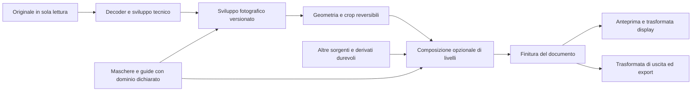

# TrueRenderer — color e livelli

Ricerca funzionale e proposta di integrazione. Data di consultazione: **8 ottobre 2026**.

L’obiettivo è portare in TrueRenderer l’intero inventario fotografico descritto qui: strumenti colore, regolazioni selettive, selezioni, maschere, livelli e ritocco collegato. Le capacità sono riunite per funzione, senza replicare nomenclature, schermate o algoritmi proprietari. La realizzazione richiede più incrementi: alcune estensioni riusano il motore attuale, altre richiedono un compositore, asset durevoli o modelli di elaborazione.

Questo documento contiene il risultato della ricerca e il progetto, **non un elenco di funzioni già disponibili**. Stato corrente, consegne, prove eseguite e caselle operative rimangono esclusivamente in [STATO.md](../STATO.md#colore-livelli-e-selezioni--ricerca-e-progetto-esteso). I contratti applicati restano nella [specifica fotografica](progetto-sviluppo-fotografico.md), nell’[architettura](TrueRenderer-Architettura.md), nella [specifica RAW](progetto-motori-raw.md) e nella [specifica export](esportazione-precisione-fits.md).

## Indice

- [Perimetro e metodo](#perimetro-e-metodo)
- [Quattro concetti da tenere distinti](#quattro-concetti-da-tenere-distinti)
- [Inventario degli strumenti colore](#inventario-degli-strumenti-colore)
- [Selezioni e costruzione delle maschere](#selezioni-e-costruzione-delle-maschere)
- [Livelli e composizione](#livelli-e-composizione)
- [Novità recenti rilevanti](#novità-recenti-rilevanti)
- [Punti di integrazione nel codice](#punti-di-integrazione-nel-codice)
- [Architettura proposta](#architettura-proposta)
- [Interfaccia proposta](#interfaccia-proposta)
- [Incrementi e dipendenze](#incrementi-e-dipendenze)
- [Criteri di accettazione](#criteri-di-accettazione)
- [Fonti e limiti della ricerca](#fonti-e-limiti-della-ricerca)

## Perimetro e metodo

Sono stati consultati manuali ufficiali, guide dei singoli strumenti, note di rilascio e pagine sulle novità. Il censimento riguarda il lavoro fotografico desktop; le varianti web e mobili servono a individuare differenze di disponibilità, senza attribuire automaticamente alla versione desktop una novità mobile. Sono inclusi gli strumenti storici ancora documentati e gli aggiornamenti pubblicati entro la data di consultazione, comprese le capacità sperimentali quando dichiarate tali.

«Tutti gli strumenti» significa qui copertura delle famiglie funzionali pertinenti a colore, selezione, livelli e ritocco fotografico: non ogni filtro artistico, plugin di terzi, funzione video, impaginazione o modellazione tridimensionale. Strumenti con nomi diversi ma uguale scopo vengono accorpati; differenze di comportamento restano esplicite. Non si assume equivalenza numerica fra implementazioni.

Le descrizioni dei controlli derivano dalla documentazione; formule, strutture dati, interazione e sequenza di realizzazione indicate come **proposta TrueRenderer** sono scelte progettuali. I manuali non pubblicano tutti gli algoritmi: non permettono di dedurre formule esatte, ordine interno completo, prestazioni, consumo di memoria o qualità fotografica. La ricerca non include una prova pratica dei prodotti esterni.

Le sigle F01–F44 rimandano al repertorio neutro delle fonti in fondo. Per mantenere questo file privo dei nomi dei prodotti di riferimento, i principali collegamenti esterni sono separati dal documento nel resoconto della ricerca. Le date di aggiornamento di una pagina non sono automaticamente date di introduzione di una funzione.

## Quattro concetti da tenere distinti

| Concetto | Significato | Esempio |
|---|---|---|
| Regolazione | Descrive **che cosa cambia** nei campioni dell’immagine. | Scaldare il colore, ridurre la saturazione dei verdi, sollevare le ombre. |
| Selezione | Area di lavoro temporanea creata con un gesto, un intervallo o un riconoscimento. | Tracciare un poligono attorno a una giacca. |
| Maschera | Copertura salvata, anche sfumata, che descrive **dove** agisce una regolazione o appare un contenuto. | Giacca visibile in bianco, sfondo nero, bordi antialias in grigio. |
| Livello | Elemento ordinato con contenuto o regolazioni, maschera, visibilità e regole di composizione. | Livello «Giacca» con correzione selettiva, maschera e intensità del 70%. |

Una maschera può rimanere parametrica — per esempio un’ellisse o un intervallo cromatico — oppure essere una mappa di copertura salvata. Un modello può produrre una maschera senza modificare il colore; un ritocco generativo può invece produrre nuovi RGB oltre alla copertura. Questi casi richiedono dati e controlli diversi.

### Tre modelli di lavoro documentati

| Modello | Funzionamento | Conseguenza per TrueRenderer |
|---|---|---|
| Sviluppo con gruppi di maschere | Ogni maschera raccoglie componenti e un insieme di regolazioni locali; la pipeline fotografica determina come applicarle. | Una lista di maschere non equivale a una pila arbitraria di immagini. |
| Sviluppo con livelli di regolazione | Un livello contiene più strumenti fotografici e una maschera; opacità, nomi, copia e combinazioni facilitano il lavoro locale. | È il passo naturale oltre le maschere attuali, ma servono identità stabili e un contratto sull’ordine. |
| Composizione di contenuti e regolazioni | Immagini, riempimenti, gruppi e filtri formano una pila; maschere e fusione governano il risultato. | Occorrono alpha, riferimenti ad altre sorgenti, trasformazioni per livello e un compositore vero. |

Il pannello può essere comune, ma i tre modelli non vanno confusi. «Livelli» come strumento tonale indica invece punti di nero, mezzitoni e bianco: nella UI chiamarlo **Livelli tonali**, distinto dal pannello **Livelli**. Fonti: F08–F10, F17, F25–F28.

## Inventario degli strumenti colore

Gli identificatori C01–C49 servono a collegare il censimento agli incrementi. «Locale» indica un obiettivo della proposta: non significa che tutte le fonti consentano quella regolazione su qualsiasi livello.

### Interpretazione, bilanciamento e misurazione

| ID | Strumento e funzionamento | Controlli e vincoli da prevedere |
|---|---|---|
| C01 | **Bilanciamento del bianco RAW.** Interpreta l’illuminante attraverso le capacità del decoder; contagocce su un’area neutra, Come scattato, personalizzato e Auto quando qualificato. | Guadagni e metadati reali del motore. Kelvin soltanto con una conversione valida; il campione deve escludere clipping e trasparenza. Il WB del sensore è globale. |
| C02 | **Temperatura e tinta RGB.** Modificano caldo/freddo e verde/magenta dopo lo sviluppo; utili anche con luce mista dentro una maschera. | Controlli relativi e neutro chiaro. Un JPEG non riacquista i dati RAW; una correzione locale RGB non è WB sensore. |
| C03 | **Profilo tecnico e risposta iniziale.** Profilo di ingresso, caratterizzazione fotocamera e curva iniziale influenzano l’interpretazione del colore. | Separare profilo tecnico, motore e look creativo; dichiarare formati supportati e compatibilità per sorgente. Non applicare due volte una caratterizzazione già eseguita dal decoder. |
| C04 | **Calibrazione delle primarie.** Variazioni di tonalità/saturazione delle primarie e tinta delle ombre spostano il comportamento cromatico complessivo. | Distinguere regolazione creativa della base e calibrazione misurata con target. Ordine e spazio di calcolo incidono sul risultato; non è un altro mixer HSL. |
| C05 | **Campionatori e letture colore.** Punti o aree mostrano componenti RGB, luminanza, HSL/HSB e, con conversione valida, Lab e valori di prova stampa. | Campioni multipli prima/dopo; dimensione dell’area; stadio, profilo e unità dichiarati. Coordinate della sorgente; nessun campionamento dello screenshot. |
| C06 | **Istogrammi e avvisi.** Distribuzione di luminanza/canali, clipping, gamut della destinazione e copertura delle selezioni aiutano a valutare la correzione. | Distinguere saturazione del sensore, clipping working e fuori gamut di uscita. Istogramma globale oppure della maschera, esplicitamente indicato. Un avviso non deve alterare i pixel. |

Fonti: F01, F11–F14, F18, F30. Le letture avanzate e l’istogramma della maschera sono parte dell’obiettivo TrueRenderer; non si deduce dalla ricerca che ogni ambiente offra gli stessi indicatori.

### Luce e curve che influenzano il colore

| ID | Strumento e funzionamento | Controlli e vincoli da prevedere |
|---|---|---|
| C07 | **Esposizione, luminosità, contrasto.** EV, posizione dei mezzitoni e separazione tonale risolvono problemi diversi. | Esposizione moltiplicativa nel dominio dichiarato; contrasto con pivot; luminosità senza fingere recupero di dati persi. Riusare il gruppo Luce esistente. |
| C08 | **Alte luci, ombre, bianchi e neri.** Rimodellano fasce tonali con transizioni morbide. | Gruppo utilizzabile globalmente e su livello. Il recupero di campioni RAW saturi resta distinto dalla compressione dei toni sviluppati. |
| C09 | **Livelli tonali.** Impostano nero/bianco di ingresso, mezzitoni e nero/bianco di uscita, sul composito o per canale. | Istogramma, contagocce nero/neutro/bianco, reset per canale, Auto composto o indipendente. Il secondo può cambiare il bilanciamento cromatico. |
| C10 | **Curve a punti e parametriche.** Mappano ingresso→uscita; le parametriche espongono zone e confini, le curve a punti consentono controllo diretto. | Curva tonale/luminanza, composita RGB e R/G/B separate; punti dal campione, trascinamento sull’immagine, interpolazione documentata, compensazione della saturazione facoltativa. |
| C11 | **Neutralizzazione mediante curve.** Un campione neutro produce correzioni nei canali per ridurne la dominante. | Anteprima dell’effetto e protezione delle curve preesistenti: aggiungere un nodo o proporre una sostituzione annullabile. Non azzerare regolazioni senza mostrarlo. |
| C12 | **Esposizione con offset e gamma.** Guadagno, spostamento additivo e potenza offrono controlli tecnici separati. | Sezione avanzata. Definire comportamento su negativi e HDR; gamma non è esposizione. Nessuna potenza frazionaria non definita sui campioni negativi. |
| C13 | **Auto tono, contrasto e colore.** Analisi dell’immagine propone punti estremi, neutralità o parametri fotografici. | Selettore del tipo di analisi, esclusioni, quantità, anteprima; congelare parametri e regione analizzata. «Ricalcola» deve essere un’azione riconoscibile. |

Fonti: F01, F04–F05, F13, F20–F22. Le varianti di curva e di Auto non devono essere ridotte a etichette diverse per lo stesso algoritmo.

### Controllo cromatico globale e selettivo

| ID | Strumento e funzionamento | Controlli e vincoli da prevedere |
|---|---|---|
| C14 | **Saturazione e vividezza.** La prima agisce sull’intensità cromatica; la seconda modula l’effetto secondo la cromia di partenza. | Intensità positiva/negativa, protezione facoltativa dei toni caldi. Una protezione cromatica non identifica semanticamente la pelle né garantisce assenza di clipping. |
| C15 | **Mixer per famiglie HSL.** Modifica tonalità, saturazione e luminosità delle fasce cromatiche con transizioni sovrapposte. | Otto famiglie come base, vista per colore o parametro, reset per fascia e strumento diretto sull’immagine. Gestire il raccordo rosso 0°/360° e i grigi. |
| C16 | **Colore a campioni.** Il contagocce definisce un colore bersaglio e il suo vicinato in tonalità, cromia e luminosità. | Più campioni nominabili, contagocce aggiungi/sottrai, limiti morbidi per asse, tolleranza complessiva, visualizzazione dell’intervallo. Selezione cromatica separata dalla correzione. |
| C17 | **Uniformità del colore.** Riduce la dispersione dei colori selezionati verso un riferimento, invece di spostarli tutti della stessa quantità. | Uniformità separata di tonalità, saturazione e luminosità; colore desiderato campionabile, intensità e protezione della trama. Utilizzabile su tessuti, fondali e pelle, senza imporre un colore standard. |
| C18 | **Tonalità/saturazione/luminosità mirate e Colorizza.** Ruota o sostituisce la cromia di un intervallo; Colorizza introduce una tonalità comune anche in un’immagine monocromatica. | Intervallo centrale e sfumature laterali, contagocce, scelta del colore dominante, controllo fine. Separare preservazione della luminanza e schiarimento del risultato. |
| C19 | **Colore selettivo per componenti.** Regola componenti ciano/magenta/giallo/nero in famiglie cromatiche e in bianchi, neutri e neri. | Metodo relativo e assoluto, quantità per componente, maschera facoltativa. Su RGB è una regolazione creativa: non equivale a separazioni CMYK caratterizzate per la stampa. |
| C20 | **Bilanciamento cromatico.** Sposta assi complementari in ombre, mezzitoni e luci. | Ciano↔rosso, magenta↔verde, giallo↔blu, preservazione della luminanza e quantità. Offrire una lettura coerente con le ruote senza duplicare regolazioni invisibili. |
| C21 | **Grading a ruote.** Sceglie tinta e intensità cromatica per ombre, mezzitoni, luci e globale. | Luminanza per zona, bilanciamento fra zone e ampiezza della sovrapposizione. Ruote e slider devono manipolare gli stessi parametri; reset singolo e complessivo. |
| C22 | **Filtro cromatico.** Simula una tinta calda, fredda o scelta liberamente, con intensità e preservazione della luminosità. | Colore e densità, selettivo con maschera. Non confonderlo con un profilo fotocamera, una correzione ottica o una LUT. |
| C23 | **Mixer dei canali.** Ogni canale di uscita deriva da una combinazione dei canali di ingresso più un termine costante. | Matrice 3×3, offset, preview dei canali e modalità monocromatica. Coefficienti negativi ammessi solo con semantica estesa verificata; somma 100% non garantisce neutralità per qualunque matrice. |
| C24 | **Sostituzione colore e pennello colore.** Sceglie una tinta di destinazione e la applica nell’area campionata o dipinta. | Campionamento continuo/iniziale, contiguità, tolleranza, protezione dei bordi, modalità tinta/colore/saturazione. Bianco e nero richiedono anche controllo tonale, non soltanto rotazione di hue. |

Fonti: F02–F03, F06, F14–F16, F19, F23–F24. Proposta TrueRenderer: C16 crea sia una regolazione sia, su richiesta, una maschera riutilizzabile; C17 riusa il selettore di C16, mantenendo distinta l’operazione di uniformazione.

### Monocromia, look ed effetti

| ID | Strumento e funzionamento | Controlli e vincoli da prevedere |
|---|---|---|
| C25 | **Bianco e nero con mixer.** Le famiglie di colore dell’originale contribuiscono diversamente ai grigi finali. | Mixer per famiglie, alternativa a pesi RGB, contagocce diretto, filtro simulato, contrasto e grana. Conservare il colore originale per rivedere la conversione. |
| C26 | **Viraggio e doppio viraggio.** Introduce colore nel monocromo, con tinte diverse nelle zone tonali. | Tinta unica oppure ombre/luci, bilanciamento e sovrapposizione; estendere ai mezzitoni usando C21. Evitare due pannelli che applicano due volte lo stesso viraggio. |
| C27 | **Mappa gradiente.** Converte la luminanza in una tavolozza ordinata di colori. | Stop colore, posizioni, interpolazione, inversione, intensità, dithering con seed. È diversa da un gradiente spaziale: lo stesso tono riceve lo stesso colore ovunque. |
| C28 | **LUT e profili creativi.** Trasformano il colore secondo una tabella o un profilo; il look può comprendere anche curve e altri parametri. | Quantità, anteprima, spazio/dominio di ingresso e uscita, impronta e versione dell’asset. LUT 1D/3D, profili tecnici e preset sono oggetti distinti. |
| C29 | **Profili adattivi.** Il trattamento dipende dal contenuto dell’immagine e può coinvolgere tono, colore e distribuzione locale della luce. | Analisi versionata, quantità e output durevole quando necessario. Non rappresentarli come una semplice LUT o come sei slider Auto; distinguere resa SDR e HDR. |
| C30 | **Inversione, posterizzazione e soglia.** Inversione dei valori, riduzione dei livelli cromatici e conversione binaria sono effetti creativi/diagnostici. | Nodi reversibili con dominio dichiarato e maschera. La soglia non è una conversione B&N tonale; invertire RGB non basta per sviluppare un negativo a colori. |
| C31 | **Negativi fotografici.** Conversione di scansioni con compensazione della base, inversione, livelli e caratterizzazione tonale/cromatica. | Campione della pellicola non esposta, esclusione dei bordi dall’analisi, nero/bianco per canale, coerenza del rullo. Una pipeline specifica deve distinguere WB della scansione e colore del positivo. |
| C32 | **Grana.** Aggiunge una struttura controllata, globale o localizzata. | Quantità, dimensione, irregolarità, dipendenza dalla luminanza e componente cromatica opzionale. Seed stabile e scala in pixel sorgente; non cambiare disegno a ogni zoom. |
| C33 | **Texture, chiarezza, foschia e vignetta creativa.** Influenzano contrasto locale, struttura e percezione della cromia. | Quantità, scale e protezioni dagli aloni; foschia positiva/negativa e colore atmosferico quando previsto. Vignetta creativa distinta dalla compensazione ottica. |

Fonti: F04, F07, F13–F14, F20, F22, F29, F31–F33. La componente cromatica opzionale della grana è una proposta, non una capacità attribuita indistintamente alle fonti.

### Uniformare immagini, ritocco e uscita

| ID | Strumento e funzionamento | Controlli e vincoli da prevedere |
|---|---|---|
| C34 | **Normalizzazione su campione.** Avvicina un’area al riferimento usando WB, esposizione o entrambi. | Campione riferimento/destinazione, profilo delle letture, area media e quantità. Il match di un campione non garantisce corrispondenza cromatica dell’intera immagine. |
| C35 | **Corrispondenza del look.** Stima tono, colore, curve e grading da una o più immagini di riferimento; può usare statistiche oppure modelli. | Gruppi applicabili separatamente, intensità, anteprima e nuovi parametri modificabili. Distinguere corrispondenza cromatica statistica, adattamento WB/esposizione ai volti e trasferimento creativo. |
| C36 | **Preset, stili e copia selettiva.** Riutilizzano parametri o una struttura di livelli/maschere. | Copia dei valori distinta da ricalcolo per contenuto; gruppi effettivamente supportati, comportamento per livelli omonimi e quantità. Mostrare gli elementi incompatibili prima dell’applicazione. |
| C37 | **Pulizia cromatica tecnica.** Rumore cromatico, moiré, frange viola/verdi e dominanti spaziali richiedono correzioni diverse. | Intervalli, quantità e maschere; separare defringe, riallineamento CA e flat-field. Una calibrazione da campo uniforme dipende dalla configurazione di ripresa, non soltanto dalla tinta scelta. |
| C38 | **Ritocco locale dei ritratti.** Uniformità della pelle, attenuazione difetti/occhiaie, modellazione delle ombre, sclera, iride e denti combinano segmentazione e regolazioni. | Quantità separate di luminosità, cromia e trama; persone/occhi selezionabili singolarmente, pennello di protezione dei particolari e Prima/Dopo. Identità e protezioni richiedono regole di trasferimento esplicite, non la sola posizione nella lista dei volti. |
| C39 | **Scherma, brucia e spugna.** Pennellate schiariscono, scuriscono o modificano saturazione. | Esposizione/quantità, intervallo ombre/mezzitoni/luci, flusso e protezione del colore. In TrueRenderer preferire pennellate di maschera e nodi reversibili. |
| C40 | **Clone, correttivo, toppa, polvere e occhi rossi.** Copia di campioni, adattamento della trama, riparazione di una selezione, rilevamento di macchie e correzione della pupilla. | Sorgente/destinazione, allineamento, diffusione, adattamento di struttura/colore e campionamento dei livelli. Riempimento da contenuto esistente distinto dalla generazione con modelli; sorgenti e cronologia salvate. |
| C41 | **Colorizzazione e trasferimenti assistiti.** Colore suggerito per monocromi, palette da riferimento, trucco/stile e rielaborazione creativa. | Punti guida, quantità, regioni protette e risultato su livello derivato. I colori suggeriti non sono recupero documentale dei colori originari. Alcune famiglie sono ancora beta nelle fonti. |
| C42 | **Armonizzazione e illuminazione assistita.** Adatta colore, luce, ombre e talvolta dettagli di un soggetto al contesto. | Maschera, riferimento, intensità/varianti, provenienza e derivato durevole. Separare match parametrico da rigenerazione dei pixel; non promettere fedeltà geometrica automatica. |
| C43 | **Rimozione di riflessi e distrazioni.** Separa o ricostruisce contenuti che contaminano colore e leggibilità. | Selezione, qualità e confronto; conservare eventuali componenti separate e risultato. Non è una maschera colore né una semplice diminuzione della saturazione. |
| C44 | **Sfocatura per profondità.** Usa profondità incorporata o stimata per separare piani e modulare sfocatura, bokeh e talvolta foschia. | Intervallo di fuoco, intensità, forma bokeh, pennello di correzione della profondità e bordi. Una mappa stimata non è una misura fisica della distanza. |
| C45 | **Prova colore e destinazioni.** Trasformazione verso profilo di uscita, intento, gamut, simulazione carta/inchiostro e prova SDR/HDR. | Separare working, look, display e output; simulazione non cotta nella ricetta creativa. CMYK/Lab, tinte piatte e duotonia da stampa richiedono moduli e formati dedicati. |
| C46 | **Esportazione del look e interoperabilità.** Preset nativi, LUT e profili possono trasportare parti diverse di una lavorazione. | Una LUT non codifica crop, pennelli, immagini sovrapposte, filtri spaziali o analisi per contenuto. Esplicitare ciò che si esporta; nessuna promessa di round-trip di documenti complessi senza prova. |
| C47 | **Mapping tonale HDR.** Compressione delle luci, esposizione/gamma e adattamento locale riportano o rimodellano una gamma ampia. | Raggio, dettaglio, contrasto, colore e curva secondo il metodo; nodo esplicito con prova SDR/HDR. Un effetto su input SDR non recupera una scena HDR né giustifica l’appiattimento irreversibile del documento. |
| C48 | **Equalizzazione dell’istogramma.** Ridistribuisce i toni secondo le statistiche dell’immagine, anche come metodo di mapping. | Regione di analisi, quantità e preservazione cromatica dichiarate; rischio di amplificare rumore e dominanti. Non equivale ad Auto esposizione o contrasto. |
| C49 | **Scelta e pittura del colore.** Selettore RGB/HSB/Lab, palette e campioni; pennello/matita, secchiello e pennello miscelatore aggiungono o mescolano colore. | Colore di primo piano/sfondo, scambio, contagocce, valori e profilo; opacità/flusso, bagnato/carico/miscela. Sfoca, nitidezza locale e sfumino modificano i campioni. Operare su livello derivato con maschera, conservando la sorgente; gomma normale, per sfondo o per colore agisce sull’alpha del derivato. |

Fonti: F11–F12, F17, F22, F24, F30, F33–F44. Ritocco, generazione, stampa e interoperabilità sono inclusi nell’obiettivo esteso; richiedono incrementi dedicati, non pulsanti fittizi nel pannello Colore.

### Cinque differenze operative che devono rimanere visibili

1. **Spostare e uniformare:** ruotare tutte le tonalità di 10° conserva approssimativamente la loro dispersione; avvicinarle a un colore bersaglio la riduce. Servono controlli distinti.
2. **Selezionare e correggere:** modificare la tolleranza di un campione cambia chi viene coinvolto; cambiare saturazione modifica quei campioni. La maschera deve essere ispezionabile senza applicare l’effetto.
3. **Saturazione e luminanza:** schiarire un canale può modificare entrambi. «Preserva luminanza» va definito nel dominio del nodo e misurato, non usato come promessa universale.
4. **Profilo, LUT e preset:** il profilo interpreta o trasforma uno spazio; la LUT campiona una trasformazione; il preset imposta controlli. Non sono tre formati equivalenti dello stesso oggetto.
5. **Recuperare e generare:** schiarire ombre con dati esistenti, stimare un canale RAW saturo e inventare una trama sono operazioni differenti. Provenienza e confronto devono renderlo riconoscibile.

## Selezioni e costruzione delle maschere

### Metodi da coprire

| ID | Metodo | Come si usa e cosa deve conservare |
|---|---|---|
| M01 | Pennello e gomma | Dipingere o togliere copertura con raggio, durezza/sfumatura, flusso e limite di accumulo. Pressione della penna facoltativa; tratti distinti, ultimo punto e annullamento del singolo tratto. |
| M02 | Pennello con riconoscimento dei bordi | La pennellata fornisce un seme; colore e contrasto limitano la crescita oltre i bordi. Tolleranza, raggio, campionamento e possibilità di correzione manuale. Non è un selettore semantico. |
| M03 | Bacchetta per colore e pennello per regioni simili | Selezione da un clic o tratto, contigua oppure estesa a tutte le aree simili. Tolleranza, antialias, sorgente di campionamento, aggiunta e sottrazione. |
| M04 | Gradiente lineare | Una zona passa progressivamente da effetto pieno a nullo; maniglie per direzione, centro, ampiezza e inversione. Parametri modificabili dopo il salvataggio. |
| M05 | Gradiente radiale | Ellisse con centro, due assi, rotazione, sfumatura e inversione; consente anche una zona centrale uniforme. Gli assi si trascinano sull’immagine. |
| M06 | Rettangolo, ellisse, riga e colonna | Selezioni geometriche, rapporto libero/fisso, antialias e feather. Riga/colonna sono strumenti avanzati di campionamento/riparazione, non opzioni obbligatorie del flusso normale. |
| M07 | Lazo libero, poligonale e magnetico | Contorno a mano, per vertici o agganciato ai bordi; chiusura esplicita, modifica dei vertici, annullamento dell’ultimo segmento. Il magnetico deve permettere di forzare punti. |
| M08 | Tracciati e maschere vettoriali | Curve Bézier e forme combinabili, convertibili in copertura alla scala richiesta. Contorno, trasformazione e feather restano separati dai pixel dell’immagine. |
| M09 | Intervallo colore | Uno o più campioni con tolleranza cromatica e sfumature; eventuale limitazione spaziale. Distinguere hue-only, distanza colore e selezione per tonalità/cromia/luminosità. |
| M10 | Intervallo luminanza | Fascia con ingresso/uscita morbidi; selezione di ombre, mezzitoni o luci, contagocce su area, visualizzazione in grigio. Soglie nel dominio di luminanza dichiarato. |
| M11 | Canali e maschere di luminosità | Creazione da R/G/B, luminanza, alpha o loro combinazioni; curve/livelli della sola maschera. Calcoli fra mappe e maschere di luminosità salvabili, senza ritoccare RGB. |
| M12 | Profondità incorporata o stimata | Selezione di una fascia di distanza/profondità con falloff. Indicare l’origine della mappa e consentire correzioni. La disponibilità della profondità incorporata è diversa dall’inferenza da una foto normale. |
| M13 | Area a fuoco | Individua regioni nitide rispetto allo sfondo, con sensibilità e controllo del rumore. Non equivale a segmentazione del soggetto; serve rifinitura dove tutto è nitido. |
| M14 | Soggetto, sfondo e cielo | Riconoscimento automatico con preview prima dell’applicazione, eventuali soggetti multipli e complemento. Il risultato deve essere ispezionabile e correggibile. |
| M15 | Oggetti | Clic, riquadro, lazo o pennellata suggeriscono l’oggetto; hover facoltativo mostra la proposta. Più istanze separate e comandi per aggiungere/escludere oggetti. |
| M16 | Persone e parti | Persona intera, pelle del viso/corpo, capelli, barba, sopracciglia, labbra, denti, sclera, iride/pupilla e abiti. Persone e componenti individuali oppure gruppi; non identificazione anagrafica. |
| M17 | Componenti del paesaggio | Cielo, neve, vegetazione, acqua, architettura, terreno naturale/artificiale e montagne. Voci offerte soltanto se il modello supporta quella classe; più componenti combinabili. |
| M18 | Colori della pelle, toni e fuori gamut | Selezione cromatica guidata da intervalli, eventualmente affinata da rilevamento dei volti; estremi tonali o gamut di una destinazione precisa. Una fascia cromatica non riconosce tutte le persone. |
| M19 | Maschera rapida dipinta | Modalità temporanea a overlay in cui pennello e gomma modificano la selezione; uscita verso selezione o maschera salvata, mai cancellazione implicita dei pixel. |
| M20 | Alpha e trasparenza del contenuto | Caricare la copertura di un livello o un canale come selezione; usare la sagoma del livello sottostante per limitare quello superiore. Va distinto dalla maschera di ritaglio fotografico. |

Fonti: F08–F10, F15–F17, F25–F28, F34, F39, F42. Le categorie semantiche sono l’unione delle capacità documentate: la stessa lista non è garantita da ogni modello o piattaforma.

### Operazioni comuni alle maschere

| ID | Operazione | Comportamento richiesto |
|---|---|---|
| M21 | Aggiungi, sottrai, interseca, inverti | Conservare un albero di componenti modificabili: «Cielo ∩ Luminanza − Pennello» deve poter essere riaperto e corretto in ogni parte. Gestire anche seleziona tutto, deseleziona e riseleziona. |
| M22 | Duplica, riusa, salva e carica | Duplicazione indipendente come default; collegamento condiviso esplicito. Convertire selezione↔maschera; salvare preset parametrici e bitmap durevoli con dipendenze. |
| M23 | Sfumatura e forma del bordo | Feather, espansione/contrazione, levigatura, contrasto del bordo e bordo ad anello; trasformare la selezione separatamente dal contenuto. Scala in coordinate sorgente. |
| M24 | Rifinitura di capelli e trasparenze | Pennello di bordo, raggio adattivo, confronto su fondo chiaro/scuro, eventuale matting. Decontaminazione del colore può modificare RGB oltre alla maschera: mantenerla come operazione distinta. |
| M25 | Intensità, densità e visualizzazione | Intensità dell’effetto, attenuazione della maschera, flusso del pennello e opacità dell’overlay hanno significati diversi. Nomi e tooltip devono impedirne la confusione. |
| M26 | Congelamento e aggiornamento | Componenti parametriche restano dinamiche; bitmap e risultati di modelli sono salvati. Segnalare input cambiati; ricalcolo esplicito, annullabile e confrontabile con la versione precedente. |
| M27 | Copia fra fotografie | Coordinate geometriche trasferibili con compatibilità dichiarata; selezioni semantiche ricalcolabili per destinatario. Riferimenti ai ritocchi e campioni hanno regole proprie. |
| M28 | Ispezione e navigazione | Mostra/nascondi, solo maschera, overlay a colore scelto, matte nero/bianco, outline, pin e conteggio componenti. L’overlay non entra in export e non rappresenta la qualità del rendering. |

Esempio di maschera parametrica: per raffreddare soltanto le parti luminose del cielo, creare Cielo, intersecare una fascia Luminanza, sottrarre un pennello sulle cime e applicare Temperatura RGB. Modificare la sfumatura del pennello deve aggiornare l’effetto senza cancellare cielo e intervallo.

**Proposta matematica TrueRenderer**, coerente con la specifica fotografica: per coperture `a,b ∈ [0,1]`, Aggiungi `1−(1−a)(1−b)`, Sottrai `a(1−b)`, Interseca `ab`, Inverti `1−a`. Con coperture parziali Aggiungi non è il massimo: sommare due volte una maschera grigia aumenta la copertura. Mostrare l’albero ed evitare duplicazioni accidentali; non ottimizzare via riordino di sottrazioni o filtri di bordo.

L’intensità di una regolazione usa `w = opacità_livello × copertura`. Una densità di maschera che ne attenua il potere di nascondere può invece usare `m' = 1−d(1−m)`: a densità zero la maschera lascia passare tutto. Flusso e densità massima del pennello devono avere nomi distinti, poiché governano la deposizione della pennellata. Queste formule sono una proposta da versionare, non una ricostruzione degli algoritmi delle fonti.

## Livelli e composizione

### Tipi di livello e gestione

| ID | Capacità | Funzionamento e proposta |
|---|---|---|
| L01 | Base fotografica | Sorgente in sola lettura con ricetta tecnica. La base può rimanere un RAW decodificato dal motore scelto; non deve diventare l’ultimo raster esportato. |
| L02 | Livello di regolazione | Uno o più operatori reversibili; maschera bianca per effetto globale, nera per iniziare a dipingere. Indicare chiaramente a quale risultato sottostante si applica. |
| L03 | Livello immagine/pixel | Contenuto importato o derivato, alpha, trasformazione propria e maschera. Utile per montaggi e risultati di ritocco; non equivale a una semplice maschera fotografica. |
| L04 | Riempimenti | Colore uniforme, gradiente spaziale e pattern. Parametri modificabili e asset conservati; il gradiente spaziale non è la mappa gradiente di C27. |
| L05 | Gruppi | Nomi, ordine, visibilità, opacità e maschera del gruppo. Gruppo isolato: prima comporre i figli; gruppo passante: interagiscono con i livelli esterni secondo regole esplicite. |
| L06 | Oggetti incorporati o collegati | Conservano contenuto originario e trasformazioni rivedibili; istanze condivise oppure copie indipendenti. Un collegamento esterno richiede identità e gestione offline; l’aggiornamento deve essere visibile. |
| L07 | Filtri modificabili | Pila di filtri con parametri, ordine, bypass, opacità e maschere. Un filtro applicato a RGB sviluppati non riapre magicamente lo sviluppo del mosaico. |
| L08 | Maschere di livello, vettoriali e di filtro | Le prime limitano la visibilità/effetto, le seconde derivano da tracciati, le terze limitano i filtri. Contenuto e maschera possono muoversi insieme o separatamente. |
| L09 | Aggancio alla sagoma sottostante | Il contenuto superiore è limitato dall’alpha di un livello base. Mostrare graficamente l’aggancio e la sua base; evitare il nome ambiguo «ritaglio» per questo comando. |
| L10 | Ordine, duplica, elimina e blocchi | Spostamento, duplicazione indipendente, blocco modifiche/posizione, selezione multipla e annullamento. Non usare l’indice nella lista come identità durevole. |
| L11 | Fusione e opacità | Il metodo calcola come interagiscono i colori; l’opacità ne governa la copertura. Riempimento, effetti decorativi e opacità non sono equivalenti in ogni metodo. |
| L12 | Fusione condizionata dai toni | Intervalli su luminanza o canali del livello corrente e del composito sottostante; soglie separate in rampe per transizioni morbide. Guida fissata prima dell’effetto per evitare autoreferenze. |
| L13 | Effetti di livello | Sovrapposizione colore/gradiente/pattern, ombre, bagliori e contorni sono utili in composizione. Appartengono a una sezione dedicata, con unità e scala esplicite. |
| L14 | Copia, preset e corrispondenze | Scelta fra aggiungere, saltare o sostituire livelli; nome suggerisce corrispondenze, UUID conserva identità. Maschere relative, asset esterni e input semantici verificati per foto. |
| L15 | Confronti e versioni | Bypass temporaneo, Prima/Dopo del livello, snapshot e varianti della composizione. Una variante è una ricetta alternativa, non un’immagine sovrapposta nella stessa pila. |
| L16 | Derivazione e interoperabilità | Unire, creare una copia composta, rasterizzare o esportare produce derivati dichiarati. Conservare la pila originale e specificare quanto del progetto rimane modificabile nel formato scelto. |

Fonti: F08, F17, F25–F28, F35–F36. Testo, forme e tracciati possono diventare contenuti della composizione; un sistema completo di impaginazione non è una dipendenza degli strumenti fotografici. I filtri decorativi non devono occupare il pannello Colore di default.

Le opzioni avanzate L11–L13 comprendono anche esclusione di canali dalla fusione e **foratura della pila**: una sagoma rende visibile ciò che si trova sotto un gruppo oppure fino alla base/trasparenza. Il limite di attraversamento deve essere esplicito. Non implementarla come cancellazione definitiva dei livelli intermedi; l’ordine e l’opacità di riempimento fanno parte del contratto del compositore. Fonte: F27.

### Famiglie di metodi di fusione

Il catalogo deve includere le famiglie seguenti, con nomi IT/EN e miniature comparative. La tabella descrive l’intento nel dominio usuale limitato; non autorizza a estendere le formule senza verifica a negativi, HDR o qualsiasi spazio colore.

| Famiglia | Metodi da progettare | Effetto e uso |
|---|---|---|
| Copertura | Normale, Dissolvi | Composizione ordinaria oppure distribuzione puntinata della copertura. Dissolvi richiede un seed stabile per non sfarfallare. |
| Scurimento | Scurisci, Moltiplica, Colore brucia, Brucia lineare, Colore più scuro | Scurimento per confronto, prodotto o contrasto; confronto per componente distinto da confronto del colore complessivo. |
| Schiarimento | Schiarisci, Scolora, Colore scherma, Scherma lineare/Aggiungi, Colore più chiaro | Schiarimento per confronto, prodotto dei complementari o guadagno. Le divisioni richiedono gestione dei denominatori limite. |
| Contrasto | Sovrapponi, Luce soffusa, Luce intensa, Luce vivida, Luce lineare, Luce puntiforme, Miscela dura | Combinazioni di schiarimento e scurimento, con transizioni o soglie diverse. Il punto neutro dipende dal dominio del metodo. |
| Differenza e calcolo | Differenza, Esclusione, Sottrai, Dividi | Differenze fra immagini, correzioni tecniche o effetti. Non usare Dividi come correzione flat-field senza calibrazione. |
| Componenti | Tonalità, Saturazione, Colore, Luminosità | Combina componenti cromatiche e tonali di due contenuti. Esplicitare la definizione di luminanza/luminosità usata. |
| Gruppi e pennelli | Passante per gruppi; Dietro e Cancella per pittura | Il passaggio attraverso il gruppo non è un normale blend di due raster; dipingere dietro o cancellare alpha richiede contenuto modificabile separato. |

Proposta: realizzare prima Normale, Moltiplica, Scolora, Luce soffusa, Colore e Luminosità nel compositore, quindi completare l’intero catalogo. Ogni metodo deve avere dominio, formula, comportamento alpha, limiti HDR e prove CPU/GPU propri. Per i metodi artistici che richiedono un dominio limitato, l’eventuale trasformazione deve essere un nodo dichiarato, non un clamp nascosto. Fonte: F27.

### Esempio di pila

```text
Composizione «Ritratto»
  Gruppo «Finitura»                       visibile · opacità 100%
    Grana                                 maschera globale
    Grading                               maschera globale
  Regolazione «Giacca»                    maschera Oggetto ∩ Colore
  Regolazione «Pelle»                     maschera Pelle − Pennello
  Ritocco «Piccole macchie»               sorgenti e correzioni salvate
  Base fotografica                       originale + sviluppo tecnico
```

La lettura della pila va dal basso verso l’alto. In un primo editor di soli livelli fotografici l’ordine può essere limitato allo stesso stadio; la UI deve dichiararlo e impedire spostamenti non supportati. Presentare una pila liberamente riordinabile quando il motore continua a usare un ordine fisso sarebbe un errore funzionale.

## Novità recenti rilevanti

Questa tabella distingue pubblicazione e disponibilità documentata. Le versioni sono riferimenti di ricerca, non versioni di TrueRenderer. Date entro l’8 ottobre 2026; nessuna previsione di funzioni future presentata come rilascio.

| Periodo / evidenza | Capacità documentata | Conseguenza progettuale |
|---|---|---|
| 2025; guide colore aggiornate nel 2026 | Regolazione diretta dei colori dominanti e selezione puntuale con intervalli più fini; controllo della variabilità del campione nelle guide recenti. | Unire contagocce, selettore dell’intervallo e correzione sullo stesso pannello. Non presumere che «variabilità» e uniformità abbiano identico algoritmo. |
| Ottobre 2025, rilascio 16.7 | Maschere composte modificabili; selezione abiti; ritocco separato di occhi/denti e inclusione del collo nei controlli della pelle. | Albero di maschere prima dei preset semantici; componenti del volto e del corpo distinte. F09, F34. |
| Rilascio 16.7.2, successivo al 16.7 | Miniature delle maschere e possibilità di esportarle come canali alpha in formati a livelli. | Una maschera esportata non equivale al trasferimento di tutta la ricetta e dei suoi operatori. F37. |
| Ottobre 2025–febbraio 2026 | Temperatura, tinta, vividezza e saturazione riunite in un livello di regolazione. | Stesso gruppo Colore globale o locale, senza duplicazione di controlli. F19, F38. |
| Gennaio 2026, note desktop; guide successive | Chiarezza/foschia e grana esposte come regolazioni su livello. | I filtri spaziali devono condividere maschera, ordine e persistenza con i nodi puntuali. La pagina Grana aggiornata ad agosto non prova un lancio ad agosto. F32, F38. |
| Febbraio 2026, rilascio 16.7.3 | Copia dei livelli con comportamento esplicito per nomi coincidenti. | Anteprima aggiungi/salta/sostituisci, identità separate dai nomi. F08, F37. |
| Marzo 2026, rilascio 16.7.4 | Modalità per negativi e neutralizzazione di un punto mediante curve RGB. | Pipeline dedicata per negativi; protezione delle curve già modificate. Gli strumenti disabilitati in quella modalità non si possono considerare universalmente compatibili. F04, F31. |
| 2025–2026; pagina delle novità verificata fino a settembre | Profili adattivi, paesaggi per componenti, miglioramenti del soggetto, denoise e rimozione dei riflessi. | Asset dipendenti dall’input, ricalcolo controllato e validazione per versione. Miglioramento di un modello non equivale a nuova famiglia di strumenti. F29, F39–F40. |
| Maggio 2026, annuncio e note beta 16.8 | Denoise avanzato con elaborazione dedicata; successivi annunci estendono capacità anche al mobile. | Tenere separati gate del decoder, anteprima e derivati; non confondere un rilascio mobile con una novità desktop. Stato beta dell’evidenza tecnica esplicito. F40. |
| Agosto 2026, rilasci 15.5 e 9.5 | Controlli generali Feather e Edge per ammorbidire o spostare il bordo della maschera. | Rifinitura comune alle maschere, distinta dal feather nativo di un gradiente. F39. |
| Agosto 2026, rilascio 27.10 | Livello Luce con esposizione, contrasto, luci, ombre, bianchi e neri; accesso alle varianti precedenti dei controlli. | Versionare anche l’algoritmo del singolo nodo. Alcune elaborazioni dipendenti dal contenuto possono richiedere una preview provvisoria durante il gesto. F21, F38. |
| Agosto–settembre 2026 | Modifiche guidate da testo, area selezionata e segni visivi; espansione generativa in alcuni ambienti. | Un’azione assistita deve produrre parametri verificabili oppure un derivato esplicito. L’assistente sperimentale resta distinto dalle singole funzioni rilasciate. F38–F39. |
| Settembre 2026, rilascio 27.11; guida 5 ottobre | Rifinitura assistita del bordo con elaborazione RGBA, anche per capelli e semitrasparenze. | Non trattarla come sola sfumatura alpha: conservare eventuali RGB ricostruiti e distinguere la decontaminazione deterministica. F36, F38. |
| Repertorio dei filtri aggiornato 4 ottobre 2026 | Colorizzazione, trasferimenti di stile/trucco e altre famiglie assistite; armonizzazione, trasferimento colore, profondità e restauro hanno anche varianti elencate come beta. | La stessa finalità può avere un vecchio filtro sperimentale e un diverso servizio recente. Memorizzare implementazione, versione e tipo di risultato. F35. |

Le note dei rilasci arrivano a settembre e le guide consultate fino al 6 ottobre. Non è stata provata la disponibilità in ogni account, lingua, sistema operativo o installazione; non si deducono lanci da discussioni non ufficiali. In particolare, non si classificano come nuove funzioni autonome nomi apparsi soltanto in una correzione di traduzione o in una voce di bugfix.

## Punti di integrazione nel codice

Ricognizione tecnica alla data del documento, da usare per evitare duplicazioni. Questa tabella identifica responsabilità e differenze strutturali; l’avanzamento successivo resta in STATO.md.

| Punto del repository | Base riutilizzabile | Estensione necessaria per l’inventario |
|---|---|---|
| [editing.rs del core](../crates/tr-core/src/editing.rs) | `EditRecipe`, validazione, processi 1–4, luce, temperatura/tinta RGB, saturazione/vividezza, curva tonale fino a 32 punti. Il processo 4 ammette estremi mobili. | Registro di operatori e struttura versionata per livelli; curve RGB complete e nuovi nodi senza cambiare il significato dei processi salvati. |
| [color.rs](../crates/tr-core/src/editing/color.rs) | Otto fasce cromatiche; tre zone di grading con hue/amount; monocromia da luminanza; un parametro di mezzitoni per canale RGB. | Le attuali «curve RGB» non sono editor a punti; mancano campioni, uniformità, ruota globale, balance/blending, luminanza per zona, mixer B&N, LUT e gran parte di C19–C31. |
| [masks.rs](../crates/tr-core/src/editing/masks.rs) | Radiale, lineare, pennello con tratti separati, intervalli luminanza/hue, feather e inversione. Parametri locali: esposizione, calore RGB e saturazione. | Non è ancora un modello completo di livelli. Servono UUID, nomi, opacità, gomma compositiva, forme avanzate, albero, mappe raster e più operatori locali. L’intervallo hue attuale non equivale a C16/M09. |
| [geometria](../crates/tr-core/src/editing/geometry.rs) e [crop UI](../apps/desktop/src/ui/editing/crop.rs) | Coordinate sorgente e trasformazioni; crop reversibile e sessione separata. | Riutilizzare mapping e identità; aggiungere dominio del documento e trasformazioni proprie solo per la composizione. Non sostituire la sorgente con il crop esportato. |
| [editing UI](../apps/desktop/src/ui/editing.rs) e [controlli avanzati](../apps/desktop/src/ui/editing/advanced.rs) | Bozze, preview, commit e strumenti fotografici in un ispettore comune. | Pannello a scopo esplicito, browser strumenti e componenti riusabili; sostituire l’indice della maschera come riferimento UI durevole con un’identità. |
| [trasferimento regolazioni](../apps/desktop/src/ui/editing/transfer.rs) | Copia selettiva dei gruppi Luce/Curva/Colore RGB effettivamente supportati. | Estendere schema e compatibilità prima di esporre copia di livelli, maschere, WB o asset. Non abilitare automaticamente tutti i nuovi gruppi. |
| [store](../crates/tr-store/src/lib.rs) | Head/revisioni immutabili, generazione attesa e cursore undo/redo nella libreria durevole. | Manifest e asset della revisione, transazioni coordinate, quote, recupero e backup; una bitmap maschera non deve diventare cache eliminabile. |
| [renderer](../crates/tr-render/src) | Percorso GPU qualificato per un sottoinsieme di operatori; CPU comune per gli altri. | Shader nuovi solo dopo riferimento CPU, invalidazione per stadio e compositore con alpha. Maschere e filtri spaziali non diventano GPU per la sola aggiunta del pannello. |
| [stile UI](../apps/desktop/src/ui/style.rs) e [traduzioni](../apps/desktop/src/i18n.rs) | Palette neutra, spaziature, pulsanti e testo IT/EN. | Componenti per livelli, campioni, intervalli, ruote, selezioni e stati; stessa scala e accessibilità del resto dell’app. |

Il contratto attuale degli strumenti avanzati limita a **16 maschere, 512 punti pennello complessivi e 48 KiB di ricetta**, entro messaggi IPC di 64 KiB. La proposta non può essere realizzata aumentando soltanto questi numeri: servono asset esterni alla ricetta e ammissione delle risorse. L’ordine storico è fissato: dettaglio/defringe precedono mixer e maschere; la guida delle maschere precede il mixer; geometria/crop seguono. Anche il processo 4 conserva queste dipendenze, salvo l’estensione esplicita della curva tonale.

## Architettura proposta

### 1. Conservare le ricette e introdurre un modello estendibile

Proporre un nuovo schema e un nuovo processo fotografico, **successivo al 4**; il numero definitivo va assegnato all’implementazione. I processi 1–4 continuano a usare i propri evaluator. Aprire una foto o aggiornare l’app non promuove né riscrive la ricetta.

La prima estensione può rappresentare la catena precedente come base parametrica e aggiungervi livelli nel dominio definito. Questo conserva il risultato storico senza rasterizzarlo. Una successiva migrazione verso una pipeline completamente riorganizzata deve essere esplicita, confrontabile e annullabile. Non distribuire i vecchi parametri fra nuovi nodi presumendo equivalenza.

Per la foto singola, l’adapter deve esporre il risultato prima della mappa geometrica/crop finale: le nuove maschere fotografiche leggono l’intera sorgente nel proprio stadio. Non usare come base locale un raster storico già ritagliato. Verificare che, con nuovi nodi neutri, separare questi stadi dia lo stesso risultato dell’evaluator storico, senza duplicare trasformazioni. I livelli di composizione possono invece usare la geometria scelta per ciascuna foto, conservando il collegamento alla sorgente completa.

Strutture concettuali, non API già implementate:

```text
PhotoDocument
  schema_version, process_version
  source_binding { asset_id, digest, engine, geometry_id }
  base_recipe { historical_process, parameters }
  layer_tree [ LayerId -> Layer ]
  mask_graph [ MaskId -> MaskNode ]
  asset_manifest [ AssetRef -> hash, format, domain, size, provenance ]

Layer
  id, name, kind, enabled, locked
  stage, input_scope, transform, opacity, blend_mode
  effect_mask_id?, visibility_mask_id?, clipped_to?
  operators[] oppure content_ref oppure children[]

Operator
  kind, version, parameters, input_domain, output_domain
  analysis_ref?, required_assets[], capability_requirements

MaskNode
  id, kind, parameters, children[], coordinate_domain
  guide_binding?, transform?, durable_coverage_ref?
```

Separare maschera dell’effetto e maschera di visibilità: una regolazione locale cambia RGB lasciando invariato l’alpha della foto; nascondere un livello può cambiare l’alpha del composito. Nomi modificabili e posizioni della lista non devono entrare nell’identità dei riferimenti. Duplicare una maschera crea una copia indipendente; condividerla richiede un comando esplicito e un indicatore.

### 2. Due percorsi coordinati: sviluppo e composizione



È uno schema concettuale della nuova pipeline, non una modifica dell’ordine storico. Ogni sorgente aggiuntiva viene interpretata nel proprio spazio prima di entrare nel working comune. Le maschere fotografiche sono ancorate alla sorgente orientata; le maschere di montaggio possono essere ancorate al livello oppure al documento. Il dominio è serializzato e la UI mostra il relativo aggancio.

Gli operatori tecnici RAW rimangono nello stadio supportato dal decoder. Nessun demosaic, profilo sensore o recupero CFA locale fittizio. I livelli fotografici iniziali si riordinano soltanto nei gruppi per i quali l’evaluator implementa quell’ordine. Il compositore successivo applica davvero la pila di contenuti e regolazioni dal basso verso l’alto.

Crop e trasformazioni sono parametri; il render riparte dalle sorgenti e compone le mappe prima del ricampionamento quando possibile. Una foto ritagliata mantiene i campioni esclusi, anche se usata come livello. Ripristinare il crop della sorgente e modificare l’estensione della composizione sono azioni distinte.

### 3. Registro comune degli strumenti

Ogni operatore dichiara tipo/versione, parametri e neutro, stadio, dominio colore, supporto globale/locale, requisiti di sorgente e profilo, halo, analisi necessarie, CPU di riferimento e capacità GPU. Il registro alimenta validazione, UI, ricerca strumenti, trasferimento ed export, senza duplicare elenchi di capacità incompatibili.

Per un livello di regolazione ordinario, a parità di alpha: `risultato = input + w × (operatore(input) − input)`, con `w` dalla maschera e dall’opacità. È la semantica proposta per intensità dell’effetto; un modo di fusione creativo richiede una funzione ulteriore, non una modifica nascosta di questa formula. Per i filtri spaziali chiarire se la maschera limita il **risultato** o anche i **campioni letti**: sono due operazioni diverse, specialmente ai bordi.

Per evitare menù vuoti, gli strumenti non implementati non compaiono nel selettore operativo. Uno strumento implementato ma incompatibile con il contesto rimane disabilitato con motivo breve, per esempio «Richiede una mappa di profondità». Il catalogo progettuale completo rimane in questo documento.

### 4. Colore, precisione e blending

Riusare il working lineare Rec.2020 fp32 e il confine dichiarato del decoder. Gli operatori non lineari lavorano su RGB straight con deassociazione protetta; composizione e filtri spaziali gestiscono copertura e premoltiplicazione. Alpha non subisce WB, curve o trasformazioni ICC; a copertura zero il working segue la convenzione RGB zero già specificata.

Ogni spazio percettivo utilizzato per intervalli, uniformità o fusione deve dichiarare trasformazione e dominio, inclusi valori negativi e oltre 1. Le distanze hue sono circolari; vicino ai neutri la tonalità non deve diventare una selezione arbitraria. Le spline delle curve richiedono interpolazione monotona quando previsto e test di overshoot; le curve creative non monotone sono una variante esplicita.

Per LUT: parser confinato, quote, dimensioni controllate, spazio e intervallo di ingresso noti, interpolazione definita e trattamento esplicito dei valori fuori tabella. Un `.cube` senza semantica di spazio sufficiente richiede una scelta dichiarata; non assegnare automaticamente un profilo come se fosse incorporato. ICC, DCP, configurazioni di gestione colore e LUT non condividono necessariamente parser né autorità di filesystem.

Preset adattivi, Auto e corrispondenze devono analizzare una rappresentazione canonica. La regione può essere l’intera sorgente, il crop o la maschera, ma viene salvata come input dell’analisi: ridimensionare la finestra non cambia il risultato. Un’opzione che segue il crop deve mostrare quando richiede un ricalcolo, particolarmente nella conversione dei negativi.

### 5. Maschere senza cicli e risultati assistiti riproducibili

Ogni intervallo o modello legge una guida identificata, di default l’ingresso al proprio livello prima delle sue regolazioni. È ammesso riferirsi a uno stadio precedente, non al risultato del nodo stesso o dei suoi discendenti. Il validatore rifiuta cicli, riferimenti mancanti, profondità/numero di nodi eccessivi e parametri non finiti. Le ricette storiche conservano la guida pre-mixer prescritta.

Distinguere tre oggetti: istruzioni di selezione, risultato durevole e cache di accelerazione. Per una selezione semantica salvare classe/istanza, input digest, versione del modello, parametri e mappa finale. Per un risultato generativo conservare i pixel e la copertura, con riferimento e provenienza. Lo stesso seed non garantisce rigenerazione bit-exact fra versioni, hardware o servizi: il derivato salvato garantisce la riapertura.

Se cambia la sorgente o una dipendenza, mostrare «Selezione da aggiornare» e consentire confronto/ricalcolo. Non sostituire di nascosto una maschera approvata all’apertura o all’export. Con modello non disponibile, permettere di usare il risultato salvato e gli strumenti manuali; disabilitare soltanto il ricalcolo che lo richiede.

### 6. Asset durevoli, revisioni e recupero

Le maschere piccole rimangono parametriche. Mappe, campioni di ritocco, contenuti importati, pattern, profili e risultati assistiti entrano in un deposito durevole separato dalle cache, indirizzato per hash. Bitmap di copertura almeno a precisione qualificata per bordi morbidi; eventuale quantizzazione 16 bit contro float va misurata, non assunta innocua. Metadati dichiarano dimensioni, dominio e codifica.

Preparare file temporanei, verificarli, renderli durevoli, quindi confermare in transazione manifest e revisione. Un journal permette di recuperare crash fra scrittura del file e aggiornamento SQLite. La pulizia elimina solo asset senza riferimenti da revisioni, undo/redo, bozze, backup o job; non tratta i vecchi asset come cache. Backup coerente fra database e manifest, con prova di ripristino senza le cache originali.

IPC trasporta descrittori e handle secondo il confine di isolamento, non megabyte di alpha nel JSON della ricetta né percorsi arbitrari concessi al worker. Quote per byte compressi/decompressi, tile, nodi e lavori concorrenti; nessun aumento automatico del budget scelto dall’utente.

Sessione di lavoro proposta: **foto pronta → bozza → eventuale analisi → anteprima → salvataggio → revisione confermata**. Il gesto produce una modifica undo; una bozza identica non produce revisione. Esc annulla il gesto o la sessione che lo possiede. Errori di scrittura conservano bozza e asset recuperabili con Riprova; cambio foto non deve perdere una bozza pendente né trasferirla al destinatario successivo. Un journal delle bozze consente recupero al riavvio senza fingere una revisione già confermata.

### 7. Asincronia, copia e prestazioni

Ogni job conserva `asset_id`, digest, revisione/generazione attesa, LayerId/MaskId e impronte degli input. Un risultato obsoleto può essere conservato per la propria foto, ma non applicato al nuovo livello selezionato. Per batch congelare destinatari e criteri all’avvio; registrare esiti per foto, annullare il lavoro non iniziato e offrire undo del gruppo senza sovrascrivere modifiche intervenute nel frattempo.

La copia offre modalità distinte: stessi valori, posizioni relative, ricalcolo semantico, copia indipendente degli asset e riuso esplicito dei riferimenti. Cambio motore/dimensioni/area attiva richiede compatibilità geometrica dimostrata: coordinate normalizzate da sole non allineano due sviluppi diversi.

Preparare coefficienti una volta, invalidare solo gli stadi dipendenti e usare tile con halo. Una maschera float a piena risoluzione costa circa 93 MiB a 24,3 MP; una pila non può tenerne decine residenti insieme al working RGBA. Tenere le rappresentazioni parametriche e rasterizzare tile/scale necessari; il risultato finale usa la risoluzione canonica.

Preview ridotte, overlay e suggerimenti AI possono essere provvisori e devono essere identificabili. Export e Verifica resa finale usano la revisione e gli asset congelati, non la preview interattiva. Misurare latenza evento→frame e RSS/footprint oltre ai crediti logici; qualificare ogni shader contro CPU e mantenere fallback con errore visibile. Modelli, download e servizi esterni richiedono licenze, quote e scelta dell’utente; nessun invio automatico di foto private.

## Interfaccia proposta

La direzione visiva è **uno spazio fotografico sobrio, preciso e arioso**: l’immagine domina, il pannello rende sempre evidente che cosa si sta modificando, il colore dell’interfaccia compare dove comunica un colore reale o uno stato. La bellezza deve derivare da proporzioni, allineamenti, tipografia e qualità delle interazioni, non dall’accumulo di effetti decorativi.

La proposta parte dal tema in `ui/style.rs` e dalle schermate del progetto. Tutto quanto segue è progettazione, da provare con prototipo e utenti prima della qualifica: le dimensioni sono in punti logici e non sostituiscono la scala UI configurabile.

### Layout principale: foto, ambito, strumenti

Mantenere navigazione e filmstrip esistenti; nell’ispettore **Sviluppo** introdurre un’intestazione persistente con miniatura/nome della foto e ambito della modifica. Sotto, due viste complementari: **Regolazioni** e **Livelli**. Selezionare un livello aggiorna la stessa area delle proprietà; non apre una seconda colonna piena di controlli duplicati.

```text
┌──────────────────────────────────────────────────────────────────────────────┐
│ TrueRenderer   Griglia  Anteprima  Confronta       Annulla  Ripeti   Esporta   │
├─────────────┬──────────────────────────────────────┬─────────────────────────┤
│ Libreria    │ Adatta  1:1       Prima/Dopo          │ [foto] Ritratto.nef      │
│ Esplora     │                                      │ Modifica: Giacca         │
│             │                                      │ Regolazioni | Livelli   │
│ Cartelle    │                                      ├─────────────────────────┤
│             │              FOTOGRAFIA              │ Colore selettivo        │
│             │                                      │ [campione] Giacca blu   │
│             │                                      │ Tonalità   ─────●──  +8 │
│             │                                      │ Saturazione ──●──── −12 │
│             │                                      │ Luminosità ────●───  +4 │
│             │                                      │ Intervallo   [Mostra]   │
│             │                                      │ Maschera: Oggetto ∩ Blu │
│             │                                      │ [Modifica maschera]     │
│             │                                      │ [+ Aggiungi regolazione]│
├─────────────┴──────────────────────────────────────┼─────────────────────────┤
│ Filmstrip: foto e selezione                        │ Salvato                 │
└───────────────────────────────────────────────────┴─────────────────────────┘
```

**Ambito sempre leggibile:** «Foto intera», «Livello: Giacca» o «Maschera: Giacca / Oggetto». Nel confronto mostrare anche A/B e il nome della foto attiva. Un cambio di ambito non cambia i valori salvati, non ricalcola selezioni e non crea revisioni. Quando un controllo è globale per natura, indicarlo vicino al titolo: per esempio «WB RAW · Foto intera».

Alla prima apertura mostrare **Luce**, **Colore**, **Curve**, **Dettaglio** e **Geometria** in sezioni compatte; conservare le preferenze di apertura dell’utente. La vista **Attivi** mostra solo le regolazioni non neutre. I titoli di sezione hanno nome, indicatore di modifica, bypass e menu di sezione; Ripristina compare nel menu e come azione da tastiera, con destinazione esplicita. Non lasciare una lunga colonna di pulsanti Reset ripetuti.

### Accesso a tutti gli strumenti senza un menu enorme

Il comando **Aggiungi regolazione** apre un selettore ancorato al pannello, largo inizialmente 340–400 pt, con ricerca, preferiti e categorie. Ogni risultato ha icona vettoriale, nome e descrizione di una riga: «Uniformità — avvicina i colori al campione scelto». Invio attiva il risultato; frecce cambiano voce; Esc chiude senza creare un livello.

| Categoria nel selettore | Capacità raggiungibili | Presentazione |
|---|---|---|
| Luce e curve | C07–C13, C39, C47–C48 | Luce e curve prima; livelli tonali, offset/gamma, Auto e mapping nelle opzioni avanzate. |
| Colore | C02, C14–C24, C34–C35 | Mixer, campioni, uniformità e grading in primo piano; canali, selettivo e filtri ricercabili. |
| Monocromia e look | C25–C29, C32–C33 | B&N, viraggio, LUT/profili creativi, grana e presenza. Miniature solo su richiesta, senza analisi costosa al semplice hover. |
| Sorgente e calibrazione | C01, C03–C04, C31, parte tecnica di C37 | Area separata della base fotografica, con badge «Globale» e dipendenze di sorgente. |
| Ritocco | C37–C44 | Pennelli, correzioni e azioni assistite; separare ritocco riproducibile, analisi e generazione. |
| Effetti e composizione | C27, C30, C49, L03–L13 | Riempimenti, pittura, fusione e filtri della composizione; mostrati nel contesto compatibile. |
| Misura e uscita | C05–C06, C45–C46 | Campionatori, istogrammi, prova/export e gestione del look; non creano per forza un livello. |
| Riutilizzo | C36, L14–L16 | Preset, copia selettiva e versioni, con anteprima dei gruppi e dei destinatari. |

La ricerca deve riconoscere sinonimi IT/EN: «tinta», «hue», «dominante», «nero e bianco», «HSL», «pelle», «sfumatura». I sinonimi non producono strumenti duplicati. Preferiti e ultimi usati sono preferenze personali; l’ordine dei controlli non deve cambiare mentre si sta lavorando. Nessuna voce sperimentale entra fra i preferiti disponibili se il relativo modulo non è presente.

Due ingressi equivalenti: **prima l’effetto** — scelgo Uniformità e poi dove applicarla — oppure **prima l’area** — seleziono la giacca e poi scelgo la regolazione. Nel primo caso il default è Foto intera, chiaramente visibile; nel secondo viene proposto un nuovo livello con la selezione come maschera. Non attivare invisibilmente la precedente selezione temporanea.

### Selezioni: un gesto iniziale, correzioni sempre a portata

Un pulsante **Seleziona area** nella barra del viewer e il comando **Aggiungi maschera** nel pannello aprono lo stesso selettore. Primo gruppo: Pennello, Gradiente lineare, Gradiente radiale, Colore, Luminanza. Secondo: Soggetto, Oggetto, Cielo, Persone, Paesaggio quando disponibili. **Altri metodi** raccoglie geometrie, lazi, tracciati, canali, profondità e area a fuoco; ogni metodo rimane trovabile dalla ricerca.

```text
┌ Seleziona area ────────────────────┐
│ Cerca metodo…                     │
│ Pennello       Gradiente lineare  │
│ Gradiente radiale                 │
│ Colore         Luminanza          │
│ ───────────────────────────────── │
│ Soggetto       Oggetto            │
│ Cielo          Persone            │
│ Paesaggio      Altri metodi…      │
└───────────────────────────────────┘

Barra contestuale del viewer:
[Aggiungi] [Sottrai] [Interseca]  [Overlay]  [Rifinisci]  [Fine]
```

La barra contestuale occupa una riga stabile fuori dall’area fotografica quando c’è spazio; in modalità immersiva diventa una barra spostabile che evita il cursore e il soggetto selezionato. È possibile ancorarla. Non mostrare una grande finestra modale sopra il punto che si deve campionare.

Una selezione automatica propone la sagoma con un overlay leggero; **Usa selezione** crea la maschera, **Riprova** ricalcola e **Annulla** conserva la situazione precedente. Per più persone/oggetti, mostrare miniature e nomi «Persona 1», «Persona 2», non un unico controllo opaco «Tutte». Un clic su una persona apre le parti disponibili; «Tutte/Nessuna» facilita la scelta. La UI mostra soltanto le classi riconosciute o supportate e comunica quando il rilevamento non ha trovato risultati.

Pennello e gomma: cursore a doppio anello per raggio/feather, tratto provvisorio immediato, raggio regolabile con gesto e campo opzionale, pennellate non interrotte quando il pannello si aggiorna. Gradiente: maniglie direttamente sul disegno per ampiezza e direzione; radiale con assi e rotazione. Rettangoli, ellissi e tracciati: maniglie grandi abbastanza da afferrare, hit area più ampia del segno visibile. Nessuna selezione di punti tramite numeri nel popup principale.

### Pannello Livelli e maschera composta

```text
┌ Livelli ────────────────────────────────────┐
│ [+ Livello]                          [⋯]    │
│ ☑ [miniatura] Finitura                 100% │
│ ☑ [miniatura] Giacca                   70%  │
│   Maschera                                 │
│     Oggetto                                │
│     ∩ Colore blu                           │
│     − Pennello bordo                       │
│   [Aggiungi] [Sottrai] [Interseca]          │
│ ☑ [miniatura] Pelle                    60%  │
│ 🔒 Base fotografica                         │
├────────────────────────────────────────────┤
│ Giacca · Regolazioni | Maschera             │
│ Fusione: Normale         Intensità ──●──    │
└────────────────────────────────────────────┘
```

I simboli sono indicativi: implementare icone vettoriali coerenti, senza dipendere dalla resa di emoji. Riga di livello alta 36–40 pt, miniatura di 28–32 pt, nome su una riga e indicatore del tipo. Visibilità a sinistra, menu a destra; la maschera ha una miniatura distinta e un bordo di focus. Clic sulla riga seleziona le regolazioni; clic sulla miniatura della maschera apre la sua modifica. Un’etichetta testuale conferma sempre quale delle due è attiva.

L’albero mostra i componenti solo del livello espanso; le operazioni usano sia simbolo sia verbo. Spostare una riga visualizza il punto di inserimento; le posizioni non ammesse spiegano il vincolo. Rinomina in linea, duplica, blocca, solo questo livello, copia e elimina nel menu contestuale e tramite tastiera. Eliminare è annullabile; non interrompere ogni gesto con una conferma. Il menu fotografico rimane accessibile separatamente dal menu del livello o del pennello.

### Controlli cromatici belli e leggibili

**Mixer:** otto campioni colorati di uguale dimensione, con nome al passaggio e selezione a bordo doppio; nomi disponibili anche senza hover. Sotto, tre slider allineati H/S/L della fascia attiva. Opzione «Tutte le fasce» per tabella compatta; evitare otto sezioni alte aperte contemporaneamente. Il contagocce seleziona la fascia o il campione senza spostare automaticamente i valori.

**Colore a campioni:** una fila di campioni nominabili, pulsante `+`, confronto Prima/Dopo del campione e tre correzioni principali. La sezione **Intervallo** mostra un piano tonalità/cromia e una fascia luminanza con maniglie interne ed esterne per zona piena e sfumatura. «Mostra area» rende subito visibile cosa viene selezionato; **Uniformità** è una sezione separata sotto la correzione. I valori numerici sono disponibili per precisione e accessibilità, senza sostituire i gesti.

```text
Colore a campioni                       [contagocce] [+]
[Blu giacca] [Fondale] [Pelle]

Correzione       Tonalità   Saturazione   Luminosità
                 ───●────   ─────●──     ────●───
Intervallo                                    [Mostra]
┌───────────────────────────────────────────────────┐
│ Piano tonalità / cromia con zona e sfumature       │
└───────────────────────────────────────────────────┘
Luminosità       ──╱──────────────╲─────────────
Uniformità       Tonalità   Saturazione   Luminosità
```

**Grading:** quattro schede Globali/Ombre/Mezzitoni/Luci, una ruota ampia per la scheda attiva e miniindicatori delle altre. A pannello largo, vista a tre ruote; a pannello stretto non ridurle a bersagli minuscoli. Intensità e luminanza con slider separati, balance e sovrapposizione sotto. Campo hue e frecce fini disponibili da tastiera. Il centro indica neutralità; trascinare il punto non deve ruotare il pannello né cambiare scheda.

**Curve e livelli tonali:** grafico con margini, griglia sottile e istogramma attenuato, selettore Luma/RGB/R/G/B, punto attivo con coordinate opzionali. Contrasto sufficiente per curve rosse/blu su fondo scuro, anche con una seconda traccia neutra. I punti si aggiungono direttamente sul grafico o con il campionatore, si spostano con mouse o frecce e si eliminano con comando chiaro. Ripristino per canale, bypass e confronto prima/dopo. Livelli tonali usa tre maniglie d’ingresso e due d’uscita con aree di presa non sovrapposte.

**LUT, preset e riferimenti:** miniature uniformi, nome, intensità e stato di compatibilità. Hover può visualizzare un’anteprima temporanea dopo un breve ritardo, senza scrivere revisioni; uscire ripristina lo stato. Clic conferma una scelta reversibile. Mostrare il riferimento del look a fianco della destinazione in un confronto stabile, con scelta dei gruppi applicati.

**Palette e pittura:** due campioni per colore attivo/secondario, comando Scambia, campioni recenti e palette nominabili; popup unico con piano colore, hue, opacità e campi precisi in una sezione espandibile. La modalità del pennello deve indicare «Dipingi colore», «Dipingi maschera» oppure «Ritocco», con cursore e titolo distinti: il nero sulla maschera non va confuso con pittura nera sulla foto. I controlli bagnato/carico/miscela compaiono solo scegliendo il pennello miscelatore.

**Strumenti assistiti e ritocco:** controllo principale, anteprima, quantità e varianti; dettagli tecnici/provenienza in un pannello secondario. Attesa con nome dell’azione e Annulla, esito sul livello prodotto. Non usare «Migliora tutto» come contenitore di operazioni non dichiarate. Scelta di un servizio remoto separata dall’atto di selezionare un’area.

### Sistema visivo

| Elemento | Proposta concreta |
|---|---|
| Palette | Conservare i neutri esistenti: canvas `#141414`, pannello `#1C1C1C`, superficie `#262626`, separatore `#383838`, testo `#E8E8E8`, secondario `#B4B4B4`. Ambra `#D9A441` per gli stati previsti dall’app, non per bordare ogni controllo. |
| Gerarchia | Titolo del gruppo 15–16 pt semibold, controlli 13–14 pt, note 12 pt come minimo alla scala base. Numeri tabulari dove disponibili. Niente maiuscolo sistematico o testo essenziale a contrasto basso. |
| Spaziature | Griglia di 4 pt: 8 fra controlli collegati, 12–16 fra gruppi, 16 di margine pannello. Allineare etichette, slider e colonne valori; evitare card annidate per ogni riga. |
| Superfici | Raggio 6 pt per controlli, 8–10 per popover; bordo sottile e ombra soltanto per elementi sovrapposti. Nessuna trasparenza dietro letture colore, grafici o pannelli sopra l’immagine. |
| Icone | Segni vettoriali da 18–20 pt, spessore coerente; bersaglio interattivo almeno 28–32 pt al desktop, 44 pt in modalità ampia. Etichetta o tooltip e nome accessibile sempre presenti. |
| Stato attivo | Fondo neutro più chiaro, bordo/focus evidente e indicatore testuale. Il colore del campione non è l’unico segnale della selezione. |
| Slider | Traccia sottile, maniglia percepibile, zero centrale se pertinente, numero editabile a destra. Gradiente cromatico solo quando spiega il parametro; posizione e tastiera devono restare sufficienti. |
| Overlay | Colore configurabile, opacità di default moderata, alternative matte e contorno. Preferenza separata per overlay e regolazione; scelta accessibile a chi non distingue rosso/verde. |
| Movimento | Transizioni brevi, indicativamente 100–160 ms, senza animare il colore della fotografia. Rispettare Riduci movimento; non ritardare l’inizio del gesto. |
| Ambiente di visione | Contorno della foto neutro, preferenze esistenti preservate; nessun tema saturo o illustrazione decorativa accanto al campione da valutare. |

I valori sono una base progettuale, da controllare sul rendering nativo. Obiettivi: contrasto almeno 4,5:1 per testo normale e 3:1 per elementi di interazione essenziali, focus distinguibile, nessun comando riconoscibile soltanto dal colore. I separatori ornamentali possono essere più discreti; maniglie e focus no.

### Dimensioni, tastiera e accessibilità

Su finestre ampie, pannello destro 340–380 pt ridimensionabile e navigazione sinistra 200–240 pt. Su larghezze medie, ridurre prima navigazione e filmstrip, poi usare una sola vista delle proprietà. Su finestre compatte, mantenere una ruota/grafico per volta e consentire il pannello a cassetto; nessuna riga di azioni essenziali tagliata orizzontalmente. A scala UI 200% usare la stessa logica in punti disponibili, con scorrimento dei contenuti e intestazione fissa. Verificare almeno 1280×800 e 1024×768, oltre a una finestra ampia; i numeri non sono una promessa di supporto prima della prova.

Percorso da tastiera completo: ricerca strumenti, categorie, risultato, proprietà, selettore ambito, albero livelli e componenti. Tab/Shift+Tab segue ordine visivo; frecce modificano il valore o navigano l’albero in base al focus; Invio attiva o conclude l’input. Shift+F10 apre il menu dell’oggetto focalizzato. Esc chiude prima popup/input/gesto attivo e poi lo strumento, senza intercettare l’annullamento della sessione crop sbagliata.

Proporre una palette comandi ricercabile con scorciatoia configurabile; verificarne i conflitti con zoom e comandi esistenti prima di assegnarla. Le scorciatoie del pennello sono personalizzabili per tastiere IT/EN, senza obbligare a tasti di parentesi difficili da raggiungere. Spazio temporaneo per pan solo fuori dagli input testuali e senza trasformare una pennellata già iniziata. Riordino livelli disponibile anche con comandi Sposta sopra/sotto.

Le ruote e gli intervalli devono esporre valori e alternative a slider per tecnologie assistive. Annunciare nome del livello, tipo di componente, visibilità, quantità e stato del calcolo; evitare annunci a ogni frame. IT/EN prevedono crescita del testo, plurali e messaggi completi: «Maschera salvata», «Bozza non salvata — Riprova», «Nessuna persona rilevata», «3 foto aggiornate, 1 non disponibile».

### Stati e flussi da progettare prima del codice UI

| Stato | Cosa vede l’utente | Comportamento |
|---|---|---|
| Nessuna foto | Invito Apri foto, pannello privo di slider attivi | Nessuna regolazione applicata alla foto precedente. |
| Foto pronta, nessun livello locale | Foto intera e azioni essenziali | Aggiungere un livello può partire da effetto o selezione. |
| Gesto in corso | Preview immediata, proprietà stabili | Una bozza e un undo per gesto; niente salti di layout o focus. |
| Analisi pendente | «Seleziono il soggetto…», Annulla | La vecchia maschera rimane recuperabile; nessun overlay presentato come risultato definitivo. |
| Salvataggio pendente | Stato discreto vicino all’ambito | Navigazione sicura, foto destinataria conservata e coda visibile se necessario. |
| Errore di salvataggio | «Bozza non salvata», Riprova e Recupera | Bozza conservata; niente toast che scompare come unico avviso. |
| Sorgente offline | Nome foto, maschere e cronologia consultabili | Disabilitare solo operazioni che richiedono i pixel mancanti; indicare il motivo. |
| Dipendenza cambiata | «Selezione da aggiornare», Confronta/Ricalcola | Nessuna sostituzione automatica del risultato approvato. |
| Modello o asset assente | Capacità indisponibile e spiegazione | Usare il derivato salvato quando valido; installazione/ricollegamento espliciti. |
| Nessun risultato | Messaggio specifico, scelta altro metodo | Conservare la maschera precedente; nessun livello vuoto spacciato per selezione riuscita. |

Flusso **ricolorare una giacca**: Seleziona area → Oggetto → clic sulla giacca → Usa selezione → Colore a campioni → campiona → correggi → eventuale Sottrai pennello. Risultato: livello nominabile con maschera e valori sempre modificabili. Flusso **uniformare un fondale**: campione → Mostra area → restringi intervallo → Uniformità → intensità. Flusso **grading globale**: Colore → Grading → ruota e intensità, senza obbligo di creare manualmente una maschera bianca.

Flusso **ritocco di un volto**: Persone → persona → parti → preview della maschera → regolazioni separate; niente rimozione automatica di particolari all’apertura. Flusso **copia su più foto**: scegli sorgente → gruppi/livelli → destinatari e numero → valori o ricalcolo → esiti per foto. Flusso **composizione**: Aggiungi immagine → verifica sorgente → posiziona → maschera → fusione; ogni fase rimane rivedibile.

Per giudicare comodità ed estetica, preparare un prototipo delle tre viste sopra e far svolgere questi flussi senza istruzioni vocali: trovare uno strumento poco usato, capire il destinatario, correggere una selezione, annullare e recuperare un errore. Misurare azioni, esitazioni, errori di ambito e spazio occupato sull’immagine. Non considerare raggiunto l’obiettivo estetico sulla base del solo elenco di colori o di uno screenshot statico.

## Incrementi e dipendenze

Questa è la scomposizione tecnica del progetto, non un secondo registro di avanzamento. L’ordine operativo e gli esiti si aggiornano soltanto in STATO.md. Le sigle CL distinguono questi pacchetti dai gate SF e R, che rimangono applicabili. Nessuna stima di calendario è credibile prima di prototipi su memoria, colori e composizione.

| Pacchetto | Capacità e risultato utilizzabile | Dipendenze e criterio di uscita |
|---|---|---|
| CL0 — fondamenta e prototipo UI | Nuovo schema/processo, registro operatori, identità, manifest asset e journal; prototipo navigabile di Regolazioni/Livelli/Selezioni. Base L01, L10, L15. | Ricette 1–4 invariate, recupero dopo crash e backup senza cache; flussi UI comprensibili, ambito sempre identificabile. Completa prerequisiti SF0, non il gate intero. |
| CL1 — colore completo sul piano fotografico | C02, C07–C27: curve RGB vere, livelli tonali, mixer e campioni, uniformità, grading completo, B&N, selettivo, canali, filtri e mappa gradiente. Riutilizzo C14/C15 già presenti; M09 come selettore del campione. | CL0; riferimento CPU e test di identità, neutri, gamut esteso e discontinuità. Prima consegna incrementale consigliata: campioni+uniformità, poi curve/livelli/grading, poi gli altri nodi. |
| CL2 — livelli fotografici e maschere composte | L02, L08, L10; M01, M04–M05, M21–M22, M25–M26, M28. Nomi, visibilità, intensità, maschere riapribili e regolazioni locali supportate. | CL0 e operatori di CL1; stessa catena in viewer, miniature, confronto ed export. Pila e ordine realmente implementati, nessun livello solo cosmetico. |
| CL3 — selezione manuale avanzata | M02–M03, M06–M11, M13, M18–M20, M23; rifinitura deterministica M24. Pennelli per regioni, lazi/tracciati, canali, area a fuoco, quick mask, bordi e maschere raster. | CL2 e deposito asset; round-trip, bordi morbidi, coordinate e quote. Ogni metodo si integra nello stesso compositore di maschere. |
| CL4 — profili, effetti e interpretazioni | C01, C03–C04, C28, C30–C33; parte flat-field di C37; C47–C48. Formati creativi qualificati, grana, negativi e mapping. | CL0–CL1, capacità decoder e formati; licenze/parser, look neutro, analisi congelate, seed stabile. Negativi e HDR hanno processi e gate dedicati, senza regressioni sui positivi SDR. |
| CL5 — ritocco riproducibile | C39–C40 e parte deterministica C37: clone, correttivo, polvere, occhi rossi, scherma/brucia e pulizia cromatica locale. | CL2–CL3; sorgenti dei campioni e ordine salvati, correzioni a tile prive di cuciture e parità export. Non richiede generazione remota. |
| CL6 — composizione completa | C49, L03–L13, L16: immagini, pittura, riempimenti, gruppi, oggetti incorporati/collegati, filtri, agganci, intero catalogo blend ed effetti. | CL0–CL3 e asset; grafo aciclico, alpha/color management, trasformazioni senza perdita cumulativa, offline e budget fisici. È un sottoprogetto più ampio dei livelli fotografici. |
| CL7 — selezioni e analisi assistite | M12, M14–M17, rifinitura assistita M24; C29, C38, C44 e denoise assistito pertinente a C37. | CL2–CL3, worker e modelli qualificati; maschere/derivati salvati e modificabili, aggiornamento esplicito, risultato utile anche senza modello installato al riavvio. |
| CL8 — riferimenti e riutilizzo esteso | C34–C36, M27, L14: normalizzazione, corrispondenze, preset, trasferimento di livelli e batch con ricalcolo. | CL1–CL3 e, per le varianti assistite, CL7; destinatari congelati, compatibilità per foto, niente sostituzione implicita dei livelli e undo coerente. |
| CL9 — derivati creativi assistiti | C41–C43: colorizzazione, armonizzazione, trasferimenti, rimozione riflessi/distrazioni e generazione quando scelta. | CL6–CL7 per la verticale completa; provenienza, pixel durevoli, cancellazione, privacy e licenze. Le varianti locali deterministiche possono precedere quelle generative con operatori distinti. |
| CL10 — uscita e flussi specialistici | C05–C06, C45–C46, L15–L16: misure estese, prova colore, profili/destinazioni, export maschere e look, versioni della composizione, interoperabilità. | Gli strumenti coinvolti nei pacchetti precedenti; qualifica dei singoli formati, gamut e restore. Le misure minime devono accompagnare ogni pacchetto, non attendere CL10. |

In CL10 distinguere esplicitamente: export raster finale; maschere alpha separate; ricetta/documento nativo completo; LUT di un sottoinsieme puntuale; eventuale formato a livelli interoperabile; separazioni di stampa, Lab/CMYK e tinte piatte. Per Lab prevedere curve/canali L*, a*, b* con conversione caratterizzata, non applicare le formule RGB ai tre numeri. Per duotonia prevedere curve degli inchiostri e prova specifica. L’assenza di un writer/parser qualificato mantiene l’opzione fuori dall’interfaccia.

### Una prima verticale concreta

La prima implementazione raccomandata è **seleziona un colore → modifica/uniforma → limita con una maschera → salva il livello → riapri → esporta**. Copre il maggior valore fotografico con componenti riusabili:

1. Schema e identità, con evaluator storico preservato e journal minimo.
2. Campione cromatico con intervallo morbido, correzione H/S/L e uniformità.
3. Livello fotografico nominabile con intensità; pennello, gradiente e combinazioni.
4. Nuovo pannello, selettore strumenti e flusso diretto sul viewer, IT/EN e tastiera.
5. Persistenza/undo, confronto, export e verifiche sugli originali.

Segue il completamento dei controlli cromatici puntuali e delle selezioni manuali, quindi gli altri pacchetti secondo dipendenze. Questa verticale **non sostituisce** il resto dell’inventario: lascia spazio al compositore e ai modelli nel formato dati senza esporre capacità ancora vuote.

## Criteri di accettazione

Le prove sotto sono requisiti per le future implementazioni, non esiti di questa ricerca.

| Area | Prova significativa | Condizione di accettazione |
|---|---|---|
| Compatibilità | Aprire/esportare ricette dei processi 1–4 prima e dopo l’estensione; annullare una promozione volontaria. | Pixel storici invariati nei percorsi equivalenti; nessuna revisione alla sola apertura; ricette nuove rifiutate correttamente dai lettori incompatibili. |
| Colore | Rampe, neutri, toni caldi diversi, saturi, negativi working, valori >1, alpha nullo/parziale, hue a 0°/360°. | Identità esatta per nodo neutro; nessun NaN, Inf, clamp occulto o salto agli intervalli. Limiti degli operatori espliciti e misurati. |
| Campioni e uniformità | Campioni vicini, sovrapposti, neutri, colore assente, uniformità positiva/zero, cambi di guida. | Area selezionata e correzione separate; falloff continuo; nessuna dominante inventata quando hue non è definita. |
| Curve, LUT e profili | Identità, estremi, curva ripida, gamut esteso, LUT malformata/troncata, profilo mancante o sostituito. | Nessuna reinterpretazione di vecchie ricette; errore recuperabile; impronte e dipendenze verificate. |
| Maschere | Proprietà delle operazioni su coperture binarie e grigie; inverti due volte; tratti separati e cancellazione. | Formule versionate rispettate, nessun accumulo inatteso e nessuna cancellazione di componenti durante il salvataggio. |
| Geometria | Maschera → crop → rotazione/raddrizzamento → riapertura → ampliamento crop; cambio motore con area diversa. | Selezione solidale al dominio salvato; campioni esclusi recuperabili; incompatibilità geometrica segnalata. |
| Livelli | Riordino, gruppi isolati/passanti, maschere agganciate/scollegate, filtri, opacità, blend e clipping alla sagoma. | Ordine visualizzato uguale all’ordine calcolato; alpha corretto, dipendenze prive di cicli. |
| AI e derivati | Modello mancante/aggiornato, inferenza cancellata, input cambiato, nessuna classe trovata, ripristino offline. | Risultato approvato recuperabile senza servizio; niente sostituzioni silenziose; ricalcolo produce un’operazione annullabile. |
| Durabilità | Arresto fra asset e commit, disco pieno, digest errato, ripristino database+asset in ambiente senza cache. | Nessuna revisione confermata senza asset; bozza recuperabile; undo/redo e backup mantengono tutte le dipendenze. |
| Destinatari | Avviare analisi/copia su A, cambiare foto/livello, filtrare/rimuovere dalla vista, ricevere risultato tardivo. | Modifica applicata solo a identità e generazione previste; esiti per foto; nessun trasferimento involontario su B. |
| Resa | Viewer, miniature, A/B, Prima/Dopo, prova d’uscita ed export della stessa revisione, al medesimo profilo/scala. | Stessa catena canonica; preview ridotte segnalate; tolleranze numeriche per nodo e formato stabilite prima della campagna. |
| Risorse | Foto 12/24/45 MP, molte maschere, tracciati lunghi, tile con halo, cambio foto rapido e device loss. | Budget di ammissione e memoria fisica misurati, cancellazione efficace, nessuna cucitura né crescita proporzionale a copie complete per livello. |
| UI e bellezza | Flussi descritti, pannello stretto/largo, scala 100–200%, IT/EN, solo tastiera, contrasto e overlay su immagini chiare/scure. | Nessun controllo essenziale fuori vista, focus stabile, ambito sempre chiaro, colori neutrali e allineamenti coerenti. Prototipo valutato anche in uso, non solo in immagine. |
| Integrità | Hash originali, confronto tabelle durevoli estranee al test, copie autorizzate e cataloghi isolati. | Nessuna modifica agli originali o perdita di regolazioni/catalogo/backup; niente asset privati pubblicati. |

Quando si passerà al codice: usare `scripts/cargo-local.sh`, regressioni mirate al contratto modificato e `scripts/verify.sh`; prova nativa `--gui` per interazioni e superficie. Dopo modifiche a broker, decoder o bundle, eseguire anche `scripts/test-xpc-integration.py` sul pacchetto. Una nuova consegna del bundle richiede backup preventivo e verifica del candidato e del percorso distribuito. Le sole verifiche documentali non chiudono alcun gate R0–R4 o SF0–SF10.

## Fonti e limiti della ricerca

Repertorio di fonti **primarie consultate**, con titoli descrittivi neutrali e identificatori quando disponibili. Le pagine che descrivono strumenti e quelle che attestano un rilascio sono tenute distinte. I principali collegamenti esterni sono nel resoconto della ricerca; qui non vengono riprodotti marchi, URL contenenti nomi dei prodotti, schermate o testi estesi dei manuali.

| Rif. | Documento o famiglia di documenti consultati | Riferimento utile e uso |
|---|---|---|
| F01 | Bilanciamento automatico; esposizione fotografica | Articoli 360002596038 e 360002785697; WB, esposizione, luminosità e saturazione. |
| F02 | Editor colore: panoramica e intervalli | Articoli 360002601358 e 360002601738; famiglie, campioni avanzati e modifica diretta. |
| F03 | Uniformazione dei toni selezionati | Articolo 360002596077, aggiornato 16 marzo 2025; uniformità di hue, saturazione e luminosità. |
| F04 | Curve: panoramica | Articolo 360002612118, aggiornato 4 marzo 2026; RGB/Luma e neutralizzazione del punto. |
| F05 | Livelli: panoramica e Auto | Articoli 360002602797 e 360002603437; estremi e correzione dei singoli canali. |
| F06 | Bilanciamento colore a ruote | Articoli 360002594857 e 360002594937; ruota generale e tre zone tonali. |
| F07 | Viraggio e viraggio locale | Articoli 360002596297 e 360002600998; conversione monocromatica e colorazione successiva. |
| F08 | Livelli e maschere: panoramica | Articolo 360002601658; tipi, organizzazione e strumenti di maschera. |
| F09 | Maschere combinate | Articolo 31021514753053, aggiornato 10 dicembre 2025; composizione modificabile e trasferimento. |
| F10 | Pennello per regioni e intervalli di luminanza | Articoli 4403193308049, 360002622857 e 360002622897; tolleranza, contiguità e rifinitura. |
| F11 | Normalizzazione colore/esposizione | Articolo 360002576117; campioni e valori di riferimento. |
| F12 | Corrispondenza del look e adattamento ai ritratti | Articoli 22188770298269, 8329116085917, 8226603251741 e 360002596038; gruppi, riferimenti e adattamento WB/esposizione. |
| F13 | Tono, colore, profili e calibrazione | Manuale desktop, capitolo `image-tone-color`, comprese sezioni primarie/ombre nelle edizioni localizzate; profili e processo distinti dai controlli. |
| F14 | Mixer e colore a campioni | Capitoli `color-mixer` e `edit-photos`; guida mixer aggiornata 27 ottobre 2025, guide colore consultate anche nelle revisioni 2026. |
| F15 | Selezione di un intervallo colore | Guida «Select a Color Range», revisione 2 dicembre 2025; tolleranza, campioni, localizzazione e toni. |
| F16 | Selezione dell’area a fuoco e delle persone | Guide «Select areas and pixels of images in focus», 28 settembre 2026, e «Make precise selections using Select People», 2 dicembre 2025. |
| F17 | Maschere e regolazioni locali fotografiche | Capitolo `masking`, revisione 7 agosto 2026; componenti, operazioni, profondità, regolazioni locali, curve e grana. |
| F18 | Opzioni di sviluppo e gestione della prova | Capitolo `develop-module-options`, revisione 29 luglio 2024 nelle pagine accessibili; processo, soft proof e corrispondenza dell’esposizione. Non usato per datare novità 2026. |
| F19 | Colore e vividezza su livello; regolazione diretta dei colori | Guida `correct-color-balance-with-color-and-vibrance`, 23 febbraio 2026; tutorial `adjust-colors`, 24 aprile 2025. |
| F20 | Elenco regolazioni e comandi colore | Guide `adjustment-layers-options`, 23 febbraio 2026, e `color-adjustment-commands`; censimento delle famiglie, non prova del loro algoritmo interno. |
| F21 | Luce su livello | Guida `adjust-image-lighting-with-light`, 9 settembre 2026; sei controlli, varianti precedenti e comportamento durante l’interazione. |
| F22 | Auto colore/tono/contrasto; esposizione, mapping HDR ed equalizzazione | Guide `apply-auto-tone-auto-contrast-and-auto-color` e `adjust-hdr-exposure-and-toning`, 30 settembre 2026; `equalize-brightness-values-in-an-image`, 6 ottobre 2026. |
| F23 | Colore selettivo per componenti | Guida `make-selective-color-adjustments`, 30 settembre 2026; metodi relativo e assoluto. |
| F24 | Mixer dei canali e monocromia | Guide `mix-color-channels-with-channel-mixer`, 30 settembre, e `create-monochrome-and-tinted-images-with-channel-mixer`, 6 ottobre 2026. |
| F25 | Livelli, regolazioni, riempimenti e maschere | Guide «Layers overview», «Work with adjustment layers» e «Use layer masks to target adjustment or fill layers»; contenuti e ambiti. |
| F26 | Oggetti incorporati/collegati e filtri modificabili | Guide «Smart Objects — overview and benefits», 23 febbraio 2026, e «Apply Smart Filters», 18 luglio 2024. Nessuna equivalenza presunta fra filtri RGB e sviluppo RAW. |
| F27 | Fusione, opacità e opzioni avanzate | Guide «Blending mode descriptions», 23 febbraio 2026, «Layer opacity and blending modes», «Use advanced blending options» e `create-texture-effects-with-knockout`, 28 settembre 2026; disponibilità dipendente da dominio/profondità. |
| F28 | Strumenti di selezione e rifinitura | Guide «Selection tools overview», selezione oggetti e tutorial «Clean up a selection in Select and Mask»; lazi, geometrie, bordi e decontaminazione. |
| F29 | Profili adattivi | Novità desktop febbraio 2025 e capitolo profili; trattamento dipendente dal contenuto, separato dai normali slider. |
| F30 | Gestione HDR, prova ed export di tabelle colore | Capitoli `hdr-output`, `develop-module-options` e `export-color-lookup-tables`; formati e limiti di rappresentazione. |
| F31 | Conversione dei negativi | Articolo 33917623779229 e note 33550971607581 del 4 marzo 2026; base, livelli, ordine e incompatibilità. |
| F32 | Chiarezza/foschia e grana su livello | Guide `adjust-contrast-with-clarity-and-dehaze` e `enhance-texture-with-grain`; quest’ultima aggiornata 18 agosto 2026. Introduzione datata attraverso F38. |
| F33 | Effetti cromatici speciali | Guida `apply-special-color-effects-to-images`, 30 settembre 2026; inversione, soglia, posterizzazione e mappa gradiente. |
| F34 | Selezioni assistite e ritocco di volti/occhi/denti | Articoli 14055231933853, 27336176639133, 31234371381917 e note 31141690629917; selezioni, protezioni manuali, limiti del trasferimento e novità 2025. |
| F35 | Repertorio dei filtri assistiti | Guida «Neural Filters gallery», 4 ottobre 2026, e FAQ del 24 maggio 2023; classificazione corrente separata dalle descrizioni storiche e dai servizi più recenti. |
| F36 | Armonizzazione e rifinitura assistita RGBA | Guide `blend-subjects-with-harmonize`, 20 maggio 2026, e `use-enhance-edge-to-refine-masks`, 5 ottobre 2026. |
| F37 | Note di rilascio 16.7.2, 16.7.3 e 16.7.4 | Articoli 32384987653277, 33550967023389 e 33550971607581; alpha, copia livelli, negativi e neutralizzazione. |
| F38 | Note desktop e novità beta | Release notes fino a settembre 2026, versione 27.11, aggiornate 5 ottobre; pagina beta aggiornata 18 giugno 2026. Rilasci e anteprime tecnologiche trattati separatamente. |
| F39 | Note delle famiglie fotografiche desktop | Release notes aggiornate 29 settembre 2026, versioni 15.6 e 9.6; novità agosto 15.5/9.5, maschere, riflessi e modifiche guidate. |
| F40 | Pagina novità e denoise beta | Panoramica consultata fino alle voci di settembre 2026 e articolo 35747427882653, beta 16.8 del 6 maggio; distinzione desktop/mobile. |
| F41 | Calibrazione delle dominanti spaziali | Articoli 360002404757 e 360002584538; campo uniforme, configurazione di ripresa e dipendenze del profilo. |
| F42 | Maschera rapida e canali alpha | Guide «Create temporary quick masks», 6 ottobre 2026, e «Alpha channels and masks», 29 settembre 2026; selezioni temporanee e conservazione durevole. |
| F43 | Scelta, campioni e pittura del colore | Guide «Use the Color and Swatches panels», «Customize color pickers and swatches», «Choose a spot color» e «Paint with the Mixer Brush»; campionamento, palette e mescolamento. |
| F44 | Ritocco manuale e da campioni | Guide `retouch-tools-overview`, 23 febbraio 2026, `repair-a-selected-area-with-the-patch-tool` e `use-the-content-aware-patch-tool`, quest’ultima 29 settembre 2026; metodi e controlli distinti. |

Limiti: pagine dinamiche e disponibilità possono cambiare dopo la consultazione; alcune traduzioni non sono sincronizzate. Dove una pagina corrente contiene informazioni storiche, la data del rilascio proviene dalle relative note. Il censimento non dimostra conformità di formati proprietari, licenze di redistribuzione, parità fra piattaforme o formule numeriche degli strumenti. Questi aspetti richiedono qualifiche specifiche durante l’implementazione, con esiti riportati in STATO.md.
