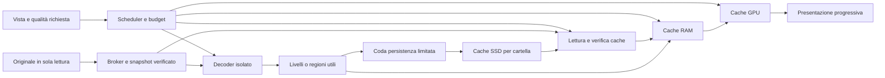

# TrueRenderer — progetto di anteprime, cache e prestazioni

Data: 7 settembre 2026. Revisione del progetto: 2, dopo verifica del ramo pubblico.

**Stato: progetto dei prossimi incrementi.** Questo documento risponde alla richiesta del titolare di migliorare la navigazione di cartelle con circa 1.000 RAW, scegliere fra anteprima standard e qualità piena, configurare i limiti delle cache e sfruttare intensamente CPU/GPU durante il lavoro utile. Distingue le funzioni già presenti nella 0.1.4 da quelle ancora da implementare; non contiene nuovi benchmark eseguiti durante questa revisione.

Baseline verificata: applicazione **0.1.4**, commit `4e5d07b398c183603048a0f2f2e880b52adbd7d5`, che comprende la cache di `59bf9d7` e le ottimizzazioni di `da97b33`. La prima stesura era basata sulla 0.1.3; questa revisione recepisce anche [ADR 0005](adr/0005-cache-cartella.md), inclusa la scelta autorizzata della cache accanto alle foto. R0–R4 rimangono aperti secondo [PLAN.md](../PLAN.md). I badge di pipeline **Standard/Riferimento** restano subordinati ai loro gate. Le anteprime esterne sono abilitate soltanto nel bundle macOS XPC/App Sandbox, come in [ADR 0004](adr/0004-formati-esterni-e-pubblicazione.md).

La checklist dei prossimi incrementi è contenuta in §13: il documento è leggibile e pubblicabile autonomamente, senza richiedere aggiornamenti contestuali degli altri file del piano.

## 1. Decisione e confronto con il codice attuale

Evolvere la cache lossless per cartella già implementata, aggiungendo miniature e anteprime autonome, quote RAM/GPU coordinate, caricamento anticipato guidato dalla navigazione e calcolo parallelo CPU/GPU. Riutilizzare impostazioni, snapshot, checksum, primitive di accesso e test esistenti. La distanza dalla foto visibile influenza la priorità e la permanenza in RAM; non provoca automaticamente una scrittura dell'intera immagine su SSD.

| Area | Comportamento 0.1.4 verificato nel codice | Cambiamento progettato |
|---|---|---|
| Catalogo | Elenco della cartella in RAM con percorsi, identificatori e annotazioni; i 1.000 RAW non vengono tutti sviluppati all'apertura | Conservare questa separazione fra catalogo e pixel |
| Miniature | `ensure_image` richiede `edge: 0` anche per la griglia; sorgente completa e piramide condivisa | Renderizzare da un artefatto autonomo, senza obbligare la sorgente completa a restare residente |
| RAM delle immagini | Massimo 64 elementi oppure 1.536 MiB; eliminazione per uso recente, dopo il completamento | Quote in byte, prenotazione prima dei lavori, protezione delle rappresentazioni visibili |
| Presentazione | Cache nominale di 64 texture / 128 MiB; dipendenza dalla piramide della sorgente | Texture utilizzabili anche dopo l'espulsione della sorgente CPU; contabilizzazione dei buffer in volo |
| SSD | `.truerenderer-cache/entries` conserva l'intera piramide fp32 non compressa e l'istogramma; hit verificato senza nuovo decode | Conservare anche artefatti piccoli indipendenti; evitare di leggere tutta la piramide per una miniatura |
| Preferenze | Già disponibili abilitazione, quota per cartella, temporaneo massimo, scadenza, riserva libera e pulizia; RAM/GPU ancora fisse | Estendere le preferenze esistenti con qualità, RAM/GPU e prestazioni, preservando i valori salvati |
| Hash e sorgente | SHA-256 accelerato dove supportato; `SourceSnapshot` privato riusato sul miss | Conservare queste ottimizzazioni e ammettere il costo dello snapshot nel budget prima della lettura |
| Scrittura cache | Avviene nel thread di decode prima di consegnare l'immagine | Consegnare prima il risultato e persistere in una coda separata con limiti in byte |
| Scheduler | Due decoder, priorità urgente/miniature, coda finita; cancellazione legata alla generazione della cartella | Priorità per vista, revisione del viewport, deduplicazione, promozione dei lavori e cancellazione del lavoro superato |
| CPU | Preparazione della piramide nei thread di decode; ricampionamento del presenter su un solo thread | Pool CPU comune, blocchi paralleli e SIMD verificato |
| GPU | wgpu presenta il raster; il kernel diagnostico non è il renderer completo | Ricampionamento e trasformate del viewer in compute, con confronto contro CPU |
| Decoder Apple | `CIContext` creato nel render con `kCIContextUseSoftwareRenderer: YES`; RAW a scala nativa | Riutilizzo del contesto e percorso Metal nel worker, da verificare; decode ridotto esplicito per la qualità standard |

Riferimenti della baseline: [stato UI e cache](../apps/desktop/src/ui.rs), [cache e impostazioni](../apps/desktop/src/cache/mod.rs), [primitive filesystem](../apps/desktop/src/cache/directory.rs), [snapshot e broker](../crates/tr-platform/src/lib.rs), [servizio catalogo](../apps/desktop/src/service.rs), [pool decoder](../apps/desktop/src/decode_pool.rs), [piramide](../crates/tr-core/src/resample.rs), [presenter](../crates/tr-render/src/presenter.rs), [decoder nativo Rust](../crates/tr-worker/src/native.rs), [decoder Apple](../native/macos/image_decoder.m).

Una sorgente 6000×4000 RGBA32F occupa circa 366 MiB; la piramide attuale completa circa 488 MiB. Il limite di 1.536 MiB contiene circa tre di queste immagini, esclusi worker e temporanei. È un calcolo delle dimensioni, non una misura RSS. L'obiettivo è evitare che ogni miniatura richieda di trattenere quei 488 MiB.

Nella 0.1.4 il ritorno su una foto espulsa può già evitare sviluppo e costruzione della piramide grazie all'SSD; rimane il costo di lettura/verifica dell'intera piramide. I [report pubblicati](../reports/cache-performance-comparison.json) misurano cinque riusi per fixture con cache OS non svuotata: sono evidenze limitate del percorso attuale, non p95 su 1.000 RAW né prestazioni del sistema qui progettato.

## 2. Contratto delle due qualità

### 2.1 Nomi e significato

Il selettore utente si chiama **Qualità anteprima** e offre **Standard** e **Piena**. Nel viewer le indicazioni complete sono `Anteprima standard` e `Anteprima a qualità piena`. Non mostrare mai il solo badge `STANDARD` per la scelta veloce: quel badge identifica già una futura pipeline qualificata nell'architettura.

Tre proprietà separate nel modello:

- `PreviewQuality`: `Standard` oppure `Full`, scelta dall'utente.
- `Assurance`: classe di verifica della pipeline; nell'incremento resta `Preview` per entrambe le scelte.
- `Completeness`: contenuto provvisorio, in raffinamento oppure completo rispetto alla richiesta corrente.

| Proprietà | Anteprima standard | Anteprima a qualità piena |
|---|---|---|
| Scopo | Sfogliare rapidamente e contenere il costo delle rappresentazioni | Ispezionare il dettaglio disponibile e conservare la resa del percorso completo |
| Risoluzione del viewer | Derivato con lato lungo iniziale massimo di 2.048 pixel; usare meno pixel se la vista ne richiede meno | Risoluzione necessaria ai pixel fisici del viewport; LOD 0 per 1:1 |
| Griglia e filmstrip | Derivati piccoli commisurati alla cella fisica | Livelli prodotti dal grafo completo di ADR 0003, sufficienti alla cella fisica; nessun obbligo di tenere l'intero RAW in RAM |
| RAW | Sviluppo ridotto esplicito quando supportato e verificato; altrimenti sviluppo completo temporaneo seguito dalla riduzione | Sviluppo alla risoluzione nativa, ricetta nominata corrente; successiva selezione dei livelli necessari |
| Colore e precisione | Derivati a risoluzione ridotta in Rec.2020 lineare RGBA32F, alpha premoltiplicata, senza clamp RGB intermedio | Stesso spazio e formato RGBA32F, cache lossless prima dell'uscita; nessuna nuova quantizzazione intermedia o compressione lossy |
| Filtri | Filtraggio lineare corretto anche sui derivati; il minor dettaglio non autorizza nearest a scala arbitraria | Stesso grafo, versione del filtro, alpha e coordinate di ADR 0003; CPU o GPU verificata per quel grafo |
| Garanzie | Anteprima con dettaglio limitato | Anteprima del percorso completo; non certifica ICC, monitor, ogni fotocamera o la modalità Riferimento |

**Qualità piena riguarda la rappresentazione richiesta, non l'obbligo di materializzare ogni pixel e ogni livello di tutte le foto.** In una cella piccola basta un livello corretto della piramide; a 1:1 occorre il dettaglio sorgente della regione mostrata.

Il valore 2.048 è una scelta iniziale da verificare su display diversi. Se il viewport richiede più dettaglio, Standard resta limitata e lo segnala. Non cambiare automaticamente qualità globale per riempire un monitor più grande.

La differenza iniziale fra le qualità riguarda risoluzione e percorso di sviluppo dichiarato. Standard non applica implicitamente un gamut sRGB più stretto, clipping anticipato, sharpening o una diversa resa tonale. Un futuro formato di cache sRGB8/lossy sarebbe un compromesso distinto, da esporre e verificare; non è il default di questo incremento. Il decode RAW ridotto può comunque differire dal Full: misurare e dichiarare tali differenze, senza promettere equivalenza del demosaicing.

### 2.2 Comportamento dei comandi

1. Il selettore è disponibile nella barra del viewer/confronto e nelle preferenze. La scelta globale si applica anche a griglia, filmstrip e preview laterale, ed è persistente.
2. Nuove installazioni: Standard come valore iniziale orientato alla navigazione. Migrazione da 0.1.3/0.1.4: Piena, per conservare la resa precedente. Rilevare l'installazione esistente prima di creare nuovi file di configurazione/catalogo e conservare le impostazioni della cache già salvate.
3. Il comando `Qualità piena per questa foto` crea un override di sessione per l'asset; il cambio della preferenza globale elimina gli override con indicazione nel controllo. In confronto si mostra la qualità effettiva di ciascuna foto.
4. `1:1` e il campionamento dei pixel sorgente richiedono Piena per la foto interessata. Mentre arriva il dettaglio, mostrare `Preparazione dettaglio 1:1`; una preview ingrandita non diventa un vero 1:1. Lo zoom libero in Standard può ingrandire il derivato, segnalando il limite di dettaglio.
5. Il passaggio a Piena conserva l'anteprima già valida della stessa foto/revisione mentre raffina. Il ritorno a Standard cancella i lavori Full privi di altri consumatori, senza interrompere risorse ancora utilizzate dalla GPU.
6. Un risultato Standard non soddisfa mai una richiesta Full. Può soltanto coprire temporaneamente la stessa regione, dichiarando il raffinamento.
7. Istogramma e campionatore indicano lo stadio analizzato. Un istogramma del derivato non viene presentato come istogramma sorgente; il dettaglio tecnico può essere recuperato separatamente dai pixel pesanti.

### 2.3 RAW e fedeltà

La prima implementazione mantiene la scelta di ADR 0004: **nessun ripiego silenzioso sul JPEG incorporato nel RAW**. Standard significa inizialmente sviluppo ridotto o derivato dello sviluppo TrueRenderer. Scala, decoder, ricetta e dimensioni effettive sono registrati nella provenienza.

L'estrazione della preview della fotocamera potrà essere un'opzione distinta, `Usa anteprima della fotocamera`, con indicazione dell'origine e prove per formato/orientamento. Non è necessaria per consegnare le due qualità di questo progetto e non è un prerequisito nascosto del miglioramento promesso. I tempi di estrazione di JPEG incorporati non vengono usati come benchmark dello sviluppo RAW.

## 3. Preferenze e controllo delle risorse

Estendere il pannello esistente in **Preferenze → Anteprime e prestazioni**. Le impostazioni sono caricate una volta, fuori dal percorso di disegno, migrando l'attuale `settings.json` verso uno schema versionato nell'app-data; in sviluppo, nel percorso dati locale. Conservare `enabled`, `disk_mib`, `temporary_mib`, `unused_days` e `free_mib` già presenti. La configurazione non appartiene alla cache eliminabile.

| Controllo utente | Valore iniziale proposto | Semantica |
|---|---|---|
| Qualità anteprima | Standard nuova installazione; Piena per migrazione | Preferenza persistente descritta in §2 |
| Memoria complessiva | Candidato automatico iniziale: `min(2 GiB, 25% RAM fisica)` | Budget complessivo app, worker, staging e memoria GPU attribuibile; nessun doppio conteggio della stessa allocazione unificata |
| Limite manuale memoria | 512 MiB fino al 75% della RAM fisica, compatibilmente con i minimi del motore | L'interfaccia espone il valore richiesto e quello effettivamente disponibile; i valori iniziali sono da qualificare |
| Cache riutilizzabile in RAM | Automatico, fino al 40% del budget complessivo quando c'è spazio | Sottolimite, non memoria aggiuntiva. `0` disabilita la conservazione opportunistica; i buffer della vista corrente restano memoria di lavoro |
| Cache su disco, già disponibile | Conservare il valore salvato; default attuale 4.096 MiB per cartella | Tutti gli artefatti e temporanei, vecchi e nuovi, condividono la quota della cartella; nessuna nuova quota aggiuntiva implicita |
| Temporaneo massimo, già disponibile | Conservare il valore salvato; default attuale 2.048 MiB per artefatto | Limite del singolo artefatto in preparazione, oltre alla prenotazione aggregata nella quota della cartella |
| Scadenza, già disponibile | Conservare il valore salvato; default attuale 30 giorni senza uso | Mantenere pulizia per scadenza e LRU con lettori attivi protetti |
| Spazio libero da preservare, già disponibile | Conservare il valore salvato; default attuale 512 MiB sul volume | Riserva distinta dalla quota cache; se non disponibile, sospendere nuove scritture |
| Limite cache disco personalizzato | Valore in GiB, oppure cache disabilitata | Disabilitare interrompe nuovi accessi persistenti; i dati preesistenti restano eliminabili con il comando dedicato |
| Limite GPU, avanzato | Automatico entro budget complessivo e budget del dispositivo | Sottolimite in MiB; su GPU discreta include VRAM attribuibile, su memoria unificata evita duplicazioni |
| Profilo prestazioni | Prestazioni con alimentazione esterna; riduzione automatica a batteria | Prestazioni, Bilanciato, Risparmio; indipendenti dalla qualità visiva |
| Calcolo immagine | Automatico | Automatico, GPU compatibile, CPU; la scelta comprende il compute disponibile nel decoder. La presentazione continua a usare la GPU anche scegliendo CPU |
| Thread CPU, avanzato | Automatico | Limite superiore del pool applicativo, con indicazione dei limiti sui decoder di sistema |
| Precaricamento | Automatico | Disattivato, Automatico, Esteso; sempre subordinato alle quote e alla latenza interattiva |
| Manutenzione | Comandi espliciti | `Svuota cache immagini`, `Ricostruisci anteprime della cartella`, `Pausa preparazione` |

Mostrare occupazione, quota e spazio prenotato separatamente. La riduzione di una quota entra in vigore subito per le nuove ammissioni; i lavori non interrompibili finiscono o vengono gestiti dal broker, e i buffer GPU si liberano dopo completamento. Fino ad allora indicare `Riduzione memoria in corso`, senza fingere un limite RSS istantaneo.

Le impostazioni hanno schema, validazione numerica, migrazione e scrittura temporanea con sostituzione controllata. Un file danneggiato viene conservato per diagnosi e sostituito da default documentati; un fallimento di salvataggio resta visibile. Aumentare la memoria non modifica le quote di sicurezza su file/pixel né abilita un decoder fuori sandbox.

La quota disco resta **per cartella**, come richiesto in ADR 0005; le preferenze globali si applicano alle cartelle visitate, non equivalgono a un tetto di spazio su tutti i volumi. Un eventuale limite aggregato richiede un registro dei percorsi gestiti e una politica per volumi offline e altre istanze: è un'estensione separata, non una garanzia di questa fase. Non cercare e cancellare cache su dischi non aperti dall'utente.

`Svuota cache immagini` opera soltanto nella directory cache gestita. Originali, `library.sqlite`, annotazioni, configurazione e backup durevoli non sono coinvolti. La ricostruzione di tutta la cartella è un lavoro esplicito con progresso/cancellazione; l'apertura normale non avvia 1.000 sviluppi Full.

## 4. Rappresentazioni autonome e flusso dei dati



Il ramo cache ha una coda I/O indipendente dai decode RAW. Nel formato fp32 non compresso si estende il lettore Rust controllato già previsto da ADR 0005; eventuali codec di decompressione esterni richiedono il confine isolato e l'ammissione descritti in §6. Il broker autorizza accessi e snapshot: i worker non ricevono percorsi generali né scrivono liberamente nella cache. Il diagramma descrive il sistema finale proposto.

| Rappresentazione | Contenuto e durata |
|---|---|
| `AssetDescriptor` | Identità, revisione osservata e metadati leggeri; indipendente dai pixel |
| `ThumbnailArtifact` | Miniatura o livello sufficiente alle celle fisiche; condiviso da griglia e pannelli compatibili |
| `PreviewArtifact` | Derivato Standard oppure livelli Full sufficienti a una preview; non contiene obbligatoriamente LOD 0 |
| `SourceBlock` / `MipLevel` | Campioni lineari indipendenti con coordinate e provenienza; liberabili separatamente |
| `DisplayFrame` | Risultato della vista corrente, con texture e trasformata; disegnabile senza possedere la piramide completa |
| `FullFrameLease` | Sorgente completa temporanea per backend che richiedono lo sviluppo intero; costo prenotato prima del decode |

Refactoring essenziale: `Pyramid { levels: Vec<LinearImage> }` non può restare l'unica unità di residenza. Separare descrizione geometrica dell'immagine, elenco dei livelli e possesso dei blocchi. Un riferimento a una miniatura non deve trattenere indirettamente tutto il raster attraverso un `Arc<Pyramid>`. Anche `Pyramid::from_levels()` della 0.1.4 valida una catena completa fino a 1×1: un insieme parziale richiede tipi e invarianti propri, senza aggirare quelli esistenti.

Una porta `ImageProvider`/`TileProvider` espone le rappresentazioni disponibili e le richieste mancanti. Il primo adattatore può sviluppare l'intera sorgente entro quota e produrre livelli indipendenti. Questo non equivale a implementare decode regionale RAW, streaming o gigapixel: le capability del provider devono dichiararlo.

In Piena si producono soltanto i livelli finali necessari e gli intermedi richiesti dal medesimo grafo di filtri. Gli intermedi transitano con una durata limitata; generarli e scartarli non deve cambiare coefficienti, origine dei centri o gestione dei bordi rispetto al riferimento.

Una miniatura Full persistente conserva il livello lineare necessario e la trasformata dalle coordinate sorgente. La texture finale alla dimensione fisica esatta può rimanere in RAM/GPU. Non reintrodurre una miniatura fissa da 320 pixel ulteriormente ingrandita dalla UI come risultato Full.

## 5. Budget unico, ammissione e liberazione

### 5.1 Contabilità

Il limite delle singole mappe viene sostituito da un `MemoryBudget` condiviso. Ogni allocazione applicativa ha dimensione verificata, identificatore e proprietario; le copie fisicamente distinte sono conteggiate separatamente. Spostare un buffer dal job alla cache trasferisce la prenotazione, senza sommarlo due volte.

```text
B = budget complessivo effettivo
M = memoria di base stimata app + worker, esclusi i blocchi attribuiti a C
C = allocazioni immagine CPU/GPU vive, inclusi lavori e risultati in volo
J = byte futuri ancora da allocare, prenotati per i lavori ammessi
H = margine per runtime, allocatori, driver e stime incerte

ammetti(job) soltanto se M + C + J + picco_incrementale(job) + H <= B
```

Quando un job alloca un buffer, trasferire atomicamente il relativo credito da `J` a `C`; una copia aggiuntiva consuma credito aggiuntivo. Un buffer completato resta in `C` anche nella coda risultati o nella cache, fino al rilascio effettivo. Non sommare il picco intero del job ai buffer che ne occupano già una parte. `M` e il margine si calibrano senza ricontare questi blocchi.

RSS/footprint/VRAM osservati sono un controllo esterno del modello, non un'altra somma da aggiungere integralmente a `C + J`. Dove la condivisione non è dimostrabile, mantenere una stima prudente e indicarne l'incertezza. La memoria GPU di Core Image nel worker appartiene anch'essa al budget.

Il picco incrementale include lettura privata del file, copie IPC realmente concorrenti, decoder nativo, raster, passaggi del filtro, codifica/decompressione, upload/readback e risultati non ancora consumati. Code limitate per numero di messaggi non bastano a limitare questi byte.

Le risorse dei decoder non sono tutte contabilizzabili con precisione prima dell'avvio. Per backend/classi di input non qualificati si usano stime conservative e supervisione; si dichiara il limite come budget di ammissione e obiettivo misurato, non come tetto kernel. Un input entro 64 Mi pixel può comunque richiedere più del default di 2 GiB nel percorso full-frame.

Prima di fissare quel default, la fase A deve misurare i picchi del corpus 12/24/45 MP anche in Piena. Una migrazione che rende inapribili file prima utilizzabili non supera il gate: ridurre copie/intermedi o ricalibrare esplicitamente il default automatico entro la frazione di RAM dichiarata. Non aumentare di nascosto un limite manuale. Il numero di file nel catalogo non giustifica moltiplicare il budget per 1.000.

### 5.2 Politica di residenza

1. Proteggere i blocchi minimi che coprono le viste attive e i risultati in uso. La protezione riguarda miniature/livelli/tile, non tutti i raster completi delle foto visibili.
2. Riservare spazio per il lavoro che sblocca il primo contenuto utile; espellere le cache opportunistiche prima di rifiutarlo.
3. Conservare un piccolo insieme recente e le rappresentazioni vicine entro quota. Separare miniatura, preview e dettaglio pesante per evitare che un RAW espella tutte le miniature.
4. Usare LRU segmentata con ingresso provvisorio: una lunga scansione attraversata una sola volta non deve eliminare immediatamente tutte le foto visitate ripetutamente.
5. Espellere prima elementi non protetti, lontani e poco riutilizzati; a parità considerare costo di ricostruzione e presenza su SSD. Non basare tutto sul numero di foto.
6. Gli `Arc` dei lavori attivi e i buffer in volo mantengono la loro prenotazione anche dopo la rimozione dalla mappa. Il rilascio effettivo restituisce credito al budget.
7. In pressione memoria/termica sospendere prefetch e costruzione di sfondo, ridurre concorrenza ed espellere dati opportunistici. Un timer di permanenza non impedisce la liberazione urgente.

Se il prossimo lavoro Full non entra: serializzare, ridurre intermedi o usare un provider regionale/streaming realmente disponibile. Se continua a non entrare, conservare il contenuto provvisorio con stato esplicito e mostrare memoria richiesta/limite. Nessun passaggio silenzioso a una qualità inferiore dichiarata completa, nessun superamento del limite scelto per aumentare l'utilizzo CPU.

## 6. Cache su SSD e correttezza del riuso

### 6.1 Evolvere il formato e la directory esistenti

Conservare `.truerenderer-cache` dentro la cartella aperta, come autorizzato in ADR 0005, e le primitive di riconoscimento/accesso già implementate. Una directory omonima priva del corretto `OWNER` rimane intatta e non viene adottata. La cartella non scrivibile produce un percorso RAM/decoder con stato visibile; non cambiare automaticamente posizione o quota.

```text
<cartella foto>/
  <originali in sola lettura>
  .truerenderer-cache/
    OWNER                  riconoscimento della cache gestita
    cache.lock             protocollo di esclusione condiviso
    entries/<sha256>.tvc    artefatti v1 e nuovi record tipizzati v2
    tmp/<sha256>.part       temporanei entro la medesima quota
```

La versione del formato è distinta dal marker di proprietà della directory. Per il primo incremento mantenere nomi gestiti, estensioni e protocollo di lock della 0.1.4: il vecchio GC conta i nuovi `.tvc` nella stessa quota, anche se non ne interpreta i pixel. Le chiavi v2 hanno namespace distinto. Non introdurre una seconda gerarchia invisibile alla contabilità esistente.

| Tipo | Formato iniziale | Regola |
|---|---|---|
| Miniatura Standard o Full | Header limitato/versionato e RGBA32F little-endian lossless | Qualità, grafo e geometria registrati; nessun clamp RGB intermedio |
| Preview o dettaglio più grande | Stessi campioni, suddivisibili in record indipendenti | Descrittore limitato con dimensioni/trasformata e riferimenti ai blocchi necessari |
| Piramide v1 esistente | Lettore attuale completo e verificato | Riuso opportunistico entro budget; nessuna conversione in massa all'apertura |
| Frame di presentazione | Texture/raster della vista, transitorio in RAM/GPU | Non diventa la sorgente persistente; dipende da display e geometria |

Un obiettivo iniziale di circa 4 MiB di payload per record limita il lavoro sotto lock. Una preview grande può usare blocchi di righe o tile e un descrittore `.tvc`, pubblicato per ultimo. Il blocco di archiviazione non cambia il grafo di filtraggio: assemblare il livello necessario, oppure caricare anche gli aloni richiesti dal filtro. Non implica decode RAW regionale. Limiti su record, riferimenti, dimensioni e output totale impediscono catene arbitrarie di descrittori. Un blocco mancante rende incompleto il derivato, senza obbligare a scartare le altre miniature valide.

Il primo formato resta non compresso e riusa SHA-256 e i controlli esistenti. Zstd lossless è una successiva ottimizzazione da misurare per classe di artefatto: oggi è una dipendenza assente, da qualificare e bloccare se il beneficio supera codifica, decompressione, copie e isolamento. Nessun fp16, sRGB8 o lossy implicito. Non serializzare `to_display()` come dato lineare: oggi include conversione/clamp sRGB8 e composizione con il surround.

Le dimensioni rendono concreta la quota: 512×342 RGBA32F sono circa 2,67 MiB, quindi 1.000 miniature simili circa 2,61 GiB; 2.048×1.366 sono circa 42,69 MiB, quindi 1.000 preview circa 41,69 GiB, prima di header e blocchi aggiuntivi. Il default di 4 GiB può conservare molte miniature e un insieme selettivo di preview; non promette tutte le preview 2K di 1.000 RAW. Scegliere la dimensione realmente necessaria alle celle e misurare la compressione senza presumere un rapporto favorevole.

### 6.2 Identità e invalidazione senza indebolire la verifica

Conservare la codifica canonica tipizzata e SHA-256. Estendere la chiave attuale con tipo/versione dell'artefatto, qualità, stadio, formato, dimensioni/livello/regione, trasformata dei centri, orientamento applicato e policy alpha. Mantenere digest sorgente, backend, build OS, spazio di lavoro, ricetta RAW e versione del filtro che già influenzano il riuso. Sostituire in futuro la versione globale dell'app con revisioni semantiche della pipeline solo dopo test che dimostrino l'invalidazione di ogni modifica ai pixel; inizialmente la chiave resta conservativa.

Il digest sorgente resta lo SHA-256 dell'intero contenuto, con l'accelerazione e il riuso di `SourceSnapshot` già implementati. Un token filesystem può localizzare una candidata o invalidare presto un risultato, ma non autorizza un hit disco basato solo su percorso, dimensione e timestamp. Alla riapertura verificare la sorgente prima di accettare l'artefatto, come in ADR 0005; includere il costo di lettura/hash nella latenza e la vita dello snapshot nel budget. Non trattenere gli snapshot di tutti i RAW della cartella. Entro una revisione attiva, richieste compatibili condividono lo snapshot privato già acquisito; hash, hit e miss usano quella stessa identità.

Uno snapshot privato lega hash e decode agli stessi byte; non prova da solo che un file modificato durante la lettura rappresenti uno stato atomico dell'originale. Mantenere i controlli prima/dopo lettura e il contratto di revoca/revisione del broker. Checksum dell'artefatto significa rilevazione di corruzione, non autenticazione contro chi riscrive anche il checksum: Standard e Piena restano Anteprima.

Tema, viewport e profilo monitor non entrano nella cache persistente lineare; entrano nelle chiavi di presentazione quando cambiano i pixel. Annotazioni e ordinamento non invalidano gli artefatti. Non dedurre compatibilità Full da una preview Standard. Il riuso v1 è consentito solo per una chiave/pipeline riconosciuta e dopo la validazione completa attuale, seguita eventualmente dall'estrazione dei derivati richiesti; se non entra nel budget o non è compatibile, è un miss. Le vecchie entry rimangono soggette alle quote/scadenza esistenti, senza migrazione obbligatoria di tutta la cartella.

### 6.3 Pubblicazione asincrona, quote e concorrenza

1. Consegnare il risultato utile alla vista prima della persistenza. La coda cache ha limiti di descrittori, byte trattenuti e spazio disco prenotato; un job opzionale non trattiene `Arc<Pyramid>` solo per salvare una miniatura. Sotto pressione rinunciare alla scrittura e liberare i dati.
2. Riservare input/scratch/output RAM prima di preparare un record. Preparazione e possibile codifica avvengono fuori dal lock cartella; tenere in RAM solo output limitato e contabilizzato. Nel protocollo iniziale, creare e scrivere il `.part` soltanto mentre si detiene il lock esclusivo esistente: un vecchio GC elimina i `.part` che trova liberi.
3. Sotto lock verificare proprietà, quota, temporanei concorrenti, spazio libero e cancellazione, poi scrivere, validare lunghezze/checksum, sincronizzare e pubblicare con rename esclusivo già adottato. La prenotazione disco è ricontrollata in questo punto fra processi; una stima locale non prenota lo spazio contro altre istanze.
4. Rilasciare il lock fra record e dare precedenza alle letture della vista. Non mantenere il lock per codificare tutta una preview o per scrivere una piramide completa. Misurare la durata dei lock e ridurre i blocchi se il writer peggiora P0; nessuna promessa di durata massima del filesystem sotto carico.
5. Pubblicare il descrittore completo dopo i suoi blocchi. Un crash può lasciare blocchi orfani eliminabili o riferimenti mancanti: il lettore accetta solo l'insieme verificato, con limiti prima delle allocazioni. Il primo incremento non richiede un nuovo database SQLite; l'indice in RAM è ricostruibile dai record gestiti.
6. Conservare lock condivisi/lease per la lettura e i blocchi ancora in uso; il GC non cancella file sotto lettura. Dopo la copia privata validata in RAM, la cancellazione del file cache non invalida i campioni. Quota, statistiche e manutenzione comprendono entry v1/v2, descrittori, orfani e temporanei.

Prevedere il costo dell'intero derivato prima di iniziarne i blocchi: il limite del temporaneo massimo si applica al lavoro logico, e suddividerlo non permette di aggirarlo. Proteggere localmente i blocchi in preparazione dalla propria LRU e verificare sotto lock che siano ancora presenti prima di pubblicare il descrittore. Un'altra istanza può averli espulsi fra due record: annullare o ritentare una sola volta entro quota, senza scritture infinite né pubblicazioni dichiarate complete senza verifica.

Non accorciare ulteriormente i lock lasciando temporanei non protetti: richiederebbe prenotazioni persistenti e un protocollo nuovo compatibile fra processi. Cambiare solo `OWNER` non revoca un'istanza vecchia già in esecuzione. Un simile cambiamento richiede migrazione coordinata e prove specifiche; non è necessario per consegnare gli artefatti piccoli e il writer asincrono.

Mantenere la quota unica per cartella, con LRU/scadenza. Distinguere le classi e proteggere una quota minima iniziale del 20% per miniature, prestando lo spazio libero alle altre classi; è una soglia minima recuperabile, non un tetto del 20% alle miniature. Il resto segue domanda e riuso. Il dettaglio pesante si persiste selettivamente. Una vecchia istanza può eliminare record nuovi secondo la sua LRU: ciò deve comportare un miss sicuro, senza promettere la stessa politica di residenza fra versioni.

Quando la foto si allontana, una copia SSD valida evita nuove scritture. Se manca, persistere eventualmente i derivati piccoli a bassa priorità; l'espulsione urgente non attende codifica o I/O. Disco pieno, quota insufficiente o cache disabilitata lasciano disponibile il percorso RAM/decoder entro budget. Il writer annotazioni rimane separato e durevole. La pulizia resta confinata alla radice riconosciuta, senza seguire link/reparse point o coinvolgere originali, libreria e backup.

### 6.4 Letture, isolamento e contesa

Estendere il lettore Rust non compresso della 0.1.4 con gli stessi controlli su magic, header limitato, aritmetica delle dimensioni, lunghezza esatta, campioni finiti/alpha e checksum. Copiare e validare i byte che verranno effettivamente usati prima dell'upload GPU; non validare un file e poi usare un mapping modificabile senza nuova protezione. Il pool I/O/validazione host ha quota e priorità proprie e non occupa i due decoder RAW.

Distinguere `Hit`, `Missing`, `Invalid`, `Busy` e `Disabled`. Un lock occupato genera un retry limitato con priorità P0 e sospensione delle nuove scritture locali, senza spin né un nuovo sviluppo RAW a ogni tentativo. Dopo un'attesa massima dichiarata, un eventuale fallback decode è singolo, deduplicato e ammesso entro budget; registrare la contesa separatamente dai miss reali. Il limite del writer di un'altra istanza rimane osservabile.

Se si introduce un codec compresso esterno, la decompressione passa dal worker isolato con output massimo prenotato e uno slot breve riservato secondo §7. La cache non è un'autorizzazione a decodificare nuovi originali: il gate corpus rimane prima del riuso nel percorso pipe e dentro il decoder. Nessun flag generico `trusted_cache`. Il backend persistente macOS esistente è il punto di partenza; Windows richiede primitive/isolamento OS qualificati, senza dichiararlo già operativo.

## 7. Scheduler, vicinanza e cancellazione

### 7.1 Descrivere la domanda delle viste

La UI pubblica un `ViewDemand` compatto quando cambiano selezione, area visibile, ordinamento, filtro, zoom, DPI o qualità. Contiene asset/revisione, ruolo della vista, regione sorgente in f64, dimensioni fisiche, qualità e scadenza. `state.visible` oggi identifica l'elenco filtrato: non confonderlo con le sole celle effettivamente sullo schermo.

Tre generazioni distinte:

- `domain_generation`: cambio cartella/dominio; conserva la revoca di autorità del broker e il riciclo dei servizi previsti oggi.
- `view_generation`: domanda visuale corrente; rende obsoleti i consumatori senza riciclare un servizio XPC a ogni scroll.
- `settings_generation`: qualità/contratto display/impostazioni che cambiano la richiesta; impedisce l'arrivo tardivo di un risultato incompatibile.

La chiave del lavoro identifica l'artefatto, non il singolo consumatore. Richieste equivalenti da griglia e filmstrip condividono decode e blocchi quando compatibili. Un gruppo per asset, stesso snapshot, ricetta e dominio coordina le richieste: un Full già in corso può produrre anche i derivati Standard ammessi dal contratto, mentre un decode Standard ridotto non soddisfa Full. Condividere prima le dipendenze utili; dimensioni o regioni diverse richiedono una verifica geometrica, non una deduplica per solo asset. Se una miniatura già in coda diventa la foto aperta, promuovere il job e le sue dipendenze; la deduplicazione non deve lasciarlo bloccato in priorità bassa. È un limite dell'attuale `pending_images` da correggere.

### 7.2 Priorità

| Priorità | Lavoro |
|---|---|
| P0 | Primo contenuto della foto aperta, confronto e miniature della griglia attiva |
| P1 | Raffinamento delle regioni visibili alla qualità richiesta |
| P2 | Regioni appena oltre il viewport, nella direzione del pan |
| P3 | Miniature effettivamente visibili nei pannelli secondari |
| P4 | Righe adiacenti nella griglia |
| P5 | Preview della foto precedente/successiva e breve anticipo nella sequenza |
| P6 | Preparazione esplicita della cartella, persistenza cache, indicizzazione e statistiche differibili |

I salvataggi durevoli mantengono il writer e la coda separati; non sono job P6 scartabili. L'aging vale fra lavori compatibili, senza permettere al prefetch di trattenere le risorse necessarie al primo contenuto.

Code limitate sia per descrittori sia per memoria incrementale prenotata. Prima implementazione: massimo 64 descrittori decode come oggi e due servizi XPC; risultati completi e upload hanno anche un tetto in byte. All'arrivo di P0, una coda piena deve poter rimuovere lavori speculativi. Nessuna coda può trattenere 64 sorgenti full-frame già allocate.

Separare lettura/hash snapshot, lettura/verifica cache, decode RAW, compute e scrittura. Le letture di artefatti pronti non aspettano il completamento di un demosaicing. Limitare anche i task I/O e gli snapshot in byte, leggere/hashare per blocchi cancellabili e conservare capacità per la domanda visibile invece di saturare il volume col prefetch.

Durante navigazione interattiva, ammettere al massimo **un decode lungo speculativo**; il secondo servizio dà precedenza alla domanda visibile. Due decode lunghi effettivamente necessari al visibile possono procedere entro budget se le misure di latenza lo consentono: la cache fp32 ha già letture indipendenti nell'host. Se una preview Standard richiede in realtà sviluppo completo, appartiene alla classe lunga. Una nuova richiesta P0 Full può ancora attendere chiamate native non interrompibili: dichiarare e misurare quell'attesa, riducendo la concorrenza quando peggiora la navigazione, senza promettere prelazione.

L'eventuale codec cache isolato cambia questa scelta: durante navigazione con artefatti compressi riservare uno dei due servizi ai lavori brevi e non assegnargli RAW lunghi. Il costo di questa riserva, comprese le copie XPC, rientra nell'A/B prima di abilitare la compressione. Non introdurre Zstd solo per ridurre i byte se peggiora il tempo al visibile.

La preparazione esplicita della cartella può usare entrambi i decoder quando non c'è domanda interattiva, sempre entro budget. Al ritorno dell'utente sospendere nuove ammissioni di sfondo; i due lavori già non interrompibili possono ritardare il primo decode. Anche un batch deve lasciare indipendenti letture cache e presentazione. Non sacrificare il tempo al primo contenuto per mostrare due worker occupati.

### 7.3 Prefetch e isteresi

- Griglia: partire da una schermata adiacente nella direzione di scorrimento e mezza nella direzione opposta, limitate dal budget. Estendere solo se la misura dimostra utilità.
- Viewer: preparare una preview della precedente e della successiva; in navigazione stabile, fino a due ulteriori preview nella direzione prevalente. Non avviare demosaicing Full speculativi se impediscono un P0.
- Pan/zoom: richiedere regioni e livelli adiacenti realmente utilizzabili dal provider; nessuna finta promessa di decode regionale di un RAW full-frame.
- Anticipo temporale iniziale: `clamp(latenza_p95_recente + margine, 100 ms, 500 ms)`. Convertire velocità e latenza in distanza nell'ordine corrente, con tetto di byte. I valori sono parametri da tarare.
- Conservare una fascia recente per circa 1 secondo quando c'è spazio. Il bordo di espulsione è più ampio di quello di precaricamento; piccoli movimenti avanti/indietro non devono provocare continui caricamenti.
- Salti grandi, filtri e cambi di direzione invalidano il prefetch ormai inutile. Non attraversare tutte le foto intermedie fra due selezioni lontane.

Un job senza consumatori può completare un artefatto quasi pronto solo se il costo residuo è piccolo e non blocca un lavoro prioritario. In ogni altro caso si cancella ai confini di blocco. Le chiamate native non cancellabili e i dispatch GPU già inviati non vengono dichiarati terminati prima del loro completamento. Il riciclo XPC resta una misura per timeout/sicurezza: con il ritardo di launchd osservato, usarlo a ogni cambio foto peggiorerebbe la navigazione.

## 8. CPU e GPU: utilizzo elevato durante lavoro utile

### 8.1 Criterio di prestazione e profili

In profilo **Prestazioni** il motore deve sfruttare i core disponibili, vettorizzazione, GPU e sovrapposizione I/O/calcolo per svuotare il lavoro utile rapidamente. Non viene accettata una pipeline che resta seriale per scelta accidentale mentre esistono blocchi indipendenti e risorse disponibili.

Il criterio di successo è tempo alla prima immagine, latenza di interazione e immagini elaborate al secondo entro memoria e qualità. L'utilizzo CPU/GPU è una misura diagnostica: una cache hit può essere velocissima usando poco calcolo; un RAW può essere limitato da memoria o decoder. Non impostare un obiettivo artificiale del 100% simultaneo di entrambe le unità, che potrebbe aumentare contesa e durata del lavoro.

| Profilo | Regola iniziale |
|---|---|
| Prestazioni | Pool applicativo fino a `max(1, parallelismo_disponibile - 1)` thread; durante un batch esplicito senza interazione, possibile uso di tutti i thread se throughput migliora |
| Bilanciato | Pool iniziale circa metà del parallelismo disponibile; prefetch corto, aumento guidato dalle misure |
| Risparmio | Uno o pochi lavori concorrenti, priorità al visibile, riduzione del prefetch e sospensione della costruzione di sfondo |

Questi limiti riguardano il pool controllato dall'app. ImageIO/Core Image e futuri codec possono creare thread propri: il controllore considera anche il loro carico ed evita di moltiplicare pool pieni per ogni immagine. Una preferenza sui thread non è un tetto di utilizzo imposto dal sistema operativo.

A immagine ferma e senza lavori pendenti non avviare nuovi calcoli o submit periodici. Non precalcolare 1.000 RAW soltanto per tenere occupato il processore. Il comando esplicito di preparazione della cartella, invece, deve procedere a throughput elevato con progresso e pausa.

### 8.2 Parallelismo CPU

1. Separare orchestrazione, I/O, decode, calcolo e scrittura durevole. Il thread UI non esegue letture, decompressioni, filtri o attese GPU sincrone.
2. Introdurre un unico pool di calcolo a work stealing, con Rayon come candidato già previsto dall'architettura ma assente dal lockfile corrente. Nessun pool completo per ogni miniatura.
3. Parallelizzare le righe/blocchi indipendenti del filtro. Ogni task produce pixel disgiunti e ha una quota esplicita di scratch; gestire aloni e intermedi dei passaggi senza buffer full-frame superflui.
4. Precalcolare e riusare i coefficienti compatibili per geometria/versione del filtro; limitare anche la cache dei coefficienti.
5. Conservare un'implementazione scalare di confronto e aggiungere NEON su macOS arm64, AVX2 con rilevamento runtime su Windows x86-64. Nessun requisito AVX2 globale sul binario e nessun cambio dei risultati oltre la tolleranza autorizzata.
6. Istogrammi: accumuli per blocco e riduzione finale, evitando un lock per pixel. Il calcolo sorgente completo è richiesto quando serve, non per ogni apparizione di una miniatura.
7. Adattare granularità e concorrenza al picco di memoria e ai costi misurati. Il parallelismo non cambia il grafo dei livelli o l'ordine semantico colore/alpha.

### 8.3 Compute GPU del renderer

È una parte richiesta del progetto, non un semplice mantenimento della presentazione wgpu esistente. Il lockfile attuale contiene **wgpu 30.0.1**, attraverso eframe 0.36.1; progettare contro quella versione senza aggiornamenti impliciti.

- Condividere il `Device` e la `Queue` di eframe per il renderer. Pipeline WGSL per riduzione multistadio, ricampionamento del viewport, operazioni colore disponibili e composizione; CPU semanticamente equivalente per ogni stadio.
- Oggi il viewport è calcolato su CPU e caricato sulla GPU. Nel nuovo percorso caricare blocchi riutilizzabili, calcolare e mantenere il risultato sulla GPU fino alla presentazione, evitando un readback a ogni cambio viewport. Readback soltanto quando serve per persistenza, ispezione o verifica, asincrono e prenotato; preferire per la cache i campioni CPU già disponibili quando compatibili.
- Piena mantiene RGBA32F per il working; usare `textureLoad` e accumuli espliciti quando servono. Non presumere filtraggio hardware di RGBA32Float né storage sulla swapchain. Se una capability manca, scegliere un percorso supportato o CPU.
- Prima variante di workgroup 8×8, poi poche alternative come 16×16 solo dopo verifica dei limiti e confronto. Fusione di passaggi solo con identico dominio e semantica: non sostituire una catena di filtri con una diversa per ridurre i dispatch.
- Ring di staging riutilizzabile e upload raggruppati. Dimensioni, allineamenti e byte in volo entrano nel budget; nessun readback o `poll(Wait)` bloccante nel disegno UI.
- Suddividere il lavoro di sfondo in submit corti; target iniziale di circa 2 ms per lotto stimato prima di rivalutare P0. Non promettere la prelazione di un dispatch già inviato. La dimensione dei lotti si adatta alla latenza osservata.
- Le callback di completamento rilasciano lease/crediti e inviano eventi brevi. Un segnale logico di cancellazione non autorizza a riutilizzare un buffer ancora in uso. La semantica di completamento e polling va rispettata secondo [Queue wgpu 30.0.1](https://docs.rs/wgpu/30.0.1/wgpu/struct.Queue.html).
- Con timestamp query supportate misurare upload/compute separati. Se non disponibili, indicare tempi indiretti e misurare comunque il risultato end-to-end.

Il percorso GPU Full si abilita per gli stadi/dispositivi che superano il confronto con CPU e le prove fisiche della vista. Una diagnostica aritmetica di 4.096 campioni non basta a qualificarlo. Se il compute fallisce si passa al calcolo CPU mantenendo il device di presentazione quando sano; un device perso richiede il recovery completo della UI previsto dall'architettura.

### 8.4 Decoder macOS: verificare e accelerare il render nativo

Oggi il render nativo crea un `CIContext` per ogni chiamata e richiede il renderer software tramite `kCIContextUseSoftwareRenderer: YES`. La verticale macOS deve valutare un contesto persistente per servizio XPC e un contesto su dispositivo Metal disponibile, mantenendo precisione fp32, ricetta, orientamento e comportamento alpha. Core Image gestisce stato e cache interni: il riuso va bilanciato con memoria residente e riciclo del dominio. Riferimenti API: [CIContext](https://developer.apple.com/documentation/coreimage/cicontext), [useSoftwareRenderer](https://developer.apple.com/documentation/coreimage/cicontextoption/usesoftwarerenderer).

La documentazione di `useSoftwareRenderer` precisa che l’opzione non ha effetto sulle piattaforme senza OpenCL: il flag nel codice non misura da solo il backend effettivo. Cambiare una singola opzione non prova che ogni stadio del RAW sia eseguito in GPU. Misurare CPU, tempi del decoder e attività GPU, mantenendo il percorso software come confronto. Se il renderer Metal non è disponibile nel servizio isolato, usare il percorso software all'interno dello stesso isolamento, senza estendere accessi filesystem/rete.

Core Image nel worker e wgpu nell'host hanno contesti e code di processi distinti. Non assumere una `MTLCommandQueue` condivisa attraverso XPC né zero copie grazie alla memoria unificata. Il broker coordina ammissione e numero di lavori GPU dei worker per contenere la contesa con il viewport; il costo delle copie IPC rimane misurato.

Questo incremento conserva **due servizi XPC**. Usare fino a quattro decoder richiederebbe una verticale separata su bundle, identità dei servizi, quote e prove: aumentare i thread host non crea automaticamente quattro servizi indipendenti.

### 8.5 Adattamento dinamico

Ogni finestra di misura aggiorna attese P0, throughput, byte trasferiti, occupazione delle code e pressione memoria. Aumentare concorrenza/prefetch a piccoli passi quando migliora il throughput senza deteriorare la latenza; ridurli quando peggiora il tempo al visibile. Applicare isteresi per evitare oscillazioni.

Su Windows il budget GPU fornito da DXGI è un segnale dinamico da considerare, non la VRAM nominale utilizzabile tutta dall'app. [DXGI_QUERY_VIDEO_MEMORY_INFO](https://learn.microsoft.com/en-us/windows/win32/api/dxgi1_4/ns-dxgi1_4-dxgi_query_video_memory_info). Su macOS affiancare footprint dei servizi e segnali documentati di pressione. Quando un dato non è disponibile, riportarlo come tale e usare una strategia prudente.

Cambio adattatore solo tramite riavvio controllato del motore, non durante un pan. Batteria e segnali termici documentati possono ridurre lavoro speculativo; la qualità scelta dall'utente resta una proprietà separata e non viene silenziosamente abbassata.

## 9. Decoder e protocollo: richieste esplicite

L'attuale parametro `edge` non basta. Nel decoder nativo il ridimensionamento avviene dopo la produzione del raster completo: inviare `edge = 2048` senza cambiare quel percorso non elimina il picco full-frame e non realizza questa ottimizzazione.

Modello di richiesta proposto, da tradurre in tipi Rust e protocollo versionato:

```text
DecodeIntent:
  Probe                  metadati/capability sufficienti al preflight, con limiti propri
  StandardPreview        dimensioni massime e qualità standard esplicita
  FullSource             campioni nativi per sviluppo completo
  RegionOrLevel          soltanto quando la capability del backend è reale
  ReadCacheArtifact      solo per codec cache da isolare; tipo/versione e output massimo

Request:
  request_id, asset_id, source_revision, intent, quality,
  domain_generation, expected_dimensions, maximum_output_bytes,
  recipe_revision

HostJob (non serializzato):
  cancellation_token, consumer_set, budget_lease, snapshot_lease
```

Il token di cancellazione e i lease sono oggetti host, non puntatori inviati su IPC. Un eventuale messaggio `Cancel(request_id)` richiede supporto negoziato; in sua assenza il broker scarta il risultato obsoleto e attende il completamento reale prima di restituire i crediti.

Il probe esegue i parser non fidati nel worker e non è un'operazione gratuita o senza quota. Riservare il suo input/stato prima dell'avvio. Per il decode Standard valutare [CIRAWFilter.scaleFactor](https://developer.apple.com/documentation/coreimage/cirawfilter/scalefactor), mantenendo una ricetta ridotta identificabile; verificare se riduce effettivamente lavoro e memoria sul backend. Draft, sharpening, WB e tone mapping non cambiano implicitamente con il profilo Prestazioni.

La risposta dichiara dimensioni sorgente e raster, scala, origine/trasformata della regione, precisione, ricetta, decoder e qualità effettiva. Il broker verifica tutto contro la richiesta, incluso output massimo e campioni finiti. Un raster ridotto non viene accettato come risposta FullSource; nessuna promozione per il solo nome del comando.

Host e servizi negoziano una versione/capability coerente. Un bundle vecchio non interpreta i nuovi messaggi; l'incompatibilità ha errore esplicito e non attiva un decoder nell'host. La policy di sicurezza dell'artefatto cache è distinta dal suo formato e non viene sostituita dal flag `Full`/`Standard`.

Per backend full-frame, la prima ottimizzazione libera rapidamente sorgente/intermedi dopo aver prodotto i derivati richiesti. Un vero picco bounded per righe/tile richiede supporto del backend o spool qualificato e viene consegnato come passo successivo; non lo si deduce dalla granularità della cache.

## 10. Scenari e stati di errore da rendere espliciti

| Scenario | Risultato richiesto |
|---|---|
| Cartella con 1.000 RAW mai vista | Elenco e celle visibili subito schedulabili; sviluppo limitato alla domanda; nessuna materializzazione iniziale di tutte le sorgenti |
| Seconda visita alla stessa griglia | Miniature da RAM/SSD senza risviluppare RAW se gli artefatti corrispondenti sono validi |
| Salto dalla foto 10 alla 900 | P0 sulla 900 e prefetch del nuovo intorno; cancellazione dei lavori speculativi precedenti |
| Oscillazione fra due foto | Riutilizzo delle rappresentazioni recenti; nessuna scrittura SSD a ogni passaggio |
| Piena richiesta con preview Standard presente | Preview corretta della stessa foto durante il raffinamento; completamento soltanto con dettaglio Full |
| Cache Full sufficiente ad Adatta, poi zoom 1:1 | Riutilizzo dei livelli bassi come copertura; caricamento di dettaglio mancante, senza fingere che la cache sia completa |
| Miniatura ancora visibile, sorgente CPU espulsa | La miniatura continua a essere disegnata e non genera da sola una nuova richiesta FullSource |
| Limite memoria troppo basso | Riduzione di concorrenza e cache; se il decode non entra, messaggio con limite/costo stimato, senza retry infinito |
| Cache disabilitata o disco pieno | Uso di RAM e decoder entro quota; nessuna perdita di annotazioni e nessun blocco della UI per il writer cache |
| Sorgente modificata o rimossa | Invalidazione della revisione; nessun hit disco dichiarato valido senza lo snapshot verificato. Stato di file cambiato/non disponibile; eventuale frame già in RAM è indicato come precedente |
| Payload cache corrotto | Scarto della voce, ricostruzione quando possibile e massimo un tentativo automatico; conteggio diagnostico |
| Cache occupata da writer/GC | Retry limitato in coda I/O, precedenza al visibile e nessuna tempesta di decode; contesa distinta dal miss |
| Risultato tardivo di un'altra foto/qualità | Può entrare in una cache compatibile se utile; non sostituisce il frame corrente |
| Perdita GPU | Invalidazione delle risorse GPU e una ricreazione controllata; stato utente separato dal renderer |

La regola di continuità vale dopo il primo contenuto valido e durante il raffinamento della stessa immagine/revisione. Al passaggio a una foto mai pronta può esserci un placeholder dichiarato; non mantenere la vecchia foto facendo credere che sia la nuova selezione.

## 11. Mappa delle modifiche e dipendenze

I seguenti file nuovi sono **proposti**, non creati da questo documento. Preferire moduli nei crate esistenti prima di aggiungere altri servizi o processi.

| Area | File/moduli interessati | Responsabilità |
|---|---|---|
| Dominio immagine | `tr-core`: nuovi `preview.rs`, `provider.rs`; `resample.rs`, `protocol.rs` | Qualità, artefatti, geometria, capability e protocollo |
| Stato e scheduling | `tr-app`: nuovi `scheduler.rs`, `budget.rs`; `lib.rs` | Domanda delle viste, dipendenze, quote/lease e generazioni; tipi indipendenti dalla UI |
| Cache e impostazioni | Estendere `apps/desktop/src/cache/mod.rs` e `cache/directory.rs`; eventuali sottomoduli `artifact.rs`, `writer.rs`, `settings.rs` | Riusare backend e controlli 0.1.4, aggiungere artefatti v2, writer separato, statistiche e migrazione preferenze. Nessun secondo backend o nuovo database obbligatorio |
| Renderer | `tr-render`: `presenter.rs`, `lib.rs`; nuovi `residency.rs`, `compute.rs`, shader WGSL | Frame autonomi, livelli residenti, CPU/GPU e completamenti |
| Piattaforma | `tr-platform`: broker, XPC e nuovi adattatori delle risorse OS | Ammissione prima delle copie, pressione RAM/VRAM, capability e verifiche |
| Decoder | `tr-worker`, `native/macos/image_decoder.m/.h` | Intent espliciti, contesto riutilizzabile, decode ridotto/Full e codec cache isolati |
| Desktop | `apps/desktop/src/ui.rs`, `service.rs`, `decode_pool.rs`, `main.rs` | Preferenze, selettore qualità, pubblicazione domanda, collegamento dei servizi |
| Verifica | Nuovi harness per navigazione/cache/memoria, accanto alle verifiche esistenti | Benchmark riproducibili e regressioni del contratto visuale |

Rayon e l'eventuale Zstd richiedono scelta di versione, build riproducibile e aggiornamento dei notice delle dipendenze effettive. SHA-256 con accelerazione e snapshot resta quanto già implementato; non introdurre BLAKE3 in parallelo senza una necessità misurata. Non servono nuove dipendenze per approvare questo progetto documentale. Non modificare la licenza proprietaria o pubblicare cache, foto, database e toolchain.

Gli attuali smoke che aspettano `cache.len() == numero immagini` devono essere sostituiti da condizioni sul risultato richiesto e sugli eventi completati. Con residenza corretta è normale non tenere tutte le sorgenti in RAM: un test non deve obbligare l'app a farlo.

## 12. Misure e criteri di accettazione

### 12.1 Protocollo delle misure

Creare un harness di navigazione con sequenza deterministica di scroll, selezioni, cambio qualità, zoom e ritorni. La baseline primaria è **0.1.4 al commit indicato in apertura**, comprensiva di cache e snapshot accelerati; 0.1.3 è un confronto storico opzionale. Confrontare nuova CPU e GPU sulla stessa macchina, corpus, superficie e quota.

Misurare Piena contro il percorso completo 0.1.4. Per Standard riportare sia il confronto d'esperienza con la baseline sia l'A/B della stessa pipeline Standard con cache/parallelismo attivi e disattivi, mantenendo identici sorgente, ricetta ridotta, dimensioni e precisione. Separare il vantaggio della minore risoluzione da quello dell'architettura. I report cache già pubblicati sono un punto di partenza, non sostituiscono questo harness.

Corpus: sintetico deterministico per CI; raccolta autorizzata di RAW reali per modelli e dimensioni qualificati, senza pubblicare fotografie o percorsi personali. Includere 1.000 file distinti per il caso catalogo, subset da 12/24/45 MP, file privi di preview incorporata, alpha, 16 bit, dimensioni dispari e input rifiutati. Non usare copie identiche di un solo RAW per gonfiare il beneficio della deduplicazione.

Distinguere almeno: primo accesso senza cache applicativa; SSD popolato dopo riavvio; RAM/GPU calde; cache disabilitata; pressione memoria. Dichiarare lo stato della cache OS. Usare manifest con CPU, GPU, RAM, SSD/volume, OS/driver, build, decoder, qualità, DPI e alimentazione; almeno 100 prove indipendenti per p95, campioni sufficienti per p99, dispersione/intervalli di confidenza. Windows prova gli esterni solo dopo il suo isolamento reale; prima, riportare i limiti del corpus ammesso.

### 12.2 Gate funzionali e di memoria

- [ ] Una miniatura resta utilizzabile dopo l'espulsione della sorgente/piramide completa; la vista non ne richiede un nuovo decode senza bisogno di più dettaglio.
- [ ] Entrambe le qualità, il cambio rapido, il confronto e l'override 1:1 rispettano il contratto di §2; nessun badge Standard/Riferimento abilitato dal selettore.
- [ ] Qualità, quote e profilo persistono al riavvio; migrazione da 0.1.3/0.1.4 conserva Piena e le preferenze disco esistenti; configurazione corrotta e salvataggio fallito sono gestiti.
- [ ] Lo scheduler promuove i job già pendenti quando diventano visibili; coda piena di prefetch non impedisce l'ammissione di P0. Letture cache indipendenti dai RAW lunghi, retry `Busy` limitati e deduplicazione Standard/Full verificati.
- [ ] Nessuna ammissione supera i crediti disponibili; ogni allocazione e lease ha un solo conteggio; cancellazione e completamenti non perdono credito.
- [ ] Il picco osservato su ciascun scenario resta nel budget concordato con il margine dichiarato; eventuali scostamenti sono failure, non corretti contando meno processi o omettendo la GPU.
- [ ] Se il budget scelto non permette l'operazione, il risultato è un limite esplicito, non un superamento silenzioso o una qualità degradata dichiarata Full.
- [ ] Quote disco per cartella includono entry v1/v2, descrittori, orfani e temporanei; resize, più istanze e GC durante letture attive non corrompono il contenuto. Nessuna quota duplicata dalla migrazione.
- [ ] Crash prima/dopo pubblicazione, disco pieno, payload manomessi, file mancanti e revisione cambiata producono miss/errori contenuti. La verifica sorgente non viene ridotta al solo stat. Il writer asincrono non ritarda la consegna del risultato né trattiene memoria senza quota.
- [ ] La pulizia della cache conserva byte e integrità di originali, `library.sqlite`, configurazione e backup su copie di prova.

### 12.3 Gate di qualità e GPU

- [ ] Cache lineare Standard e Full: round-trip dei campioni fp32 bit-per-bit, incluso RGB negativo/oltre 1 e alpha; nessuna ricompressione lossy nascosta. Standard conserva spazio/precisione, distinguendo gli effetti del decode ridotto.
- [ ] Nuovo percorso CPU Full: stesso raster della baseline per lo stesso grafo e le stesse coordinate; mantenere esattezza LOD 0 a 1:1.
- [ ] GPU e SIMD: confrontare tutti gli stadi con CPU scalare, bordi/cuciture, orientamenti, alpha, livelli e transizioni. Target numerico iniziale da ratificare sul corpus: `abs(gpu - cpu) <= 1e-5 + 1e-4 * abs(cpu)` per canale lineare finito; nessuna tolleranza consente un campionamento geometrico errato a 1:1.
- [ ] Conservare almeno i controlli attuali di sinusoidi e screenshot; target di presentazione non oltre un livello per canale sRGB8 nelle regioni qualificate. Espandere Siemens, alias 2D, overshoot e display/DPI secondo §19.3.
- [ ] I target numerici sopra sono gate di questa ottimizzazione, non una qualifica ICC/ΔE00 o della modalità Riferimento. Se falliscono, lo stadio resta CPU; non allargare le soglie dopo aver visto il risultato.
- [ ] Decoder Apple Metal: verificare resa, precisione, orientamento, quote, riuso del contesto e isolamento. Differenze backend effettive producono distinta revisione di pipeline e report.
- [ ] GPU non compatibile, device loss, query temporali indisponibili e fallback CPU non causano risultati obsoleti o perdita di stato durevole.

### 12.4 Obiettivi di prestazione

Sono criteri da misurare, non promesse di prestazioni già raggiunte.

| Metrica | Obiettivo/criterio | Condizione |
|---|---|---|
| Prima miniatura da cache | p95 < 75 ms | Cartella 1.000 elementi; cache richiesta disponibile; stato OS dichiarato |
| Ritorno alla preview da cache pronta | Target iniziale p95 < 100 ms | Artefatto sufficiente alla qualità/geometria; tutte le letture, verifica sorgente e upload necessari sono inclusi |
| Scroll/pan/zoom con rappresentazioni residenti | p95 < 16,7 ms; p99 < 33 ms | Profilo 60 Hz e stesso contenuto/qualità; cache miss misurati a parte |
| Continuità del raffinamento | Zero frame vuoti dopo il primo contenuto valido della stessa revisione | Cambi scala e passaggio Standard → Piena |
| Ritorno su miniature persistite | Zero nuovi sviluppi RAW per gli artefatti già validi e sufficienti | Trace di ritorno con cache SSD dimensionata per il dataset richiesto |
| Uso delle risorse a riposo | Zero nuovi lavori immagine/submit dovuti a polling inutile | Nessuna interazione, animazione o costruzione di sfondo pendente |
| Sviluppo RAW a freddo | Limite iniziale di regressione Piena: +5% sul p95 di latenza; throughput non inferiore al 95% della baseline | Medesima ricetta, dimensioni e stato cache; limiti e significatività fissati prima del confronto |
| Accelerazione GPU/parallelismo | Miglioramento end-to-end oltre la variabilità della misura; P0 entro il limite di regressione +5% e i target interattivi | A/B sulla stessa qualità; scegliere CPU per gli stadi dove risulta più veloce |
| Preparazione di 1.000 anteprime | Throughput, tempo totale, picco memoria e scritture pubblicati nel report | Lavoro esplicito; distinguere sviluppo ridotto, completo ed eventuale estrazione incorporata |

La latenza parte dall'evento utente e termina al primo frame corretto presentato, non dal completamento dell'hash o dal momento in cui il job esce dalla coda. Separare gli stati RAM/GPU caldi e SSD dopo riavvio, ma includere sempre attesa, lettura/hash sorgente, verifica artefatto, conversione e upload quando necessari. I target 75/100 ms richiedono hardware/corpus e dimensioni degli artefatti dichiarati: una lettura del RAW originale può dominarli. Se falliscono, riportare il limite; non omettere l'hash o mostrare una candidata non verificata per farli passare.

Per i confronti stabilire prima la procedura statistica e gli intervalli di confidenza; se l'incertezza supera la soglia del 5%, il risultato è inconcludente e servono campioni aggiuntivi. Le soglie sono iniziali da ratificare con la baseline, non da cambiare dopo aver osservato il candidato.

Il requisito storico `< 30 s per 1.000 miniature RAW` riguarda l'estrazione di anteprime incorporate. Non attribuirlo allo sviluppo completo o ridotto di questo incremento. Stabilire un target di throughput del corpus RAW dopo la baseline della prima fase, prima di valutare l'accelerazione, e registrarlo senza abbassarlo a posteriori per far passare il gate.

Registrare anche hit/miss per livello, decodifiche duplicate evitate, lavori cancellati, byte scritti per foto, prefetch usato/sprecato, latenza della coda, utilizzo CPU/GPU dove disponibile, throttling e consumo della sessione. Le percentuali di utilizzo non sostituiscono le latenze.

I nuovi nomi report sono proposti: `reports/preview-cache-<os>.json`, `reports/preview-navigation-<os>.json`, `reports/preview-memory-<os>.json` e `reports/preview-quality-<os>.json`. Non creare report di esito positivo prima di eseguire le prove.

## 13. Sequenza di consegna

Le fasi sono incrementi verificabili; i primi miglioramenti RAM/CPU non devono attendere il completamento del renderer GPU. La richiesta complessiva sulle prestazioni comprende comunque la fase GPU, oppure un esito misurato che ne documenti i limiti per uno specifico backend.

| Fase | Lavoro | Uscita richiesta |
|---|---|---|
| A — Baseline e modelli | Baseline 0.1.4, contatori, qualità/revisione, migrazione impostazioni, budget/lease e ammissione prioritaria minima | Misure iniziali e target RAW fissati; test ammissioni; nessuna duplicazione della cache già consegnata |
| B — Residenza e consegna | Separare miniature/preview/sorgente e `Arc<Pyramid>`, preservare frame, consegnare prima di scrivere, code I/O/decode separate | Espulsione senza decode delle miniature; writer con byte limitati; letture cache non accodate ai RAW lunghi |
| C — Scelta qualità e decoder | Selettore Standard/Piena, override 1:1, intent di decode, sviluppo ridotto verificato, provenienza | Due qualità reali; nessun finto Full ottenuto ingrandendo la Standard |
| D — Artefatti persistenti | Estendere cache 0.1.4 con record/descrittori v2, chiavi, quote comuni, letture piccole, compatibilità/recupero | Riavvio/ritorno senza RAW quando sufficiente; niente lettura obbligatoria della piramide completa; test negativi passati |
| E — Scheduler e CPU | Domanda visibile, promozione/deduplica, prefetch con isteresi, pool parallelo, SIMD | Trace navigazione e pressione entro budget; beneficio misurato rispetto alla baseline |
| F — GPU e decoder Apple | Compute WGSL, staging/residenza, contesti Core Image persistenti/Metal, adattamento | Confronti CPU/GPU e prove native/XPC; miglioramento per i percorsi abilitati |
| G — Qualifica integrata | Tutti i profili/qualità, 1.000 RAW, cache fredda/calda, limiti bassi, driver/display | Report riproducibili, limiti dichiarati, documentazione utente e pacchetto verificato |

Checklist autonoma di questa proposta, tutta ancora da implementare/verificare:

- [ ] A: baseline 0.1.4 e budget/priorità minimi verificati.
- [ ] B: artefatti residenti autonomi e consegna prima della persistenza verificati.
- [ ] C: due qualità e migrazione preferenze consegnate con prove.
- [ ] D: nuovi artefatti nella cache per cartella, senza duplicare quote o indebolire controlli.
- [ ] E: scheduler completo e parallelismo CPU con beneficio misurato.
- [ ] F: compute GPU e percorso Apple verificati per gli stadi abilitati.
- [ ] G: qualifica integrata e report di tutti i gate §12.

Il nucleo di budget della fase A è prerequisito alle allocazioni delle altre fasi; la fase B può continuare a usare temporaneamente il decoder Full esistente, serializzato entro quota. Le prove XPC accompagnano ogni modifica a broker/decoder/bundle, senza rimandarle tutte alla fase G.

Durante l'implementazione usare `scripts/cargo-local.sh` per Rust e i controlli pertinenti di `scripts/verify.sh`; `--gui` aggiunge la prova nativa. Sul bundle macOS modificato eseguire anche `scripts/test-xpc-integration.py`, verifiche formati/campionamento/pacchetto e smoke di navigazione. Il backend Windows esterno richiede prima isolamento OS reale; non aggirare la allowlist su pipe per ottenere benchmark.

Durante i futuri incrementi applicativi aggiornare [avanzamento](avanzamento.md), le caselle di questo documento e di [PLAN.md](../PLAN.md) e sincronizzare il solo blocco di avanzamento con `python3 scripts/sync-docs.py`. Le caselle delle funzioni restano aperte fino a codice e prove effettivi. Conservare immutata [l'architettura originale v1.2](TrueVision-Architettura.originale-v1.2.md).

## 14. Decisioni iniziali e questioni da risolvere con misure

**Decisioni di questo progetto:** evolvere la cache per cartella 0.1.4 preservando preferenze e verifica sorgente; due qualità distinte dalla classe di verifica, entrambe con campioni lineari fp32; nessuno swap integrale automatico; quote in byte e ammissione globale; miniature indipendenti e persistenza asincrona; letture cache separate dai decode lunghi; prefetch limitato; CPU parallela e compute GPU verificato; due servizi XPC; nessun ripiego automatico sul JPEG del RAW.

**Da misurare prima di fissare la configurazione di rilascio:** risoluzione Standard ottimale per i display, costo dei decode ridotti Apple, disponibilità GPU nel servizio sandbox, picco delle copie/decoder, numero di thread utile, blocchi SIMD/GPU, soglie di prefetch, compressione Zstd e pareggio CPU/GPU. Questi punti non bloccano la progettazione, ma non possono essere dichiarati risolti da questo documento.

**Fuori dal primo incremento:** demosaicing proprietario/GPU LibRaw, RAW regionale non offerto dal backend, gigapixel qualificato, texture sparse, quota disco globale su tutti i volumi, nuovo protocollo di lock incompatibile con la 0.1.4, più di due servizi XPC e promozione dei badge Standard/Riferimento. Le astrazioni devono permettere le estensioni previste senza far dipendere la navigazione di 1.000 foto dal completamento di R3.

## 15. Tracciabilità dei requisiti del titolare

| Richiesta | Sezioni e verifica |
|---|---|
| RAM per le immagini utili e recupero delle lontane da SSD | §§4–7; espulsione senza risviluppo delle miniature, cache persistente e prefetch |
| Scelta fra anteprima full qualità e standard | §§2–3, 9; selettore persistente, override 1:1, provenienza e gate di qualità |
| Limiti cache scelti dall'utente | §§3, 5–6; quote RAM/SSD/GPU, riduzione dinamica, cache disabilitabile e manutenzione |
| CPU/GPU molto utilizzate e app performante | §§7–9, 12; profilo Prestazioni, parallelismo/SIMD, compute WGSL e percorso Apple Metal verificato |
| Confronto concreto con 1.000 RAW | §§1, 10, 12; baseline, scenari freddi/caldi e misure per la stessa qualità |
| Progetto salvato prima dell'implementazione | Questo documento; checklist autonoma §13 e gate §12 ancora aperti |

Le fonti API collegate descrivono capacità e vincoli delle piattaforme; formule, valori iniziali e sequenza degli incrementi sono scelte progettuali di TrueRenderer. Il riferimento normativo rimane [l'architettura corrente](TrueRenderer-Architettura.md), in particolare §§1.2, 2.3, 5.3–5.4, 7.6, 10–12 e 19, con le decisioni di [ADR 0003](adr/0003-campionamento-fisico-r0.md), [ADR 0004](adr/0004-formati-esterni-e-pubblicazione.md) e [ADR 0005](adr/0005-cache-cartella.md), che aggiorna la scelta della cache accanto agli originali.
