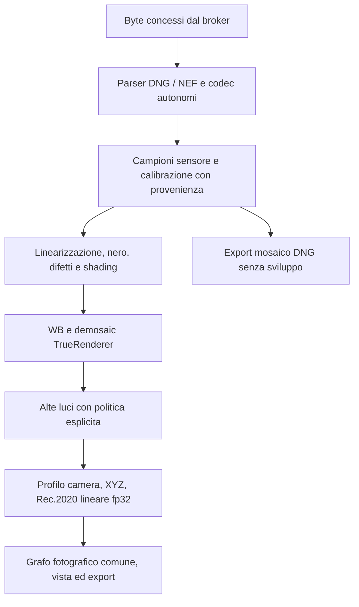

# trueRendererExperimental — motore RAW autonomo e fedeltà cromatica

Specifica di progetto del 9 ottobre 2026, derivata dalla richiesta del titolare: costruire un motore aggiuntivo sulla base di TrueRenderer, sostituendo le responsabilità oggi affidate a LibRaw e perseguendo la massima fedeltà cromatica misurabile. Ordine richiesto: **DNG prima, poi Nikon D750, Fujifilm X-T5, Nikon D800 e D850**. Il piano operativo, le prove eseguite e le caselle di avanzamento risiedono esclusivamente in [STATO.md](../STATO.md#truerendererexperimental--piano-e-sviluppo-del-9-ottobre).

Il documento distingue l'analisi del codice di partenza dai requisiti del nuovo motore. «Autonomo», «decodifica corretta» e «colore qualificato» hanno verifiche separate; il nome del motore non certifica nessuna delle tre proprietà.

## 1. Decisione di progetto e obiettivo

### ADR 0012 — sostituzione di LibRaw nel percorso Experimental

La richiesta autorizza un percorso sperimentale distinto dalla baseline di [§7 dell'architettura](TrueRenderer-Architettura.md#7-pipeline-raw). È una deroga circoscritta al rinvio della ricerca RAW post-v1: non modifica le condizioni di promozione, i gate R/SF o la promessa degli altri motori.

Si progetta un nucleo Rust con responsabilità separate: contenitore/codec, segnale del sensore, ricostruzione RGB, caratterizzazione della fotocamera. Il nucleo riusa i contratti numerici e applicativi di TrueRenderer, con un proprio ingresso RAW. Non deve dipendere da LibRaw per riconoscere, aprire, sviluppare o esportare i formati che dichiara supportati.

Le decisioni sono:

1. Conservare `RawEngine::TrueRenderer`, la sua identità serializzata e la ricetta `LibRaw-0.22.2-TR-directional-f32-sensor-highlights-v2`. La nuova variante proposta è `RawEngine::TrueRendererExperimental`, con etichetta visibile **trueRendererExperimental**. Nessun cambio dei default di piattaforma.
2. Realizzare prima DNG Bayer con contratto delimitato, poi NEF D750/D800/D850 e RAF Fujifilm X-T5 per sottotipo provato. L'autonomia non richiede di riprodurre subito l'intero catalogo di LibRaw.
3. Scrivere il percorso iniziale di parsing/decodifica in Rust, riutilizzando dipendenze generiche ammissibili dove corrette. Un codec esterno non è escluso per principio; nessun altro sviluppatore RAW diventa un requisito nascosto.
4. Conservare Rec.2020 lineare esteso fp32, alpha uno per RAW opachi, negativi e valori sopra uno, orientamento applicato una volta, grafo di sviluppo ed export comuni.
5. Usare il demosaic direzionale esistente come punto di partenza e controllo. Valutare RI/MLRI e poi ARI; adottare un metodo più complesso soltanto dopo prove sul segnale lineare, sul rumore e sui colori difficili.
6. Dare priorità a calibrazione del sensore e profili colore verificabili. Denoise, ricostruzione delle alte luci e look sono decisioni esplicite e versionate, non mezzi per migliorare artificialmente il punteggio del renderer.

L'app completa può continuare a contenere LibRaw per i motori precedenti. L'autonomia di Experimental richiede invece **zero chiamate LibRaw nel suo percorso** e un eseguibile di verifica del nucleo compilabile senza LibRaw. La rimozione della libreria dall'intero prodotto sarebbe una migrazione ulteriore, incompatibile con il mantenimento inalterato delle scelte storiche.

### Che cosa significa massima fedeltà

L'obiettivo è minimizzare l'errore rispetto a riferimenti della scena misurati, nelle condizioni e nel dominio dichiarati, preservando quanto il sensore ha registrato. Comprende accuratezza dei colori, neutralità, stabilità con esposizione/illuminante, falsi colori sui dettagli e incertezza delle zone sature.

Una fotocamera RGB non consente in generale di ricostruire univocamente lo spettro della scena. Risposte spettrali, illuminazione e metamerismo pongono limiti anche a un software perfetto; una matrice o una LUT non li elimina universalmente. La letteratura sulla [caratterizzazione colorimetrica delle fotocamere](https://pmc.ncbi.nlm.nih.gov/articles/PMC4299059/) motiva il limite e l'uso di obiettivi percettivi. Qui si propone quindi una fedeltà **misurata per condizioni**, senza una promessa di ΔE zero su qualunque soggetto.

## 2. Analisi delle responsabilità attuali

L'analisi riguarda il codice locale, non una descrizione generica delle capacità di LibRaw. Le API esterne sono riscontrabili nella [documentazione LibRaw](https://www.libraw.org/docs/API-CXX.html), ma l'insieme realmente chiamato è molto più circoscritto.

| Responsabilità | Percorso di partenza | Sostituzione richiesta per Experimental |
|---|---|---|
| Riconoscere RAW e distinguerli dai bitmap | `EngineDecoder::is_raw` chiama il probe LibRaw bilineare; segue il controllo del contenitore e, su Mac, il probe nativo | Classificatore autonomo con esiti bitmap certo, RAW supportato, RAW non supportato, corrotto/ambiguo. Il rifiuto di un RAW non autorizza Apple RAW o JPEG |
| Aprire il contenitore e identificare il modello | `open_and_identify` → `open_buffer` | TIFF/IFD e DNG propri; poi NEF/MakerNotes. Byte concessi dal broker, nessuna riapertura per percorso |
| Estrarre e decomprimere il sensore | `tr_mosaic_read` → `unpack` | Codec per ciascun sottotipo ammesso, con limiti prima dell'allocazione e controlli dei bitstream |
| Interpretare le curve del formato | Anche all'interno dei decoder LibRaw; il decoder Nikon applica una curva durante l'unpack | Dichiarare dominio dei codici e linearizzazione già applicata; non applicare due volte la curva e non confondere decompressione con recupero di informazione perduta |
| Area utile, margini e CFA | `raw2image`, `sizes`, `COLOR` | Geometria esplicita del piano completo, origine CFA, area attiva e crop di presentazione distinti |
| Livelli del sensore | `black`, `cblack`, `maximum`, riletti dopo unpack | Metadati originali e calibrazione per modalità; nero spaziale e soglie di saturazione rappresentabili senza ridurli sempre a quattro numeri |
| WB come scattato | `cam_mul`, normalizzato rispetto al verde | Lettura del neutro/WB dal formato, provenienza e validazione; nessun daylight o gray-world implicito |
| Trasformata colore | `rgb_cam` consegnata come camera → sRGB lineare | Profilo proprio o incorporato, con illuminante, dominio d'ingresso e trasformata espliciti |
| Matrice per DNG RAW in uscita | `tr_mosaic_color_matrix` usa `cam_xyz`, oppure la prima `ColorMatrix` DNG se D65 | Esportare calibrazione originale rappresentabile o profilo autorizzato, senza dipendere dalla tabella LibRaw |
| Normalizzazione e WB applicato ai campioni | Già Rust, in `mosaic::develop_with_wb` | Riutilizzare il principio, estendere i contratti del sensore; non copiare assunzioni valide soltanto per i modelli storici |
| Demosaic | Già Rust, in `demosaic.rs` | Baseline derivata dal metodo esistente, poi candidati separati e versionati |
| Alte luci, passaggio in Rec.2020, orientamento | Già Rust, in `demosaic.rs` | Stadi espliciti con politiche proprie; mantenere invariato il percorso storico |
| WB Auto/contagocce | `raw_wb::estimate` misura render e richiama il decoder fino a 16 volte | Metodo Experimental sul segnale camera calibrato, con rumore e saturazione identificati prima della matrice; vecchio stimatore conservato per le vecchie ricette |
| Export del mosaico DNG | `export::raw` chiama direttamente `mosaic::export_mosaic`, senza argomento motore | Instradamento esplicito del backend di estrazione anche per questa operazione |
| Versioni e costruzione | Tre ricette con prefisso LibRaw; `tr-worker/build.rs` compila la libreria su Mac/Windows | Dipendenza del nuovo nucleo separata; build di prova senza backend storici e integrazione normale con entrambi |

Riferimenti locali: [bridge C++](../native/libraw/tr_libraw.cpp), [contratto C](../native/libraw/tr_libraw.h), [adattatore mosaico](../crates/tr-worker/src/mosaic.rs), [instradamento worker](../crates/tr-worker/src/lib.rs), [export](../crates/tr-worker/src/export.rs), [demosaic](../crates/tr-core/src/demosaic.rs), [WB](../crates/tr-core/src/raw_wb.rs), [identità motori](../crates/tr-core/src/decoder.rs), [build nativa](../crates/tr-worker/build.rs).

Per i due motori LibRaw bilineare/AHD, invece, la libreria esegue anche `dcraw_process` e restituisce RGB uint16: sono pipeline differenti dal TrueRenderer fp32. Apple usa CIRAWFilter. La nuova architettura non attribuisce al TrueRenderer attuale il confine intero RGB dei motori LibRaw.

Il percorso TrueRenderer sottrae il nero, divide per bianco meno nero, applica i guadagni WB e demosaicizza senza clamp RGB. **Il passaggio matematico attraverso le primarie sRGB in float non restringe da solo il gamut**: non è un raster sRGB8. Il motivo per introdurre camera → XYZ → Rec.2020 è rendere la calibrazione controllabile, non correggere un clipping inesistente in quel passaggio.

Il bridge storico limita esplicitamente il supporto a D750, D40 e DNG sintetico TrueRenderer, Bayer a tre colori; usa nero rappresentabile al massimo su periodicità 2×2, un bianco scalare, quattro WB e matrice 3×3. Non espone un interprete DNG generale. I limiti e le misure storiche sono in [progetto motori RAW](progetto-motori-raw.md); il miglioramento osservato del demosaic su alcuni segnali non dimostra accuratezza colorimetrica della fotocamera.

Il progetto dispone già di parsing limitato delle preview TIFF e lettura dei dati di scatto: [container.rs](../crates/tr-worker/src/container.rs) e [shooting.rs](../crates/tr-worker/src/shooting.rs). Sono riutilizzabili come confini e fixture, ma non sostituiscono un parser RAW completo. Nessuna necessità di ricostruire catalogo, UI o grafo fotografico per ottenere autonomia dal decoder.

## 3. Alternative tecniche valutate

| Opzione | Vantaggio concreto | Limite rispetto al progetto | Decisione proposta |
|---|---|---|---|
| Continuare LibRaw solo per unpack | Copertura e codice già integrato | Experimental continuerebbe a dipenderne per aprire i RAW | Solo controllo esterno nei test e percorso storico |
| RawSpeed | Decoder da memoria, CFA, dati RAW e lavoro upstream su robustezza/prestazioni | Non fornisce da solo il renderer colore; integrazione C++ e condizioni LGPL da progettare | Alternativa futura per ampliare i formati, non requisito della prima verticale |
| Rawler/DNGLab | Implementazione Rust e molti formati RAW | LGPL anche per il crate; upstream dichiara API non stabile | Possibile confronto indipendente e alternativa da rivalutare, non sostituzione diretta acritica |
| Adobe DNG SDK | Implementazione di riferimento utile per DNG e verifiche di interoperabilità | Non sostituisce la lettura dei NEF; propria build, versione e condizioni di distribuzione | Validatore/riferimento offline separato, non motore di resa del prodotto |
| Nucleo Rust DNG, poi NEF | Confini, risorse, dominio dei campioni e integrazione sotto controllo; autonomia verificabile | Manutenzione dei formati e corpus a carico del progetto; supporto iniziale più piccolo | Percorso raccomandato, con gate prima di ogni estensione |

[RawSpeed](https://github.com/darktable-org/rawspeed) dichiara di essere uno stadio di decodifica, senza demosaic o correzione colore, e documenta il fuzzing. [Rawler](https://github.com/dnglab/dnglab/blob/main/rawler/Cargo.toml) dichiara LGPL-2.1; [DNGLab](https://github.com/dnglab/dnglab/blob/main/README.md) avverte della stabilità dell'API. Queste proprietà non determinano da sole la qualità né una scelta assoluta fra librerie.

La LGPL non vieta in generale prodotti proprietari: il [testo distribuito con RawSpeed, §6](https://raw.githubusercontent.com/darktable-org/rawspeed/develop/LICENSE), pone condizioni su modifica/sostituzione e distribuzione. L'[ADR 0008](progetto-motori-raw.md#adr-0008) privilegia lo statico senza rilink del codice proprietario; adottare una libreria LGPL richiederebbe una diversa integrazione documentata, non la conclusione che «Rust significa licenza permissiva». In questa fase non si aggiunge una dipendenza RAW.

Copiare parti di LibRaw e rinominarle non produce un'implementazione originale. Tabelle, profili, codice, articoli e dataset hanno provenienze separate: registrarne i diritti prima di incorporarli. L'audit del codice esistente non va descritto come un processo clean-room. Un profilo ricavato dalla tabella LibRaw può essere un controllo di laboratorio con origine dichiarata, non un profilo misurato TrueRenderer.

## 4. Perimetro dei formati e ordine DNG → NEF

### Prima verticale DNG

La [specifica Adobe DNG 1.7.1.0](https://helpx.adobe.com/content/dam/help/en/camera-raw/digital-negative/jcr_content/root/content/flex/items/position/position-par/download_section_733958301/download-1/DNG_Spec_1_7_1_0.pdf) è il riferimento normativo bloccato. La prima capacità è un **sottoinsieme dichiarato**, non «tutti i DNG». La revisione del documento non coincide con l'insieme di funzioni implementate.

| Dimensione della capacità | Prima verticale proposta | Estensione successiva distinta |
|---|---|---|
| Contenitore | TIFF classico nei due endian; IFD/SubIFD, selezione inequivocabile del mosaico principale, strip/tile con quote | BigTIFF, sequenze/multi-immagine o contenitori ulteriori |
| Segnale | CFA Bayer RGB 2×2, interi fino a 16 bit; profondità e ordine dei bit espliciti | Float, monocromatico, CFA non Bayer, dati multiframe |
| Compressione | Prima non compresso; poi JPEG lossless ammesso dal profilo DNG, qualificato per marker/predittori/precisione usati | JPEG lossy, JPEG XL e altri codec dopo contratto e corpus specifici |
| Geometria | Piano completo, area attiva, crop e fase CFA; otto orientamenti EXIF; crop intero e scala unitaria nella prima capacità | Crop frazionario, scala non unitaria e deformazioni con ricampionamento qualificato |
| Calibrazione del sensore | Tabella di linearizzazione, nero periodico e correzioni per riga/colonna quando presenti nel sottoinsieme; bianco nel dominio dichiarato | Mappe e modalità non rappresentabili nel primo contratto |
| Colore | Uno/due illuminanti, metadati camera completi richiesti dal profilo scelto; neutro come scattato valido | Tre illuminanti, profili tabellari e ulteriori estensioni dopo verifiche dedicate |
| Opcode | Elenco e stadio riconosciuti; prima file senza operazioni obbligatorie non implementate | Operazioni calibrate di difetti/gain map e poi ottica, con prove di composizione |
| DNG lineare RGB | Identificato come immagine già demosaicizzata e distinto dal Bayer | Adattatore dedicato prima di dichiararlo supportato da Experimental |

L'inventario reale deve essere basato sui byte e sui tag, non sull'estensione o sulla sola stringa del produttore. Un DNG recente non è necessariamente incompatibile e un DNG vecchio non è necessariamente semplice: contano versione di compatibilità, funzioni utilizzate e capacità del decoder. Il parser deve rifiutare selezioni ambigue e RAW mascherati da bitmap.

Per ogni opcode registrare applicazione, omissione consentita o rifiuto, con stadio e motivo. Una funzione opzionale omessa può comunque cambiare la resa: il rapporto deve dirlo. La politica su `BaselineExposure` e sugli altri suggerimenti di resa è separata dalla scala sensore: nella baseline di misura nessuna compensazione di presentazione viene applicata implicitamente; il valore del metadato resta disponibile e un'eventuale applicazione entra nella ricetta.

La sequenza interna è: fixture indipendenti non compresse → DNG reali autorizzati dello stesso sottoinsieme → compressione lossless → funzioni di calibrazione necessarie al corpus. Prima della selezione in app occorre almeno una campagna su DNG reali, con produttore/converter e combinazione di funzioni registrati; il successo sui DNG sintetici del progetto non basta.

Lettura di un file, corretta interpretazione della calibrazione e resa colorimetrica sono tre colonne della matrice di supporto. Un file decodificabile ma senza calibrazione utilizzabile può produrre diagnostica del sensore nel laboratorio; non viene presentato come render cromaticamente valido. DNG computazionali o già elaborati non sono implicitamente misure intatte di un singolo sensore.

### Seconda verticale NEF e RAF

L'unità di qualifica sarà `(modello, modalità sensore, dimensioni, profondità, compressione, versione MakerNotes)`. D750, D800 e D850 richiedono capacità distinte. La Fujifilm trovata nel corpus autorizzato è una X-T5: il suo CFA X-Trans e il codec RAF richiedono una verticale dedicata, non una nuova voce nella allowlist Bayer. D40 e D40X sono escluse dalla campagna corrente su richiesta del titolare; sRAW resta fuori finché non ha una capacità propria.

Servono riconoscimento TIFF/NEF, metadati Nikon, codec/predittori, curve, area sensore, nero/bianco e WB specifici dei sottotipi presenti nel corpus. La documentazione primaria di [ExifTool sui tag Nikon](https://exiftool.org/TagNames/Nikon.html) distingue versioni e ordinamenti dei canali e segnala informazioni ColorBalance cifrate: un lettore EXIF generico non risolve da solo il WB Nikon.

Per ogni modalità si devono provare campioni normali, scuri, prossimi al clipping, ISO pertinenti e orientamenti. La modalità lossy va identificata: l'uguaglianza del risultato decompresso con un decoder indipendente non recupera i codici eliminati in camera. Copertura della D750 non si estende automaticamente a D800, D850 o RAF.

La conversione preventiva dei NEF in DNG non è un sostituto nascosto del backend NEF. Può essere uno strumento di confronto, conservando originale, converter, versione, impostazioni e trasformazioni già applicate.

## 5. Contratto del nucleo autonomo

Si propone `crates/tr-raw`, dipendente dai tipi numerici necessari di `tr-core`, senza dipendenza da `tr-worker`, FFI LibRaw o framework Apple. Il worker userà un adattatore distinto `experimental.rs`. Nomi di moduli e tipi seguenti sono proposte di implementazione, non API già disponibili.

| Contratto | Dati essenziali | Regola |
|---|---|---|
| `RawDescriptor` | Formato/sottotipo, dimensioni, codec, CFA/origine, regioni, orientamento, limiti e necessità di calibrazione | Probe senza raster; dimensioni fisiche e visualizzate distinte |
| `RawFrame` | Campioni decodificati, stride, dominio dei codici e operazioni già eseguite | I codici non sono RGB; campioni originali preservati per export e diagnostica |
| `SensorCalibration` | Linearizzazione, nero, scala radiometrica, soglie di saturazione, difetti, rumore e shading | Ogni dato ha unità, origine, versione e campo di validità |
| `CameraProfile` | Modello/modalità, illuminanti, trasformate, neutro, opzionali residui di calibrazione, hash | Profilo e look non sono sinonimi; corrispondenza verificata prima del render |
| `ResolvedRawRecipe` | Versioni degli stadi, guadagni effettivi, profilo risolto, crop, politiche, backend numerico | Identità completa dopo risoluzione; serializzazione canonica e riproducibile |
| `RawMemoryPlan` | Piani vivi per fase, halo, scratch codec, copie e output | Ammissione prima dell'allocazione; overflow verificato |
| `RawEvidence` | Origini dei dati, assunzioni, calibrazione disponibile, saturazione e avvisi | Riassunto IPC breve con impronta del dettaglio, non stringhe enormi troncate |

Le dimensioni e le soglie possono essere affinate dopo decompressione solo entro il contratto ammesso. Una geometria diversa dal probe invalida il risultato e richiede una nuova ammissione esplicita; non si scrive in un buffer stimato per un altro raster. I dettagli non essenziali alla riuscita del probe possono restare sconosciuti fino all'unpack, ma la provenienza finale e la chiave del risultato devono usare i valori effettivi.

Per TIFF/codec: aritmetica verificata su offset e lunghezze, limiti su IFD/tag/profondità/visite, rilevamento cicli, byte compressi e dimensioni decodificate limitati, assenza di moltiplicazioni o allocazioni da dati non validati. Unknown, corrotto, non supportato e fuori risorse sono errori distinti. Il parser deve fallire in modo deterministico anche con dati troncati o contraddittori.

Il confine di isolamento resta quello di [ADR 0002/0004](isolamento-decoder-e-formati.md): due servizi XPC nel bundle Mac, policy controllata del worker su pipe, originali in sola lettura. Rust non sostituisce il sandbox. Profili esterni e dati ausiliari passano come risorse concesse e limitate dal broker; il parser non apre file indicati dal RAW e non effettua richieste di rete.

## 6. Pipeline numerica proposta

Il diagramma riassume responsabilità. Non impone un ordine universale agli opcode: ogni operazione è assegnata al dominio/stadio prescritto dal formato e dalla ricetta; l'export mosaico si dirama prima degli interventi distruttivi sui campioni.

### Segnale prima del colore

Conservare distinti codici compressi, campioni decodificati, segnale linearizzato, segnale sottratto del nero e camera RGB bilanciato. La linearizzazione avviene una volta. Soglie e nero devono riferirsi allo stesso dominio dei campioni; non si trasferiscono numeri fra domini senza la corrispondente trasformazione.

Il nero può dipendere da posizione, canale, modalità e condizioni. Usare prima metadati validi e calibrazioni pertinenti; una stima da margini oscurati richiede che quei margini siano identificati e sufficienti. Mai assumere che il percentile più scuro della fotografia sia il nero del sensore. Conservare i valori sotto nero nella rappresentazione float: il clamp precoce introduce una distorsione nelle ombre.

La scala radiometrica e le soglie di clipping sono concetti distinti. Un massimo osservato nella singola foto non è né un bianco sensore affidabile né una normalizzazione neutra. Non derivare compensazioni cromatiche dai soli massimi per canale; gli eventuali guadagni fanno parte della calibrazione del formato/profilo. Non aggiungere auto-bright o esposizione adattiva nascosta.

G1 e G2 restano distinguibili fino alla verifica/calibrazione della loro risposta. Correzione di pixel difettosi e disparità dei verdi ha una maschera e criteri specifici; non si scambia una trama reale per un difetto. Shading cromatico e aberrazione laterale possono influire sul colore: profili o misure pertinenti, trasformazioni dichiarate e una sola correzione per fenomeno, senza duplicare quella dei controlli fotografici.

La maschera di saturazione nasce dal segnale sensore, prima di WB, demosaic, shading e matrice. Mantiene soglie per il dominio/modo corretto e distingue invalidi, saturi e prossimi alla soglia. RGB sopra uno o un overshoot dell'interpolazione non provano clipping nel sensore.

Come primo modello di lavoro per il rumore, valutare `varianza(s) = a·max(s, 0) + b` nel dominio sensore calibrato, con coefficienti misurati o dichiarati e campo di validità per modalità. Un guadagno `g` moltiplica la varianza per `g²`. Il massimo con zero appartiene alla stima della varianza, non altera il campione conservato. Verificare separatamente rumore di riga, pixel difettosi e compressione: questo modello semplice non li descrive tutti.

### Bilanciamento del bianco

Separare il neutro rilevato in camera, i guadagni scelti dall'utente e l'illuminante del profilo. WB e selezione/interpolazione del profilo devono essere risolti insieme; applicare il WB due volte attraverso una matrice che lo incorpora è un errore da prevenire con tipi/test.

Il dominio d'ingresso della trasformata risolta deve essere verificabile. Se `T` comprende già il WB e mappa camera RGB non bilanciato in XYZ, mentre il demosaic riceve guadagni diagonali `G`, la trasformata sul risultato bilanciato usa `T·G⁻¹`, nei medesimi assi camera. Un profilo definito direttamente sul camera RGB bilanciato segue invece il proprio contratto. Questo raccordo non autorizza a spostare il WB attraverso il demosaic assumendo che le due operazioni commutino.

Come scattato usa dati validi del file. Il contagocce usa statistiche robuste su siti CFA corrispondenti, esclude difetti/saturazione e campioni dominati dal rumore, poi verifica la neutralità nel risultato. Auto resta una stima della scena richiesta esplicitamente, con possibilità di rifiuto; non è una misura dell'illuminante.

Non trattare il WB intero storico a passi di 1/1000 come precisione sufficiente per definizione. Prima misurare l'effetto della quantizzazione e dei limiti 0,25–4; se interferiscono col budget colore, usare parametri Experimental con versione e precisione proprie. Le ricette precedenti conservano la semantica originale. Un controllo in kelvin richiede una conversione fisica coerente col profilo; i guadagni relativi non diventano kelvin cambiando l'etichetta.

### Demosaic sulla base TrueRenderer

Il nucleo attuale combina interpolazione direzionale del verde e differenze R−G/B−G, ma la sua funzione produce già Rec.2020 orientato e può neutralizzare le alte luci. Non è una funzione generica che restituisce camera RGB: per rendere gli stadi componibili occorre una nuova implementazione separata della stessa costruzione, verificata contro quella storica con trasformata/orientamento controllati. La funzione precedente non cambia.

Il primo candidato di qualità è la famiglia **RI/MLRI**; **ARI** viene dopo. La [pubblicazione di Monno e colleghi](https://pmc.ncbi.nlm.nih.gov/articles/PMC5751666/) descrive la combinazione adattiva di metodi residuali; l'[analisi IPOL](https://www.ipol.im/pub/art/2021/358/) offre un riferimento matematico ulteriore. Sono motivi per una prova, non una dimostrazione di superiorità sui RAW del progetto.

Per ciascun candidato fissare formule, finestre, pesi, regolarizzazione, iterazioni massime e bordo. Regolarizzare rispetto a un modello di rumore calibrato quando disponibile; in sua assenza usare una politica dichiarata e qualificata, senza inventare coefficienti camera. Negative, alte luci, basse esposizioni, colori poco correlati e campioni oltre uno appartengono al dominio di prova. Non applicare il metodo solo a immagini sRGB di esempio.

Con denoise disattivato, i siti misurati validi devono essere conservati nel loro canale salvo correzioni sensore dichiarate. Le differenze dal segnale misurato vanno attribuite a uno stadio, non assorbite in una generica etichetta «qualità». Un futuro metodo con denoise congiunto avrà ricetta e gate distinti. Modelli appresi sono candidati di ricerca solo con dati RAW pertinenti, pesi versionati e prove fuori dal training; non sono necessari per la prima autonomia.

### Alte luci

Il metodo storico alza i canali con evidenza di saturazione verso il massimo RGB bilanciato. È una stima neutra utile contro dominanti, ma può attenuare colori autentici nelle saturazioni parziali. Non va equiparato al colore recuperato della scena.

Experimental distingue una politica diagnostica che conserva i valori e segnala l'incertezza da una politica di ricostruzione fotografica esplicita. Per quest'ultima valutare stima locale della cromaticità dai canali/regioni affidabili, con limiti di propagazione sui bordi e confidenza; in assenza di informazione non dichiarare recuperati colore o trama. Soglie, raggio, transizione e comportamento su uno/due/tre canali saturi sono parte della ricetta.

La misura colorimetrica principale esclude i fotositi saturi e riporta separatamente le zone ricostruite. La neutralizzazione non può migliorare il punteggio semplicemente cancellando le patch difficili. Il confronto con la ricetta storica deve includere cieli, luci colorate e bordi fra oggetti, non soltanto campi bianchi.

## 7. Caratterizzazione cromatica

### Trasformata esplicita

Il percorso proposto porta camera RGB in XYZ con bianco dichiarato e poi in Rec.2020 D65. La matrice composta è calcolata/verificata in f64 e applicata in fp32 nel percorso operativo. Se il profilo produce XYZ D50, l'adattamento verso D65 avviene una volta; non si aggiunge un adattamento generico a una trasformata che lo ha già incluso.

Per DNG, `ColorMatrix` e `ForwardMatrix` hanno direzioni e domini diversi. `CameraCalibration`, `AnalogBalance`, firme dei profili, neutro e illuminanti partecipano alla risoluzione; non basta invertire una matrice e applicare i vecchi guadagni. Il capitolo 6 della [specifica DNG](https://helpx.adobe.com/content/dam/help/en/camera-raw/digital-negative/jcr_content/root/content/flex/items/position/position-par/download_section_733958301/download-1/DNG_Spec_1_7_1_0.pdf) governa i rami con/senza ForwardMatrix. Le formule eseguibili e i casi degeneri devono essere trascritti nel contratto numerico prima di implementarli.

Ogni risoluzione restituisce neutro effettivo, trasformata, condizionamento e sorgente. Matrici non finite, singolari, incompatibili col dominio o eccessivamente instabili vengono rifiutate. I test devono includere matrici non diagonali, WB lontani dagli illuminanti di calibrazione e variazioni continue del bianco. Una LUT che maschera una matrice sbagliata non è una calibrazione valida.

### Profili e priorità

Nella prima verticale DNG usare la calibrazione incorporata applicabile, identificandone l'origine senza chiamarla misurata dal progetto. Un profilo personalizzato validato e selezionato esplicitamente può sostituirla; un profilo di modello distribuito deve avere matching, fonte e condizioni documentati. In caso di ambiguità non scegliere in base al solo nome file. Per NEF, creare/ottenere profili indipendenti dalla tabella runtime LibRaw prima di promettere un render colore autonomo.

La campagna di caratterizzazione comprende:

- Target con valori misurati sullo specifico esemplare, acquisizioni ripetute e illuminazione controllata. Target e spettri di verifica separati da quelli usati per stimare il profilo.
- Almeno due famiglie di illuminazione e una verifica fuori dai punti di calibrazione; sorgenti LED reali misurate, non equivalenza dedotta soltanto dalla temperatura nominale.
- Fotocamera/modalità/ISO pertinenti, esposizione, risposta lineare, uniformità, lente e shading documentati. Un profilo di esemplare non viene automaticamente promosso a tutto il modello.
- Fit iniziale 3×3 vincolato alla neutralità e alla stabilità; metriche aggregate e per famiglia di colori. Correzioni più flessibili solo se migliorano il test separato.
- Dati di sensibilità spettrale misurati, quando disponibili, per estendere e stressare il fit con illuminanti/riflettanze pertinenti. Spettri stimati sono etichettati come stimati.

La [root-polynomial regression di Finlayson, Mackiewicz e Hurlbert](https://pubmed.ncbi.nlm.nih.gov/25769139/) è un candidato a correzione residua per la sua costruzione legata all'esposizione. Non è il default: termini frazionari richiedono una politica verificata per campioni negativi e vicini a zero, e non garantiscono stabilità fuori dai dati di fit. Anche una LUT di calibrazione deve conservare i neutri, evitare discontinuità, dichiarare il comportamento fuori dominio e superare prove di esposizione.

La separazione è semantica: una tabella chiamata Hue/Sat può contenere calibrazione o scelte di resa. La baseline colorimetrica applica soltanto i componenti necessari al profilo qualificato; curve/look creativi hanno identità e attivazione distinte. Non si ignorano trasformazioni richieste presentando comunque il risultato come applicazione completa di quel profilo.

### Limite di ciò che si vede

L'uscita scene-linear va misurata prima della curva di vista e del gamut mapping. La fedeltà visibile richiede anche catena ICC, profilo monitor e condizioni fisiche, come già previsto nell'architettura. Una resa SDR che taglia colori o alte luci non è una misura del RAW; correggere il decoder non qualifica automaticamente monitor, HDR o modi Standard/Riferimento.

## 8. Identità, cache, persistenza ed export

La ricetta risolta deve identificare almeno parser/codec e versione, profilo camera e hash dei suoi contenuti, versione dati sensore, linearizzazione/crop/CFA, guadagni WB effettivi, demosaic/parametri, denoise e politica alte luci. I parametri che possono cambiare i pixel partecipano alla cache, al job IPC e al risultato. Il percorso del file di profilo o il solo nome del motore non sono un'identità sufficiente.

Una nuova versione del profilo non cambia la resa delle ricette già salvate senza un'azione esplicita. I profili personalizzati referenziati diventano asset durevoli con scrittura atomica e backup, non cache eliminabile. L'implementazione deve scegliere come conservarli e migrarli prima di abilitarne il salvataggio. Riutilizzare il catalogo esistente non autorizza a sovrascrivere le sue ricette o a reinterpretare quelle precedenti.

L'eventuale riuso del mosaico già decodificato durante variazioni WB ha una chiave di stadio propria e occupa crediti di memoria; il buffer viene invalidato al cambio di sorgente o calibrazione pertinente. Questo può evitare ripetuti unpack, ma la cache intermedia non diventa un secondo deposito permanente dei RAW.

Punti d'integrazione obbligatori:

| Superficie | Requisito |
|---|---|
| Probe, decode, WB Auto/contagocce | Un solo backend Experimental; nessun passaggio preventivo da LibRaw per classificare il file |
| Bitmap con motore Experimental selezionato | Restano sui decoder bitmap qualificati, dopo classificazione positiva del bitmap; nessun fallback RAW del percorso Windows storico |
| Preferenze e ricette | Variante distinta, default storici, parametri validati per motore, errore leggibile se una ricetta non è disponibile |
| Cambio durante i lavori | Generazione e identità complete; annullamento e risultati tardivi verificati, inclusi probe ed export |
| Cache RAM/SSD e miniature | Separazione per ricetta risolta e profilo; preview incorporata resta uno stadio riconoscibile e non è un export RAW |
| Grafo fotografico e uscita RGB | Stesso buffer di lavoro e stesso grafo per viewer/export, con ricampionamento e quantizzazione di destinazione dichiarati |
| Export DNG mosaico | Backend esplicito; campioni e calibrazione rappresentabili, nessun WB/demosaic incorporato accidentalmente |
| Provenienza | Rispettare o versionare consapevolmente quote IPC attuali: decoder 128 byte, input colore 256, orientamento 128 |

Il writer DNG attuale rappresenta una superficie limitata: nero 2×2, bianco scalare, matrice singola e campioni uint16. Un DNG letto dal nuovo motore può richiedere più informazioni. Prima di esportarlo si deve conservare la semantica completa supportata dal writer oppure rifiutare l'operazione specifica; non appiattire nero/mappe/calibrazione e promettere equivalenza. La copia dei byte originali, il DNG con mosaico reimpacchettato e il DNG lineare sviluppato restano operazioni diverse.

L'export del mosaico non è un archivio sostitutivo del file originale se omette MakerNotes, margini, frame o metadati. Se è stata applicata una linearizzazione durante la decompressione, tag e livelli in uscita devono descrivere quel dominio e non chiedere a un altro lettore di linearizzare nuovamente.

## 9. Prestazioni, memoria e portabilità

Prima una versione CPU deterministica a fotogramma intero e un riferimento numerico per stadi; SIMD, parallelismo, tile e GPU seguono il profilo di costo. Il riferimento numerico del laboratorio non è il modo di assurance Riferimento del prodotto.

Il budget di memoria deriva dal massimo dei buffer vivi nelle diverse fasi. Conta input concesso, piano sensore completo, maschere, intermedi del demosaic, output, copie IPC/host, riduzione, cache e job concorrenti. Un piano float a 24 milioni di pixel pesa 96 MB decimali; l'output RGBA fp32 pesa 384 MB. Aggiungere diversi piani per ARI ha quindi un costo materiale prima di qualsiasi GPU.

La stima corrente in [decode_pool.rs](../apps/desktop/src/decode_pool.rs) include allowance native e picchi di trasferimento/riduzione; non prova il fabbisogno del nuovo algoritmo. Serve `RawMemoryPlan` ammesso dal broker prima delle allocazioni, con margine confrontato con RSS e memoria GPU reali. La supervisione periodica RSS resta una supervisione, non un limite kernel garantito.

Per i codec sequenziali si può dover decomprimere tutto il mosaico anche se il demosaic è regionale. Ogni stadio dichiara supporto spaziale e fasi globali. Comporre gli halo lungo il grafo, includendo correzioni ottiche, iterazioni e confidenza delle alte luci; confrontare tile con fotogramma intero anche ai bordi e con origini CFA differenti.

Una preview ridotta deve dichiarare l'eventuale algoritmo diverso. Il semplice binning Bayer non è per definizione equivalente al render pieno ridotto in luce lineare. Non usare fp16 per risparmiare senza misurare l'errore e non promettere velocità o memoria inferiori prima della prova release.

Misurare separatamente parsing, unpack, calibrazione, demosaic, colore, trasferimento e tempo alla presentazione. Campagne cold/warm definite, cancellazione, due XPC attivi, memoria sotto pressione, p50/p95/p99 con numerosità registrata. Windows richiede esecuzione reale; una build Mac non lo qualifica.

## 10. Criteri di accettazione

Le soglie seguenti sono obiettivi progettuali del nuovo percorso. Quelle fotografiche richiedono un banco misurato; non sono risultati né nuovi badge del prodotto.

| Gate | Evidenza richiesta | Criterio |
|---|---|---|
| A — autonomia | Build/esecuzione del nucleo senza LibRaw; percorso integrato instrumentato con chiamate legacy rese fallimenti nel test | Zero chiamate per riconoscimento, probe, decode, WB, export e rifiuti; nessun decoder alternativo eseguito su un RAW respinto |
| B — decodifica | Fixture con campioni noti e decoder indipendente, prima stesso piano completo poi stessa area attiva | Zero campioni discordanti per formati lossless nel dominio concordato; per lossy distinguere correttezza del decoder da perdita della sorgente |
| C — geometria e metadati | Tutte le fasi Bayer, crop con origine pari/dispari, otto orientamenti, neri spaziali, tag assenti/conflittuali | Coordinate e fase esatte; profilo e WB effettivamente applicati identificati; errori espliciti per le capacità mancanti |
| D — aritmetica colore | Vettori analitici, matrici non banali e confronto f64/fp32 per stadio | Per il solo tratto matriciale nel dominio di prova: errore assoluto/relativo iniziale ≤ `2e-6 + 2e-6·abs(riferimento)`; gamut e segno conservati. Le tolleranze degli altri stadi si fissano separatamente |
| E — fedeltà fotografica | Target/riflettanze misurati, dati di fit separati, sessioni ripetute, illuminanti noti, campioni non saturi | Obiettivo iniziale: ΔE00 medio ≤1, p95 ≤2, massimo ≤4 nel dominio qualificato; neutrali ≤1. Confrontare anche incertezza e peggior caso, non soltanto la media |
| F — ricostruzione | Verità sintetica lineare, RAW reali, rumore, trame cromatiche indipendenti, bordi, clipping parziale | Errori/artefatti distinti per categoria; nessuna promozione sulla sola media CPSNR. Soglie per falso colore, zipper e rumore fissate prima del confronto candidato |
| G — integrazione | Cambio motore durante lavoro, cache, riapertura, ricette, Undo/Redo, viewer/export | Identità coerente, nessun pixel di un altro motore, regressioni storiche invariate nella stessa build/piattaforma |
| H — risorse e robustezza | Input avversari/fuzzing, OOM, timeout, annullamento, due worker e corpus autorizzato | Nessun crash riproducibile non gestito, output invalido o allocazione fuori piano; misure entro budget/timeout configurati |

Il gate E esprime una destinazione ambiziosa per condizioni controllate, non una soglia universale fisicamente garantita. Se i dati non la consentono, registrare errore, intervallo di confidenza e cause; il motore può restare sperimentale, senza cambiare a posteriori il protocollo per dichiararlo riuscito. La disponibilità funzionale richiede A–D e G–H nel sottoinsieme dichiarato; una rivendicazione di maggiore fedeltà richiede anche E/F e un confronto pertinente.

Il metodo storico `ColorSource::faithful()` considera anche una ricetta RAW dichiarata: non è un punteggio colorimetrico. La qualifica Experimental deve avere evidenze proprie e non discendere da quel booleano o dalla sola presenza di un profilo.

### Protocollo colore e confronto

Definire osservatore, bianco e adattamento, esposizione di riferimento, illuminante misurato e regione delle patch prima di calcolare ΔE. Usare dati CIE con provenienza, ad esempio [osservatore 1931 a 2°](https://cie.co.at/datatable/cie-1931-colour-matching-functions-2-degree-observer), e verificare l'implementazione CIEDE2000 sui [vettori degli autori Sharma, Wu e Dalal](https://hajim.rochester.edu/ece/sites/gsharma/ciede2000/).

Separare due esperimenti: colorimetria relativa dopo una sola normalizzazione d'esposizione/WB documentata, e stabilità radiometrica senza riallineamenti opportunistici per immagine o patch. La media della patch si calcola nel dominio lineare prima delle trasformazioni percettive; rumore e dispersione si riportano a parte. Misurare prima del look, del display e del clipping di destinazione.

Registrare N di patch/scene/sessioni, media, mediana, p95, massimo, intervalli di confidenza e risultati per illuminante/ISO/categoria. Non trattare milioni di pixel della stessa patch come milioni di misure indipendenti; p99 su 24 patch non è una statistica robusta. Conservare campioni difficili di incarnato, verdi, blu/viola, pigmenti saturi, LED e trame, non solo neutri.

Per isolare le cause, confrontare prima decoder sul medesimo dominio sensore; poi stesso demosaic con profili diversi e stesso profilo con demosaic diversi; infine motori completi. Apple, LibRaw AHD e TrueRenderer storico sono confronti di resa, non la verità della scena. La coincidenza con LibRaw può qualificare un unpack ma non dimostra colori più fedeli.

### Corpus e riproducibilità

Fixture generate con generatori indipendenti dall'implementazione sotto test, verità conservata, mutazioni strutturate, file troncati, offset/contatori in overflow, IFD ciclici, codec malformati, profili invalidi e operazioni obbligatorie non supportate. DNG SDK o altro lettore indipendente per interoperabilità, con versione/parametri bloccati: il confronto non dipende soltanto da LibRaw.

Manifest privati con hash, formato/modalità, provenienza, diritti, misure e versione delle ricette. Nessuna fotografia privata, nome/percorso personale o database nel repository pubblico. I rapporti pubblici riportano aggregati e limiti; originali e dati durevoli restano intatti. La disponibilità di un RAW online non autorizza automaticamente a distribuirlo.

## 11. Scomposizione per implementazione

Questi pacchetti descrivono dipendenze e consegne tecniche; avanzamento e check operativi sono soltanto in STATO.md.

| Pacchetto | Consegna concreta | Dipendenze e uscita |
|---|---|---|
| E0 — contratti | Matrice responsabilità/formati, schema sensore/profilo, politica autonomia e protocollo misure | Questa specifica è la base; formule esatte e fixture del singolo stadio precedono il codice |
| E1 — banco indipendente | Golden storici, generatore DNG, dump per stadi, metriche e build del nucleo senza LibRaw | Dati isolati; riferimento storico riproducibile, test di autonomia predisposto |
| E2 — DNG non compresso | Parser limitato, metadati, piano sensore e export dei soli contratti rappresentabili | E1; gate B/C, rifiuti corretti e aritmetica di calibrazione verificata |
| E3 — DNG fotografico | JPEG lossless, profili uno/due illuminanti, ricostruzione iniziale derivata da TrueRenderer, DNG reali | E2; verticale completa senza LibRaw, A–D; capacità pubblicabile strettamente corrispondente ai casi provati |
| E4 — fedeltà | Banco misurato, miglioramento profili, confronto direzionale/RI/MLRI, alte luci e rumore separati | E3 per applicazione ai RAW; acquisizione dei dati può iniziare da E1. Scelta algoritmo guidata da E/F |
| E5 — applicazione | Nuova identità, WB, cache/profili durevoli, UI IT/EN, worker ed export instradati, memoria | E3 e politiche E4 fissate; G/H e chiavi complete; nessuna dipendenza nascosta nel selettore |
| E6 — candidato DNG | Suite, GUI, bundle separato, entrambi gli XPC, report funzionale e colore distinti | E5; consegna recuperabile nel sottoinsieme qualificato, limiti di fedeltà espliciti se E non raggiunto |
| E7 — Nikon D750 | Decoder/metadati e profilo per i sottotipi D750 concordati | Dopo la verticale DNG; gate A–H ripetuti per le nuove capacità, nessuna qualifica ereditata dal vecchio motore |
| E8 — ulteriori camere autorizzate | RAF/X-Trans Fujifilm X-T5, NEF D800/D850 e profili dei sottotipi presenti in Download | Corpus dedicato, decoder e demosaic pertinenti; D40 esclusa per ora. La disponibilità effettiva del D850 va verificata |
| E9 — ottimizzazione/estensione | SIMD, tile/GPU, ARI se utile, ulteriori DNG/formati | Soltanto dopo misura di qualità/memoria; equivalenza con la CPU e matrice capacità aggiornata |

La prima consegna utile deve aprire DNG reali del sottoinsieme ammesso, mostrare profilo e limiti, mantenere cache/export coerenti e funzionare senza chiamare LibRaw. Un modulo che funziona solo sui DNG sintetici o un selettore collegato al vecchio unpack non costituiscono quella consegna.

La stima di lavoro va aggiornata dopo E1/E2, quando siano noti inventario dei DNG prioritari, difficoltà dei codec e disponibilità delle misure colore. I maggiori rischi di calendario sono corpus/formati non documentati, profili verificabili e comportamento su rumore/saturazione; la UI non è il percorso critico. Separare la disponibilità del primo renderer autonomo dal completamento delle campagne fotografiche e dall'ampliamento della compatibilità.

## 12. Contratto numerico della prima ricetta DNG

Identità: `TRExp-dng1-lj1-cal1-dir1-extended1`. Il primo contratto riguarda un solo IFD RAW primario CFA Bayer RGB, TIFF classico II/MM, interi unsigned 8–16 bit, strip/tile non compressi o SOF3 lossless con un unico scan interleaved, 1–4 componenti senza subsampling, predittori 1–7 e restart allineati a righe. La geometria JPEG può differire da quella TIFF se il numero di campioni coincide; l'ordine appiattito resta quello del contenitore. BigTIFF, float RAW, LinearRaw, X-Trans, JPEG lossy/XL, interleave e subtile non unitari hanno un rifiuto esplicito. Sono limiti di capacità, non diagnosi di file malformato in generale.

La selezione del mosaico usa NewSubfileType e PhotometricInterpretation; due RAW primari sono ambigui, una preview non sostituisce il sensore. Si ammette soltanto ColorimetricReference 0, riferito alla scena. CFA e pattern del nero hanno origine nell'ActiveArea, come stabilito dal DNG; DefaultCropOrigin è relativo alla stessa area. Il demosaic usa tutta l'area attiva, poi applica il crop intero e un solo orientamento EXIF 1–8. DefaultScale non unitario e crop frazionario richiedono una ricetta successiva.

La LUT viene applicata una volta; gli indici oltre la tabella usano l'ultima voce. Per questo DNG a un piano, `B(x,y)=BlackLevel[y mod R,x mod C]+DeltaH[x]+DeltaV[y]`; il fattore comune è `1/(WhiteLevel-max_active(B))`, secondo il capitolo 5 della specifica, **non** un denominatore variabile per fotosito. La ricetta estesa conserva negativi e valori sopra uno invece di eseguire il clipping suggerito dal modello DNG. Nessun valore saturato viene presentato come colore ricostruito.

La calibrazione compone in f64 `XYZtoCamera=AB·CC·CM`, usando CC solo quando le firme UTF-8 coincidono esattamente; sono ammessi campi ASCII e BYTE, senza filtrare caratteri prima del confronto. L'interpolazione è lineare in temperatura reciproca con estremi fissati all'illuminante più vicino; il calcolo CCT usa i dati Robertson di Colour 0.4.6, BSD-3-Clause, inventariati in `third_party/colour-robertson/manifest.json`. Il neutro effettivo è quello as-shot diviso per i guadagni relativi richiesti e normalizzato al verde. La soluzione xy usa al massimo 64 iterazioni, smorzamento 1/2 e tolleranza L1 `1e-10`; non convergenza, matrice singolare o condizionamento infinito >10000 vengono rifiutati.

Senza FM, l'inversa di XYZtoCamera viene normalizzata alla luminanza del neutro e adattata con Bradford a D50. Con FM, si usa `FM·diag(1/referenceNeutral)·inverse(AB·CC)`. La matrice per il mosaico già bilanciato compensa l'inverso dei guadagni, poi adatta D50→D65 e converte direttamente in Rec.2020. L'applicazione ai pixel è fp32. ProfileLookTable, la curva di profilo e BaselineExposure non appartengono a questa baseline; HueSatMap, ICC/preprofile, GainTableMap, RGBTables e calibrazioni a tre illuminanti non vengono ignorati: sono rifiutati, così come gli opcode non vuoti.

Il demosaic conserva la costruzione direzionale del verde e delle differenze cromatiche di TrueRenderer, in una funzione separata, senza cambiare la ricetta storica. Non include denoise o recupero colore delle alte luci. La qualità di eventuali candidati residuali resta soggetta al banco di misura.

FM deve mandare il vettore unitario in D50: si accetta soltanto uno scarto per componente inferiore a `1e-3`, poi si normalizza ogni riga al bianco esatto, per eliminare le dominanti dovute all'arrotondamento dei coefficienti razionali. Nella prima integrazione Auto/contagocce usano lo stimatore comune sul render Experimental; i guadagni relativi restano interi a passi di 1/1000. Il metodo robusto sui siti CFA e la qualifica della quantizzazione appartengono alla successiva consegna colore.

Quote del parser: 256 MiB sorgente, 64 Mi pixel, 32 IFD, 4096 tag complessivi, 16 MiB payload di metadati e 65536 chunk. `RawMemoryPlan` calcola il massimo dei buffer sensore/tile, sensore/normalizzato, demosaic/output ed export prima delle allocazioni raster, aggiungendo 64 MiB per le tre possibili copie simultanee dei metadati del writer, directory e vettori di calibrazione. L'adattatore ammette solo piani compresi nella prenotazione minima corrente del broker (`48·pixel_output+128 MiB`, sorgente conteggiata separatamente); rapporti sensore/crop più grandi vengono rifiutati finché non esistono crediti IPC separati. Questa ammissione non sostituisce il gate RSS/pressione fisica.

L'export DNG Experimental riempacchetta in uint16 i codici sensore completi, mantenendo LUT, nero/delta, bianco, ActiveArea, crop, CFA, orientamento e calibrazione uno/due illuminanti supportata, con nome, copyright e politica di incorporamento del profilo. Non incorpora WB, demosaic o regolazioni. Omette EXIF, MakerNotes, preview e dati compressi originali: non è una copia archivistica. I test richiedono campioni e render identici dopo riapertura, anche con LUT, delta e crop.

## 13. Verifica e consegna delle modifiche future

Usare la toolchain locale attraverso `scripts/cargo-local.sh`. Eseguire test mirati del nuovo nucleo e dei contratti toccati, fmt/Clippy e suite del workspace; prima della consegna applicativa `scripts/verify.sh --gui`, build release, pacchetto candidato e `scripts/test-xpc-integration.py --bundle <candidato>` su entrambi i servizi. I comandi esistenti non provano da soli l'assenza di LibRaw: aggiungere la build e i test specifici del gate A.

Congelare le fixture dello storico prima di cambiare i punti comuni. Richiedere identità dei risultati storici sullo stesso percorso/build di riferimento; fra CPU/GPU e piattaforme usare tolleranze dichiarate. `scripts/verify-libraw.py` deve continuare a controllare le tre ricette LibRaw precedenti, senza attribuire il loro prefisso al nuovo motore.

I test su dati personali si eseguono soltanto sul corpus autorizzato, con cataloghi e artefatti di prova separati. Conservare la versione precedente del bundle e verificare gli originali. Nessuna pulizia di `var/library.sqlite`, `var/backups` o dei futuri asset di profilo durevoli.

Le condizioni e gli strumenti della [pagina Adobe DNG](https://helpx.adobe.com/camera-raw/desktop/dng-and-file-formats/digital-negative.html) vanno bloccati nell'inventario della versione scelta prima di incorporare SDK o tecnologia distribuita; consultare un formato pubblico non sostituisce la verifica delle dipendenze effettivamente incluse. Le fonti sopra sono riferimenti tecnici: algoritmo pubblicato, diritto sul codice e diritti sui dati si verificano separatamente.
